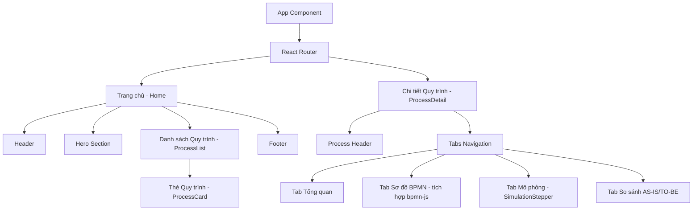

# BÁO CÁO ĐỒ ÁN MÔN HỌC
## HỆ THỐNG QUẢN TRỊ QUY TRÌNH NGHIỆP VỤ

**Đề tài:** Phân tích và Cải tiến Quy trình Nghiệp vụ tại Công ty Cổ phần Dược phẩm FPT Long Châu

**Trường:** Đại học Công nghệ Thông tin – ĐHQG TP.HCM (UIT)

**Môn học:** Hệ thống Quản trị Quy trình Nghiệp vụ (HTQTQTNV)

---


---

# LỜI MỞ ĐẦU

## Lý do chọn đề tài

Trong bối cảnh ngành bán lẻ dược phẩm ngày càng phát triển, các doanh nghiệp phải quản lý đồng thời nhiều hoạt động như nhập hàng, quản lý kho, bán thuốc tại nhà thuốc, bán hàng trực tuyến, giao hàng và chăm sóc khách hàng. Nếu các quy trình này chưa được chuẩn hóa và phối hợp hiệu quả, doanh nghiệp có thể gặp phải nhiều vấn đề như sai lệch tồn kho, xử lý đơn hàng chậm, hàng hóa cận hạn hoặc khó kiểm soát chất lượng.

FPT Long Châu là một hệ thống bán lẻ dược phẩm có quy mô lớn, với mạng lưới nhà thuốc và nhiều kênh bán hàng khác nhau. Do đó, việc phân tích và mô hình hóa các quy trình nghiệp vụ có ý nghĩa quan trọng trong việc nhận diện điểm nghẽn, xác định nguyên nhân và đề xuất các giải pháp cải tiến phù hợp.

Xuất phát từ thực tế trên, nhóm lựa chọn đề tài **"Hệ thống quản trị quy trình nghiệp vụ Công ty Cổ phần Dược phẩm FPT Long Châu"** nhằm vận dụng kiến thức của môn Hệ thống quản trị quy trình nghiệp vụ vào một trường hợp thực tế. Đề tài tập trung nghiên cứu các quy trình liên quan đến chuỗi cung ứng, quản lý kho và hoạt động bán hàng; đồng thời xây dựng website mô phỏng nhằm giúp người dùng dễ dàng theo dõi và hình dung quy trình.

## Mục tiêu nghiên cứu

Đề tài được thực hiện nhằm đạt các mục tiêu sau:

1. Tìm hiểu tổng quan về hoạt động kinh doanh và cơ cấu tổ chức của FPT Long Châu.
2. Liệt kê và phân loại các quy trình nghiệp vụ theo ba nhóm: Management Process, Core Process và Support Process.
3. Mô tả tổng quan 10 quy trình nghiệp vụ chính của doanh nghiệp.
4. Mô hình hóa 6 quy trình tiêu biểu bằng sơ đồ BPMN AS-IS.
5. Phân tích chuyên sâu quy trình bán thuốc tại nhà thuốc và quy trình quản lý kho.
6. Xác định các hoạt động tạo giá trị, hoạt động không tạo giá trị, lãng phí và điểm nghẽn trong quy trình.
7. Đề xuất các giải pháp cải tiến theo mô hình BPMN TO-BE.
8. Xây dựng website mô phỏng và hiển thị các quy trình nghiệp vụ đã nghiên cứu.

## Đối tượng và phạm vi nghiên cứu

Đối tượng nghiên cứu của đề tài là các quy trình nghiệp vụ trong hoạt động quản lý và vận hành của FPT Long Châu, tập trung vào chuỗi cung ứng, quản lý kho, bán thuốc và các quy trình hỗ trợ.

Phạm vi nghiên cứu bao gồm:

- **Phạm vi nội dung:** Nghiên cứu 10 quy trình nghiệp vụ, trong đó mô hình hóa chi tiết 6 quy trình và phân tích chuyên sâu 2 quy trình là bán thuốc tại nhà thuốc và quản lý kho.
- **Phạm vi doanh nghiệp:** Hoạt động của hệ thống FPT Long Châu và các bộ phận có liên quan như cung ứng, kho, nhà thuốc, nhân sự và công nghệ thông tin.
- **Phạm vi dữ liệu:** Sử dụng các tài liệu công khai, thông tin trên website, tài liệu tham khảo, quan sát và các giả định phù hợp do nhóm xây dựng. Do không tiếp cận được dữ liệu nội bộ, một số thông tin và số liệu trong báo cáo mang tính mô phỏng hoặc ước tính phục vụ mục đích học tập.
- **Phạm vi sản phẩm:** Website có chức năng hiển thị thông tin, sơ đồ và mô phỏng các bước xử lý của quy trình nghiệp vụ; không thay thế cho hệ thống vận hành thực tế của doanh nghiệp.

## Phương pháp nghiên cứu

Đề tài sử dụng kết hợp các phương pháp nghiên cứu sau:

1. **Thu thập tài liệu:** Tìm hiểu thông tin từ website chính thức của FPT Long Châu, các bài viết, báo cáo, tài liệu công khai và tài liệu chuyên ngành.
2. **Quan sát:** Phân tích trình tự hoạt động trong các quy trình bán hàng, nhập hàng, quản lý kho và giao hàng dựa trên thông tin thực tế có thể quan sát được.
3. **Phân tích và tổng hợp:** Tổng hợp dữ liệu, xác định tác nhân, đầu vào, đầu ra, hoạt động chính và mối quan hệ giữa các bộ phận.
4. **Mô hình hóa BPMN:** Sử dụng ký hiệu BPMN để biểu diễn quy trình hiện tại AS-IS và quy trình cải tiến TO-BE.
5. **Phân tích quy trình:** Áp dụng các phương pháp VA/BVA/NVA, phân tích lãng phí, phân tích nguyên nhân gốc rễ, phân tích thời gian, chi phí và chất lượng.
6. **Thiết kế và xây dựng website:** Sử dụng các công cụ và công nghệ phù hợp để tạo giao diện mô phỏng, giúp trình bày quy trình một cách trực quan và dễ hiểu.

## Ý nghĩa thực tiễn của đề tài

Về mặt thực tiễn, đề tài giúp minh họa cách tiếp cận quản trị quy trình nghiệp vụ trong lĩnh vực bán lẻ dược phẩm. Thông qua việc mô hình hóa và phân tích, nhóm có thể nhận diện những vấn đề thường gặp như nhập liệu thủ công, cập nhật tồn kho chậm, kiểm kê mất nhiều thời gian và khó kiểm soát hạn sử dụng.

Các đề xuất cải tiến như sử dụng mã vạch/QR, áp dụng nguyên tắc FEFO, đồng bộ dữ liệu kho, cập nhật tồn kho theo thời gian thực và xây dựng dashboard quản lý có thể góp phần nâng cao hiệu quả vận hành. Bên cạnh đó, website mô phỏng giúp người dùng dễ dàng tiếp cận, theo dõi và hiểu được mối liên hệ giữa các bước trong quy trình.

Do giới hạn về dữ liệu, các kết quả trong đề tài chủ yếu mang tính mô phỏng và học thuật, nhưng có thể làm cơ sở tham khảo cho việc nghiên cứu, thiết kế hoặc triển khai hệ thống quản trị quy trình trong thực tế.

## Bố cục báo cáo

Ngoài phần Lời mở đầu, Danh mục bảng, Danh mục hình ảnh, Tài liệu tham khảo và Phụ lục, báo cáo gồm 7 chương:

- **Chương 1:** Giới thiệu về FPT Long Châu – trình bày tổng quan doanh nghiệp, lịch sử hình thành, lĩnh vực hoạt động, cơ cấu tổ chức và hoạt động kinh doanh.
- **Chương 2:** Khảo sát, liệt kê và phân loại quy trình nghiệp vụ – trình bày cơ sở phân loại, kiến trúc quy trình, danh sách và mô tả tổng quan 10 quy trình.
- **Chương 3:** Xây dựng website mô phỏng quy trình nghiệp vụ – giới thiệu mục tiêu, công nghệ, giao diện và các chức năng của website.
- **Chương 4:** Mô hình hóa quy trình nghiệp vụ hiện tại AS-IS – trình bày chi tiết 6 quy trình và các sơ đồ BPMN tương ứng.
- **Chương 5:** Phân tích quy trình nghiệp vụ – phân tích chuyên sâu quy trình bán thuốc tại nhà thuốc và quy trình quản lý kho.
- **Chương 6:** Đề xuất cải tiến quy trình nghiệp vụ – trình bày các vấn đề phát hiện, giải pháp cải tiến và mô hình BPMN TO-BE.
- **Chương 7:** Kết luận và hướng phát triển – tổng hợp kết quả đạt được, hạn chế và định hướng phát triển của đề tài.


---

# CHƯƠNG 1: GIỚI THIỆU VỀ CÔNG TY CỔ PHẦN DƯỢC PHẨM FPT LONG CHÂU

Chương này trình bày cái nhìn tổng quan về Công ty Cổ phần Dược phẩm FPT Long Châu, đối tượng nghiên cứu chính của đồ án. Các nội dung bao gồm tổng quan về công ty, lịch sử hình thành và phát triển, các lĩnh vực hoạt động chủ yếu, cơ cấu tổ chức bộ máy, tình hình hoạt động kinh doanh hiện tại và những định hướng chiến lược trong tương lai. Việc thấu hiểu sâu sắc bối cảnh hoạt động, quy mô và đặc thù ngành nghề bán lẻ dược phẩm của FPT Long Châu là tiền đề quan trọng để tiến hành phân tích, đánh giá và đề xuất các giải pháp cải tiến hệ thống quản trị quy trình nghiệp vụ (BPM) một cách hiệu quả và sát với thực tiễn doanh nghiệp.

## 1.1. Tổng quan về công ty

Công ty Cổ phần Dược phẩm FPT Long Châu, được biết đến rộng rãi với tên gọi hệ thống Nhà thuốc FPT Long Châu, là một trong những chuỗi bán lẻ dược phẩm lớn nhất và uy tín nhất tại Việt Nam hiện nay. Là một thành viên trực thuộc Công ty Cổ phần Bán lẻ Kỹ thuật số FPT (FPT Retail - mã chứng khoán FRT), FPT Long Châu thừa hưởng nền tảng công nghệ vững chắc, tiềm lực tài chính mạnh mẽ và kinh nghiệm quản trị chuỗi bán lẻ hiện đại từ tập đoàn mẹ. Với tôn chỉ hoạt động mang đến những sản phẩm chăm sóc sức khỏe chất lượng cao, giá cả hợp lý và dịch vụ tư vấn tận tâm, chuỗi nhà thuốc đã nhanh chóng chiếm được sự tin tưởng của đông đảo người tiêu dùng trên toàn quốc.

Tính đến năm 2024, quy mô của FPT Long Châu đã đạt đến một cột mốc ấn tượng với hơn 1.800 nhà thuốc phân bố rộng khắp trên tất cả 63 tỉnh thành của Việt Nam. Mạng lưới rộng lớn này không chỉ giúp công ty tiếp cận được đa dạng phân khúc khách hàng mà còn đóng vai trò thiết yếu trong việc đảm bảo cung ứng thuốc kịp thời cho nhu cầu chăm sóc sức khỏe của cộng đồng. 

Danh mục sản phẩm của FPT Long Châu vô cùng đa dạng, đáp ứng toàn diện nhu cầu điều trị và bảo vệ sức khỏe. Các nhóm sản phẩm chủ lực bao gồm: thuốc kê đơn theo chỉ định của bác sĩ, thuốc không kê đơn (OTC), các dòng dược mỹ phẩm chăm sóc da và làm đẹp, thực phẩm chức năng hỗ trợ sức khỏe, cùng với đa dạng các trang thiết bị y tế gia đình. Đặc biệt, FPT Long Châu nổi tiếng với năng lực cung ứng đầy đủ các loại thuốc đặc trị chuyên sâu, vốn thường khó tìm tại các nhà thuốc quy mô nhỏ.

**Bảng 1.1. Tóm tắt thông tin cơ bản về Công ty Cổ phần Dược phẩm FPT Long Châu**

| Tiêu chí | Thông tin chi tiết |
| :--- | :--- |
| **Tên chính thức** | Công ty Cổ phần Dược phẩm FPT Long Châu |
| **Tên thương hiệu** | Nhà thuốc FPT Long Châu |
| **Công ty mẹ** | Công ty Cổ phần Bán lẻ Kỹ thuật số FPT (FPT Retail) |
| **Lĩnh vực kinh doanh** | Bán lẻ dược phẩm, thực phẩm chức năng, thiết bị y tế |
| **Quy mô (2024)** | Hơn 1.800 cửa hàng trên 63 tỉnh/thành phố |
| **Khẩu hiệu (Slogan)** | "Vì sức khỏe cộng đồng" / "Thuốc tốt giá rẻ" (các thông điệp truyền thông chính) |
| **Tiêu chuẩn chất lượng** | Đạt chuẩn GPP (Good Pharmacy Practice) của Bộ Y tế |
| **Kênh phân phối** | Bán lẻ trực tiếp tại cửa hàng, thương mại điện tử (Website/App) |

## 1.2. Lịch sử hình thành và phát triển

Hành trình phát triển của FPT Long Châu là một câu chuyện kinh doanh đầy cảm hứng, chuyển mình từ một nhà thuốc gia đình truyền thống trở thành một đế chế bán lẻ dược phẩm hàng đầu Việt Nam nhờ vào sự can thiệp của chiến lược quản trị và công nghệ hiện đại. Tiền thân của chuỗi hệ thống này là nhà thuốc Long Châu, được thành lập từ năm 1985 tại khu vực Quận 5, Thành phố Hồ Chí Minh. Trong suốt hơn ba thập kỷ hoạt động, nhà thuốc Long Châu đã xây dựng được một thương hiệu địa phương vững chắc, nổi tiếng với sự uy tín, đa dạng các loại thuốc và đặc biệt là mức giá cạnh tranh so với mặt bằng chung của thị trường.

Bước ngoặt lịch sử diễn ra vào năm 2017 khi Công ty Cổ phần Bán lẻ Kỹ thuật số FPT (FPT Retail) quyết định mua lại hệ thống nhà thuốc Long Châu. Thương vụ M&A (Mua bán và Sáp nhập) này không chỉ đánh dấu sự gia nhập chính thức của FPT Retail vào thị trường bán lẻ dược phẩm đầy tiềm năng mà còn mang lại cho Long Châu một nguồn lực khổng lồ về vốn, công nghệ quản trị và kinh nghiệm vận hành chuỗi. FPT Retail đã thực hiện một quá trình tái cấu trúc toàn diện, áp dụng hệ thống quản trị nguồn lực doanh nghiệp (ERP), chuẩn hóa các quy trình nghiệp vụ và nâng cấp chất lượng dịch vụ khách hàng.

Giai đoạn từ năm 2018 đến 2024 chứng kiến sự mở rộng bùng nổ của FPT Long Châu. Áp dụng công thức thành công từ chuỗi FPT Shop, Long Châu liên tục khai trương các cửa hàng mới với tốc độ đáng kinh ngạc. Nếu như năm 2018, hệ thống mới chỉ có vài chục cửa hàng tập trung chủ yếu tại TP.HCM, thì đến năm 2022, con số này đã vượt mốc 1.000 cửa hàng, chính thức phủ sóng toàn quốc. Tính đến năm 2024, FPT Long Châu đã vượt qua mốc 1.800 nhà thuốc, khẳng định vị thế dẫn đầu tuyệt đối về quy mô trên thị trường bán lẻ dược phẩm Việt Nam. Sự phát triển thần tốc này đi kèm với việc liên tục hoàn thiện hệ thống quản lý chuỗi cung ứng, hệ thống kho bãi trung tâm và phát triển đa kênh (omnichannel).

**Bảng 1.2. Các cột mốc lịch sử quan trọng của FPT Long Châu**

| Năm | Sự kiện nổi bật | Số lượng nhà thuốc (ước tính) |
| :--- | :--- | :--- |
| **1985** | Thành lập nhà thuốc Long Châu đầu tiên tại Quận 5, TP.HCM, định vị là nhà thuốc chuyên bán thuốc đặc trị giá sỉ. | 1 |
| **2017** | FPT Retail chính thức mua lại chuỗi Long Châu, bắt đầu quá trình tái cấu trúc và số hóa hệ thống quản trị. | ~4 |
| **2018** | Thành lập Công ty Cổ phần Dược phẩm FPT Long Châu, bắt đầu thử nghiệm mô hình chuỗi. | ~22 |
| **2019** | Mở rộng quy mô, vươn ra các tỉnh thành lân cận TP.HCM và bắt đầu tiến ra khu vực miền Bắc. | ~70 |
| **2020** | Tăng tốc mở mới bất chấp đại dịch COVID-19, đóng vai trò quan trọng trong việc cung ứng thiết bị y tế và thuốc men. | ~200 |
| **2021** | Chuyển đổi số mạnh mẽ, ra mắt ứng dụng di động, đẩy mạnh bán hàng trực tuyến và giao hàng tận nơi. | ~400 |
| **2022** | Chạm mốc 1.000 cửa hàng, phủ sóng 63/63 tỉnh thành, đạt lợi nhuận tích cực sớm hơn kỳ vọng. | ~1.000 |
| **2023** | Tiếp tục dẫn đầu thị trường về tốc độ mở mới, mở rộng mảng kinh doanh vắc xin. | ~1.600 |
| **2024** | Đạt quy mô hơn 1.800 nhà thuốc, củng cố vị thế chuỗi bán lẻ dược phẩm lớn nhất Việt Nam. | > 1.800 |

## 1.3. Lĩnh vực hoạt động

Hoạt động kinh doanh cốt lõi của FPT Long Châu tập trung vào mảng bán lẻ dược phẩm và các sản phẩm chăm sóc sức khỏe. Hệ thống cung cấp một danh mục hàng hóa đồ sộ bao gồm thuốc kê đơn, thuốc không kê đơn (OTC), thực phẩm chức năng, dược mỹ phẩm, trang thiết bị y tế gia đình và các sản phẩm tiêu dùng y tế khác. Bên cạnh kênh bán lẻ trực tiếp tại hệ thống hơn 1.800 cửa hàng vật lý, FPT Long Châu còn đẩy mạnh lĩnh vực thương mại điện tử (TMĐT) thông qua website chính thức và ứng dụng di động Long Châu. Các nền tảng số này cung cấp dịch vụ đặt thuốc online, tư vấn trực tuyến với dược sĩ và giao hàng tận nhà nhanh chóng, tạo sự tiện lợi tối đa cho khách hàng trong kỷ nguyên số.

Để duy trì năng lực cạnh tranh và đảm bảo chất lượng phục vụ, FPT Long Châu đầu tư mạnh mẽ vào hệ thống quản lý chuỗi cung ứng và logistics dược phẩm. Công ty sở hữu các tổng kho phân phối đạt chuẩn, áp dụng công nghệ quản lý kho thông minh để đảm bảo việc điều phối hàng hóa đến hàng nghìn nhà thuốc một cách chính xác và hiệu quả. Ngoài ra, Long Châu cũng tích cực triển khai các chương trình khách hàng thân thiết, tích điểm đổi quà và cá nhân hóa dịch vụ chăm sóc sức khỏe nhằm nâng cao mức độ hài lòng và giữ chân khách hàng.

Toàn bộ hệ thống nhà thuốc và kho bãi của FPT Long Châu đều tuân thủ nghiêm ngặt các tiêu chuẩn GPP (Good Pharmacy Practice - Thực hành tốt cơ sở bán lẻ thuốc) theo quy định của Bộ Y tế. Việc đảm bảo chuẩn GPP không chỉ là yêu cầu pháp lý mà còn là cam kết của công ty đối với chất lượng thuốc, điều kiện bảo quản, quy trình tư vấn và trình độ chuyên môn của đội ngũ dược sĩ, từ đó mang đến sự an tâm tuyệt đối cho người tiêu dùng.

## 1.4. Cơ cấu tổ chức

Cơ cấu tổ chức của FPT Long Châu được thiết kế theo mô hình trực tuyến - chức năng, kết hợp với quản lý theo chuỗi nhằm đảm bảo sự thống nhất trong chiến lược kinh doanh từ cấp cao nhất xuống đến từng cửa hàng, đồng thời duy trì sự chuyên môn hóa cao ở các phòng ban. Mô hình này cho phép thông tin được truyền đạt thông suốt, quy trình ra quyết định nhanh chóng và khả năng thích ứng linh hoạt với những biến động của thị trường. Cấu trúc bộ máy được phân cấp rõ ràng, hỗ trợ hiệu quả cho việc vận hành mạng lưới bán lẻ khổng lồ trên toàn quốc.

Ở cấp độ nhà thuốc, bộ máy nhân sự được tinh gọn nhưng vẫn đảm bảo tính chuyên nghiệp và tuân thủ quy định chuyên ngành. Mỗi nhà thuốc được điều hành bởi một Cửa hàng trưởng (quản lý vận hành) và bắt buộc phải có Dược sĩ chuyên môn phụ trách các vấn đề liên quan đến thuốc. Đội ngũ nhân viên trực tiếp phục vụ bao gồm các dược sĩ bán hàng, nhân viên tư vấn sản phẩm sức khỏe, nhân viên thu ngân và nhân viên quản lý kho tại cửa hàng. Tất cả đều phải trải qua quá trình đào tạo bài bản về kiến thức chuyên môn và kỹ năng dịch vụ khách hàng.

**Sơ đồ cơ cấu tổ chức Công ty Cổ phần Dược phẩm FPT Long Châu [Hình 1.1]:**

*   **Hội đồng Quản trị / Tổng Giám đốc FPT Retail:** Cơ quan hoạch định chiến lược và chỉ đạo chung.
    *   **Ban Giám đốc chuỗi FPT Long Châu:** Chịu trách nhiệm điều hành toàn bộ hoạt động kinh doanh của chuỗi.
        *   **Khối Mua hàng (Purchasing):** Đảm nhiệm việc đàm phán, tìm kiếm nguồn hàng, ký kết hợp đồng với các hãng dược phẩm và nhà cung cấp.
        *   **Khối Đảm bảo chất lượng (QA) và Chuyên môn:** Kiểm soát chất lượng thuốc, giám sát tuân thủ GPP, xây dựng quy trình chuyên môn.
        *   **Khối Nhân sự và Đào tạo (HR & Training):** Tuyển dụng, tính lương, phúc lợi và tổ chức các khóa đào tạo nâng cao chuyên môn cho dược sĩ.
        *   **Khối Công nghệ Thông tin (IT):** Phát triển, duy trì và nâng cấp các hệ thống phần mềm quản lý (ERP, POS), website, app.
        *   **Khối Tài chính - Kế toán:** Quản lý dòng tiền, kế toán nghiệp vụ, báo cáo tài chính và kiểm toán nội bộ.
        *   **Khối Marketing và Phát triển kinh doanh:** Hoạch định các chiến dịch truyền thông, tiếp thị, mở rộng mạng lưới, phân tích thị trường.
        *   **Trung tâm Điều hành Chuỗi cung ứng (Supply Chain):** 
            *   Hệ thống Tổng kho (Miền Bắc, Miền Trung, Miền Nam)
            *   Đội ngũ Vận tải và Logistics
        *   **Khối Vận hành Kinh doanh (Operations):**
            *   Giám đốc Vùng / Khu vực
                *   Hệ thống hơn 1.800 Nhà thuốc trên toàn quốc
                    *   *Dược sĩ chuyên môn*
                    *   *Cửa hàng trưởng*
                    *   *Dược sĩ bán hàng / Tư vấn viên*
                    *   *Nhân viên thu ngân / NV kho cửa hàng*

## 1.5. Hoạt động kinh doanh

FPT Long Châu hiện là điểm sáng nổi bật nhất trong bức tranh tài chính của FPT Retail. Kết quả kinh doanh những năm gần đây liên tục ghi nhận mức tăng trưởng doanh thu ấn tượng, trở thành động lực tăng trưởng chính của toàn bộ tập đoàn mẹ. Sự bứt phá này phần lớn đến từ tốc độ mở mới cửa hàng thần tốc, khả năng tối ưu hóa biên lợi nhuận thông qua việc đàm phán trực tiếp với các nhà sản xuất, cũng như việc khai thác hiệu quả tập khách hàng trung thành.

Trên thị trường bán lẻ dược phẩm Việt Nam, FPT Long Châu đang chiếm lĩnh thị phần lớn nhất và duy trì vị thế dẫn đầu trong bối cảnh cạnh tranh khốc liệt. Các đối thủ chính trong ngành bao gồm Pharmacity (tập trung vào quy mô và mô hình convenience store kết hợp dược phẩm) và An Khang (thuộc hệ sinh thái Thế Giới Di Động). Dù đối mặt với sự cạnh tranh gay gắt, FPT Long Châu vẫn duy trì được lợi thế riêng biệt. Ưu điểm cốt lõi của Long Châu nằm ở mạng lưới phân phối rộng khắp, khả năng cung ứng đầy đủ các loại thuốc đặc trị khó tìm, chính sách giá bán cạnh tranh và đội ngũ dược sĩ tư vấn chuyên nghiệp, tận tâm. 

Hệ thống công nghệ là một trong những vũ khí chiến lược tạo nên sự khác biệt của Long Châu. Công ty vận hành mượt mà trên nền tảng ERP hiện đại, tích hợp sâu với hệ thống quản lý điểm bán (POS) tại hơn 1.800 cửa hàng. Nền tảng công nghệ này cho phép quản lý tồn kho theo thời gian thực (real-time), tối ưu hóa quy trình luân chuyển hàng hóa và hạn chế tối đa tình trạng thiếu hụt thuốc. Bên cạnh đó, hệ sinh thái số bao gồm website thương mại điện tử và ứng dụng di động cũng được đầu tư bài bản, mang lại trải nghiệm mua sắm Omnichannel toàn diện cho người dùng.

**Bảng 1.3. So sánh tương quan giữa FPT Long Châu và các chuỗi đối thủ chính (Số liệu tham khảo 2024)**

| Tiêu chí | FPT Long Châu | Pharmacity | An Khang |
| :--- | :--- | :--- | :--- |
| **Quy mô chuỗi** | > 1.800 nhà thuốc | ~1.000 nhà thuốc (ước tính) | ~500 nhà thuốc (đang thu hẹp/tái cấu trúc) |
| **Công ty mẹ** | FPT Retail | SK Group (Hàn Quốc) / Mekong Capital (trước đây) | Đầu tư Thế Giới Di Động (MWG) |
| **Cơ cấu sản phẩm** | Mạnh về thuốc kê đơn, thuốc đặc trị bệnh mãn tính, TPCN | Thiên về sản phẩm tiêu dùng y tế, chăm sóc cá nhân (CVS) | Cân bằng giữa thuốc và các sản phẩm chăm sóc sức khỏe |
| **Định giá sản phẩm** | Rất cạnh tranh, giá sỉ cho nhiều mặt hàng đặc trị | Trung bình cao | Cạnh tranh |
| **Nền tảng công nghệ** | ERP nội bộ mạnh, App/Web hoạt động hiệu quả, Omnichannel | App thành viên tiện lợi, hệ thống quản lý khá tốt | Thừa hưởng hệ thống IT mạnh từ MWG |
| **Mô hình phục vụ** | Tập trung chuyên sâu vào dược lý và điều trị y tế | Mô hình nhà thuốc tiện lợi (Convenience Pharmacy) | Mô hình bán lẻ dược phẩm kết hợp với Bách Hóa Xanh/TGDĐ |

## 1.6. Định hướng chiến lược

Trong tầm nhìn chiến lược giai đoạn 2025-2026, FPT Long Châu đặt mục tiêu tham vọng sẽ tiếp tục mở rộng quy mô lên hơn 2.500 nhà thuốc trên toàn quốc. Sự mở rộng này không chỉ nhằm củng cố vị thế dẫn đầu về thị phần mà còn đi sâu vào các khu vực vùng ven, nông thôn, đưa các sản phẩm thuốc chất lượng với giá tốt tiếp cận đến mọi tầng lớp người dân. Công ty xác định chiến lược phủ sóng sâu rộng là chìa khóa để duy trì lợi thế cạnh tranh về quy mô.

Song song với việc mở rộng mạng lưới vật lý, FPT Long Châu đang dồn lực cho chiến lược phát triển mô hình bán lẻ đa kênh (Omnichannel) toàn diện. Sự kết hợp nhuần nhuyễn giữa hệ thống cửa hàng offline, nền tảng mua sắm online và dịch vụ giao hàng siêu tốc được kỳ vọng sẽ tạo ra một hệ sinh thái chăm sóc sức khỏe không khoảng cách. Để thực hiện được điều này, công ty đang tăng cường ứng dụng Trí tuệ nhân tạo (AI) trong việc phân tích hành vi tiêu dùng, dự báo nhu cầu hàng hóa và cá nhân hóa tư vấn. Hệ thống quản lý kho thông minh cũng sẽ được nâng cấp liên tục để đáp ứng khối lượng xử lý đơn hàng ngày càng khổng lồ. 

Ngoài mảng bán lẻ dược phẩm truyền thống, FPT Long Châu cũng đang từng bước mở rộng sang các dịch vụ chăm sóc sức khỏe toàn diện hơn. Việc triển khai thành công chuỗi trung tâm tiêm chủng vắc xin Long Châu là minh chứng rõ nét cho định hướng này. Trong tương lai, công ty dự kiến sẽ tiếp tục phát triển các dịch vụ y tế dự phòng, xét nghiệm và tư vấn sức khỏe từ xa, từng bước hiện thực hóa mục tiêu trở thành nền tảng chăm sóc sức khỏe hàng đầu và đáng tin cậy nhất đối với người dân Việt Nam.


---

# CHƯƠNG 2: PHÂN TÍCH QUY TRÌNH NGHIỆP VỤ TẠI FPT LONG CHÂU

## 2.1. Khái quát về quản trị quy trình nghiệp vụ
Quản trị quy trình nghiệp vụ (Business Process Management - BPM) là một lĩnh vực thuộc chuyên ngành quản lý hoạt động, tập trung vào việc cải thiện hiệu suất doanh nghiệp thông qua việc quản lý và tối ưu hóa các quy trình nghiệp vụ của tổ chức. Thay vì chỉ xem xét một bộ phận hoặc chức năng độc lập, BPM nhìn nhận doanh nghiệp dưới góc độ của các chuỗi hoạt động có liên kết chặt chẽ với nhau, từ đó mang lại giá trị gia tăng cho khách hàng. Mục tiêu chính của BPM không chỉ là tự động hóa các bước công việc mà còn là sự thấu hiểu, phân tích và cải tiến liên tục để đáp ứng linh hoạt với sự thay đổi của thị trường.

Trong bối cảnh doanh nghiệp hiện đại, BPM đóng vai trò cực kỳ quan trọng và thiết yếu. Trước áp lực cạnh tranh ngày càng gay gắt, một tổ chức sở hữu hệ thống quy trình nghiệp vụ rõ ràng, chuẩn hóa sẽ có khả năng giảm thiểu chi phí vận hành, hạn chế sai sót, và gia tăng tốc độ phục vụ khách hàng. Hơn thế nữa, BPM tạo nền tảng vững chắc cho quá trình chuyển đổi số, giúp kết nối liền mạch giữa con người, hệ thống công nghệ thông tin và chiến lược kinh doanh của doanh nghiệp.

Vòng đời của Quản trị quy trình nghiệp vụ (BPM Lifecycle) bao gồm sáu giai đoạn chính: Nhận diện (Process Identification), Khám phá (Process Discovery), Phân tích (Process Analysis), Thiết kế lại (Process Redesign), Triển khai (Process Implementation), và Giám sát (Process Monitoring). Quá trình này bắt đầu bằng việc xác định bức tranh tổng thể các quy trình (Nhận diện), tiếp tục với việc thu thập dữ liệu và lập sơ đồ hiện trạng "As-Is" (Khám phá), từ đó định lượng hoặc định tính các điểm yếu (Phân tích). Dựa trên kết quả phân tích, doanh nghiệp thiết kế quy trình tương lai "To-Be" nhằm khắc phục các nút thắt (Thiết kế lại), sau đó áp dụng vào thực tiễn kết hợp với tự động hóa CNTT (Triển khai). Cuối cùng, các chỉ số hiệu suất được thu thập và đánh giá liên tục nhằm đảm bảo tính hiệu quả và đưa ra các quyết định cải tiến tiếp theo (Giám sát).

Liên hệ với ngành dược phẩm bán lẻ, đặc biệt là chuỗi nhà thuốc lớn như FPT Long Châu, quản trị quy trình nghiệp vụ lại càng thể hiện tầm quan trọng sâu sắc. Ngành dược có tính rủi ro cao và chịu sự điều chỉnh của nhiều tiêu chuẩn khắt khe về y tế (như GPP - Thực hành tốt nhà thuốc). Do đó, áp dụng BPM không chỉ giúp Long Châu tối ưu hóa chi phí logistic hay mở rộng quy mô một cách nhanh chóng, mà còn đảm bảo mọi khâu từ nhập thuốc, bảo quản, đến tư vấn và bán thuốc đều tuân thủ chặt chẽ pháp luật. Hệ thống quy trình chuẩn xác chính là lợi thế cạnh tranh cốt lõi, giúp bảo vệ sức khỏe người tiêu dùng và giữ vững uy tín thương hiệu.

## 2.2. Phương pháp và nguồn thu thập dữ liệu
Để hoàn thành việc nghiên cứu, mô hình hóa và phân tích các quy trình nghiệp vụ tại FPT Long Châu, nhóm nghiên cứu đã áp dụng một cách phối hợp và đa dạng nhiều phương pháp thu thập dữ liệu khác nhau. Các phương pháp chính bao gồm quan sát thực tế tại các điểm bán, phỏng vấn chuyên sâu (được mô phỏng và giả định dựa trên kinh nghiệm thực tiễn), nghiên cứu tài liệu nội bộ, và phân tích hệ thống công nghệ thông tin (website, ứng dụng). Việc quan sát thực tế tại các nhà thuốc giúp nhóm hình dung trực quan về dòng di chuyển của khách hàng, tương tác giữa dược sĩ và hệ thống POS (Point of Sale), cũng như quy trình xuất nhập kho tại chỗ. Phỏng vấn giả định với các nhân sự tại cửa hàng nhằm tìm hiểu chi tiết các bước thực hiện công việc thường ngày. Phân tích nền tảng số giúp hiểu rõ hơn về các bước thao tác đối với khách hàng trong quy trình mua sắm trực tuyến.

Nguồn thu thập dữ liệu được sử dụng làm cơ sở cho nghiên cứu rất đa dạng và đảm bảo tính chính xác, cập nhật liên tục. Thứ nhất, các báo cáo thường niên và tài liệu công bố thông tin của FPT Retail cung cấp bức tranh toàn cảnh về định hướng chiến lược và quy mô của Long Châu. Thứ hai, website chính thức longchau.com và ứng dụng di động Long Châu đóng vai trò là nguồn dữ liệu quan trọng để lập sơ đồ quy trình bán hàng trực tuyến và dịch vụ chăm sóc khách hàng. Thứ ba, các văn bản quy định của Bộ Y tế, tiêu chuẩn GPP (Good Pharmacy Practice) là nguồn dữ liệu nền tảng, thiết yếu để đảm bảo tính thực tiễn và tuân thủ pháp luật của các quy trình nghiệp vụ mô phỏng. Cuối cùng, những bài báo chuyên ngành và thông cáo báo chí liên quan đến chuỗi cung ứng, hệ thống kho bãi của Long Châu cũng được sử dụng làm nguồn dữ liệu tham khảo phụ trợ để xây dựng hệ thống quy trình toàn diện.

Mặc dù nhóm đã cố gắng tiếp cận nhiều nguồn thông tin đa dạng, các phương pháp thu thập dữ liệu trên vẫn tồn tại một số hạn chế nhất định. Hạn chế lớn nhất là nhóm chưa có quyền truy cập trực tiếp vào hệ thống quản trị nguồn lực doanh nghiệp (ERP) hoặc các tài liệu mô tả quy trình nghiệp vụ nội bộ tuyệt mật của FPT Long Châu do tính bảo mật thông tin doanh nghiệp. Do vậy, một số quy trình như Quản lý chuỗi cung ứng hay Quản lý kho được xây dựng dựa trên sự suy luận từ kết quả đầu ra, quan sát bên ngoài, lý thuyết BPM chung, tiêu chuẩn ngành dược và dữ liệu phỏng vấn giả định. Dù vậy, những dữ liệu này vẫn phản ánh trung thực bản chất, đặc thù và các bước công việc cốt lõi của các quy trình nghiệp vụ hiện hành tại doanh nghiệp bán lẻ dược phẩm hàng đầu này.

## 2.3. Phân loại quy trình nghiệp vụ
Kiến trúc quy trình của bất kỳ tổ chức nào cũng thường được chia thành ba nhóm chính, nhằm xác định rõ chức năng, mục tiêu và cách thức đóng góp vào chuỗi giá trị chung. Tại FPT Long Châu, các quy trình nghiệp vụ được phân loại thành: quy trình quản lý, quy trình cốt lõi và quy trình hỗ trợ.

### 2.3.1. Quy trình quản lý
Quy trình quản lý (Management Processes) là những quy trình chịu trách nhiệm định hướng, giám sát, kiểm soát và điều phối các hoạt động khác trong toàn bộ tổ chức. Các quy trình này không trực tiếp tạo ra giá trị cho khách hàng cuối, nhưng lại đóng vai trò tối quan trọng trong việc thiết lập mục tiêu kinh doanh, phân bổ nguồn lực, đảm bảo tổ chức hoạt động tuân thủ pháp luật và chiến lược đã đề ra. Tại một chuỗi dược phẩm có quy mô lớn như FPT Long Châu, quy trình quản lý giúp duy trì tính đồng nhất trong hoạt động của hàng ngàn cửa hàng và đảm bảo an toàn y tế.
Các quy trình quản lý tiêu biểu tại Long Châu bao gồm: 
- Quản lý chiến lược: Xác định định hướng mở rộng hệ thống nhà thuốc, chiến lược sản phẩm.
- Quản lý chất lượng: Kiểm tra, giám sát chất lượng sản phẩm, dịch vụ khách hàng.
- Quản lý tuân thủ pháp lý & dược: Đảm bảo đáp ứng đầy đủ yêu cầu GPP, quy định an toàn vệ sinh và hồ sơ cấp phép y tế.
- Quản lý hiệu suất: Đo lường và đánh giá kết quả kinh doanh của các nhà thuốc và phòng ban.

### 2.3.2. Quy trình cốt lõi
Quy trình cốt lõi (Core Processes / Primary Processes) là những quy trình tác động trực tiếp đến việc sản xuất hoặc cung cấp sản phẩm, dịch vụ cho khách hàng bên ngoài. Đây là chuỗi giá trị (Value Chain) mang lại doanh thu, lợi nhuận trực tiếp cho tổ chức, làm thỏa mãn nhu cầu của khách hàng. Đặc điểm của quy trình cốt lõi là sự hiện diện rõ nét nhất của các tương tác với thị trường và khách hàng.
Tại chuỗi nhà thuốc FPT Long Châu, các quy trình cốt lõi bao gồm:
- Bán thuốc tại nhà thuốc: Quy trình tiếp đón khách, tư vấn dược, kê đơn, thanh toán và xuất hóa đơn.
- Bán thuốc online: Khách hàng tìm kiếm sản phẩm trên web/app, duyệt đơn thuốc ảo, thanh toán trực tuyến, vận chuyển tận nơi.
- Quản lý chuỗi cung ứng: Từ việc dự báo nhu cầu đến nhập hàng, điều phối thuốc từ nhà cung cấp tới kho tổng và phân phối xuống từng điểm bán.
- Dịch vụ tư vấn dược: Hỗ trợ khách hàng về liều lượng, công dụng sản phẩm trực tiếp hoặc qua điện thoại.

### 2.3.3. Quy trình hỗ trợ
Quy trình hỗ trợ (Support Processes) là những hoạt động thiết yếu được thiết kế để phục vụ, hỗ trợ việc thực hiện trơn tru các quy trình cốt lõi và quản lý. Dù không trực tiếp tạo ra doanh thu hay tương tác thường xuyên với khách hàng cuối, chúng cung cấp nguồn nhân lực, hạ tầng tài chính, công nghệ và cơ sở vật chất để đảm bảo hệ thống vận hành liên tục.
Các quy trình hỗ trợ trọng yếu tại Long Châu gồm có:
- Quản lý kho: Lưu trữ, bảo quản thuốc đúng nhiệt độ, điều kiện độ ẩm, xuất - nhập kho theo chuẩn FIFO/FEFO.
- Tuyển dụng và đào tạo: Chiêu mộ dược sĩ có bằng cấp, tổ chức đào tạo kỹ năng tư vấn, cập nhật kiến thức về thuốc mới.
- Quản lý CNTT (IT): Quản lý cơ sở hạ tầng mạng, bảo trì ứng dụng Long Châu, hệ thống ERP và máy tính tại cửa hàng.
- Quản lý tài chính: Kế toán nội bộ, quản lý dòng tiền, báo cáo thuế.

## 2.4. Kiến trúc quy trình nghiệp vụ của FPT Long Châu
Kiến trúc quy trình nghiệp vụ (Process Architecture) là một bản đồ chiến lược giúp tổ chức sắp xếp, cấu trúc hóa và biểu diễn trực quan các quy trình hoạt động, từ đó xác định các lĩnh vực cần cải tiến và phân bổ nguồn lực. Đối với FPT Long Châu, kiến trúc quy trình được phân bổ dựa trên 3 tầng phân loại (Quản lý – Cốt lõi – Hỗ trợ), phản ánh toàn diện hệ sinh thái vận hành của một chuỗi bán lẻ dược phẩm quy mô lớn. 

Dưới đây là Bảng Kiến trúc Quy trình Nghiệp vụ (Process Architecture) tổng thể của Long Châu:

| Tầng quy trình | Tên quy trình | Mô tả ngắn |
| :--- | :--- | :--- |
| **Tầng Quản lý (Management)** | Quản lý chiến lược | Lập kế hoạch kinh doanh, định hướng mở rộng chuỗi cửa hàng và phát triển hệ sinh thái y tế số. |
| | Quản lý chất lượng | Giám sát chất lượng vận hành nhà thuốc, đảm bảo tiêu chuẩn y tế, kiểm tra định kỳ sản phẩm. |
| | Quản lý tuân thủ pháp lý & dược | Cập nhật, thực thi các quy định y tế, GPP, đảm bảo giấy phép kinh doanh, an toàn thông tin khách hàng. |
| **Tầng Cốt lõi (Core)** | Quản lý chuỗi cung ứng | Hoạt động thu mua nguyên vật liệu, điều phối hàng hóa từ nhà sản xuất về kho và đến từng cửa hàng. |
| | Bán thuốc tại nhà thuốc | Trải nghiệm trực tiếp tại cửa hàng, từ khâu nhận yêu cầu, tư vấn, đến chốt đơn và trao thuốc cho khách. |
| | Bán thuốc online | Tiếp nhận và xử lý đơn hàng từ đa kênh số, tư vấn qua điện thoại, đóng gói và vận chuyển giao hàng cuối. |
| | Quản lý quan hệ khách hàng (CRM) | Duy trì, chăm sóc khách hàng thành viên, tích điểm thưởng, giải quyết khiếu nại. |
| **Tầng Hỗ trợ (Support)** | Quản lý kho | Tổ chức khu vực lưu trữ, kiểm soát tồn kho, bảo quản theo tiêu chuẩn dược phẩm đặc thù. |
| | Tuyển dụng và đào tạo | Bổ sung nhân lực dược sĩ chất lượng, huấn luyện kỹ năng mềm, cập nhật chuyên môn định kỳ. |
| | Quản lý CNTT | Vận hành hệ thống ERP, đảm bảo ứng dụng Long Châu, hệ thống thanh toán hoạt động ổn định. |
| | Quản lý tài chính - kế toán | Ghi nhận chi phí, doanh thu, thanh toán nhà cung cấp, và duy trì an toàn dòng tiền doanh nghiệp. |

Mối liên hệ giữa các quy trình trong kiến trúc trên là một mạng lưới đan xen và phụ thuộc lẫn nhau. **Tầng cốt lõi** là động lực chính tạo ra doanh thu (ví dụ: quá trình Bán thuốc trực tiếp cần nguồn cung hàng hóa từ Quản lý chuỗi cung ứng). Tuy nhiên, để tầng cốt lõi hoạt động không gián đoạn, nó phải dựa hoàn toàn vào **Tầng hỗ trợ** (như Quản lý kho sẽ đảm bảo hàng hóa tại điểm bán luôn đủ số lượng; Tuyển dụng và đào tạo cung cấp đội ngũ dược sĩ tư vấn). Trong khi đó, **Tầng quản lý** sẽ định hướng và thiết lập ranh giới vận hành cho hai tầng dưới, chẳng hạn như Quản lý tuân thủ pháp lý đặt ra các quy định nghiêm ngặt mà quy trình Bán thuốc hay Quản lý kho bắt buộc phải tuân theo (như kiểm soát nhiệt độ kho lạnh, cách kiểm tra đơn thuốc có kê toa). Sự phối hợp nhịp nhàng giữa 3 tầng này là yếu tố cốt lõi giúp Long Châu duy trì lợi thế vận hành xuất sắc.

## 2.5. Danh sách 10 quy trình nghiệp vụ

Dựa vào kiến trúc quy trình tổng thể ở mục trước, dưới đây là danh sách chi tiết 10 quy trình nghiệp vụ nổi bật tại FPT Long Châu, được chọn lọc để biểu diễn các hoạt động phong phú trong tổ chức.

| STT | Tên quy trình | Phân loại | Bộ phận chủ quản | Mức độ phức tạp | Tần suất thực hiện |
| :--- | :--- | :--- | :--- | :--- | :--- |
| 1 | Quản lý chuỗi cung ứng | Cốt lõi | Ban Cung ứng & Mua hàng | Cao | Hàng ngày |
| 2 | Quản lý chất lượng | Quản lý | Ban Đảm bảo Chất lượng | Trung bình | Hàng tuần / Hàng tháng |
| 3 | Bán thuốc tại nhà thuốc | Cốt lõi | Cửa hàng Long Châu | Trung bình | Liên tục (Hàng giờ) |
| 4 | Bán thuốc online | Cốt lõi | Thương mại điện tử / Cửa hàng | Cao | Liên tục (Hàng giờ) |
| 5 | Quản lý kho | Hỗ trợ | Khối Kho bãi / Logistics | Trung bình | Hàng ngày |
| 6 | Tuyển dụng và đào tạo | Hỗ trợ | Ban Nhân sự (HR) | Trung bình | Hàng tháng |
| 7 | Quản lý công nghệ thông tin | Hỗ trợ | Ban Công nghệ (IT) | Cao | Hàng ngày |
| 8 | Quản lý tài chính – Kế toán | Quản lý | Ban Tài chính Kế toán | Trung bình | Hàng ngày / Hàng tháng |
| 9 | Quản lý quan hệ KH (CRM) | Cốt lõi | Trung tâm Dịch vụ KH | Trung bình | Hàng ngày |
| 10 | Quản lý tuân thủ pháp lý & dược | Quản lý | Ban Tuân thủ / Pháp chế | Cao | Hàng tháng / Quý |

## 2.6. Mô tả tổng quan 10 quy trình nghiệp vụ

Dưới đây là mô tả ngắn gọn về đặc điểm hoạt động của từng quy trình được liệt kê ở mục trên:

**1. Quản lý chuỗi cung ứng**
- **Mục tiêu**: Đảm bảo nguồn cung ứng thuốc liên tục, ổn định từ nhà sản xuất đến tận tay người tiêu dùng, tối ưu hóa chi phí vận chuyển.
- **Tác nhân chính**: Nhân viên mua hàng, Nhà cung cấp (hãng dược), Đội ngũ điều phối, Hệ thống ERP.
- **Đầu vào**: Dữ liệu dự báo nhu cầu bán hàng, danh mục hàng hết tồn kho.
- **Đầu ra**: Đơn đặt hàng hoàn thành, hàng hóa sẵn sàng phân bổ về các trung tâm.
- **Điểm đặc thù/Thách thức**: Sự đa dạng lớn của hàng hóa dược phẩm với nhiều hạn sử dụng khác nhau; thách thức trong việc cân đối lượng tồn kho tại hơn 1800 cửa hàng toàn quốc.

**2. Quản lý chất lượng**
- **Mục tiêu**: Kiểm soát và đánh giá định kỳ chất lượng hàng hóa, cơ sở vật chất và dịch vụ để bảo vệ uy tín nhà thuốc.
- **Tác nhân chính**: Nhân viên kiểm soát chất lượng (QA/QC), Quản lý cửa hàng, Dược sĩ.
- **Đầu vào**: Báo cáo sự cố chất lượng, phản hồi của khách hàng, tiêu chuẩn GPP.
- **Đầu ra**: Biên bản kiểm tra chất lượng, kế hoạch khắc phục điểm yếu tại cửa hàng.
- **Điểm đặc thù/Thách thức**: Khối lượng công việc lớn do quy mô chuỗi rộng lớn, đòi hỏi hệ thống đo lường chất lượng phải chuẩn hóa, số hóa và tự động hóa cao.

**3. Bán thuốc tại nhà thuốc**
- **Mục tiêu**: Phục vụ và cung cấp dược phẩm đúng toa, đúng bệnh, mang lại trải nghiệm tư vấn chu đáo cho khách mua trực tiếp.
- **Tác nhân chính**: Khách hàng, Dược sĩ tư vấn, Hệ thống POS (Point of Sale).
- **Đầu vào**: Đơn thuốc của khách hàng hoặc triệu chứng khách hàng cung cấp.
- **Đầu ra**: Khách nhận đúng thuốc, biên lai thanh toán được ghi nhận lên hệ thống.
- **Điểm đặc thù/Thách thức**: Đòi hỏi dược sĩ phải thao tác nhanh chóng nhưng vẫn tuân thủ nghiêm ngặt quy định không được bán thuốc kê đơn khi thiếu toa hợp lệ.

**4. Bán thuốc online**
- **Mục tiêu**: Đóng gói, xử lý và giao hàng tận nơi các đơn đặt hàng dược phẩm trực tuyến một cách chính xác, nhanh chóng nhất.
- **Tác nhân chính**: Khách hàng trực tuyến, Dược sĩ (thẩm định toa), Nhân viên đóng gói, Đối tác giao hàng (Shipper).
- **Đầu vào**: Đơn đặt hàng trên ứng dụng/website, hình ảnh toa thuốc (nếu có).
- **Đầu ra**: Đơn hàng giao thành công, thanh toán hoàn tất (COD hoặc trực tuyến).
- **Điểm đặc thù/Thách thức**: Quy trình phức tạp do cần bước dược sĩ gọi điện tư vấn, thẩm định toa thuốc online, và áp lực thời gian giao hàng (thường cam kết dưới 1-2 giờ).

**5. Quản lý kho**
- **Mục tiêu**: Tổ chức lưu trữ hàng hóa một cách khoa học, kiểm soát chặt chẽ điều kiện bảo quản cũng như số lượng xuất/nhập, đảm bảo nguyên tắc FIFO/FEFO.
- **Tác nhân chính**: Thủ kho, Nhân viên bốc xếp, Hệ thống Quản lý Kho (WMS).
- **Đầu vào**: Hàng hóa từ nhà cung cấp chuyển về, Phiếu yêu cầu xuất kho.
- **Đầu ra**: Hàng hóa lưu trữ đúng vị trí, Phiếu xuất/nhập kho được cập nhật, Báo cáo tồn kho.
- **Điểm đặc thù/Thách thức**: Các mặt hàng dược phẩm yêu cầu nghiêm ngặt về nhiệt độ, độ ẩm (như vắc xin, thuốc tiểu đường), rủi ro lớn nếu kho bị sai lệch số liệu.

**6. Tuyển dụng và đào tạo**
- **Mục tiêu**: Thu hút, tuyển chọn đúng ứng viên chất lượng (đặc biệt là dược sĩ), đồng thời duy trì hệ thống đào tạo kỹ năng tư vấn chuyên nghiệp.
- **Tác nhân chính**: Nhân viên Tuyển dụng, Chuyên viên Đào tạo nội bộ, Ứng viên.
- **Đầu vào**: Yêu cầu tuyển dụng từ các phòng ban hoặc cửa hàng mới, ngân sách đào tạo.
- **Đầu ra**: Nhân sự mới ký hợp đồng làm việc, nhân viên vượt qua các bài kiểm tra kỹ năng định kỳ.
- **Điểm đặc thù/Thách thức**: Tốc độ mở rộng hàng trăm cửa hàng/năm đòi hỏi bộ máy tuyển dụng phải chạy hết công suất mà vẫn không làm giảm tiêu chuẩn đầu vào của nghề y dược.

**7. Quản lý công nghệ thông tin**
- **Mục tiêu**: Đảm bảo toàn bộ nền tảng hệ thống từ ERP, website đến máy bán hàng tại các cửa hàng hoạt động trơn tru 24/7, không gián đoạn.
- **Tác nhân chính**: Nhân viên IT Helpdesk, Kỹ sư phần mềm, Nhà cung cấp phần mềm, Người dùng nội bộ.
- **Đầu vào**: Yêu cầu hỗ trợ kỹ thuật (Ticket), yêu cầu nâng cấp tính năng.
- **Đầu ra**: Lỗi hệ thống được xử lý, phiên bản phần mềm mới được cập nhật, dữ liệu được sao lưu an toàn.
- **Điểm đặc thù/Thách thức**: Phải bảo mật tuyệt đối dữ liệu lịch sử khám bệnh và thông tin cá nhân của hàng triệu khách hàng trước các nguy cơ tấn công mạng.

**8. Quản lý tài chính – Kế toán**
- **Mục tiêu**: Ghi nhận toàn bộ luồng tiền thu - chi một cách minh bạch, kịp thời, phục vụ lập báo cáo tài chính và thực hiện nghĩa vụ thuế.
- **Tác nhân chính**: Nhân viên Kế toán, Kế toán trưởng, Quản lý các bộ phận.
- **Đầu vào**: Hóa đơn mua hàng, biên lai bán lẻ (POS), bảng lương nhân sự.
- **Đầu ra**: Báo cáo tài chính định kỳ, hồ sơ kê khai thuế, các khoản thanh toán được duyệt.
- **Điểm đặc thù/Thách thức**: Số lượng giao dịch vi mô (bán lẻ) hàng ngày cực kỳ khủng khiếp, đòi hỏi quy trình tự động hóa đối soát (reconciliation) phải rất chuẩn xác.

**9. Quản lý quan hệ khách hàng (CRM)**
- **Mục tiêu**: Tối đa hóa giá trị vòng đời khách hàng thông qua việc quản lý điểm thưởng, cung cấp thông tin y tế, nhắc lịch uống/mua thuốc, giải quyết phàn nàn.
- **Tác nhân chính**: Nhân viên CSKH, Khách hàng, Hệ thống CRM.
- **Đầu vào**: Khiếu nại từ khách hàng, lịch sử mua sắm của hội viên.
- **Đầu ra**: Vấn đề của khách được giải quyết, chương trình khuyến mãi được gửi tới đúng đối tượng.
- **Điểm đặc thù/Thách thức**: Cá nhân hóa việc chăm sóc với từng loại bệnh lý khác nhau của khách hàng mà không biến thành hành vi làm phiền hoặc quảng cáo quá mức.

**10. Quản lý tuân thủ pháp lý & dược**
- **Mục tiêu**: Đảm bảo công ty tuân thủ mọi đạo luật liên quan đến y tế, kinh doanh bán lẻ dược phẩm, phòng chống rủi ro pháp lý rút giấy phép.
- **Tác nhân chính**: Chuyên viên pháp chế, Cán bộ sở Y tế/cơ quan thanh tra, Quản lý chuỗi.
- **Đầu vào**: Các thông tư, nghị định mới từ Bộ Y tế, hồ sơ chất lượng nhà thuốc.
- **Đầu ra**: Giấy phép kinh doanh/GPP được cấp/gia hạn, quy trình vận hành nội bộ được sửa đổi phù hợp pháp luật.
- **Điểm đặc thù/Thách thức**: Môi trường pháp lý ngành dược rất khắt khe và thường xuyên thay đổi, cần phản ứng nhanh gọn nhằm thích ứng với các quy định mới.

## 2.7. Lựa chọn các quy trình mô phỏng và phân tích chuyên sâu
Trong số 10 quy trình nghiệp vụ được xác định, nhóm nghiên cứu tiến hành đánh giá nhằm lựa chọn ra 6 quy trình cốt lõi và tiêu biểu nhất để thực hiện mô phỏng BPMN và phân tích cải tiến chuyên sâu ở các chương tiếp theo. Tiêu chí lựa chọn dựa trên 5 yếu tố quan trọng, được đánh giá trên thang điểm từ 1 đến 5 (1: Rất thấp, 5: Rất cao):
- **C1. Mức độ phức tạp**: Quy trình có nhiều tác nhân tham gia, nhiều điểm rẽ nhánh (gateway) logic phức tạp.
- **C2. Tần suất thực hiện**: Sự lặp lại liên tục, quyết định chi phí vận hành hàng ngày của doanh nghiệp.
- **C3. Tác động kinh doanh**: Ảnh hưởng trực tiếp đến doanh thu, lợi nhuận hoặc sự hài lòng khách hàng.
- **C4. Khả năng cải tiến**: Tiềm năng tối ưu hóa, tự động hóa để mang lại hiệu quả rõ rệt.
- **C5. Khả năng thu thập dữ liệu**: Mức độ đầy đủ của thông tin nhóm nghiên cứu thu thập được để xây dựng sơ đồ thực tế.

**Bảng đánh giá lựa chọn quy trình phân tích chuyên sâu (Thang điểm 1-5)**

| STT | Tên quy trình | C1 | C2 | C3 | C4 | C5 | Tổng điểm | Kết quả |
| :--- | :--- | :--- | :--- | :--- | :--- | :--- | :--- | :--- |
| 1 | Quản lý chuỗi cung ứng | 5 | 5 | 5 | 5 | 3 | **23** | Chọn |
| 2 | Bán thuốc online | 5 | 5 | 5 | 5 | 4 | **24** | Chọn |
| 3 | Bán thuốc tại nhà thuốc | 4 | 5 | 5 | 4 | 5 | **23** | Chọn |
| 4 | Quản lý kho | 4 | 5 | 4 | 4 | 3 | **20** | Chọn |
| 5 | Tuyển dụng và đào tạo | 3 | 4 | 4 | 4 | 4 | **19** | Chọn |
| 6 | Quản lý chất lượng | 4 | 3 | 5 | 3 | 3 | **18** | Chọn |
| 7 | Quản lý CNTT | 4 | 4 | 4 | 3 | 2 | **17** | Loại |
| 8 | Quản lý quan hệ KH (CRM) | 3 | 4 | 4 | 4 | 2 | **17** | Loại |
| 9 | Quản lý tài chính – Kế toán | 4 | 4 | 4 | 2 | 2 | **16** | Loại |
| 10 | Quản lý tuân thủ pháp lý & dược | 3 | 2 | 5 | 2 | 3 | **15** | Loại |

**Kết quả 6 quy trình được chọn:**
Dựa trên điểm số đánh giá cao nhất, nhóm quyết định lựa chọn 6 quy trình sau để mô phỏng và phân tích chuyên sâu:
1. Quản lý chuỗi cung ứng (23 điểm)
2. Quản lý chất lượng (18 điểm)
3. Bán thuốc tại nhà thuốc (23 điểm)
4. Bán thuốc online (24 điểm)
5. Quản lý kho (20 điểm)
6. Tuyển dụng và đào tạo (19 điểm)

**Giải thích lý do lựa chọn:**
Sáu quy trình trên đại diện cho những huyết mạch sống còn của hệ thống bán lẻ dược phẩm Long Châu. Bán thuốc trực tiếp và Bán thuốc online là hai luồng doanh thu chính, có tần suất cực cao và tác động mạnh mẽ đến khách hàng, đồng thời có thể dễ dàng thu thập dữ liệu bằng cách đóng vai khách hàng. Quản lý chuỗi cung ứng và Quản lý kho có tiềm năng tối ưu lớn nhờ công nghệ (mức độ phức tạp rất cao, tác động đến tỷ suất lợi nhuận). Tuyển dụng và đào tạo là một quy trình hỗ trợ cấp thiết để giải quyết bài toán thiếu hụt dược sĩ khi mở rộng chuỗi, có tính ứng dụng cải tiến rõ ràng. Cuối cùng, Quản lý chất lượng là đặc thù bắt buộc trong ngành y tế, quyết định sự sống còn của thương hiệu, rất phù hợp để mô phỏng nhằm tìm ra các nút thắt trong công tác giám sát nhà thuốc.

**Lý do loại trừ 4 quy trình còn lại:**
Các quy trình như Quản lý CNTT, Quản lý tài chính - Kế toán, và Quản lý quan hệ KH (CRM) bị loại khỏi danh sách mô phỏng chuyên sâu vì thiếu hụt dữ liệu đầu vào (khó tiếp cận thông số tài chính, hoặc logic mã nguồn hệ thống). Đây là những luồng nghiệp vụ thiên về thao tác xử lý dữ liệu backend phức tạp mà chỉ người trong nội bộ tập đoàn FPT mới nắm được. Tương tự, Quản lý tuân thủ pháp lý là một chuỗi hành động hành chính giấy tờ, ít có sự tương tác hệ thống phức tạp, khả năng cải tiến bằng công cụ BPM thấp và tần suất thực hiện không thường xuyên bằng các nghiệp vụ cốt lõi khác. Vì vậy, tập trung vào 6 quy trình đã chọn sẽ mang lại một đồ án có chất lượng học thuật và thực tiễn tốt nhất.


---

# CHƯƠNG 3: XÂY DỰNG WEBSITE MÔ PHỎNG QUY TRÌNH NGHIỆP VỤ

Chương này trình bày chi tiết về quá trình phân tích, thiết kế và xây dựng website mô phỏng các quy trình nghiệp vụ của Công ty Cổ phần Dược phẩm FPT Long Châu. Trong bối cảnh môn học Hệ thống Quản trị Quy trình Nghiệp vụ, việc chuyển hóa các phân tích lý thuyết và sơ đồ BPMN thành một công cụ trực quan hóa đóng vai trò quan trọng trong việc đánh giá và kiểm chứng tính hợp lý của quy trình. Website được xây dựng không đóng vai trò là một hệ thống quản lý thực tế tham gia vào hoạt động vận hành của doanh nghiệp, mà đóng vai trò như một môi trường giả lập (simulation environment). Qua đó, hệ thống cho phép người dùng tương tác, theo dõi luồng thông tin, nhận diện rõ ràng các tác nhân (actors), các đầu vào và đầu ra tại từng bước công việc. Các phần tiếp theo sẽ trình bày cụ thể về kiến trúc hệ thống, cấu trúc dữ liệu mô phỏng, cũng như thiết kế giao diện để hiện thực hóa 6 quy trình trọng tâm đã được phân tích ở các chương trước.

## 3.1. Mục tiêu, yêu cầu và phạm vi website

**Mục tiêu**: 
Website được phát triển với mục tiêu cốt lõi là trực quan hóa 6 quy trình nghiệp vụ trọng yếu của FPT Long Châu. Nền tảng này cung cấp cho người dùng khả năng tiếp cận và xem xét các sơ đồ BPMN một cách tương tác, theo dõi chi tiết từng bước xử lý trong quy trình, đồng thời hiểu rõ vai trò của từng tác nhân cũng như luồng thông tin và dữ liệu luân chuyển qua các bước. Từ đó, website giúp minh họa rõ nét sự khác biệt và những điểm cải tiến giữa mô hình hiện tại (AS-IS) và mô hình đề xuất (TO-BE).

**Yêu cầu chức năng**:
- **Hiển thị danh mục quy trình**: Cung cấp giao diện tổng hợp danh sách 6 quy trình nghiệp vụ trọng tâm.
- **Xem thông tin chi tiết từng quy trình**: Trình bày rõ ràng mục tiêu, các tác nhân tham gia, cùng với thông tin đầu vào và đầu ra của quy trình.
- **Hiển thị sơ đồ BPMN tương tác**: Tích hợp công cụ hiển thị sơ đồ BPMN cho phép người dùng phóng to, thu nhỏ và tương tác với các thành phần (event, gateway, task) trên sơ đồ.
- **Mô phỏng từng bước xử lý**: Cung cấp tính năng diễn hoạt (animation) các bước thực thi, cho phép chuyển tiếp (next) và quay lại (back) để quan sát chi tiết luồng công việc.
- **So sánh AS-IS và TO-BE**: Hỗ trợ chuyển đổi nhanh chóng giữa hai trạng thái quy trình để làm nổi bật các điểm tối ưu hóa.

**Yêu cầu phi chức năng**:
- **Tính đáp ứng (Responsive)**: Giao diện hiển thị tốt trên các thiết bị khác nhau (desktop, tablet, mobile).
- **Hiệu năng**: Thời gian tải trang ban đầu và phản hồi tương tác dưới 3 giây, đảm bảo trải nghiệm người dùng mượt mà.
- **Tính tương thích**: Hỗ trợ ổn định trên các trình duyệt web phổ biến hiện nay như Google Chrome, Mozilla Firefox, Safari và Microsoft Edge.

**Phạm vi**: 
Website được thiết kế chủ yếu đóng vai trò frontend hoạt động phía client dưới dạng tĩnh hoặc động dựa trên dữ liệu giả lập. Hệ thống không bao gồm backend để xử lý nghiệp vụ thực tế hay thao tác trên cơ sở dữ liệu quan hệ, mà sử dụng dữ liệu định dạng JSON được cấu trúc sẵn để phục vụ mục đích mô phỏng và trình diễn quy trình.

## 3.2. Kiến trúc hệ thống

Website được thiết kế theo kiến trúc Single Page Application (SPA), giúp tối ưu hóa trải nghiệm người dùng thông qua việc không cần tải lại toàn bộ trang web khi chuyển hướng giữa các chức năng. Kiến trúc này bao gồm các thành phần chính:

- **Frontend**: Sử dụng thư viện React.js để xây dựng các thành phần giao diện người dùng (UI components) có khả năng tái sử dụng cao và quản lý trạng thái hiệu quả.
- **Thư viện render BPMN**: Tích hợp bpmn-js (thuộc hệ sinh thái Camunda) để render và cung cấp các tính năng tương tác với sơ đồ BPMN trực tiếp trên trình duyệt.
- **Routing**: Sử dụng React Router để quản lý điều hướng giữa trang chủ, danh mục quy trình và trang chi tiết quy trình mà không làm gián đoạn trải nghiệm người dùng.
- **State management**: Sử dụng các React Hooks cơ bản (`useState`, `useEffect`, `useContext`) để quản lý trạng thái của ứng dụng, đặc biệt là tiến trình mô phỏng các bước trong quy trình nghiệp vụ.
- **Deploy**: Ứng dụng được triển khai (deploy) trên nền tảng Vercel, đảm bảo tính ổn định và khả năng phân phối nội dung nhanh chóng.

**Sơ đồ Cấu trúc Thành phần (Component Tree)**:



## 3.3. Công nghệ và công cụ sử dụng

Để xây dựng hệ thống mô phỏng đáp ứng các yêu cầu đề ra, nhóm đã lựa chọn và phối hợp sử dụng các công nghệ, công cụ hiện đại, được liệt kê chi tiết trong Bảng 3.1.

*Bảng 3.1: Các công nghệ và công cụ sử dụng trong xây dựng website*

| Tên công nghệ / Công cụ | Phiên bản | Mục đích sử dụng |
| --- | --- | --- |
| **React.js** | 18.x | Xây dựng giao diện người dùng theo kiến trúc SPA, quản lý vòng đời ứng dụng và trạng thái cục bộ. |
| **Tailwind CSS** | 3.x | Cung cấp hệ thống utility classes giúp thiết kế giao diện responsive và custom UI nhanh chóng. |
| **bpmn-js** | 12.x | Render sơ đồ chuẩn BPMN 2.0 từ file XML, hỗ trợ tương tác (zoom, pan, highlight). |
| **Chart.js** | 4.x | Trực quan hóa dữ liệu mô phỏng, biểu đồ phân tích hiệu suất trong quy trình TO-BE. |
| **Figma** | N/A | Thiết kế wireframe, prototype và hoàn thiện UI/UX trước khi tiến hành code. |
| **VS Code & Git** | N/A | Trình soạn thảo mã nguồn và công cụ quản lý phiên bản mã nguồn, phối hợp nhóm qua GitHub. |
| **Vercel** | N/A | Nền tảng cloud để triển khai ứng dụng web frontend với CI/CD tự động từ GitHub repository. |

## 3.4. Thiết kế cơ sở dữ liệu

Do tính chất của dự án là website mô phỏng (simulation frontend) và không có hệ thống backend thực thụ, cơ sở dữ liệu được thiết kế dưới dạng các tệp JSON tĩnh lưu trữ trực tiếp trên client. Cấu trúc dữ liệu được tổ chức chuẩn hóa nhằm dễ dàng ánh xạ vào các component của React.

Các tập tin dữ liệu chính bao gồm:
- `processes.json`: Chứa siêu dữ liệu về danh sách 6 quy trình (ID, tên quy trình, phân loại, mô tả ngắn gọn).
- `steps.json`: Định nghĩa chi tiết các task xử lý của từng quy trình, bao gồm thứ tự thực thi, tác nhân, đầu vào, và đầu ra tại mỗi bước.
- `actors.json`: Danh sách các tác nhân (actor/role) tham gia vào hệ thống (ví dụ: Dược sĩ, Nhân viên kho, Khách hàng).
- `bpmn_data.json`: Lưu trữ cấu trúc XML định dạng chuỗi (stringified) của các sơ đồ BPMN cho mô hình AS-IS và TO-BE tương ứng với mỗi quy trình.

**Ví dụ cấu trúc JSON cho quy trình Bán thuốc tại nhà thuốc (`steps.json`):**

```json
{
  "processId": "P_SALES_STORE_01",
  "processName": "Bán thuốc tại nhà thuốc",
  "steps": [
    {
      "stepId": 1,
      "taskName": "Tiếp nhận và tư vấn khách hàng",
      "actor": "Dược sĩ tư vấn",
      "inputs": ["Yêu cầu của khách hàng", "Đơn thuốc (nếu có)"],
      "outputs": ["Xác định nhu cầu mua thuốc"],
      "description": "Dược sĩ lắng nghe nhu cầu, kiểm tra đơn thuốc và tư vấn sản phẩm phù hợp."
    },
    {
      "stepId": 2,
      "taskName": "Kiểm tra tồn kho",
      "actor": "Hệ thống ERP",
      "inputs": ["Danh mục thuốc cần mua"],
      "outputs": ["Trạng thái tồn kho của thuốc"],
      "description": "Truy xuất hệ thống để xác nhận số lượng thuốc hiện có tại cửa hàng."
    },
    {
      "stepId": 3,
      "taskName": "Lên đơn và thanh toán",
      "actor": "Thu ngân",
      "inputs": ["Danh sách thuốc", "Thông tin thành viên (nếu có)"],
      "outputs": ["Hóa đơn thanh toán", "Phiếu xuất kho"],
      "description": "Tạo đơn hàng trên hệ thống POS, áp dụng khuyến mãi và tiến hành thu tiền."
    }
  ]
}
```

## 3.5. Thiết kế giao diện và các chức năng chính

### 3.5.1. Trang chủ và danh mục quy trình
Giao diện trang chủ được thiết kế nhằm mang lại cái nhìn tổng quan và định hướng người dùng ngay từ lần đầu truy cập. Phía trên cùng là **Hero section** với logo FPT Long Châu nổi bật, kèm theo thông điệp giới thiệu về hệ thống mô phỏng các quy trình nghiệp vụ cốt lõi. 

Phần trọng tâm của trang chủ là **Grid danh sách quy trình**, hiển thị dưới dạng 6 thẻ (card) trực quan. Mỗi thẻ bao gồm icon đại diện, tên quy trình, phân loại (Quy trình cốt lõi, Quy trình hỗ trợ, Quy trình quản lý) và một đoạn mô tả ngắn gọn. Để hỗ trợ việc tìm kiếm, trang web cung cấp thanh tìm kiếm (Search bar) và các nút lọc (Filter buttons) dựa trên phân loại quy trình. Màu sắc chủ đạo sử dụng là xanh dương và trắng – bộ nhận diện thương hiệu của Long Châu, kết hợp với các hiệu ứng hover mượt mà nhằm tăng trải nghiệm UI/UX.

### 3.5.2. Chức năng xem thông tin quy trình
Khi người dùng chọn một quy trình từ trang chủ, hệ thống sẽ điều hướng đến trang chi tiết quy trình. Trang này được cấu trúc theo dạng Tab (thẻ điều hướng) bao gồm: Tổng quan, Sơ đồ BPMN, Mô phỏng, và So sánh.

Tại **Tab Tổng quan**, thông tin quy trình được trình bày rõ ràng thông qua các bảng biểu. Nội dung bao gồm mục tiêu quy trình, các tác nhân (swimlane roles) liên quan, các tài liệu/thông tin đầu vào và đầu ra. Dưới cùng là danh sách các bước xử lý (tasks) được đánh số thứ tự tuần tự, giúp người dùng nắm bắt nhanh luồng công việc tổng thể trước khi đi sâu vào sơ đồ kỹ thuật.

### 3.5.3. Chức năng hiển thị sơ đồ BPMN
Chức năng này đóng vai trò cốt lõi trong việc minh họa nghiệp vụ chuyên sâu. Tại **Tab Sơ đồ BPMN**, thư viện `bpmn-js` được sử dụng để nhúng và render trực tiếp nội dung XML của sơ đồ BPMN 2.0. 

Sơ đồ không chỉ hiển thị tĩnh mà còn cung cấp các công cụ tương tác: người dùng có thể thực hiện thao tác zoom in/out, pan (di chuyển) khung nhìn để khám phá các quy trình phức tạp. Khi hover vào một phần tử (task, gateway, event), phần tử đó sẽ được highlight, kèm theo tooltip hiển thị chú thích chi tiết. Các đường phân luồng (sequence flow) và các phân làn (swimlane) được thể hiện rõ ràng, tuân thủ nghiêm ngặt chuẩn mô hình hóa BPM.

### 3.5.4. Chức năng mô phỏng các bước xử lý
Chức năng mô phỏng (Simulation) mang lại giá trị thực tiễn nhất của website. Tại **Tab Mô phỏng**, quy trình được chia nhỏ thành một trình tự các bước thông qua component Stepper (Wizard). Người dùng điều khiển luồng bằng các nút "Next" và "Back".

Tại mỗi bước, hệ thống áp dụng animation để làm nổi bật tác nhân đang thực thi nhiệm vụ tương ứng trên một sơ đồ minh họa thu gọn. Bên cạnh đó, các thông số về dữ liệu đầu vào và kết quả đầu ra của bước hiện tại được hiển thị sinh động. Một thanh tiến trình (Progress bar) trực quan giúp người dùng biết họ đang ở giai đoạn nào của quy trình. Đặc biệt, người dùng có thể sử dụng nút toggle "Xem AS-IS" và "Xem TO-BE" để trực tiếp đối chiếu luồng công việc, từ đó đánh giá được tác động của các điểm thắt cổ chai (bottleneck) đã được giải quyết trong quy trình mới.

## 3.6. Mô phỏng 6 quy trình nghiệp vụ trên website

Website cung cấp trải nghiệm mô phỏng chuyên biệt, làm nổi bật đặc thù của 6 quy trình nghiệp vụ cốt lõi tại FPT Long Châu:

### 3.6.1. Quản lý chuỗi cung ứng
Giao diện mô phỏng quy trình này tập trung vào sự luân chuyển hàng hóa và thông tin giữa nhà cung cấp, tổng kho trung tâm và các nhà thuốc chi nhánh. Sơ đồ mô phỏng làm nổi bật các gateway quyết định (tái đặt hàng, kiểm tra chất lượng) và minh họa trực quan sự thay đổi trạng thái tồn kho (từ "Đang vận chuyển" đến "Đã nhập kho") thông qua các cảnh báo màu sắc tương tác.

### 3.6.2. Quản lý chất lượng
Quy trình được mô phỏng tập trung vào khâu kiểm định đạt chuẩn GPP. Giao diện Stepper mô phỏng các task như kiểm tra cảm quan, kiểm tra lô/hạn sử dụng. Khi có sự cố giả định (ví dụ thuốc cận date), luồng BPMN sẽ rẽ nhánh (exclusive gateway) để hướng dẫn người dùng theo dõi cách xử lý trả hàng hoặc tiêu hủy một cách rõ ràng và trực quan.

### 3.6.3. Bán thuốc tại nhà thuốc
Đây là quy trình có tần suất cao nhất, do đó giao diện tập trung vào tương tác giữa dược sĩ, khách hàng và hệ thống ERP/POS. Trong mô phỏng TO-BE, chức năng làm nổi bật việc tích hợp quét mã vạch và kiểm tra tồn kho tự động, rút ngắn số bước so với AS-IS, được thể hiện rõ rệt qua việc thanh tiến trình (progress bar) hoàn thành nhanh hơn.

### 3.6.4. Bán thuốc online
Mô phỏng quy trình này thể hiện hành trình đa kênh (Omnichannel), từ lúc khách hàng thao tác trên website/app Long Châu đến khi tổng đài viên xác nhận và nhân viên giao hàng (Shipper) tiếp nhận. Hoạt ảnh (animation) minh họa chi tiết sự chuyển giao trách nhiệm giữa các swimlane hệ thống, telesale và vận chuyển.

### 3.6.5. Quản lý kho
Giao diện của quy trình này làm rõ các thao tác xuất, nhập, và kiểm kê kho tại chi nhánh nhà thuốc. Tính năng mô phỏng đặc biệt chú trọng vào việc minh họa hệ thống quản lý theo FEFO (First Expired, First Out - Hết hạn trước, Xuất trước). Sơ đồ TO-BE cho thấy rõ sự can thiệp của ERP trong việc tự động đề xuất vị trí lấy thuốc thay vì tìm kiếm thủ công như AS-IS.

### 3.6.6. Tuyển dụng và đào tạo
Quy trình mô phỏng các bước từ việc xác định nhu cầu nhân sự, phỏng vấn dược sĩ đến đào tạo hội nhập và chuyên môn. Trải nghiệm tập trung vào việc thể hiện luồng xét duyệt nhiều cấp (Trưởng cửa hàng, Nhân sự vùng, Giám đốc đào tạo). Các task có tính song song (parallel gateway) như chuẩn bị tài liệu và xếp lịch thực hành được trực quan hóa sinh động.

## 3.7. Đánh giá kết quả xây dựng website

Sau quá trình thiết kế và phát triển, website mô phỏng quy trình nghiệp vụ của FPT Long Châu đã hoàn thiện và đáp ứng cơ bản các yêu cầu đặt ra. Việc xây dựng công cụ này giúp nhóm có cái nhìn trực quan và sâu sắc hơn về luồng tương tác giữa các tác nhân và dữ liệu theo chuẩn BPM.

**Bảng 3.2: Đánh giá trạng thái hoàn thành các chức năng**

| Chức năng | Trạng thái | Ghi chú |
| --- | --- | --- |
| Trang chủ & Danh mục | Hoàn thành | Hoạt động mượt mà, phân loại rõ ràng. |
| Chi tiết quy trình | Hoàn thành | Hiển thị đầy đủ thông tin từ JSON. |
| Hiển thị sơ đồ BPMN | Hoàn thành | Tích hợp tốt `bpmn-js`, tương tác zoom/pan tốt. |
| Mô phỏng theo bước | Hoàn thành | Animation hoạt động tốt, highlight rõ ràng tác nhân. |
| So sánh AS-IS và TO-BE | Hoàn thành | Chuyển đổi trạng thái nhanh, không cần load lại trang. |

**Đánh giá về Giao diện và Trải nghiệm (UI/UX)**:
Giao diện website được thiết kế bám sát bộ nhận diện thương hiệu của FPT Long Châu. Các nguyên tắc responsive design được áp dụng triệt để, cho phép hiển thị tốt và tương tác ổn định trên đa nền tảng thiết bị. Trải nghiệm người dùng được tối ưu hóa thông qua các hiệu ứng chuyển cảnh mượt mà và tính năng tooltip hỗ trợ thông tin ngữ cảnh.

**Hạn chế của hệ thống**:
Bên cạnh những điểm tích cực, do giới hạn về mặt thời gian và phạm vi đồ án, website vẫn tồn tại một số hạn chế nhất định. Hệ thống hiện hoạt động hoàn toàn ở phía client (Static Frontend) mà không có backend xử lý nghiệp vụ thực tế hay cơ sở dữ liệu động. Dữ liệu được fix cứng (hardcode) dưới dạng tệp JSON, do đó việc cập nhật hoặc chỉnh sửa quy trình đòi hỏi phải can thiệp trực tiếp vào mã nguồn. Hệ thống cũng chưa tích hợp phân quyền đăng nhập hay quản lý phiên người dùng (session management).

**Đề xuất cải thiện trong tương lai**:
Để nâng cấp hệ thống thành một công cụ quản lý toàn diện hơn, các hướng phát triển trong tương lai có thể bao gồm: (1) Xây dựng backend (Node.js hoặc Java Spring Boot) và sử dụng cơ sở dữ liệu quan hệ (PostgreSQL) để quản lý metadata của quy trình; (2) Tích hợp một hệ thống BPM Engine thực thụ (như Camunda Engine) để tự động hóa và thực thi các quy trình nghiệp vụ; (3) Thêm tính năng phân quyền người dùng (Dược sĩ, Quản lý, Giám đốc) để cá nhân hóa việc truy cập và thực thi các task trên quy trình.


---

# CHƯƠNG 4: MÔ HÌNH HÓA QUY TRÌNH NGHIỆP VỤ HIỆN TẠI (AS-IS)

Mô hình hóa quy trình nghiệp vụ hiện tại (AS-IS) là một bước đóng vai trò vô cùng quan trọng trong vòng đời quản trị quy trình nghiệp vụ (BPM). Mục đích cốt lõi của việc mô hình hóa AS-IS là nhằm phác họa một bức tranh toàn cảnh, chân thực và chi tiết nhất về cách thức hoạt động hiện tại của tổ chức trước khi tiến hành bất kỳ sự can thiệp hay cải tiến nào. Đối với hệ thống chuỗi nhà thuốc FPT Long Châu, việc đánh giá chính xác các quy trình AS-IS giúp nhóm nghiên cứu nhận diện sâu sắc các điểm nghẽn (bottleneck), những thao tác dư thừa, cũng như những hạn chế trong việc ứng dụng công nghệ vào vận hành. 

Trong chương này, phương pháp mô hình hóa được sử dụng là tiêu chuẩn BPMN 2.0 (Business Process Model and Notation). Đây là một ngôn ngữ mô hình hóa quy trình chuẩn quốc tế, cung cấp hệ thống ký hiệu trực quan và dễ hiểu cho cả người dùng nghiệp vụ lẫn chuyên gia kỹ thuật. Các sơ đồ BPMN được xây dựng bằng cách sử dụng các thành phần cơ bản như nhóm (pool), làn (swimlane) để phân định rõ ràng trách nhiệm của từng tác nhân tham gia; các sự kiện (event) để đánh dấu điểm bắt đầu, kết thúc hoặc những gián đoạn trong quy trình; các tác vụ (task) thể hiện những công việc cụ thể; và các cổng rẽ nhánh (gateway) để điều hướng luồng công việc. Công cụ hỗ trợ vẽ sơ đồ được nhóm sử dụng giúp đảm bảo tính chuẩn xác và đồng bộ về mặt ký hiệu kỹ thuật. Thông qua việc phân tích 6 quy trình trọng yếu, chương này sẽ làm nền tảng vững chắc cho việc đề xuất các giải pháp cải tiến (TO-BE) ở phần tiếp theo.

## 4.1. Quy trình quản lý chuỗi cung ứng

Quy trình quản lý chuỗi cung ứng tại FPT Long Châu đóng vai trò quyết định trong việc đảm bảo nguồn hàng dược phẩm luôn sẵn sàng tại hơn 1.800 nhà thuốc trên toàn quốc. Tuy nhiên, ở trạng thái hiện tại (AS-IS), quy trình này vẫn đang phụ thuộc nhiều vào các thao tác thủ công, đặc biệt trong việc tổng hợp nhu cầu, phê duyệt đơn hàng và theo dõi vận chuyển, dẫn đến những rủi ro về chậm trễ và sai sót dữ liệu.

**Bảng tóm tắt thông tin quy trình Quản lý chuỗi cung ứng (AS-IS)**

| Thành phần | Mô tả chi tiết |
| :--- | :--- |
| **Mục tiêu** | Đảm bảo cung cấp đủ số lượng và chất lượng dược phẩm cho các nhà thuốc trong chuỗi một cách kịp thời. |
| **Tác nhân tham gia** | Nhân viên kho, Trưởng kho, Bộ phận Mua hàng, Giám đốc chuỗi, Nhà cung cấp (NCC). |
| **Đầu vào** | Yêu cầu bổ sung hàng hóa từ các nhà thuốc, báo cáo tồn kho định kỳ. |
| **Đầu ra** | Đơn đặt hàng được duyệt, hàng hóa được giao đến kho trung tâm, dữ liệu tồn kho được cập nhật. |
| **Biểu mẫu / Hệ thống** | Microsoft Excel, Email, Hệ thống ERP nội bộ (cơ bản), Phiếu đặt hàng giấy, Biên bản giao nhận. |
| **Thời gian trung bình** | 3 - 5 ngày tùy thuộc vào nhà cung cấp và quy mô đơn hàng. |
| **Tần suất** | Hàng ngày hoặc định kỳ hàng tuần. |

**Các bước thực hiện:**
1. **Nhận yêu cầu bổ sung hàng:** Nhân viên kho tại các nhà thuốc gửi báo cáo số lượng hàng tồn và yêu cầu bổ sung thông qua file Excel qua email hoặc báo cáo qua điện thoại về kho trung tâm.
2. **Tổng hợp nhu cầu:** Trưởng kho trung tâm tiếp nhận, kiểm tra và tiến hành tổng hợp nhu cầu thủ công từ tất cả các nhà thuốc để xác định tổng khối lượng hàng cần đặt.
3. **Lập phiếu đặt hàng:** Bộ phận Mua hàng dựa trên bảng tổng hợp từ Trưởng kho để tạo phiếu đặt hàng thủ công cho từng Nhà cung cấp.
4. **Phê duyệt đơn hàng:** Phiếu đặt hàng được gửi qua email cho Giám đốc chuỗi (hoặc người được ủy quyền) để xem xét. Nếu từ chối, yêu cầu được trả lại để điều chỉnh; nếu đồng ý, Giám đốc phản hồi phê duyệt qua email.
5. **Gửi đơn đặt hàng:** Bộ phận Mua hàng gửi đơn hàng chính thức đến Nhà cung cấp thông qua email hoặc hệ thống EDI (nếu có nhưng hạn chế).
6. **Xác nhận và giao hàng:** Nhà cung cấp xác nhận đơn hàng, chuẩn bị hàng hóa và tiến hành giao hàng đến kho trung tâm của Long Châu. Quá trình vận chuyển thường được theo dõi thủ công qua điện thoại.
7. **Kiểm hàng và nhập kho:** Khi hàng đến, Nhân viên kho tiến hành kiểm đếm số lượng và đối chiếu ngoại quan với phiếu giao hàng bằng phương pháp thủ công.
8. **Cập nhật hệ thống:** Sau khi hoàn tất kiểm tra, Nhân viên kho cập nhật số liệu nhập kho vào bảng tính Excel và hệ thống ERP nội bộ một cách thủ công.
9. **Phân phối:** Hàng hóa sau đó được lên lịch để phân phối về lại các nhà thuốc theo yêu cầu ban đầu.

**Sơ đồ BPMN AS-IS:**
Sơ đồ mô tả quy trình hiện tại với các làn (swim lane) tương ứng cho Nhân viên kho, Trưởng kho, Bộ phận Mua hàng, Giám đốc chuỗi và Nhà cung cấp. Các tác vụ thủ công như tổng hợp Excel, gửi email phê duyệt được thể hiện rõ bằng ký hiệu User Task hoặc Manual Task.

*[Hình 4.1: Sơ đồ BPMN AS-IS – Quy trình quản lý chuỗi cung ứng]*

## 4.2. Quy trình quản lý chất lượng

Là một chuỗi bán lẻ dược phẩm, FPT Long Châu bắt buộc phải tuân thủ nghiêm ngặt các tiêu chuẩn GPP (Thực hành tốt nhà thuốc). Quy trình quản lý chất lượng (QA) hiện tại chủ yếu tập trung vào khâu kiểm tra đầu vào và kiểm tra định kỳ các điều kiện bảo quản, tuy nhiên quá trình ghi chép và kiểm soát vẫn còn mang tính chất giấy tờ, thủ công.

**Bảng tóm tắt thông tin quy trình Quản lý chất lượng (AS-IS)**

| Thành phần | Mô tả chi tiết |
| :--- | :--- |
| **Mục tiêu** | Đảm bảo 100% dược phẩm đạt tiêu chuẩn chất lượng theo GPP trước khi phân phối và trong suốt quá trình lưu kho, trưng bày. |
| **Tác nhân tham gia** | Dược sĩ phụ trách chất lượng, Nhân viên kho, Quản lý nhà thuốc, Bộ phận QA (Đảm bảo chất lượng). |
| **Đầu vào** | Lô hàng mới nhập, chứng từ CO/CQ, yêu cầu kiểm tra định kỳ. |
| **Đầu ra** | Biên bản kiểm tra chất lượng, hàng hóa được duyệt nhập/xuất, biên bản xử lý hàng lỗi. |
| **Biểu mẫu / Hệ thống** | Sổ ghi chép kiểm soát chất lượng, Biên bản kiểm nghiệm (bản cứng), Giấy chứng nhận chất lượng (CO/CQ). |
| **Thời gian trung bình** | 2 - 4 giờ cho mỗi lô hàng mới; định kỳ hàng tháng cho kiểm tra lưu kho. |
| **Tần suất** | Mỗi khi nhập hàng và định kỳ theo tháng/quý. |

**Các bước thực hiện:**
1. **Tiếp nhận hàng hóa và chứng từ:** Nhân viên kho nhận lô hàng từ nhà cung cấp cùng với các giấy tờ chứng nhận (CO, CQ, hóa đơn).
2. **Kiểm tra giấy tờ:** Dược sĩ phụ trách chất lượng đối chiếu các giấy tờ để đảm bảo tính hợp lệ, nguồn gốc xuất xứ của lô hàng.
3. **Kiểm tra ngoại quan:** Dược sĩ tiến hành kiểm tra bằng mắt thường (ngoại quan) các yếu tố như bao bì, tem nhãn, độ nguyên vẹn, hạn sử dụng của một tỷ lệ mẫu ngẫu nhiên trong lô hàng.
4. **Kiểm tra điều kiện bảo quản:** Đảm bảo hàng hóa được giao trong điều kiện nhiệt độ, độ ẩm đúng quy định (đặc biệt với vắc xin hoặc thuốc bảo quản lạnh).
5. **Ghi sổ kiểm soát:** Các kết quả kiểm tra được Dược sĩ ghi chép bằng tay vào "Sổ kiểm soát chất lượng".
6. **Xử lý kết quả:**
   - Nếu hàng **đạt tiêu chuẩn**: Chuyển sang khu vực lưu trữ bình thường và xác nhận cho phép nhập kho.
   - Nếu hàng **không đạt** (hư hỏng, cận hạn, sai giấy tờ): Chuyển vào khu vực biệt trữ (hàng chờ xử lý), lập biên bản và thông báo cho Bộ phận QA để làm việc với Nhà cung cấp.
7. **Kiểm tra định kỳ:** Hàng tháng, Quản lý nhà thuốc và Bộ phận QA tiến hành kiểm tra lại điều kiện bảo quản và hạn sử dụng của thuốc đang trưng bày, sau đó lập báo cáo giấy gửi về ban giám đốc.

**Sơ đồ BPMN AS-IS:**
Sơ đồ thể hiện luồng công việc bắt đầu từ sự kiện nhận hàng, đi qua cổng rẽ nhánh (Gateway) để đánh giá hàng đạt hay không đạt, từ đó rẽ nhánh sang các tác vụ tiếp nhận hoặc cách ly xử lý.

*[Hình 4.2: Sơ đồ BPMN AS-IS – Quy trình quản lý chất lượng]*

## 4.3. Quy trình bán thuốc tại nhà thuốc

Bán thuốc trực tiếp là quy trình diễn ra với tần suất cao nhất và là nguồn doanh thu chủ lực. Quy trình hiện tại đòi hỏi sự tương tác trực tiếp giữa dược sĩ và khách hàng, nhưng việc tra cứu, tư vấn và thanh toán vẫn còn nhiều công đoạn gây mất thời gian chờ đợi.

**Bảng tóm tắt thông tin quy trình Bán thuốc tại nhà thuốc (AS-IS)**

| Thành phần | Mô tả chi tiết |
| :--- | :--- |
| **Mục tiêu** | Phân phối thuốc đến tay người tiêu dùng đúng loại, đúng liều, an toàn và nhanh chóng. |
| **Tác nhân tham gia** | Khách hàng, Dược sĩ / Nhân viên tư vấn, Thu ngân, Hệ thống POS. |
| **Đầu vào** | Nhu cầu của khách hàng, đơn thuốc của bác sĩ (nếu có). |
| **Đầu ra** | Thuốc được giao cho khách, hóa đơn bán lẻ, tiền thanh toán, dữ liệu tồn kho cập nhật. |
| **Biểu mẫu / Hệ thống** | Hệ thống POS tại quầy, Phần mềm quản lý bán hàng, Máy in hóa đơn, Sổ tay tra cứu. |
| **Thời gian trung bình** | 5 - 10 phút/giao dịch. |
| **Tần suất** | Liên tục hàng ngày. |

**Các bước thực hiện:**
1. **Tiếp nhận khách hàng:** Khách hàng đến quầy, trình bày triệu chứng hoặc đưa đơn thuốc của bác sĩ cho Dược sĩ.
2. **Kiểm tra và tư vấn:** Dược sĩ tiếp nhận thông tin. Nếu có đơn thuốc, kiểm tra tính hợp lệ của đơn. Nếu không có đơn, tiến hành hỏi han triệu chứng, tiền sử bệnh và tư vấn các loại thuốc không kê đơn (OTC), thực phẩm chức năng phù hợp.
3. **Tra cứu tồn kho:** Dược sĩ gõ tên thuốc vào phần mềm bán hàng tại quầy để kiểm tra xem thuốc đó còn tồn kho tại chi nhánh hay không.
4. **Lấy hàng và kiểm tra:** Nếu còn hàng, Dược sĩ tiến hành lấy thuốc từ kệ, kiểm tra lại hạn sử dụng (date) và số lượng thực tế so với đơn.
5. **Thanh toán:** Dược sĩ chuyển thông tin đơn hàng cho Thu ngân (hoặc tự thực hiện). Thu ngân thực hiện tính tiền, nhận tiền mặt hoặc thanh toán qua máy quẹt thẻ (POS) từ khách hàng.
6. **In hóa đơn:** Hệ thống phát lệnh in hóa đơn giấy.
7. **Hướng dẫn sử dụng và giao thuốc:** Dược sĩ ghi chú liều dùng lên vỏ hộp/vỉ thuốc, hướng dẫn dặn dò khách hàng cách sử dụng và bàn giao túi thuốc cùng hóa đơn.
8. **Cập nhật hệ thống:** Sau khi giao dịch hoàn tất, hệ thống tự động trừ tồn kho (tuy nhiên đôi khi có độ trễ do lỗi đồng bộ).

**Sơ đồ BPMN AS-IS:**
Sơ đồ tập trung mô tả tương tác (message flow) giữa làn Khách hàng và làn của Nhà thuốc. Các tác vụ kiểm tra đơn, tra cứu hệ thống được sắp xếp tuần tự, kết thúc bằng sự kiện giao hàng hoàn tất.

*[Hình 4.3: Sơ đồ BPMN AS-IS – Quy trình bán thuốc tại nhà thuốc]*

## 4.4. Quy trình bán thuốc online

Với sự phát triển của thương mại điện tử, Long Châu đã triển khai kênh bán hàng online. Dù vậy, quy trình AS-IS vẫn tồn tại sự đứt gãy giữa nền tảng trực tuyến (app/web) và khâu vận hành thực tế tại kho, đòi hỏi nhiều sự can thiệp thủ công của nhân viên để xác nhận và phân bổ đơn hàng.

**Bảng tóm tắt thông tin quy trình Bán thuốc online (AS-IS)**

| Thành phần | Mô tả chi tiết |
| :--- | :--- |
| **Mục tiêu** | Tiếp nhận, xử lý và giao đơn hàng trực tuyến cho khách hàng một cách chính xác. |
| **Tác nhân tham gia** | Khách hàng, Nhân viên xử lý đơn online (CSKH), Dược sĩ online, Nhân viên kho, Đối tác giao hàng (GHN/GHTK...). |
| **Đầu vào** | Đơn đặt hàng trên website longchau.com hoặc ứng dụng Long Châu. |
| **Đầu ra** | Đơn hàng được giao thành công, hóa đơn điện tử/giấy, thanh toán COD/Online. |
| **Biểu mẫu / Hệ thống** | Website/App Long Châu, Hệ thống quản lý đơn hàng (OMS), Hệ thống của đối tác giao hàng. |
| **Thời gian trung bình** | 2 - 24 giờ tùy khu vực giao hàng. |
| **Tần suất** | Liên tục, đặc biệt cao vào các giờ cao điểm trong ngày. |

**Các bước thực hiện:**
1. **Đặt hàng:** Khách hàng truy cập website hoặc ứng dụng, tìm kiếm sản phẩm, thêm vào giỏ, điền thông tin địa chỉ và hoàn tất thao tác đặt hàng.
2. **Tiếp nhận và xác nhận thủ công:** Hệ thống ghi nhận đơn. Nhân viên CSKH online sẽ gọi điện thoại trực tiếp cho khách hàng để xác nhận lại thông tin đơn hàng, số lượng và địa chỉ (bước này tốn rất nhiều thời gian). Đối với thuốc kê đơn, Dược sĩ online sẽ yêu cầu khách gửi ảnh đơn thuốc qua Zalo/ứng dụng để kiểm duyệt.
3. **Phân bổ đơn hàng:** Nhân viên kiểm tra kho thủ công trên hệ thống để quyết định sẽ xuất hàng từ kho trung tâm hay từ nhà thuốc gần khách hàng nhất.
4. **Soạn hàng và đóng gói:** Nhân viên kho (hoặc nhà thuốc) nhận thông tin đơn hàng, tiến hành nhặt hàng, kiểm tra chất lượng, in phiếu giao hàng và đóng gói bưu kiện.
5. **Bàn giao vận chuyển:** Nhân viên tạo mã vận đơn thủ công trên hệ thống của đối tác giao hàng (ví dụ Giao Hàng Nhanh, Giao Hàng Tiết Kiệm) và bàn giao bưu kiện cho bưu tá khi họ đến lấy.
6. **Theo dõi đơn hàng:** Nhân viên thỉnh thoảng tra cứu mã vận đơn để theo dõi trạng thái, hoặc đợi đối tác gửi báo cáo đối soát.
7. **Hoàn tất:** Khách hàng nhận hàng, thanh toán (nếu là COD). Trạng thái đơn được cập nhật hoàn thành.

**Sơ đồ BPMN AS-IS:**
Sơ đồ BPMN có sự tham gia của một Pool bên ngoài là "Đối tác giao hàng". Các tác vụ liên lạc thủ công qua điện thoại để xác nhận đơn được làm nổi bật như một điểm nghẽn chính trong hệ thống.

*[Hình 4.4: Sơ đồ BPMN AS-IS – Quy trình bán thuốc online]*

## 4.5. Quy trình quản lý kho

Quy trình quản lý kho tại Long Châu trước cải tiến chủ yếu dựa trên sức người và kinh nghiệm của nhân viên. Việc ghi chép thẻ kho, đối chiếu giấy tờ và áp dụng nguyên tắc xuất hàng chưa được tự động hóa triệt để, dễ dẫn đến tình trạng thất thoát hoặc hàng hóa bị cận date (hết hạn sử dụng) mà không được phát hiện kịp thời.

**Bảng tóm tắt thông tin quy trình Quản lý kho (AS-IS)**

| Thành phần | Mô tả chi tiết |
| :--- | :--- |
| **Mục tiêu** | Quản lý chính xác số lượng nhập - xuất - tồn, bảo vệ chất lượng hàng hóa lưu kho. |
| **Tác nhân tham gia** | Nhân viên kho, Trưởng kho, Nhà cung cấp, Nhân viên nhà thuốc. |
| **Đầu vào** | Hàng hóa thực tế, Phiếu xuất kho, Phiếu nhập kho, Lịch kiểm kê. |
| **Đầu ra** | Báo cáo tồn kho, Thẻ kho được cập nhật, Hàng hóa được xuất đúng yêu cầu. |
| **Biểu mẫu / Hệ thống** | Phiếu nhập/xuất (giấy), Thẻ kho (giấy), Excel, Phần mềm ERP cơ bản. |
| **Thời gian trung bình** | Vài giờ cho mỗi đợt nhập/xuất lớn; nhiều ngày cho kiểm kê tổng. |
| **Tần suất** | Hàng ngày (nhập/xuất) và định kỳ hàng tháng (kiểm kê). |

**Các bước thực hiện:**
1. **Nhập kho:**
   - Nhân viên kho tiếp nhận Phiếu giao hàng từ Nhà cung cấp.
   - Bốc dỡ hàng, tiến hành đếm số lượng, kiểm tra đối chiếu bằng mắt thường với phiếu.
   - Nếu khớp, tiến hành ghi chép số liệu vào "Sổ nhập kho" bằng tay, sau đó nhập lại vào Excel hoặc ERP.
   - Hàng hóa được sắp xếp lên kệ một cách thủ công, phụ thuộc vào trí nhớ và thói quen của nhân viên (chưa áp dụng triệt để nguyên tắc FEFO - First Expired First Out bằng hệ thống).
2. **Xuất kho:**
   - Nhận "Phiếu yêu cầu xuất kho" từ các nhà thuốc hoặc bộ phận bán online.
   - Nhân viên kho đi dọc các lối đi, tìm và lấy hàng thủ công dựa trên kinh nghiệm.
   - Đóng gói và ghi chép trừ lùi vào Thẻ kho (giấy) treo tại kệ, đồng thời ghi vào Sổ xuất kho.
3. **Kiểm kê định kỳ:**
   - Hàng tháng, toàn bộ hoạt động xuất nhập tạm ngưng. Nhân viên tiến hành đếm tay từng hộp thuốc trên tất cả các kệ.
   - Số liệu đếm thực tế được ghi ra giấy, sau đó Trưởng kho gõ lại vào Excel để đối chiếu với phần mềm.
   - Nếu có chênh lệch, tiến hành tìm kiếm nguyên nhân và lập biên bản giải trình.

**Sơ đồ BPMN AS-IS:**
Sơ đồ bao gồm các luồng (Sub-process) riêng biệt cho Nhập kho, Xuất kho và Kiểm kê. Sự kiện rẽ nhánh (Gateway) thường xuyên xuất hiện ở các bước đối chiếu số liệu giấy tờ và thực tế.

*[Hình 4.5: Sơ đồ BPMN AS-IS – Quy trình quản lý kho]*

## 4.6. Quy trình tuyển dụng và đào tạo

Với tốc độ mở mới hàng trăm nhà thuốc mỗi năm, nhu cầu nhân sự của Long Châu là cực kỳ lớn. Tuy nhiên, quy trình tuyển dụng và đào tạo hiện tại mang nặng tính hành chính, sàng lọc thủ công, dẫn đến chu kỳ tuyển dụng kéo dài và khó tìm được ứng viên chất lượng một cách kịp thời.

**Bảng tóm tắt thông tin quy trình Tuyển dụng và đào tạo (AS-IS)**

| Thành phần | Mô tả chi tiết |
| :--- | :--- |
| **Mục tiêu** | Tuyển chọn, thu hút nhân sự phù hợp và trang bị kiến thức nền tảng trước khi làm việc. |
| **Tác nhân tham gia** | Bộ phận tuyển dụng (HR), Trưởng bộ phận yêu cầu, Hội đồng phỏng vấn, Ứng viên, Nhân viên đào tạo. |
| **Đầu vào** | Phiếu yêu cầu nhân sự, Hồ sơ ứng viên (CV). |
| **Đầu ra** | Hợp đồng lao động, nhân sự mới đã qua đào tạo sẵn sàng nhận việc. |
| **Biểu mẫu / Hệ thống** | Email, Form đăng ký Google/Excel, Website tuyển dụng, Hồ sơ giấy. |
| **Thời gian trung bình** | 15 - 30 ngày từ khi có yêu cầu đến khi nhân viên bắt đầu làm việc. |
| **Tần suất** | Liên tục hàng tháng theo kế hoạch mở rộng. |

**Các bước thực hiện:**
1. **Yêu cầu tuyển dụng:** Trưởng bộ phận có nhu cầu (ví dụ: Quản lý khu vực) điền form yêu cầu nhân sự, trình ký qua giấy hoặc email và gửi cho Phòng HR.
2. **Phê duyệt và đăng tin:** Trưởng phòng HR xem xét và phê duyệt. Nhân viên tuyển dụng tiến hành biên soạn nội dung và đăng tin thủ công lên website công ty, các nhóm Facebook, hoặc mạng lưới chuyên ngành (LinkedIn, trang việc làm).
3. **Thu nhận và sàng lọc:** Hồ sơ (CV) đổ về qua email hoặc link Google Form. Nhân viên HR phải mở từng CV, đọc và sàng lọc thủ công để chọn ra ứng viên đạt yêu cầu.
4. **Liên hệ và đặt lịch:** HR gọi điện thoại trực tiếp cho từng ứng viên qua vòng hồ sơ để mời phỏng vấn và gửi email xác nhận lịch.
5. **Phỏng vấn vòng 1 (HR):** Phỏng vấn đánh giá mức độ phù hợp về văn hóa, thái độ, kỳ vọng lương.
6. **Phỏng vấn vòng 2 (Chuyên môn):** Hội đồng phỏng vấn (gồm quản lý chuyên môn, dược sĩ trưởng) tiến hành phỏng vấn kiến thức y dược và xử lý tình huống.
7. **Ra quyết định và mời nhận việc:** HR tổng hợp kết quả (thường qua giấy chấm điểm), báo cáo giám đốc duyệt. Nếu trúng tuyển, gửi Thư mời nhận việc (Offer Letter) qua email.
8. **Ký hợp đồng:** Ứng viên đồng ý, đến văn phòng nộp hồ sơ cứng và ký hợp đồng lao động giấy.
9. **Đào tạo hội nhập:** Bộ phận đào tạo tổ chức các lớp học tập trung (offline) về văn hóa công ty, quy trình làm việc và kiến thức sản phẩm.
10. **Kiểm tra và phân công:** Ứng viên làm bài test giấy sau khóa học. Đạt yêu cầu sẽ được phân công về các nhà thuốc để bắt đầu công việc thực tế.

**Sơ đồ BPMN AS-IS:**
Sơ đồ mô phỏng một chuỗi các tác vụ kéo dài với nhiều vòng lặp, đặc biệt là vòng lặp ở khâu sàng lọc hồ sơ và phỏng vấn. Các cổng rẽ nhánh hiển thị kết quả Đạt/Không đạt ở từng vòng.

*[Hình 4.6: Sơ đồ BPMN AS-IS – Quy trình tuyển dụng và đào tạo]*


---

# CHƯƠNG 5: PHÂN TÍCH QUY TRÌNH NGHIỆP VỤ

Trong bối cảnh môi trường kinh doanh bán lẻ dược phẩm ngày càng cạnh tranh gay gắt, việc chỉ mô hình hóa các quy trình nghiệp vụ hiện tại (AS-IS) là chưa đủ. Mục tiêu cốt lõi của chương này là tiến hành phân tích chuyên sâu các quy trình nghiệp vụ đã được mô hình hóa ở Chương 4, từ đó nhận diện chính xác các điểm nghẽn (bottleneck), những hoạt động không mang lại giá trị (NVA) và các loại lãng phí đang tồn tại trong hệ thống của FPT Long Châu. Việc phân tích quy trình đóng vai trò cực kỳ quan trọng, là cầu nối không thể thiếu giữa bức tranh hiện trạng và những đề xuất cải tiến trong tương lai. Nếu không có bước phân tích thấu đáo, mọi nỗ lực cải tiến đều có nguy cơ đi chệch hướng, tốn kém chi phí mà không giải quyết được căn nguyên vấn đề. 

Để đảm bảo tính khách quan và khoa học, báo cáo áp dụng một phương pháp tiếp cận tổng quát đi từ việc phân tích tác nhân, bóc tách từng hoạt động theo chuỗi giá trị, nhận diện lãng phí theo tư duy Lean, cho đến việc truy tìm nguyên nhân gốc rễ bằng các công cụ chuyên dụng. Trong phạm vi chương này, hai quy trình trọng điểm được lựa chọn để phân tích sâu là: Quy trình bán thuốc tại nhà thuốc (đại diện cho luồng tương tác trực tiếp tạo doanh thu) và Quy trình quản lý kho (đại diện cho luồng vận hành logistics hậu cần).

## 5.1. Tiêu chí và phương pháp phân tích

Để phân tích sâu và hiệu quả, báo cáo sử dụng một hệ thống các tiêu chí và phương pháp phân tích đã được chuẩn hóa trong lĩnh vực Quản trị Quy trình Nghiệp vụ (BPM). Việc lựa chọn hai quy trình trọng điểm (bán thuốc và quản lý kho) dựa trên ba tiêu chí cốt lõi: tần suất thực hiện, tác động kinh doanh và khả năng cải tiến. Quy trình bán thuốc có tần suất diễn ra liên tục hàng ngày, tác động trực tiếp đến doanh thu và trải nghiệm khách hàng; trong khi quy trình quản lý kho quyết định đến sự liền mạch của chuỗi cung ứng và quản trị rủi ro hàng hóa.

Phương pháp phân tích đầu tiên được áp dụng là phân loại hoạt động theo giá trị (Value-Added Analysis). Các bước trong quy trình được chia thành ba nhóm:
- **VA (Value-Added - Tạo giá trị gia tăng)**: Là những hoạt động tạo ra giá trị trực tiếp cho khách hàng, khách hàng sẵn sàng chi trả cho các hoạt động này (ví dụ: tư vấn thuốc, giao thuốc).
- **BVA (Business Value-Added - Tạo giá trị doanh nghiệp)**: Những hoạt động không trực tiếp mang lại giá trị cho khách hàng nhưng bắt buộc phải có để doanh nghiệp vận hành, tuân thủ pháp luật (ví dụ: kiểm tra tính hợp lệ của đơn thuốc, ghi nhận sổ sách kế toán).
- **NVA (Non-Value-Added - Không tạo giá trị)**: Là những hoạt động lãng phí, không tạo ra bất kỳ giá trị nào cho cả khách hàng lẫn doanh nghiệp và cần được tối thiểu hóa hoặc loại bỏ hoàn toàn (ví dụ: chờ đợi, tìm kiếm hàng hóa, nhập liệu lặp lại).

Song song đó, khung phân tích 7 loại lãng phí (7 Wastes of Lean) cũng được sử dụng để nhận diện các điểm yếu trong quy trình:
1. **Chờ đợi (Waiting)**: Thời gian chờ máy móc, chờ phê duyệt hoặc khách hàng chờ phục vụ.
2. **Tồn kho thừa (Inventory)**: Lưu trữ hàng hóa quá mức cần thiết, gây đọng vốn.
3. **Di chuyển (Motion)**: Thao tác đi lại, tìm kiếm không cần thiết của nhân viên.
4. **Quy trình thừa (Over-processing)**: Các bước thực hiện phức tạp hơn mức cần thiết.
5. **Sản xuất thừa (Over-production)**: Thực hiện công việc sớm hơn hoặc nhiều hơn nhu cầu thực tế.
6. **Sửa chữa lỗi (Defects/Rework)**: Sai sót dẫn đến phải làm lại, đổi trả hàng.
7. **Phương tiện chưa dùng (Underutilized Talent)**: Lãng phí năng lực, kỹ năng của nhân viên vào các việc thủ công.

Để đi sâu vào bản chất vấn đề, báo cáo sử dụng **Biểu đồ Fishbone (Ishikawa)** để phân rã nguyên nhân theo các yếu tố (Con người, Quy trình, Công nghệ, Môi trường, Nguyên vật liệu, Đo lường), kết hợp cùng **Phương pháp 5 Whys** để liên tục đặt câu hỏi nhằm tìm ra nguyên nhân gốc rễ (root cause) sâu xa nhất.

Cuối cùng, phương pháp đo lường hiệu suất được áp dụng qua các chỉ số: thời gian chu kỳ (cycle time) để biết tổng thời gian hoàn thành một quy trình, thời gian chờ (wait time) giữa các bước, tỷ lệ sai sót (error rate) và chi phí quy trình (process cost) nhằm lượng hóa các vấn đề đang tồn tại.

## 5.2. Phân tích quy trình bán thuốc tại nhà thuốc

Quy trình bán thuốc tại nhà thuốc là tuyến đầu tiếp xúc với khách hàng, nơi quyết định chất lượng dịch vụ và doanh thu cốt lõi của FPT Long Châu. Dưới đây là phân tích chi tiết nhằm bóc tách những hạn chế còn tồn đọng trong quy trình này.

### 5.2.1. Phân tích tác nhân và các bên liên quan

Để xác định rõ vai trò và trách nhiệm trong quy trình, ma trận RACI được thiết lập:

| STT | Các bên liên quan | R (Responsible - Thực thi) | A (Accountable - Chịu trách nhiệm) | C (Consulted - Tham vấn) | I (Informed - Được thông báo) |
| --- | --- | --- | --- | --- | --- |
| 1 | Khách hàng | Cung cấp thông tin bệnh lý, đơn thuốc | | | Nhận kết quả tư vấn, thuốc, hóa đơn |
| 2 | Dược sĩ/NV tư vấn | Trực tiếp tư vấn, lấy thuốc, hướng dẫn sử dụng | Chịu trách nhiệm về tính chính xác của liều lượng thuốc tư vấn | Khách hàng, Bác sĩ (nếu cần) | |
| 3 | Thu ngân | Thực hiện thanh toán, in hóa đơn | Chịu trách nhiệm về số tiền thu và khớp quỹ cuối ngày | | Dược sĩ |
| 4 | Hệ thống POS | Ghi nhận giao dịch, in hóa đơn, trừ tồn kho | | | Thu ngân, Quản lý |
| 5 | Quản lý nhà thuốc | | Chịu trách nhiệm chung về chất lượng phục vụ và doanh thu ca làm việc | | Báo cáo giao dịch |
| 6 | Bộ phận kho (gián tiếp) | | | | Số lượng tồn kho được cập nhật |
| 7 | Hệ thống kế toán (gián tiếp) | | | | Dữ liệu doanh thu |

Vai trò cụ thể: Dược sĩ là người đóng vai trò then chốt (R), quyết định chất lượng tư vấn y khoa; trong khi Quản lý nhà thuốc là người chịu trách nhiệm cuối cùng (A) cho toàn bộ hoạt động tại cơ sở.

### 5.2.2. Phân loại hoạt động VA/BVA/NVA

Việc phân loại chi tiết các bước trong quy trình giúp nhận diện những hoạt động cần tối ưu hóa.

| STT | Tên hoạt động | Loại (VA/BVA/NVA) | Thời gian (phút) | Giải thích |
| --- | --- | --- | --- | --- |
| 1 | Khách hàng lấy số/chờ đến lượt | NVA | 3.0 | Khách hàng phải đợi trong giờ cao điểm, không tạo giá trị. |
| 2 | Khách hàng trình bày triệu chứng/đơn thuốc | VA | 1.0 | Cung cấp thông tin thiết yếu cho việc chẩn đoán. |
| 3 | Dược sĩ kiểm tra tính hợp lệ đơn thuốc | BVA | 0.5 | Hoạt động bắt buộc theo quy định pháp luật y tế. |
| 4 | Dược sĩ đặt câu hỏi tư vấn sâu | VA | 2.0 | Tạo ra giá trị chuyên môn, giúp tìm đúng thuốc. |
| 5 | Tra cứu tồn kho trên phần mềm | NVA | 1.0 | Có thể tự động hóa hoặc tích hợp tốt hơn để giảm thời gian tìm kiếm. |
| 6 | Đi lại tìm thuốc trên kệ | NVA | 1.5 | Di chuyển vật lý mất thời gian, do bố trí kho chưa tối ưu. |
| 7 | Lấy thuốc và kiểm tra hạn sử dụng | BVA | 0.5 | Cần thiết để đảm bảo chất lượng trước khi giao. |
| 8 | Di chuyển thuốc ra quầy thu ngân | NVA | 0.5 | Thao tác thừa do quầy tư vấn và thu ngân tách biệt. |
| 9 | Thu ngân tính tiền và khách hàng thanh toán | VA | 1.0 | Hoàn tất giao dịch, tạo doanh thu. |
| 10 | Đợi in hóa đơn giấy | NVA | 0.5 | Lãng phí thời gian chờ thiết bị. |
| 11 | Ghi chú liều dùng lên vỏ thuốc | VA | 1.0 | Mang lại giá trị sử dụng an toàn cho khách hàng. |
| 12 | Giao thuốc và dặn dò khách hàng | VA | 1.0 | Tương tác cuối cùng, tạo sự an tâm. |

**Nhận xét:** Tổng thời gian chu kỳ là 13.5 phút. Trong đó, thời gian VA chỉ chiếm 6.0 phút (~44.4%), BVA chiếm 1.0 phút (~7.4%), và NVA chiếm tới 6.5 phút (~48.2%). Tỷ lệ NVA quá cao cho thấy quy trình hiện tại đang lãng phí đáng kể thời gian của khách hàng, chủ yếu rơi vào việc chờ đợi, tra cứu và di chuyển vật lý của nhân viên.

### 5.2.3. Phân tích lãng phí

Dựa vào khung phân tích Lean, các điểm lãng phí được chỉ ra cụ thể như sau:

| Loại lãng phí | Biểu hiện | Tác động | Mức độ |
| --- | --- | --- | --- |
| Chờ đợi | Khách hàng chờ lâu giờ cao điểm do không có hệ thống lấy số; chờ in hóa đơn giấy. | Giảm sự hài lòng, khách hàng có thể bỏ đi. | Cao |
| Di chuyển | Dược sĩ phải đi lại nhiều giữa quầy tư vấn, kệ thuốc và quầy thu ngân. | Kéo dài thời gian giao dịch, gây mệt mỏi cho nhân sự. | Trung bình |
| Quy trình thừa | In hóa đơn giấy cho mọi giao dịch dù khách không yêu cầu; ghi chép sổ tay lặp lại. | Tốn kém chi phí giấy in, tốn thời gian thao tác. | Trung bình |
| Tồn kho | Tồn kho không cân bằng, nhà thuốc thiếu hàng, nơi thừa hàng; không có cảnh báo tự động. | Mất cơ hội bán hàng, tốn thời gian tra cứu. | Cao |
| Sửa chữa lỗi | Sai sót trong việc lấy nhầm hàm lượng thuốc, phải kiểm tra lại. | Rủi ro sức khỏe khách hàng, tốn thời gian đổi trả. | Cao |
| Không sử dụng dữ liệu | Không lưu trữ và khai thác lịch sử mua bán của khách quen. | Dược sĩ phải hỏi lại từ đầu, tư vấn lặp lại nhiều lần. | Cao |

### 5.2.4. Phân tích nguyên nhân gốc rễ

Sử dụng biểu đồ Fishbone để phân tích vấn đề trung tâm: **"Thời gian phục vụ khách hàng còn chậm, tỷ lệ khách hàng phải chờ cao"**.
- **Con người**: Thiếu hụt nhân sự vào các khung giờ cao điểm; kỹ năng tra cứu và tư vấn của một số dược sĩ chưa đồng đều.
- **Quy trình**: Không có quy trình phân luồng khách hàng (mua định kỳ vs tư vấn mới); quy trình kiểm tra đơn thuốc thủ công mất nhiều thời gian.
- **Công nghệ**: Hệ thống POS chưa thông minh, không tích hợp gợi ý thuốc thay thế; thiếu kênh online hỗ trợ đặt trước.
- **Môi trường**: Diện tích quầy tư vấn hẹp, bố trí layout chưa tối ưu; thiếu khu vực chờ có tổ chức cho khách hàng.
- **Nguyên vật liệu**: Thiếu hụt các loại thuốc đặc trị khó tìm tại chi nhánh; không có hệ thống cảnh báo tồn kho ở mức thấp.

**Áp dụng phương pháp 5 Whys cho vấn đề "Khách hàng chờ lâu":**
1. **Tại sao khách hàng phải chờ lâu?** Vì thời gian xử lý một giao dịch của dược sĩ tốn quá nhiều thời gian (trung bình 10-14 phút).
2. **Tại sao mỗi giao dịch lại tốn nhiều thời gian?** Vì dược sĩ phải đi lại nhiều để tìm thuốc và tra cứu tồn kho trên máy lâu.
3. **Tại sao việc tìm thuốc và tra cứu lại lâu?** Vì phần mềm POS không gợi ý vị trí lưu trữ và không tự động báo hết hàng.
4. **Tại sao hệ thống POS không gợi ý và báo hết hàng?** Vì phần mềm bán hàng hiện tại chưa được liên kết chặt chẽ theo thời gian thực với phân hệ quản lý kho (WMS).
5. **Tại sao chưa có sự liên kết chặt chẽ với WMS?** Vì hạ tầng công nghệ chưa được đầu tư nâng cấp đồng bộ cho phép tích hợp dữ liệu tập trung toàn chuỗi. (Nguyên nhân gốc rễ)

### 5.2.5. Phân tích thời gian, chi phí và chất lượng

- **Thời gian**: Qua đo lường, Cycle Time (thời gian chu kỳ) trung bình dao động từ 12-14 phút/khách. Trong khi đó, Wait Time (thời gian khách phải chờ đợi không tạo giá trị) chiếm đến 40-50% tổng thời gian. 
- **Chi phí**: Ước tính chi phí lãng phí bao gồm chi phí cơ hội do mất khách (khi họ thấy đông và bỏ đi), chi phí giấy in hóa đơn dư thừa và chi phí nhân công cho các thao tác đi lại vô ích.
- **Chất lượng**: Tỷ lệ sai sót (xuất nhầm thuốc, nhầm hàm lượng) dù được kiểm soát nhưng vẫn tạo ra những rủi ro. Điểm hài lòng khách hàng (NPS - Net Promoter Score) ước tính chỉ ở mức trung bình (~45) chủ yếu do trải nghiệm chờ đợi làm giảm sự hài lòng.

---

## 5.3. Phân tích quy trình quản lý kho

Quy trình quản lý kho là xương sống hậu cần duy trì nguồn hàng ổn định cho toàn bộ chuỗi. Tại Long Châu, quy trình vận hành kho phức tạp nhưng đang tồn tại nhiều công đoạn thủ công, thiếu sự tự động hóa cần thiết.

### 5.3.1. Phân tích tác nhân và các bên liên quan

Ma trận RACI cho quy trình quản lý kho được xác định như sau:

| STT | Các bên liên quan | R (Thực thi) | A (Chịu trách nhiệm) | C (Tham vấn) | I (Được thông báo) |
| --- | --- | --- | --- | --- | --- |
| 1 | Nhân viên kho | Bốc dỡ, kiểm đếm, sắp xếp, xuất hàng | | | |
| 2 | Trưởng kho | Lập kế hoạch, điều phối nhân sự, duyệt báo cáo | Chịu trách nhiệm toàn bộ về số lượng và chất lượng tồn kho | Bộ phận QA | Ban Giám đốc |
| 3 | Nhà cung cấp | Giao hàng đúng hạn | | | Trưởng kho |
| 4 | Nhân viên nhà thuốc | Gửi yêu cầu nhập hàng, nhận hàng | | | Trạng thái xử lý |
| 5 | Hệ thống ERP | Ghi nhận dữ liệu, xử lý tính toán | | | |

### 5.3.2. Phân loại hoạt động VA/BVA/NVA

| STT | Tên hoạt động | Loại (VA/BVA/NVA) | Thời gian (phút) | Giải thích |
| --- | --- | --- | --- | --- |
| 1 | Nhận thông báo giao hàng | BVA | 5.0 | Cần thiết để chuẩn bị khu vực bốc dỡ. |
| 2 | Bốc dỡ hàng từ xe | VA | 30.0 | Di chuyển hàng vào khu vực an toàn. |
| 3 | Đợi giấy tờ, phiếu giao hàng | NVA | 15.0 | Thời gian chờ đợi do thủ tục hành chính. |
| 4 | Kiểm đếm số lượng thủ công | NVA | 45.0 | Lãng phí do không sử dụng công nghệ mã vạch. |
| 5 | Kiểm tra ngoại quan, hạn sử dụng | BVA | 20.0 | Bắt buộc để đảm bảo chất lượng dược phẩm. |
| 6 | Ghi chép sổ sách nhập kho bằng tay | NVA | 15.0 | Thao tác thừa, dễ dẫn đến sai sót. |
| 7 | Nhập lại số liệu từ sổ vào hệ thống ERP | NVA | 20.0 | Nhân đôi công việc nhập liệu, lãng phí thời gian. |
| 8 | Di chuyển, sắp xếp hàng lên kệ | VA | 40.0 | Tổ chức lưu trữ hàng hóa phục vụ xuất kho. |
| 9 | Nhận yêu cầu xuất kho | BVA | 5.0 | Tiếp nhận thông tin xử lý. |
| 10 | Đi tìm hàng hóa theo yêu cầu | NVA | 30.0 | Mất thời gian do không có bản đồ kho số hóa. |
| 11 | Nhặt hàng, soạn hàng | VA | 20.0 | Tạo ra giá trị hoàn thành đơn hàng. |
| 12 | Đóng gói hàng hóa | VA | 15.0 | Bảo vệ hàng hóa khi vận chuyển. |
| 13 | Ghi trừ lùi thẻ kho bằng giấy | NVA | 10.0 | Hoạt động lặp lại, dư thừa với hệ thống số. |
| 14 | Kiểm kê định kỳ đếm tay toàn bộ kho | NVA | 240.0 | Cực kỳ tốn kém thời gian nhân lực và gián đoạn. |

**Nhận xét:** Với một chu trình nhập-xuất-kiểm cơ bản, thời gian dành cho các hoạt động NVA là cực kỳ lớn (lên tới 375 phút so với tổng ~510 phút). Việc nhập liệu hai lần, đếm thủ công và duy trì hệ thống thẻ kho giấy là nguyên nhân chính dẫn đến sự chậm trễ, sai sót và phình to chi phí vận hành kho.

### 5.3.3. Phân tích lãng phí

- **Chờ đợi**: Hàng hóa phải nằm ở khu vực tiếp nhận chờ được kiểm đếm và hoàn tất thủ tục giấy tờ trước khi lên kệ.
- **Di chuyển**: Nhân viên kho phải đi bộ rất xa để tìm hàng vì thiếu hệ thống định vị vị trí lưu trữ (Bin/Location layout).
- **Quy trình thừa**: Việc duy trì song song hệ thống ERP và hệ thống sổ sách, thẻ kho bằng giấy là sự lãng phí quy trình nghiêm trọng.
- **Tồn kho/Sản xuất thừa**: Đặt hàng thiếu tính toán đồng bộ dẫn đến tồn đọng các lô thuốc cận hạn sử dụng.
- **Sửa chữa lỗi**: Thường xuyên phải làm báo cáo giải trình, tìm nguyên nhân và kiểm kê lại khi số liệu ERP và số liệu đếm tay không khớp.

### 5.3.4. Phân tích nguyên nhân gốc rễ

**Vấn đề trung tâm:** "Sai sót tồn kho và hàng cận hạn không được phát hiện kịp thời"
Phân tích theo 6 yếu tố (6M):
- **Man (Con người)**: Mệt mỏi do khối lượng đếm tay quá lớn dẫn đến đếm sai; phụ thuộc vào trí nhớ của nhân viên cũ.
- **Machine (Công nghệ)**: Thiếu máy quét mã vạch (Barcode Scanner) và thiết bị PDA di động; phần mềm ERP chưa có thuật toán kiểm soát FEFO (First Expired First Out).
- **Method (Phương pháp)**: Quy trình cập nhật thẻ kho giấy dễ xảy ra quên sót; quy trình kiểm kê toàn diện gây đóng băng hoạt động kho.
- **Material (Nguyên vật liệu)**: Rất nhiều mã thuốc có thiết kế bao bì giống nhau dễ gây nhầm lẫn khi nhặt hàng nhanh.
- **Measurement (Đo lường)**: Không có chỉ số đo lường hiệu suất (KPI) thời gian thực cho nhân viên kho.
- **Mother Nature (Môi trường)**: Diện tích kho rộng, nhiều góc khuất, khu vực bảo quản lạnh khó làm việc lâu dài.

**Áp dụng 5 Whys cho vấn đề "Số liệu tồn kho trên hệ thống không khớp thực tế":**
1. **Tại sao số liệu không khớp?** Vì thẻ kho giấy và phần mềm ERP ghi nhận hai con số khác nhau.
2. **Tại sao hai hệ thống ghi nhận khác nhau?** Vì nhân viên quên cập nhật vào ERP sau khi xuất hàng hoặc gõ sai số liệu.
3. **Tại sao nhân viên quên hoặc nhập sai?** Vì quá trình này được làm hoàn toàn thủ công, nhân viên phải nhớ và nhập liệu hai lần tách biệt.
4. **Tại sao lại phải nhập liệu tách biệt?** Vì nhân viên tại hiện trường kho không có thiết bị di động để cập nhật thẳng vào hệ thống lúc thao tác với hàng hóa.
5. **Tại sao không có thiết bị di động?** Vì quy trình quản lý chưa được số hóa toàn diện bằng việc áp dụng công nghệ quét mã vạch (Barcode/RFID) tích hợp ERP. (Nguyên nhân gốc rễ)

### 5.3.5. Phân tích thời gian, chi phí và chất lượng

- **Thời gian**: Phân tích thời gian cho thấy quy trình nhập kho mất trung bình 3-4 giờ/lô lớn, xuất kho mất 1-2 giờ/đơn hàng, đặc biệt kiểm kê tốn hàng ngày trời gây gián đoạn kinh doanh.
- **Chi phí**: Thiệt hại nặng nề nhất nằm ở lượng thuốc hết hạn bị hủy bỏ do quy tắc FEFO không được tuân thủ nghiêm ngặt bằng hệ thống. Cùng với đó là chi phí nhân công ngày càng cao để duy trì việc kiểm đếm và ghi chép thủ công.
- **Chất lượng**: Tỷ lệ sai lệch tồn kho được ước tính dao động khoảng 5-8%. Đây là con số đáng báo động trong ngành bán lẻ dược phẩm, nơi mức độ chính xác đòi hỏi gần như tuyệt đối để đảm bảo an toàn cho bệnh nhân.

---

## 5.4. Tổng hợp các vấn đề và điểm nghẽn

Sau khi tiến hành mổ xẻ chi tiết hai quy trình mang tính sống còn của Long Châu, báo cáo đã tổng hợp được bức tranh toàn cảnh về những khiếm khuyết đang kìm hãm hiệu suất của hệ thống. Dưới đây là bảng tổng hợp các vấn đề chính yếu đã được nhận diện:

| Tên vấn đề | Quy trình liên quan | Phân loại lãng phí | Mức độ ảnh hưởng | Giải pháp ưu tiên đề xuất |
| --- | --- | --- | --- | --- |
| Khách hàng chờ đợi lâu tại quầy | Bán thuốc tại nhà thuốc | NVA (Chờ đợi) | Rất cao | Tối ưu hóa phần mềm POS, tích hợp hệ thống phân luồng và kênh online. |
| Thao tác nhập liệu lặp lại (ERP & Giấy) | Quản lý kho | NVA (Quy trình thừa) | Cao | Số hóa hoàn toàn quy trình, loại bỏ các loại thẻ kho và sổ giấy. |
| Không áp dụng chuẩn xác FEFO | Quản lý kho | Lãng phí tồn kho | Rất cao | Tích hợp thuật toán cảnh báo hạn sử dụng vào phần mềm. |
| Tìm kiếm thuốc thủ công mất thời gian | Bán thuốc & Quản lý kho | NVA (Di chuyển) | Cao | Áp dụng máy quét mã vạch và thiết lập sơ đồ kho điện tử (Bin/Location). |
| Không khai thác được dữ liệu khách hàng | Bán thuốc tại nhà thuốc | NVA (Không sử dụng năng lực) | Trung bình | Xây dựng hệ thống CRM tích hợp nhận diện và lưu trữ bệnh án khách hàng. |
| Chênh lệch số liệu thực tế và phần mềm | Quản lý kho | NVA (Sửa chữa lỗi) | Cao | Cập nhật số liệu tồn kho theo thời gian thực qua thiết bị PDA di động. |

**Định vị các điểm nghẽn (Bottleneck) cốt lõi:**
Từ việc tổng hợp các vấn đề trên, có thể định vị 3 điểm nghẽn mang tính chiến lược đang "bóp nghẹt" hiệu năng của cả chuỗi bán lẻ:
1. **Điểm nghẽn thông tin tại quầy bán hàng (POS):** Phần mềm POS hiện tại thiếu tính kết nối sâu và tức thời với phân hệ kho (WMS). Mỗi khi dược sĩ cần tra cứu tồn kho, thao tác rời rạc làm chậm toàn bộ giao dịch, tạo ra "nút thắt cổ chai" khiến dòng khách hàng bị ùn ứ vào giờ cao điểm.
2. **Điểm nghẽn cập nhật dữ liệu và độ trễ thông tin:** Việc phụ thuộc vào ghi chép giấy tờ sau đó mới nhập liệu lại vào hệ thống tạo ra độ trễ rất lớn về thông tin. Ban lãnh đạo và hệ thống cung ứng không thể nhìn thấy lượng tồn kho theo thời gian thực (real-time), dẫn đến các quyết định điều phối hàng hóa, cảnh báo cận date bị sai lệch và chậm trễ.
3. **Điểm nghẽn công nghệ trong định vị hàng hóa:** Việc duy trì phương pháp tìm kiếm hàng hóa dựa hoàn toàn vào "trí nhớ" của nhân viên trên hàng ngàn mét vuông kệ kho vừa gây mệt mỏi vật lý, vừa làm tốc độ xử lý đơn hàng giảm sút nghiêm trọng. Khi có nhân sự mới chưa quen việc, điểm nghẽn này càng bộc lộ rõ rệt, đẩy tỷ lệ sai sót tăng cao.

**Nhận xét tổng quan về hiện trạng quy trình:**
Bức tranh hiện trạng quy trình nghiệp vụ của FPT Long Châu phản ánh một thách thức kinh điển: tốc độ mở rộng quy mô kinh doanh (lên tới hơn 1.800 cửa hàng) đã vượt quá năng lực đáp ứng của một cơ chế vận hành mang nặng tính thủ công và truyền thống. Mặc dù đội ngũ dược sĩ và nhân viên kho làm việc rất nỗ lực, nhưng chính sự thiếu hụt trong việc áp dụng công nghệ thông tin chuyên sâu đã và đang trói buộc năng suất của họ. Một khối lượng lớn thời gian và nguồn lực thay vì được dùng để tạo ra giá trị chăm sóc sức khỏe trực tiếp cho khách hàng (VA), lại bị tiêu phí vào các công việc hành chính, tìm kiếm, chờ đợi và xử lý lỗi (NVA).

Để duy trì vị thế dẫn đầu trên thị trường bán lẻ dược phẩm đầy khốc liệt và mang lại trải nghiệm tối ưu cho người bệnh, FPT Long Châu buộc phải thực hiện một cuộc cách mạng về quy trình (BPR). Những điểm nghẽn và nguyên nhân gốc rễ đã được chỉ ra một cách khoa học trong chương này chính là tiền đề trực tiếp, là kim chỉ nam để nhóm nghiên cứu tiến hành thiết kế lại các luồng công việc, ứng dụng các giải pháp tự động hóa. Cụ thể, các giải pháp mô hình hóa quy trình mục tiêu (TO-BE) và việc lựa chọn nền tảng công nghệ phù hợp sẽ được trình bày chi tiết và toàn diện trong Chương 6.


---

# CHƯƠNG 6: ĐỀ XUẤT CẢI TIẾN QUY TRÌNH NGHIỆP VỤ

Dựa trên những đánh giá và phân tích chuyên sâu về hiện trạng hệ thống ở Chương 5, Chương 6 sẽ đề xuất các giải pháp cải tiến quy trình nghiệp vụ nhằm khắc phục các điểm nghẽn, loại bỏ các bước lãng phí (NVA) và tối ưu hóa hiệu suất vận hành cho chuỗi nhà thuốc FPT Long Châu. Mục tiêu cốt lõi của việc cải tiến là nhằm xây dựng mô hình quy trình mục tiêu (TO-BE), giúp chuyển đổi phương thức vận hành từ thủ công sang tự động hóa và đồng bộ dữ liệu theo thời gian thực (real-time). Những đề xuất này có sự gắn kết chặt chẽ với các nguyên nhân gốc rễ đã được chỉ ra trước đó, đảm bảo tính thực tiễn và giải quyết triệt để các vấn đề như thời gian chờ đợi của khách hàng, sự sai lệch thông tin tồn kho, và sự thiếu liên kết giữa các bộ phận. Việc ứng dụng linh hoạt các nguyên lý của BPM, tư duy Lean cùng các công nghệ hiện đại sẽ giúp FPT Long Châu duy trì lợi thế cạnh tranh bền vững.

## 6.1. Mục tiêu cải tiến

Mục tiêu tổng quát của dự án cải tiến quy trình nghiệp vụ là tái thiết kế cách thức vận hành nhằm rút ngắn thời gian xử lý giao dịch, giảm thiểu tối đa các sai sót do yếu tố con người, và nâng cao trải nghiệm của khách hàng khi đến với chuỗi nhà thuốc FPT Long Châu. Trong một thị trường bán lẻ dược phẩm ngày càng cạnh tranh, tốc độ phục vụ và sự chính xác trong quản lý hàng hóa chính là "chìa khóa" để giữ chân người tiêu dùng và tối ưu hóa chi phí doanh nghiệp.

Để đảm bảo hiệu quả của dự án, các mục tiêu cải tiến được lượng hóa thông qua các chỉ số đo lường hiệu suất (KPI) cụ thể như sau:
- **Giảm thời gian phục vụ khách hàng:** Rút ngắn thời gian hoàn tất một giao dịch bán thuốc tại nhà thuốc từ 10 phút/khách (AS-IS) xuống còn tối đa 5 phút/khách (TO-BE).
- **Cải thiện độ chính xác tồn kho:** Giảm tỷ lệ sai lệch số liệu tồn kho giữa hệ thống và thực tế từ 8% xuống dưới 1%, đảm bảo tính minh bạch và an toàn hàng hóa.
- **Nâng cao sự hài lòng của khách hàng:** Tăng chỉ số khách hàng thiện cảm (NPS - Net Promoter Score) từ mức trung bình hiện tại lên 65+, nhờ vào trải nghiệm mua sắm nhanh chóng, tiện lợi và được cá nhân hóa.

Những mục tiêu này được xây dựng dựa trên nguyên tắc kết hợp các phương pháp quản trị tiên tiến: áp dụng tư duy **Lean** để loại bỏ các hoạt động không mang lại giá trị gia tăng (NVA) như việc tìm kiếm, chờ đợi; ứng dụng vòng đời **BPM** để tái thiết kế các luồng công việc một cách logic; và đẩy mạnh **tự động hóa** nhằm giải phóng sức lao động ở những công việc lặp đi lặp lại. 

Nhằm đảm bảo nguồn lực và tính khả thi khi triển khai trên quy mô lớn, phạm vi áp dụng cải tiến trong giai đoạn đầu sẽ chỉ tập trung vào 2 quy trình trọng điểm nhất có tác động trực tiếp đến doanh thu và trải nghiệm khách hàng, đó là: **Quy trình bán thuốc tại nhà thuốc** và **Quy trình quản lý kho**.

## 6.2. Đề xuất cải tiến quy trình bán thuốc tại nhà thuốc

Quy trình bán thuốc trực tiếp tại hệ thống nhà thuốc đóng vai trò quyết định đến trải nghiệm tức thời của khách hàng. Việc nâng cấp quy trình này tập trung vào số hóa các điểm chạm tiếp xúc và hỗ trợ tối đa cho dược sĩ trong việc tư vấn.

**Bảng so sánh các bước thực hiện AS-IS và TO-BE:**

| STT | Hoạt động AS-IS | Hoạt động TO-BE | Loại cải tiến |
| :--- | :--- | :--- | :--- |
| 1 | Khách xếp hàng chờ tư vấn theo cảm tính | Khách lấy số thứ tự qua Kiosk hoặc đặt lịch trước trên App | Tự động hóa |
| 2 | Khách trình bày lại tiền sử bệnh | Dược sĩ quét mã khách hàng, hệ thống hiện ngay hồ sơ và lịch sử mua thuốc | Tự động hóa |
| 3 | Tra cứu tồn kho thủ công trên phần mềm | Phần mềm POS thông minh tự động gợi ý tồn kho và vị trí thuốc trên kệ | Loại bỏ NVA |
| 4 | Thu ngân tính tiền, in hóa đơn giấy | Thanh toán không tiền mặt, gửi hóa đơn điện tử thẳng vào App/Zalo khách | Tự động hóa |
| 5 | Hệ thống trừ tồn kho có độ trễ | Tự động trừ tồn kho ngay khi xuất hóa đơn, đồng bộ Real-time | Đồng bộ hệ thống |
| 6 | Dặn dò liều dùng bằng miệng/ghi tay | Hệ thống tự động gửi nhắc nhở lịch uống thuốc qua App Long Châu | Gia tăng VA |

**Các giải pháp cụ thể:**
- **Hệ thống lấy số đợi (Kiosk) và phân luồng:** Triển khai màn hình Kiosk tự phục vụ tại cửa. Khách hàng có thể quét mã QR để lấy số, hệ thống sẽ phân luồng riêng cho khách lấy thuốc theo đơn có sẵn và khách cần tư vấn chuyên sâu, giúp giảm sự lộn xộn.
- **Tích hợp POS thông minh và lưu hồ sơ khách hàng:** Nâng cấp phần mềm POS với tính năng CRM tích hợp. Dược sĩ chỉ cần nhập số điện thoại, hệ thống sẽ hiển thị toàn bộ hồ sơ y tế, dị ứng và lịch sử mua hàng, giúp tư vấn nhanh và chính xác hơn.
- **Tự động cập nhật tồn kho:** POS được liên kết trực tiếp với WMS (Warehouse Management System), đảm bảo tồn kho tại quầy được cập nhật ngay lập tức sau tiếng "bíp" quét mã vạch lúc thanh toán.
- **Tính năng nhắc nhở uống thuốc:** Khách hàng sử dụng ứng dụng Long Châu sẽ nhận được thông báo nhắc nhở lịch uống thuốc (sáng, trưa, tối) tự động thiết lập dựa trên đơn hàng vừa mua. Điều này giúp tăng cường sự gắn kết (Customer Loyalty).

**Bảng lợi ích dự kiến sau cải tiến:**

| Chỉ số đo lường | Trước cải tiến (AS-IS) | Sau cải tiến (TO-BE) | % Cải thiện |
| :--- | :--- | :--- | :--- |
| Thời gian phục vụ 1 khách hàng | 10 - 14 phút | 4 - 5 phút | ~60% |
| Tỷ lệ khách bỏ đi do chờ lâu | 15% | < 3% | 80% |
| Thời gian thao tác POS của dược sĩ | 3 phút | 1 phút | 66% |
| Chi phí in hóa đơn giấy / tháng | Mức cao | Giảm mạnh (Hóa đơn điện tử) | ~70% |

## 6.3. Đề xuất cải tiến quy trình quản lý kho

Với tính chất phức tạp của việc phân phối dược phẩm, cải tiến quy trình quản lý kho nhằm mục tiêu bảo vệ chất lượng thuốc và loại bỏ tình trạng đếm tay thủ công tốn thời gian.

**Bảng so sánh quá trình nhập/xuất kho AS-IS và TO-BE:**

| STT | Hoạt động AS-IS | Hoạt động TO-BE | Loại cải tiến |
| :--- | :--- | :--- | :--- |
| 1 | Kiểm đếm hàng nhập kho bằng mắt thường | Sử dụng máy quét mã vạch/QR code để nhận diện nhanh số lượng lô hàng | Tự động hóa |
| 2 | Ghi chép thẻ kho giấy, nhập Excel 2 lần | Hệ thống WMS tự động ghi nhận dữ liệu vào ERP khi quét mã, bỏ thẻ kho giấy | Loại bỏ NVA |
| 3 | Sắp xếp hàng hóa phụ thuộc trí nhớ nhân viên | Hệ thống WMS tự động chỉ định vị trí (Bin/Location) cất hàng | Tối ưu hóa |
| 4 | Tìm và xuất hàng ngẫu nhiên, không theo luật | Bắt buộc áp dụng nguyên tắc FEFO (First Expired First Out) qua gợi ý hệ thống | Giảm lãng phí |
| 5 | Kiểm kê thủ công tốn hàng ngày, đóng băng kho | Kiểm kê xoay vòng (Cycle counting) bằng máy quét PDA mà không dừng hoạt động | Tự động hóa |

**Các giải pháp cụ thể:**
- **Quét mã vạch/QR Code trong toàn bộ vòng đời sản phẩm:** Bỏ việc đếm thủ công, trang bị cho nhân viên kho thiết bị quét PDA cầm tay. Mọi nghiệp vụ nhập, xuất, di chuyển vị trí hàng hóa đều được thực hiện qua một thao tác quét mã đơn giản.
- **Áp dụng triệt để nguyên tắc FEFO (First Expired First Out):** Khi có lệnh xuất kho, hệ thống WMS sẽ tự động tính toán và điều hướng nhân viên tới chính xác vị trí kệ chứa lô thuốc có hạn sử dụng gần nhất, ngăn chặn tình trạng tồn đọng hàng cận date.
- **Tích hợp WMS với ERP (Enterprise Resource Planning):** Tạo luồng dữ liệu thông suốt. Khi hàng vừa xuất khỏi kho trung tâm, dữ liệu tồn kho tổng và số liệu kế toán lập tức biến động tương ứng mà không cần phải chờ đợi đối soát cuối ngày.
- **Cảnh báo tự động:** Thiết lập các bot giám sát trong hệ thống. Khi số lượng tồn kho giảm xuống dưới mức an toàn (Min/Max level) hoặc có lô hàng sắp hết hạn trong 3-6 tháng, hệ thống sẽ tự động bật cảnh báo (Alert) tới màn hình làm việc của Trưởng kho và bộ phận Mua hàng.
- **Kiểm kê bằng mã vạch:** Chuyển từ kiểm kê toàn diện sang kiểm kê theo khu vực bằng máy PDA, dữ liệu đối chiếu trực tiếp trên máy, loại bỏ khâu gõ lại Excel.

**Bảng lợi ích dự kiến sau cải tiến:**

| Chỉ số đo lường | Trước cải tiến (AS-IS) | Sau cải tiến (TO-BE) | % Cải thiện |
| :--- | :--- | :--- | :--- |
| Tỷ lệ sai lệch hàng hóa | 8% | < 1% | > 85% |
| Tỷ lệ hàng bị hủy do hết hạn | 5% | < 0.5% | 90% |
| Thời gian xuất một đơn hàng từ kho | 60 phút | 20 phút | 66% |
| Năng suất nhân viên kho | 100 đơn/ngày | 250 đơn/ngày | 150% |

## 6.4. Ứng dụng công nghệ hỗ trợ cải tiến

Công nghệ đóng vai trò là "đòn bẩy" hiện thực hóa các đề xuất TO-BE. Việc chuyển đổi số không chỉ là mua sắm phần mềm mà là kiến tạo một hệ sinh thái đồng bộ.

### 6.4.1. Tự động hóa kiểm kê (mã vạch, QR code, RFID)
Công nghệ nhận dạng tự động là cốt lõi của hoạt động logistics hiện đại. Thay vì ghi chép sổ sách thủ công tốn thời gian, việc áp dụng đồng bộ mã vạch (Barcode 2D), QR Code và hệ thống RFID cho các loại thuốc giá trị cao sẽ giải quyết bài toán nhập liệu. Thiết bị quét mã di động cầm tay (PDA) cấp cho từng nhân viên giúp xác thực nhanh thông tin về sản phẩm, số lô, hạn sử dụng chỉ trong 1 giây. Việc kiểm kê, vốn từng là nỗi ám ảnh, nay được thực hiện theo hình thức "quét và so khớp" (Scan & Match) ngay tại hiện trường, giúp bảo toàn tính toàn vẹn của dữ liệu và triệt tiêu lỗi do con người.

### 6.4.2. Đồng bộ dữ liệu kho (WMS-ERP, real-time inventory)
Sự rời rạc giữa kho và cửa hàng đã được khắc phục bằng giải pháp tích hợp phần mềm WMS (Warehouse Management System) với lõi ERP của FPT. Giải pháp Real-time Inventory (Tồn kho thời gian thực) tạo ra một "phiên bản sự thật duy nhất" (Single Source of Truth). Bất cứ lúc nào một hộp thuốc được quét xuất kho hay bán tại cửa hàng, lượng tồn kho tổng trên hệ thống điện toán đám mây sẽ trừ đi tương ứng. Các cấp quản lý từ kho đến ban giám đốc đều nhìn thấy cùng một bảng số liệu tức thời, cho phép đưa ra các quyết định điều phối và mua hàng nhạy bén.

### 6.4.3. Tối ưu xử lý đơn hàng (auto-confirm, phân bổ kho, tracking GHN/GHTK)
Đối với luồng bán online, hệ thống Order Management System (OMS) mới sẽ tự động hóa (auto-confirm) việc xác nhận đơn hàng thay cho các cuộc gọi điện thủ công trước kia. OMS ứng dụng thuật toán thông minh để tự động phân bổ lệnh xuất hàng cho nhà thuốc (hoặc kho) có vị trí địa lý gần khách hàng nhất và đang có sẵn tồn kho. Hơn nữa, hệ thống được tích hợp API (Application Programming Interface) trực tiếp với các đối tác vận chuyển như Giao Hàng Nhanh (GHN) hay Giao Hàng Tiết Kiệm (GHTK), tự động tạo mã vận đơn (tracking) và cập nhật hành trình gói hàng liên tục trên ứng dụng cho khách theo dõi.

### 6.4.4. Ứng dụng AI và dashboard quản lý (dự báo nhu cầu, gợi ý thuốc, KPI dashboard)
Ứng dụng Trí tuệ nhân tạo (AI) giúp FPT Long Châu đi trước một bước trong việc thấu hiểu thị trường. Các mô hình Machine Learning phân tích dữ liệu lịch sử mua hàng, yếu tố thời tiết và xu hướng dịch bệnh để đưa ra các dự báo nhu cầu (Demand Forecasting) cực kỳ chuẩn xác, giúp bộ phận mua hàng tối ưu hóa lượng đặt hàng. Tại quầy, AI gợi ý cho dược sĩ các loại thực phẩm chức năng bán kèm (Cross-sell) phù hợp với đơn thuốc. Đồng thời, toàn bộ hiệu suất hoạt động được trực quan hóa qua hệ thống KPI Dashboard thông minh trên nền tảng Power BI, giúp ban lãnh đạo theo dõi trực tiếp các chỉ số NPS, tỷ lệ chốt đơn và vòng quay tồn kho mỗi ngày.

## 6.5. Mô hình BPMN TO-BE

Mô hình hóa TO-BE đóng vai trò thiết lập cấu trúc và logic cho quy trình mới, khắc phục các điểm nghẽn bằng cách tích hợp hệ thống công nghệ để tự động hóa các bước thao tác. 

**Sơ đồ BPMN TO-BE Quy trình Bán thuốc tại nhà thuốc:**
Sơ đồ BPMN mới [Hình 6.1] đưa vào các tác nhân mới như: Khách hàng sử dụng App, Hệ thống POS tích hợp CRM, và Hệ thống WMS trung tâm. Khi khách hàng bước vào, thay vì đứng chờ, họ thao tác lấy số trên Kiosk. Tại quầy, dược sĩ thực hiện tác vụ "Quét mã thành viên". Lúc này, cổng rẽ nhánh Gateway sẽ kiểm tra: Nếu khách quen, POS tự động đổ về hồ sơ bệnh án; nếu khách mới, tiến hành tạo hồ sơ. Thay vì phải "Đi tìm thuốc trên kệ", hệ thống POS tự động thực hiện Service Task "Kiểm tra tồn kho và vị trí" rồi phản hồi ngay lập tức cho dược sĩ. Khâu thanh toán được thay thế bằng quy trình quẹt thẻ/quét mã QR động. Ở cuối quy trình, một Message Event tự động được gửi từ hệ thống ERP xuống App khách hàng để "Nhắc nhở uống thuốc đúng giờ". 

**Sơ đồ BPMN TO-BE Quy trình Quản lý kho:**
Dựa trên sơ đồ TO-BE [Hình 6.2], luồng công việc của Nhân viên kho đã hoàn toàn vắng bóng các tác vụ Manual Task như "Ghi chép sổ tay" hay "Nhập liệu Excel". Tại luồng Nhập kho, khi tiếp nhận hàng hóa, nhân viên thực hiện tác vụ "Quét mã vạch lô hàng" qua PDA. Hệ thống tự động thực hiện Service Task "Cập nhật dữ liệu ERP" và "Chỉ định vị trí lưu trữ trống". Tại luồng Xuất kho, khi nhận lệnh xuất, Gateway tự động kiểm tra nguyên tắc hạn sử dụng. Nếu hợp lệ, hệ thống tạo "Luồng nhặt hàng FEFO", hướng dẫn nhân viên đến đúng vị trí của lô thuốc cần lấy. Đặc biệt, sơ đồ bổ sung thêm một Timer Event liên tục chạy ngầm trong hệ thống WMS để tự động thực hiện tác vụ "Gửi cảnh báo hàng cận date", loại bỏ hoàn toàn việc phát hiện chậm trễ như mô hình AS-IS. 

## 6.6. So sánh quy trình AS-IS và TO-BE

Bảng dưới đây trình bày cái nhìn tổng quan về sự thay đổi toàn diện từ trạng thái hiện tại (AS-IS) sang trạng thái mong muốn (TO-BE), minh chứng cho giá trị của các giải pháp cải tiến.

| Tiêu chí đánh giá | Trạng thái AS-IS | Trạng thái TO-BE | Mức cải thiện / Ý nghĩa |
| :--- | :--- | :--- | :--- |
| **Quy trình Bán thuốc tại nhà thuốc** | | | |
| **Phương thức phục vụ** | Chờ đợi theo cảm tính, lộn xộn giờ cao điểm | Lấy số tự động qua Kiosk, phân luồng khách rành mạch | Tăng trải nghiệm, giảm stress cho nhân viên. |
| **Tìm kiếm hàng hóa** | Dược sĩ đi lại tìm thuốc bằng mắt thường | POS chỉ định vị trí trên kệ thông qua WMS | Tiết kiệm 60% thời gian tra cứu. |
| **Hồ sơ khách hàng** | Hỏi lại từ đầu, lưu trữ rời rạc | Nhận diện tức thì qua mã QR, gợi ý lịch sử bệnh | Cá nhân hóa trải nghiệm chăm sóc y tế. |
| **Thanh toán & Hóa đơn** | Tiền mặt chiếm đa số, in hóa đơn giấy lãng phí | Thanh toán QR Code, gửi hóa đơn điện tử tự động | Giảm chi phí giấy in, bảo vệ môi trường. |
| **Quy trình Quản lý kho** | | | |
| **Nhập liệu & Lưu trữ** | Thẻ kho giấy, nhập liệu Excel thủ công 2 lần | Quét mã vạch bằng PDA, đồng bộ ERP theo thời gian thực | Xóa bỏ NVA nhập liệu, độ chính xác gần 100%. |
| **Luật xuất kho** | Phụ thuộc trí nhớ, ngẫu nhiên nhặt hàng | Ép buộc tuân thủ nguyên tắc FEFO bằng hệ thống | Giảm 90% lượng thuốc hỏng do quá hạn sử dụng. |
| **Kiểm soát & Kiểm kê** | Kiểm kê đếm tay tốn nhiều ngày, gián đoạn kinh doanh | Cycle counting quét mã từng khu vực, duy trì hoạt động | Tiết kiệm nhân lực, số liệu luôn minh bạch. |
| **Cảnh báo tự động** | Dò tìm bằng mắt, phát hiện muộn màng | Bot hệ thống cảnh báo tồn thấp và cận date tự động | Chủ động ngăn chặn rủi ro đứt gãy chuỗi cung ứng. |

## 6.7. Đánh giá tính khả thi và lợi ích kỳ vọng

Để đảm bảo các đề xuất cải tiến không chỉ nằm trên giấy, việc đánh giá tính khả thi và dự báo lợi ích, rủi ro là yêu cầu bắt buộc trước khi phê duyệt đầu tư.

**Phân tích khả thi 4 khía cạnh:**
- **Khả năng kỹ thuật:** Với nền tảng công nghệ mạnh mẽ từ tập đoàn mẹ FPT, việc triển khai phần mềm WMS, POS nâng cao, hay tích hợp AI là hoàn toàn khả thi. Hệ sinh thái công nghệ nội bộ đủ sức đáp ứng.
- **Khả năng tài chính:** Chi phí đầu tư ban đầu cho máy quét PDA, Kiosk và phần mềm khá lớn, nhưng so với doanh thu hàng chục ngàn tỷ của Long Châu và số tiền tiết kiệm được từ việc giảm lãng phí tồn kho, thời gian hoàn vốn (ROI) được dự báo là dưới 2 năm.
- **Khả năng nhân sự:** Đội ngũ dược sĩ và nhân viên kho phần lớn là người trẻ, dễ tiếp thu công nghệ mới. Các buổi đào tạo sử dụng hệ thống PDA, POS sẽ không gặp quá nhiều khó khăn.
- **Khả năng tổ chức:** Long Châu có hệ thống quản trị chuyên nghiệp, sự cam kết mạnh mẽ từ Ban Lãnh đạo sẽ tạo động lực quyết liệt để thay đổi tư duy làm việc toàn diện.

**Lợi ích kỳ vọng:**
- *Định lượng:* Rút ngắn 60% thời gian giao dịch tại quầy; năng suất kho tăng 150%; giảm tỷ lệ tồn kho chênh lệch từ 8% xuống dưới 1%; giảm 70% chi phí văn phòng phẩm (giấy in, sổ sách).
- *Định tính:* Tăng sự tin tưởng của người bệnh; xây dựng hình ảnh chuỗi nhà thuốc hiện đại, chuyên nghiệp; cải thiện môi trường làm việc ít áp lực hơn cho nhân viên.

**Ma trận quản lý rủi ro:**

| Rủi ro tiềm ẩn | Mức độ ảnh hưởng | Xác suất xảy ra | Giải pháp khắc phục (Mitigation) |
| :--- | :--- | :--- | :--- |
| Nhân viên chống đối hoặc chậm thích nghi hệ thống mới | Trung bình | Trung bình | Đào tạo kỹ lưỡng, đưa vào KPI đánh giá thi đua, có thời gian làm quen song song. |
| Lỗi gián đoạn đường truyền hoặc sập hệ thống (Downtime) | Rất cao | Thấp | Xây dựng hạ tầng Cloud dự phòng (Backup Server); hỗ trợ chế độ bán Offline tạm thời. |
| Dữ liệu cũ chuyển đổi sang ERP mới bị sai lệch | Cao | Trung bình | Chạy song song 2 hệ thống (Pilot) trước khi chuyển đổi; làm sạch dữ liệu trước khi Import. |

**Lộ trình triển khai 3 giai đoạn (12 tháng):**
- **Giai đoạn 1: Chuẩn bị và Thiết kế (Tháng 1-3):** Thống nhất thiết kế luồng TO-BE, lựa chọn đối tác cung cấp thiết bị Kiosk, máy quét PDA. Xây dựng và lập trình các API tích hợp WMS, POS và App.
- **Giai đoạn 2: Triển khai thử nghiệm (Pilot) (Tháng 4-6):** Lựa chọn 1 kho trung tâm và 10 nhà thuốc trọng điểm tại khu vực TP.HCM để áp dụng hệ thống mới. Ghi nhận phản hồi, đánh giá lỗi và hiệu chỉnh phần mềm liên tục.
- **Giai đoạn 3: Đào tạo và Mở rộng toàn hệ thống (Roll-out) (Tháng 7-12):** Sau khi hệ thống vận hành ổn định tại các điểm Pilot, tiến hành tổ chức đào tạo nhân sự hàng loạt. Thực hiện triển khai cuốn chiếu đồng bộ cho hơn 1.800 cửa hàng trên toàn quốc, đồng thời theo dõi và đo lường KPI theo thời gian thực.


---

# CHƯƠNG 7: KẾT LUẬN VÀ HƯỚNG PHÁT TRIỂN

Đồ án "Phân tích và cải tiến quy trình nghiệp vụ tại FPT Long Châu" đã trải qua một quá trình nghiên cứu, từ việc khảo sát hiện trạng, phân tích các điểm nghẽn đến việc đề xuất các giải pháp tối ưu hóa dựa trên nền tảng Quản trị quy trình nghiệp vụ (BPM). Chương 7 sẽ tổng kết lại toàn bộ những kết quả cốt lõi mà đề tài đã đạt được so với mục tiêu ban đầu đặt ra. Đồng thời, nhóm nghiên cứu cũng nhìn nhận một cách khách quan những mặt còn hạn chế trong quá trình thực hiện do các rào cản khách quan và chủ quan. Từ đó, báo cáo sẽ vạch ra những hướng phát triển tiềm năng trong tương lai, mở ra cơ hội hoàn thiện và ứng dụng kết quả nghiên cứu vào môi trường vận hành thực tế của chuỗi bán lẻ dược phẩm.

## 7.1. Kết quả đạt được

Trong suốt quá trình thực hiện, đồ án đã bám sát các mục tiêu ban đầu và đạt được những kết quả đáng ghi nhận trên cả phương diện lý thuyết lẫn thực tiễn. Những đóng góp của đề tài được thể hiện qua các khía cạnh sau:

Thứ nhất, về việc khảo sát và phân loại quy trình, nhóm nghiên cứu đã xây dựng thành công kiến trúc quy trình nghiệp vụ tổng thể cho FPT Long Châu. Dựa trên mô hình phân lớp chuẩn, đề tài đã nhận diện và phân loại 10 quy trình cốt lõi thành 3 tầng: tầng quản lý, tầng cốt lõi và tầng hỗ trợ. Từ đó, nhóm đã sử dụng các tiêu chí định lượng để chọn lọc ra 6 quy trình trọng điểm mang tính quyết định đối với chuỗi giá trị của doanh nghiệp để tập trung mô phỏng và phân tích chuyên sâu.

Thứ hai, về mặt công nghệ và mô phỏng, đồ án đã phát triển thành công một website mô phỏng quy trình nghiệp vụ chuyên biệt. Sử dụng các công nghệ web hiện đại như React.js kết hợp với thư viện bpmn-js, website cho phép hiển thị trực quan sơ đồ của 6 quy trình được chọn. Điểm nổi bật của hệ thống là khả năng so sánh trực tiếp cấu trúc giữa hai mô hình hiện trạng (AS-IS) và mục tiêu (TO-BE), giúp người dùng dễ dàng nhận diện những thay đổi và cải tiến đã được đề xuất, qua đó gia tăng tính tương tác và trực quan cho nghiên cứu.

Thứ ba, về mô hình hóa hiện trạng, đề tài đã áp dụng chuẩn OMG BPMN 2.0 để thiết kế sơ đồ quy trình AS-IS cho 6 luồng công việc chính. Các Sơ đồ BPMN này được xây dựng với cấu trúc **swim lane** (làn bơi) rõ ràng, thể hiện chi tiết sự phân công trách nhiệm giữa các phòng ban, tác nhân, hệ thống thông tin, cũng như luồng dữ liệu (data object) và luồng trình tự (sequence flow) trong từng quy trình. Việc mô hình hóa này đã số hóa thành công các hoạt động vận hành thủ công trên giấy tờ.

Thứ tư, về mặt phân tích nghiệp vụ, nhóm đã vận dụng hệ thống các phương pháp luận BPM chuẩn mực. Bằng cách phân tích phân loại giá trị (VA/BVA/NVA), nhóm đã định lượng được thời gian lãng phí trong các chu trình. Áp dụng tư duy quản trị tinh gọn (Lean Management), đề tài đã nhận diện các loại lãng phí hiện hữu. Hơn nữa, thông qua biểu đồ xương cá (Fishbone Diagram) và phương pháp 5 Whys, nhóm đã đi sâu phân tích và chỉ ra được nguyên nhân gốc rễ (root cause) của những điểm nghẽn (bottleneck) trong 2 quy trình trọng điểm nhất là Quản lý kho và Bán thuốc tại nhà thuốc.

Cuối cùng, về mặt đề xuất cải tiến, đồ án không chỉ dừng lại ở việc chỉ ra lỗi mà còn cung cấp một bộ giải pháp toàn diện. Đề tài đã thiết kế các Sơ đồ BPMN quy trình mục tiêu (TO-BE) tương ứng, minh họa cách thức tích hợp công nghệ mới nhằm loại bỏ các tác vụ NVA. Cùng với đó, nhóm đã vạch ra lộ trình triển khai chi tiết, đảm bảo tính khả thi cao khi ứng dụng vào thực tiễn, đóng góp trực tiếp vào chiến lược chuyển đổi số của FPT Long Châu.

## 7.2. Hạn chế của đề tài

Mặc dù đã cố gắng tiếp cận vấn đề một cách hệ thống và khoa học, đồ án vẫn không tránh khỏi một số hạn chế nhất định do những rào cản khách quan và chủ quan. Việc nhìn nhận rõ những điểm yếu này là cơ sở quan trọng để định hướng cho các nghiên cứu tiếp theo.

Hạn chế lớn nhất của đề tài xuất phát từ nguồn dữ liệu đầu vào. Do chính sách bảo mật thông tin nội bộ của FPT Long Châu, nhóm nghiên cứu không có quyền truy cập trực tiếp vào hệ thống quản trị nguồn lực doanh nghiệp (ERP) cũng như các tài liệu quy trình vận hành nội bộ. Dữ liệu sử dụng để mô hình hóa chủ yếu được tổng hợp từ phương pháp quan sát thực tế tại các điểm bán, đóng vai khách hàng, nghiên cứu tài liệu công khai và phỏng vấn giả định. Do đó, một số thông số về thời gian (cycle time), giả định cấu trúc luồng công việc phức tạp phía sau có thể mang tính ước lệ và chưa phản ánh hoàn toàn chính xác 100% thực tế nội bộ của doanh nghiệp.

Thứ hai, các đề xuất cải tiến TO-BE và giải pháp tối ưu hóa mới chỉ dừng lại ở mức độ thiết kế mô hình và phân tích lý thuyết. Đề tài chưa có cơ hội thực nghiệm đo lường kết quả tại một nhà thuốc thực tế. Vì vậy, nhóm chưa thể thu thập dữ liệu thực nghiệm sau cải tiến để chứng minh bằng các con số định lượng về mức độ gia tăng hiệu suất hay giảm thiểu chi phí (ROI) của dự án.

Thứ ba, do giới hạn về mặt thời gian và nguồn lực nhóm của một đồ án môn học, nhóm chỉ có thể tiến hành phân tích bóc tách chuyên sâu bằng công cụ (Lean, Fishbone, 5 Whys) cho 2 trên tổng số 6 quy trình được lựa chọn. Việc chưa đi sâu toàn diện 4 quy trình còn lại là một sự thiếu sót.

Cuối cùng, về sản phẩm phần mềm, website mô phỏng hiện tại chủ yếu là một ứng dụng Front-end Single Page Application (SPA) dùng để hiển thị và so sánh các sơ đồ tĩnh. Ứng dụng chưa được xây dựng một hệ thống Backend hoàn chỉnh thực tế, chưa có khả năng lưu trữ dữ liệu động từ người dùng hay thực thi tự động (process execution) trên nền tảng thực tế.

## 7.3. Hướng phát triển

Dựa trên nền tảng những kết quả đã đạt được và nhận thức rõ những hạn chế còn tồn tại, nhóm nghiên cứu đề xuất một số hướng phát triển tiềm năng nhằm hoàn thiện và mở rộng đề tài trong tương lai:

Một là, mở rộng phân tích sâu các quy trình còn lại. Đề tài có thể được hoàn thiện bằng cách tiếp tục áp dụng các công cụ phân tích chuẩn mực (VA/BVA/NVA, Lean, root-cause) cho 4 quy trình còn lại đã được mô phỏng. Việc phân tích đồng bộ này sẽ giúp đánh giá được tác động qua lại giữa các luồng công việc, từ đó tối ưu hóa toàn bộ chuỗi giá trị thay vì chỉ tập trung vào một vài điểm nút cục bộ.

Hai là, phát triển website mô phỏng thành hệ thống BPMS hoàn chỉnh. Ứng dụng web hiện tại có thể được nâng cấp bổ sung thêm kiến trúc Backend (sử dụng Node.js, Spring Boot) và cơ sở dữ liệu thực thụ. Xa hơn, có thể tích hợp engine thực thi quy trình (như Camunda, Flowable) để biến website từ một công cụ vẽ sơ đồ tĩnh trở thành một nền tảng quản trị và tự động hóa quy trình nghiệp vụ (Business Process Management Suite) có khả năng cấp việc và theo dõi hiệu suất thực.

Ba là, tiến hành thực nghiệm pilot (thí điểm). Nhóm nghiên cứu có thể hợp tác với doanh nghiệp để đưa các quy trình TO-BE vào áp dụng thử nghiệm tại 1-2 nhà thuốc cụ thể của Long Châu. Việc chạy pilot sẽ thu thập được các bộ dữ liệu thực tế về thời gian, chi phí và mức độ hài lòng, làm cơ sở chứng minh tính đúng đắn của giải pháp trước khi nhân rộng trên toàn quốc.

Bốn là, tích hợp công nghệ Process Mining (Khai phá quy trình). Nhóm có thể nghiên cứu thu thập các tệp nhật ký sự kiện (event logs) từ hệ thống ERP, POS thực tế của doanh nghiệp để chạy trên các công cụ Process Mining. Công nghệ này sẽ hỗ trợ tự động vẽ lại chính xác 100% sơ đồ quy trình đang chạy thực tế mà không cần giả định, giúp phát hiện ra những "nút thắt cổ chai" vô hình mà con người không thể quan sát thủ công.

Năm là, ứng dụng RPA (Robotic Process Automation) cho tác vụ lặp lại. Các công việc như nhập liệu kiểm kê, trích xuất hóa đơn giấy tờ có thể được phân tích sâu để nhúng robot phần mềm (RPA) vào Sơ đồ BPMN TO-BE, giúp giải phóng hoàn toàn sức lao động thủ công, tăng tốc độ xử lý và giảm thiểu tối đa sai sót.

Sáu là, mở rộng phạm vi nghiên cứu sang chuỗi dược phẩm khác. Bộ khung phân tích (framework) và hệ thống quy trình chuẩn đã xây dựng có thể được tinh chỉnh để áp dụng phân tích cho các đối thủ cạnh tranh (như Pharmacity, An Khang) nhằm thực hiện đối chuẩn (benchmarking), góp phần chuẩn hóa năng lực vận hành cho toàn ngành bán lẻ y tế.

---

# TÀI LIỆU THAM KHẢO

Bộ Y tế. (2018). *Thông tư 02/2018/TT-BYT Quy định về Thực hành tốt cơ sở bán lẻ thuốc (GPP)*. Cổng thông tin điện tử Bộ Y tế.

Camunda. (2023). *BPMN 2.0 Tutorial: Get started with Process Modeling using BPMN*. Camunda Documentation. https://camunda.com/bpmn/

Dumas, M., La Rosa, M., Mendling, J., & Reijers, H. A. (2018). *Fundamentals of Business Process Management* (2nd ed.). Springer. https://doi.org/10.1007/978-3-662-56509-4

FPT Retail. (2023). *Báo cáo thường niên 2023: Vững vị thế, Sẵn sàng bứt phá*. Công ty Cổ phần Bán lẻ Kỹ thuật số FPT.

FPT Retail. (2024). *Chuỗi nhà thuốc FPT Long Châu*. https://nhathuoclongchau.com.vn

Harmon, P. (2014). *Business Process Change: A Business Process Management Guide for Managers and Process Professionals* (3rd ed.). Morgan Kaufmann.

Liker, J. K. (2004). *The Toyota Way: 14 Management Principles from the World's Greatest Manufacturer*. McGraw-Hill.

Mangan, J., & Lalwani, C. (2016). *Global Logistics and Supply Chain Management* (3rd ed.). John Wiley & Sons.

Object Management Group (OMG). (2011). *Business Process Model and Notation (BPMN) Version 2.0.2*. https://www.omg.org/spec/BPMN/2.0.2/

React. (2024). *React Documentation: The library for web and native user interfaces*. https://react.dev/

Silver, B. (2011). *BPMN Method and Style, with BPMN Implementer's Guide* (2nd ed.). Cody-Cassidy Press.

Slack, N., Brandon-Jones, A., & Johnston, R. (2016). *Operations Management* (8th ed.). Pearson.

Vom Brocke, J., & Rosemann, M. (Eds.). (2015). *Handbook on Business Process Management 1: Introduction, Methods, and Information Systems* (2nd ed.). Springer.

Weske, M. (2019). *Business Process Management: Concepts, Languages, Architectures* (3rd ed.). Springer. https://doi.org/10.1007/978-3-662-59432-2

Womack, J. P., & Jones, D. T. (2003). *Lean Thinking: Banish Waste and Create Wealth in Your Corporation*. Free Press.

bpmn.io. (2024). *bpmn-js: A BPMN 2.0 rendering toolkit and web modeler*. https://bpmn.io/toolkit/bpmn-js/

---

# PHỤ LỤC

## Phụ lục A: Danh sách viết tắt

| Viết tắt | Ý nghĩa tiếng Anh | Ý nghĩa tiếng Việt |
| :--- | :--- | :--- |
| **AI** | Artificial Intelligence | Trí tuệ nhân tạo |
| **API** | Application Programming Interface | Giao diện lập trình ứng dụng |
| **AS-IS** | As-Is Process Model | Mô hình quy trình hiện trạng |
| **BPM** | Business Process Management | Quản trị quy trình nghiệp vụ |
| **BPMN** | Business Process Model and Notation | Mô hình và Ký hiệu Quy trình Nghiệp vụ |
| **BPMS** | Business Process Management Suite | Hệ thống quản trị quy trình nghiệp vụ |
| **BVA** | Business Value-Added | Hoạt động tạo giá trị cho doanh nghiệp |
| **CRM** | Customer Relationship Management | Quản lý quan hệ khách hàng |
| **EDI** | Electronic Data Interchange | Trao đổi dữ liệu điện tử |
| **ERP** | Enterprise Resource Planning | Hoạch định nguồn lực doanh nghiệp |
| **FEFO** | First Expired, First Out | Hết hạn trước, Xuất trước |
| **GPP** | Good Pharmacy Practice | Thực hành tốt cơ sở bán lẻ thuốc |
| **KPI** | Key Performance Indicator | Chỉ số đánh giá thực hiện công việc |
| **NCC** | Supplier / Vendor | Nhà cung cấp |
| **NPS** | Net Promoter Score | Chỉ số khách hàng thiện cảm |
| **NVA** | Non-Value-Added | Hoạt động không tạo ra giá trị (Lãng phí) |
| **POS** | Point of Sale | Điểm bán hàng (Phần mềm bán hàng) |
| **QA** | Quality Assurance | Đảm bảo chất lượng |
| **RFID** | Radio Frequency Identification | Nhận dạng qua tần số vô tuyến |
| **ROI** | Return on Investment | Tỷ suất hoàn vốn |
| **RPA** | Robotic Process Automation | Tự động hóa quy trình bằng robot |
| **SKU** | Stock Keeping Unit | Đơn vị lưu kho |
| **SPA** | Single Page Application | Ứng dụng trang đơn |
| **TO-BE** | To-Be Process Model | Mô hình quy trình mục tiêu (đề xuất) |
| **VA** | Value-Added | Hoạt động tạo giá trị gia tăng |
| **WMS** | Warehouse Management System | Hệ thống quản lý kho |

## Phụ lục B: Mã JSON mẫu cấu trúc dữ liệu website

Dưới đây là cấu trúc JSON giả định được sử dụng trong hệ thống website mô phỏng để lưu trữ và render các mô hình BPMN (quy trình bán thuốc tại nhà thuốc).

```json
{
  "id": "process_ban_thuoc_tai_nha_thuoc",
  "name": "Quy trình bán thuốc tại nhà thuốc",
  "category": "Core Process",
  "description": "Luồng công việc tư vấn, lấy thuốc và thanh toán trực tiếp tại nhà thuốc Long Châu.",
  "bpmn_xml_asis": "<?xml version=\"1.0\" encoding=\"UTF-8\"?><bpmn:definitions>...</bpmn:definitions>",
  "bpmn_xml_tobe": "<?xml version=\"1.0\" encoding=\"UTF-8\"?><bpmn:definitions>...</bpmn:definitions>",
  "lanes": ["Khách hàng", "Dược sĩ", "Hệ thống POS", "Thu ngân"],
  "analysis": {
    "cycle_time_asis_minutes": 13.5,
    "cycle_time_tobe_minutes": 8.0,
    "waste_identified": [
      "Chờ đợi (Waiting)", 
      "Di chuyển (Motion)", 
      "Quy trình thừa (Over-processing)"
    ],
    "root_cause_summary": "Phần mềm POS chưa tích hợp sâu với WMS, thiếu tính năng cảnh báo tồn kho và tìm kiếm định vị hàng hóa tự động."
  }
}
```

## Phụ lục C: Bảng đánh giá tiêu chí lựa chọn quy trình

Đánh giá trên thang điểm từ 1 đến 5 (1: Rất thấp, 5: Rất cao) cho 5 tiêu chí:
- C1: Mức độ phức tạp
- C2: Tần suất thực hiện
- C3: Tác động kinh doanh
- C4: Khả năng cải tiến
- C5: Khả năng thu thập dữ liệu

| STT | Tên quy trình | C1 | C2 | C3 | C4 | C5 | Tổng điểm | Kết quả |
| :--- | :--- | :--- | :--- | :--- | :--- | :--- | :--- | :--- |
| 1 | Quản lý chuỗi cung ứng | 5 | 5 | 5 | 5 | 3 | **23** | Chọn |
| 2 | Bán thuốc online | 5 | 5 | 5 | 5 | 4 | **24** | Chọn |
| 3 | Bán thuốc tại nhà thuốc | 4 | 5 | 5 | 4 | 5 | **23** | Chọn |
| 4 | Quản lý kho | 4 | 5 | 4 | 4 | 3 | **20** | Chọn |
| 5 | Tuyển dụng và đào tạo | 3 | 4 | 4 | 4 | 4 | **19** | Chọn |
| 6 | Quản lý chất lượng | 4 | 3 | 5 | 3 | 3 | **18** | Chọn |
| 7 | Quản lý CNTT | 4 | 4 | 4 | 3 | 2 | **17** | Loại |
| 8 | Quản lý quan hệ KH (CRM) | 3 | 4 | 4 | 4 | 2 | **17** | Loại |
| 9 | Quản lý tài chính – Kế toán | 4 | 4 | 4 | 2 | 2 | **16** | Loại |
| 10 | Quản lý tuân thủ pháp lý & dược | 3 | 2 | 5 | 2 | 3 | **15** | Loại |

## Phụ lục D: Danh sách câu hỏi khảo sát (giả định)

Dưới đây là danh sách các câu hỏi phỏng vấn giả định dành cho nhân viên kho và dược sĩ tại cửa hàng, nhằm thu thập dữ liệu xây dựng sơ đồ quy trình AS-IS:

**Dành cho Dược sĩ tư vấn tại nhà thuốc:**
1. Xin bạn mô tả chi tiết các bước từ khi một khách hàng bước vào cửa hàng cho đến khi họ nhận thuốc và ra về?
2. Trong quá trình tư vấn và tra cứu thuốc, bạn sử dụng phần mềm POS như thế nào? Hệ thống có gợi ý vị trí thuốc trên kệ không?
3. Bạn thường mất bao nhiêu thời gian trung bình để xử lý một đơn thuốc có kê toa phức tạp?
4. Những khó khăn hoặc lỗi thường gặp nhất khi bạn phải đi tìm thuốc trên kệ là gì?
5. Việc phối hợp giữa bạn (người tư vấn) và thu ngân diễn ra như thế nào? Có xảy ra tình trạng "nút thắt cổ chai" ở khâu thanh toán không?
6. Bạn xử lý ra sao khi phần mềm báo còn hàng nhưng trên kệ thực tế lại hết hàng?

**Dành cho Nhân viên/Quản lý Kho:**
7. Bạn hãy mô tả luồng công việc khi nhận một lô hàng mới từ nhà cung cấp đưa vào kho bãi?
8. Công cụ hoặc thiết bị nào đang được sử dụng để kiểm đếm số lượng hàng hóa khi nhập/xuất kho? (Sổ giấy, phần mềm trên máy tính, hay máy quét mã vạch di động?)
9. Việc áp dụng nguyên tắc xuất hàng FEFO (hết hạn trước, xuất trước) đang được hệ thống quản lý tự động hay phụ thuộc vào trí nhớ của nhân viên?
10. Mỗi khi xuất hàng đi các cửa hàng bán lẻ, bạn mất khoảng bao lâu để nhặt và đóng gói hàng? Điểm nào làm bạn tốn thời gian nhất?
11. Quy trình kiểm kê định kỳ diễn ra như thế nào? Có gây gián đoạn lớn đến hoạt động xuất nhập kho hàng ngày không?
12. Theo bạn, đâu là khâu lãng phí thời gian và dễ xảy ra sai sót con người nhất trong quá trình quản lý kho hiện tại?
