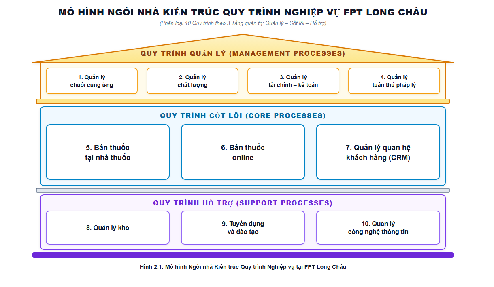
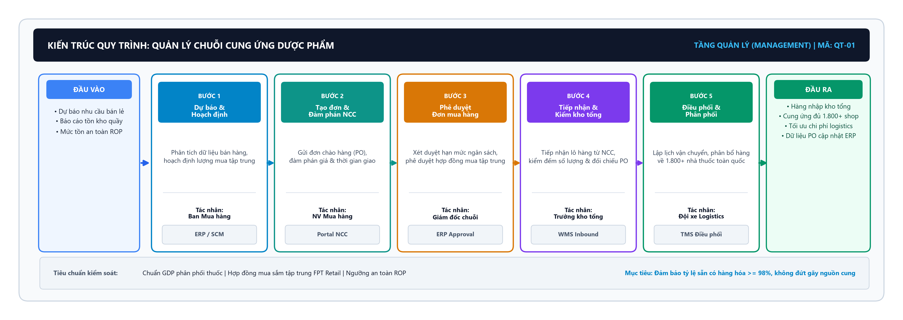
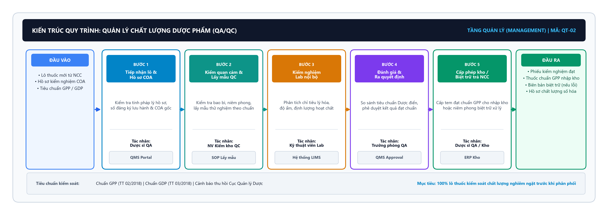
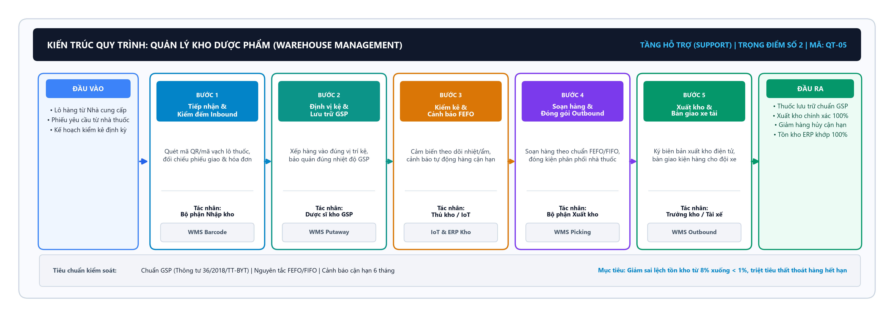
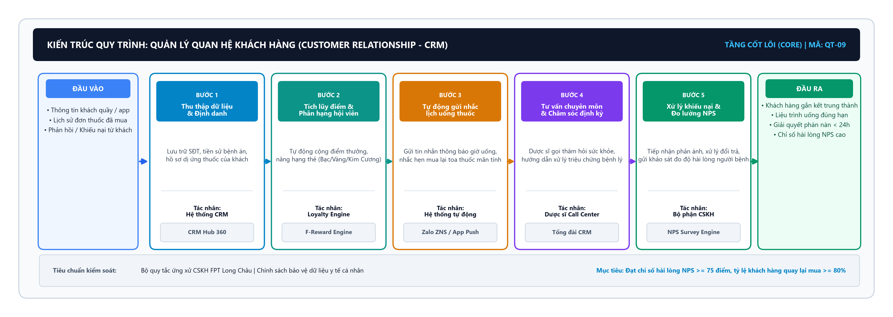

# CHƯƠNG 2: KHẢO SÁT, LIỆT KÊ VÀ PHÂN LOẠI QUY TRÌNH NGHIỆP VỤ

## 2.1. Khái quát về quản trị quy trình nghiệp vụ

Quản trị quy trình nghiệp vụ (Business Process Management - BPM) là phương pháp luận quản trị toàn diện, tập trung vào việc nhận diện, chuẩn hóa, phân tích và tối ưu hóa các chuỗi hoạt động xuyên suốt nhằm mang lại giá trị gia tăng tối đa cho khách hàng và doanh nghiệp. Khác với lối quản lý theo từng phòng ban cục bộ (silo), BPM tiếp cận doanh nghiệp như một hệ sinh thái các dòng chảy công việc có liên kết chặt chẽ giữa con người, công nghệ và dữ liệu.

Theo chuẩn quốc tế (*Dumas et al., 2018*), Vòng đời BPM (BPM Lifecycle) vận hành theo chu trình 6 giai đoạn khép kín:
1. *Nhận diện (Process Identification):* Thiết lập bức tranh danh mục và kiến trúc quy trình tổng thể.
2. *Khám phá (Process Discovery):* Khảo sát hiện trạng và mô hình hóa sơ đồ AS-IS.
3. *Phân tích (Process Analysis):* Đo lường thời gian, định lượng lãng phí VA/NVA và truy vết căn nguyên sự cố.
4. *Thiết kế lại (Process Redesign):* Tái thiết kế mô hình TO-BE tinh gọn, triệt tiêu điểm nghẽn.
5. *Triển khai (Process Implementation):* Chuyển giao quy trình, chuẩn hóa thao tác và tích hợp hạ tầng CNTT.
6. *Giám sát (Process Monitoring):* Đánh giá liên tục các chỉ số KPI vận hành để kích hoạt vòng lặp cải tiến tiếp theo.

Đối với FPT Long Châu, áp dụng BPM là điều kiện tiên quyết để chuẩn hóa chất lượng phục vụ đồng đều tại hơn 1.800 nhà thuốc, đảm bảo tuân thủ nghiêm ngặt chuẩn GPP của Bộ Y tế và duy trì lợi thế vận hành xuất sắc khi quy mô bùng nổ.

## 2.2. Phương pháp và nguồn thu thập dữ liệu

Để đảm bảo tính thực chứng và độ tin cậy khoa học, nhóm phối hợp 4 phương pháp và nguồn dữ liệu chủ đạo:

1. **Quan sát thực tế:** Ghi nhận trực tiếp luồng khách hàng, thao tác tra cứu phần mềm POS và quy trình xuất - nhập thuốc tại các nhà thuốc FPT Long Châu trong giờ cao điểm và thấp điểm.
2. **Nghiên cứu tài liệu chính thống:** Trích xuất số liệu doanh thu, quy mô từ Báo cáo thường niên FPT Retail (FRT 2023 – 2024); đối chiếu các quy chuẩn quản lý dược của Bộ Y tế (chuẩn GPP nhà thuốc, chuẩn GSP kho bãi, GDP phân phối).
3. **Phỏng vấn bán cấu trúc:** Thực hiện bộ 20 câu hỏi phỏng vấn định tính và định lượng (chi tiết tại *Phụ lục B*) với nhân sự phụ trách kho và dược sĩ tại quầy.

4. **Khảo sát kênh số (Omnichannel):** Trải nghiệm thực tế hành trình mua sắm, tư vấn toa thuốc và đối soát thời gian giao hàng trên ứng dụng di động Long Châu và website `longchau.com.vn`.

*Hạn chế nghiên cứu:* Do chính sách bảo mật nội bộ của FPT Retail, nhóm không có quyền truy cập trực tiếp vào hệ thống cơ sở dữ liệu lõi ERP/WMS. Vì vậy, các tham số chu kỳ chi tiết được xây dựng thông qua mô phỏng học thuật (academic simulation) có kiểm soát phương pháp luận, bảo đảm phản ánh chính xác bản chất vận hành thực tiễn.

## 2.3. Phân loại quy trình nghiệp vụ
Kiến trúc quy trình của bất kỳ tổ chức nào cũng thường được chia thành ba nhóm chính, nhằm xác định rõ chức năng, mục tiêu và cách thức đóng góp vào chuỗi giá trị chung. Tại FPT Long Châu, các quy trình nghiệp vụ được phân loại và trực quan hóa thông qua **Mô hình Ngôi nhà Quy trình (Process House)** chuẩn quốc tế thành ba nhóm nền tảng: quy trình quản lý (mái nhà), quy trình cốt lõi (thân nhà) và quy trình hỗ trợ (bệ móng) như minh họa tại Hình 2.1 dưới đây.

*Hình 2.1: Mô hình Ngôi nhà Phân loại Quy trình Nghiệp vụ tại FPT Long Châu*

### 2.3.1. Quy trình quản lý
Quy trình quản lý (Management Processes) là những quy trình chịu trách nhiệm định hướng, giám sát, kiểm soát và điều phối các hoạt động khác trong toàn bộ tổ chức. Các quy trình này không trực tiếp tạo ra giá trị cho khách hàng cuối, nhưng lại đóng vai trò tối quan trọng trong việc thiết lập mục tiêu kinh doanh, phân bổ nguồn lực, đảm bảo tổ chức hoạt động tuân thủ pháp luật và chiến lược đã đề ra. Tại một chuỗi dược phẩm có quy mô lớn như FPT Long Châu, quy trình quản lý giúp duy trì tính đồng nhất trong hoạt động của hàng ngàn cửa hàng và đảm bảo an toàn y tế.
Các quy trình quản lý được chọn trong phạm vi đề tài gồm:
- Quản lý chuỗi cung ứng: Hoạch định chiến lược nhu cầu dược phẩm, quản lý và đánh giá mạng lưới nhà cung cấp (Vendor Management), kiểm soát ngân sách mua sắm tập trung và điều phối dòng hàng toàn chuỗi.
- Quản lý chất lượng: Kiểm tra, giám sát chất lượng sản phẩm, dịch vụ khách hàng và kiểm soát tuân thủ tiêu chuẩn GPP.
- Quản lý tài chính – kế toán: Ghi nhận doanh thu, chi phí, quản lý dòng tiền, đối soát và các nghĩa vụ tài chính, thuế.
- Quản lý tuân thủ pháp lý & dược: Đảm bảo đáp ứng đầy đủ yêu cầu GPP, quy định Bộ Y tế và giấy phép hành nghề dược.

### 2.3.2. Quy trình cốt lõi
Quy trình cốt lõi (Core Processes / Primary Processes) là những quy trình tác động trực tiếp đến việc sản xuất hoặc cung cấp sản phẩm, dịch vụ cho khách hàng bên ngoài. Đây là chuỗi giá trị (Value Chain) mang lại doanh thu, lợi nhuận trực tiếp cho tổ chức, làm thỏa mãn nhu cầu của khách hàng. Đặc điểm của quy trình cốt lõi là sự hiện diện rõ nét nhất của các tương tác với thị trường và khách hàng.
Tại chuỗi nhà thuốc FPT Long Châu, các quy trình cốt lõi bao gồm:
- Bán thuốc tại nhà thuốc: Quy trình tiếp đón khách, tư vấn dược, kê đơn, thanh toán và xuất hóa đơn trực tiếp tại hơn 1.800 nhà thuốc.
- Bán thuốc online: Khách hàng tìm kiếm sản phẩm trên web/app, duyệt đơn thuốc ảo, thanh toán trực tuyến, vận chuyển tận nơi.
- Quản lý quan hệ khách hàng (CRM): Duy trì, chăm sóc khách hàng thành viên, tích điểm thưởng, tư vấn định kỳ và giải quyết khiếu nại.
*(Lưu ý: Dịch vụ tư vấn dược được tích hợp trực tiếp như một hoạt động chuyên môn cốt lõi trong quy trình bán thuốc tại quầy và online).*

### 2.3.3. Quy trình hỗ trợ
Quy trình hỗ trợ (Support Processes) là những hoạt động thiết yếu được thiết kế để phục vụ, hỗ trợ việc thực hiện trơn tru các quy trình cốt lõi và quản lý. Dù không trực tiếp tạo ra doanh thu hay tương tác thường xuyên với khách hàng cuối, chúng cung cấp nguồn nhân lực, hạ tầng tài chính, công nghệ và cơ sở vật chất để đảm bảo hệ thống vận hành liên tục.
Các quy trình hỗ trợ trọng yếu tại Long Châu gồm có:
- Quản lý kho: Lưu trữ, bảo quản thuốc đúng nhiệt độ, điều kiện độ ẩm, xuất - nhập kho theo chuẩn FIFO/FEFO.
- Tuyển dụng và đào tạo: Chiêu mộ dược sĩ có bằng cấp, tổ chức đào tạo kỹ năng tư vấn, cập nhật kiến thức về thuốc mới.
- Quản lý CNTT (IT): Quản lý cơ sở hạ tầng mạng, bảo trì ứng dụng Long Châu, hệ thống ERP và máy tính tại cửa hàng.

## 2.4. Kiến trúc quy trình nghiệp vụ của FPT Long Châu

### 2.4.1. Kiến trúc Quy trình Quản lý chuỗi cung ứng dược phẩm
Quy trình Quản lý chuỗi cung ứng hoạch định nhu cầu và điều phối dòng lưu chuyển hàng hóa từ nhà sản xuất đến kho trung tâm và mạng lưới nhà thuốc. Kiến trúc phân rã của quy trình được biểu diễn tại Hình 2.2 dưới đây:

*Hình 2.2: Sơ đồ Kiến trúc phân rã – Quy trình Quản lý chuỗi cung ứng dược phẩm*

### 2.4.2. Kiến trúc Quy trình Quản lý chất lượng dược phẩm (QA/QC)
Quy trình Quản lý chất lượng đảm bảo mọi lô thuốc nhập kho và phân phối đều đáp ứng nghiêm ngặt tiêu chuẩn GPP, GDP và hồ sơ COA điện tử. Kiến trúc phân rã của quy trình được thể hiện tại Hình 2.3 dưới đây:

*Hình 2.3: Sơ đồ Kiến trúc phân rã – Quy trình Quản lý chất lượng dược phẩm (QA/QC)*

### 2.4.3. Kiến trúc Quy trình Bán thuốc tại nhà thuốc
Là quy trình cốt lõi tiếp xúc trực tiếp với người bệnh tại quầy, phục vụ nhu cầu tư vấn chuyên môn và cấp phát thuốc theo đơn. Kiến trúc phân rã của quy trình được mô tả tại Hình 2.4 dưới đây:

*Hình 2.4: Sơ đồ Kiến trúc phân rã – Quy trình Bán thuốc tại nhà thuốc*

### 2.4.4. Kiến trúc Quy trình Bán thuốc online (Omnichannel O2O)
Quy trình phục vụ khách hàng trên các nền tảng số (Website, Mobile App), thẩm định đơn thuốc từ xa và giao hàng hỏa tốc trong 30 phút. Kiến trúc phân rã được biểu diễn tại Hình 2.5 dưới đây:

*Hình 2.5: Sơ đồ Kiến trúc phân rã – Quy trình Bán thuốc online (O2O)*

### 2.4.5. Kiến trúc Quy trình Quản lý kho dược phẩm (WMS)
Quy trình đảm bảo điều kiện bảo quản thuốc chuẩn GSP, kiểm soát hạn sử dụng theo nguyên tắc FEFO/FIFO và soạn hàng chính xác. Kiến trúc phân rã được mô tả tại Hình 2.6 dưới đây:

*Hình 2.6: Sơ đồ Kiến trúc phân rã – Quy trình Quản lý kho dược phẩm (WMS)*

### 2.4.6. Kiến trúc Quy trình Tuyển dụng và đào tạo Dược sĩ
Quy trình thu hút, tuyển chọn nhân sự có Chứng chỉ hành nghề (CCHN), đào tạo hội nhập và nâng cao tại Long Châu Academy. Kiến trúc phân rã được thể hiện tại Hình 2.7 dưới đây:

*Hình 2.7: Sơ đồ Kiến trúc phân rã – Quy trình Tuyển dụng và đào tạo Dược sĩ*

### 2.4.7. Kiến trúc Quy trình Quản lý công nghệ thông tin & Hạ tầng số
Quy trình duy trì sự vận hành ổn định 24/7 của hệ thống ERP, Smart POS, ứng dụng di động và bảo mật dữ liệu y tế. Kiến trúc phân rã được mô tả tại Hình 2.8 dưới đây:

*Hình 2.8: Sơ đồ Kiến trúc phân rã – Quy trình Quản lý công nghệ thông tin & Hạ tầng số*

### 2.4.8. Kiến trúc Quy trình Quản lý tài chính – Kế toán
Quy trình thu thập, đối soát dòng tiền bán lẻ vi mô và lập báo cáo tài chính minh bạch theo chuẩn VAS. Kiến trúc phân rã được biểu diễn tại Hình 2.9 dưới đây:

*Hình 2.9: Sơ đồ Kiến trúc phân rã – Quy trình Quản lý tài chính – Kế toán*

### 2.4.9. Kiến trúc Quy trình Quản lý quan hệ khách hàng (CRM)
Quy trình quản lý dữ liệu hội viên, tích điểm F-Reward, tự động gửi nhắc lịch uống thuốc và chăm sóc sức khỏe định kỳ. Kiến trúc phân rã được thể hiện tại Hình 2.10 dưới đây:

*Hình 2.10: Sơ đồ Kiến trúc phân rã – Quy trình Quản lý quan hệ khách hàng (CRM)*

### 2.4.10. Kiến trúc Quy trình Quản lý tuân thủ pháp lý & dược
Quy trình cập nhật văn bản quy phạm pháp luật, giám sát điều kiện duy trì chuẩn GPP/GDP và phòng ngừa rủi ro pháp lý ngành dược. Kiến trúc phân rã được mô tả tại Hình 2.11 dưới đây:

*Hình 2.11: Sơ đồ Kiến trúc phân rã – Quy trình Quản lý tuân thủ pháp lý & dược*

## 2.5. Danh sách 10 quy trình nghiệp vụ

Dựa vào kiến trúc quy trình tổng thể ở mục trước, dưới đây là danh sách chi tiết 10 quy trình nghiệp vụ nổi bật tại FPT Long Châu, được chọn lọc để biểu diễn các hoạt động phong phú trong tổ chức.

*Bảng 2.1: Danh mục 10 quy trình nghiệp vụ chính của FPT Long Châu*

| STT | Tên quy trình | Phân loại | Bộ phận chủ quản | Mức độ phức tạp | Tần suất thực hiện |
| :--- | :--- | :--- | :--- | :--- | :--- |
| 1 | Quản lý chuỗi cung ứng | Quản lý | Ban Cung ứng & Mua hàng | Cao | Hàng ngày |
| 2 | Quản lý chất lượng | Quản lý | Ban Đảm bảo Chất lượng | Trung bình | Hàng tuần / Hàng tháng |
| 3 | Bán thuốc tại nhà thuốc | Cốt lõi | Cửa hàng Long Châu | Trung bình | Liên tục (Hàng giờ) |
| 4 | Bán thuốc online | Cốt lõi | Thương mại điện tử / Cửa hàng | Cao | Liên tục (Hàng giờ) |
| 5 | Quản lý kho | Hỗ trợ | Khối Kho bãi / Logistics | Trung bình | Hàng ngày |
| 6 | Tuyển dụng và đào tạo | Hỗ trợ | Ban Nhân sự (HR) | Trung bình | Hàng tháng |
| 7 | Quản lý công nghệ thông tin | Hỗ trợ | Ban Công nghệ (IT) | Cao | Hàng ngày |
| 8 | Quản lý tài chính – Kế toán | Quản lý | Ban Tài chính Kế toán | Trung bình | Hàng ngày / Hàng tháng |
| 9 | Quản lý quan hệ KH (CRM) | Cốt lõi | Trung tâm Dịch vụ KH | Trung bình | Hàng ngày |
| 10 | Quản lý tuân thủ pháp lý & dược | Quản lý | Ban Tuân thủ / Pháp chế | Cao | Hàng tháng / Quý |

## 2.6. Mô tả tổng quan 10 quy trình nghiệp vụ

Theo phương pháp luận Quản trị Quy trình Nghiệp vụ chuẩn quốc tế (*Dumas et al., 2018*), mỗi quy trình nghiệp vụ cần được định danh toàn diện thông qua một Hồ sơ thuộc tính quy trình (Process Profile) kết hợp với chuỗi hoạt động chi tiết. Nhằm bảo đảm tính hệ thống, khả năng truy vết và phân tích khép kín dòng giá trị, 10 quy trình nghiệp vụ của FPT Long Châu được chuẩn hóa thống nhất theo 8 thành phần then chốt: **Mục tiêu**, **Đối tượng khách hàng phục vụ** (phân định rõ Khách hàng bên ngoài và Khách hàng nội bộ), **Tác nhân chính**, **Đầu vào & Sự kiện kích hoạt**, **Chuỗi các bước thực hiện tuần tự (5 bước nghiệp vụ Cấp 2)**, **Đầu ra vật phẩm & dữ liệu**, **Các khả năng kết quả** (Kết quả tích cực, Kết quả tiêu cực/từ chối, Kết quả ngoại lệ/điều chỉnh) và **Điểm đặc thù / Thách thức vận hành**.

Dưới đây là bản mô tả chi tiết hồ sơ và chuỗi các bước thực hiện của 10 quy trình nghiệp vụ tại FPT Long Châu:

**1. Quản lý chuỗi cung ứng (Supply Chain Management - QT-01)**
- **Mục tiêu**: Hoạch định nhu cầu, bảo đảm nguồn cung ứng thuốc và vật tư y tế liên tục, ổn định từ nhà sản xuất đến kho trung tâm và toàn bộ mạng lưới hơn 1.800 nhà thuốc; tối ưu hóa chi phí mua sắm và duy trì mức tồn kho an toàn toàn chuỗi.
- **Đối tượng khách hàng phục vụ**:
  + *Khách hàng nội bộ*: Mạng lưới hơn 1.800 nhà thuốc chi nhánh (cần bổ sung hàng hóa kịp thời để duy trì kinh doanh), Ban Giám đốc điều hành (cần kiểm soát ngân sách mua hàng tập trung và biên lợi nhuận gộp).
  + *Khách hàng bên ngoài*: Các đối tác cung ứng, hãng dược phẩm và nhà sản xuất trong và ngoài nước (nhận đơn đặt hàng PO minh bạch và đúng cam kết hợp đồng).
- **Tác nhân chính**: Nhà thuốc chi nhánh (Nhân viên Kho quầy), Trưởng kho trung tâm, Bộ phận Mua hàng tập trung, Giám đốc chuỗi cung ứng, Các Nhà cung cấp (NCC).
- **Đầu vào & Sự kiện kích hoạt**: Dữ liệu dự báo nhu cầu bán hàng từ hệ thống BI, danh mục hàng hóa chạm điểm đặt hàng lại (ROP), cảnh báo thiếu hàng khẩn cấp từ các nhà thuốc.
- **Chuỗi các bước thực hiện tuần tự (Workflow Steps)**:
  + *Bước 1 (Dự báo & Hoạch định nhu cầu)*: Ban Mua hàng phân tích dữ liệu bán hàng vi mô từ hệ thống BI/SCM, đối chiếu mức tồn kho an toàn (ROP) để lập kế hoạch mua sắm thuốc tập trung toàn chuỗi.
  + *Bước 2 (Tạo đơn đặt hàng & Đàm phán nhà cung cấp)*: Nhân viên Mua hàng lập đơn đặt hàng dự thảo (PO) trên Portal NCC, thương thảo về đơn giá, chiết khấu thương mại và cam kết thời gian giao hàng (SLA).
  + *Bước 3 (Phê duyệt đơn mua hàng)*: Đơn PO được chuyển trình qua hệ thống ERP Approval; Trưởng phòng Mua hàng hoặc Giám đốc chuỗi ký duyệt hạn mức ngân sách mua tập trung.
  + *Bước 4 (Tiếp nhận & Kiểm kho tổng)*: Kho trung tâm tiếp nhận xe hàng từ nhà cung cấp, nhân viên kho quét mã vạch kiểm đếm số lượng thực tế và đối chiếu với chứng từ đơn PO.
  + *Bước 5 (Điều phối & Phân phối toàn chuỗi)*: Bộ phận Logistics lập lịch vận chuyển qua hệ thống TMS, tổ chức bốc xếp và phân bổ thuốc về hơn 1.800 nhà thuốc chi nhánh trên toàn quốc.
- **Đầu ra vật phẩm & dữ liệu**: Đơn đặt hàng (PO) được phê duyệt số, hợp đồng mua sắm điện tử, dữ liệu PO đồng bộ trên hệ thống ERP, lịch điều phối bến bãi tiếp nhận hàng.
- **Các khả năng kết quả của quy trình (Possible Outcomes)**:
  + *Kết quả tích cực (Positive Outcome)*: Nhà cung cấp xác nhận đơn hàng, giao hàng đúng hẹn, đúng chủng loại, đạt 100% tiêu chuẩn bảo quản GSP/GDP; toàn chuỗi đạt tỷ lệ đáp ứng hàng hóa (Fill Rate) ≥ 98%.
  + *Kết quả tiêu cực / Từ chối (Negative Outcome)*: Đơn đặt hàng bị Giám đốc chuỗi từ chối phê duyệt do vượt hạn mức ngân sách quý; hoặc Nhà cung ứng thông báo hủy đơn do đứt gãy dây chuyền sản xuất thuốc.
  + *Kết quả ngoại lệ / Điều chỉnh (Exception Outcome)*: Nhà cung ứng thiếu hụt cục bộ một số hoạt chất → đàm phán giao hàng làm nhiều đợt (partial shipment), hoặc kích hoạt nhà cung cấp dự phòng tương đương sinh học.
- **Điểm đặc thù / Thách thức vận hành**: Danh mục SKU dược phẩm vô cùng phong phú (hơn 10.000 mã hàng) với hạn dùng khác nhau; áp lực điều phối cung ứng đa vùng miền mà không gây ứ đọng vốn lưu động.

**2. Quản lý chất lượng (Quality Management - QT-02)**
- **Mục tiêu**: Giám sát, kiểm nghiệm và thẩm định định kỳ chất lượng dược phẩm, điều kiện bảo quản nhiệt độ - độ ẩm và quy chuẩn thực hành tại quầy, bảo đảm 100% sản phẩm đạt chuẩn GPP của Bộ Y tế và bảo vệ an toàn tính mạng người bệnh.
- **Đối tượng khách hàng phục vụ**:
  + *Khách hàng bên ngoài*: Người bệnh và khách hàng tiêu dùng (được bảo đảm sử dụng thuốc chính hãng, tuyệt đối an toàn, rõ nguồn gốc); Cơ quan quản lý Nhà nước (Cục Quản lý Dược, Sở Y tế - kiểm tra tuân thủ pháp lý y tế).
  + *Khách hàng nội bộ*: Khối Kho vận và Khối Nhà thuốc (nhận chứng nhận kiểm định đạt chuẩn để đủ điều kiện nhập kho và phân phối bày bán).
- **Tác nhân chính**: Dược sĩ phụ trách QA, Nhân viên kiểm kho & lấy mẫu (QC), Phòng thử nghiệm Lab nội bộ, Trưởng phòng QA & Ban Giám đốc chuỗi, Viện Kiểm nghiệm thuốc Trung ương (đơn vị giám định độc lập).
- **Đầu vào & Sự kiện kích hoạt**: Lô dược phẩm mới cập bến kho tiếp nhận, hồ sơ phiếu kiểm nghiệm gốc (COA) của nhà sản xuất, bộ tiêu chuẩn GPP/GDP hiện hành, công văn cảnh báo thu hồi thuốc khẩn cấp từ Cục Quản lý Dược.
- **Chuỗi các bước thực hiện tuần tự (Workflow Steps)**:
  + *Bước 1 (Tiếp nhận lô hàng & Thẩm định hồ sơ COA)*: Dược sĩ QA tiếp nhận lô thuốc tại bến nhập kho, kiểm tra tính pháp lý của hồ sơ, số đăng ký lưu hành và phiếu kiểm nghiệm xuất xưởng gốc (COA).
  + *Bước 2 (Kiểm tra cảm quan & Lấy mẫu QC)*: Nhân viên QC kiểm tra ngoại quan bao bì, tem nhãn phụ tiếng Việt, kiểm tra thiết bị ghi nhiệt độ dây chuyền lạnh (Cold Chain) và tiến hành lấy mẫu theo quy chuẩn GPP/GDP.
  + *Bước 3 (Kiểm nghiệm tại phòng Lab nội bộ)*: Mẫu thuốc được chuyển về phòng Lab nội bộ để phân tích các chỉ tiêu lý - hóa, độ rã, độ đồng đều khối lượng và định lượng hoạt chất chính.
  + *Bước 4 (Đánh giá tiêu chuẩn & Ra quyết định)*: Trưởng phòng QA đối chiếu kết quả kiểm nghiệm với tiêu chuẩn Dược điển Việt Nam, thẩm định các cảnh báo thu hồi thuốc từ Cục Quản lý Dược để ra quyết định chấp thuận hay từ chối.
  + *Bước 5 (Cấp phép nhập kho / Xử lý biệt trữ)*: Dược sĩ QA cấp tem đạt chuẩn GPP cho phép nhập kho ERP lưu thông; hoặc lập biên bản niêm phong đưa vào khu Biệt trữ (Quarantine) để trả về nhà cung cấp/tiêu hủy.
- **Đầu ra vật phẩm & dữ liệu**: Phiếu chứng nhận kiểm định đạt chuẩn cho phép nhập kho ERP, hồ sơ theo dõi nhiệt ẩm tự động, hoặc Biên bản niêm phong/hủy thuốc/trả về nơi sản xuất.
- **Các khả năng kết quả của quy trình (Possible Outcomes)**:
  + *Kết quả tích cực (Positive Outcome)*: Lô thuốc đạt 100% tiêu chí cảm quan, hàm lượng hoạt chất và hồ sơ COA điện tử hợp lệ → cấp phép dán tem thông quan nhập kho và lưu hành toàn chuỗi.
  + *Kết quả tiêu cực / Từ chối (Negative Outcome)*: Lô hàng không đạt chuẩn (hư hao bao bì, đổi màu hoạt chất, nhiệt độ thùng lạnh vượt ngưỡng cho phép, COA nghi vấn) → lập biên bản từ chối tiếp nhận, niêm phong và trả lại nhà cung ứng.
  + *Kết quả ngoại lệ / Điều chỉnh (Exception Outcome)*: Lô thuốc có thông số nghi ngờ chưa kết luận được → đưa vào khu vực "Biệt trữ" (Quarantine) và gửi mẫu hỏa tốc đến Viện Kiểm nghiệm thuốc Trung ương để thẩm định chuyên sâu lần hai.
- **Điểm đặc thù / Thách thức vận hành**: Khối lượng lô hàng luân chuyển hàng ngày cực lớn; yêu cầu kiểm soát chuỗi cung ứng lạnh (Cold Chain 2°C - 8°C) đối với vắc xin và thuốc sinh học vô cùng khắt khe.

**3. Bán thuốc tại nhà thuốc (In-Store Pharmacy Sales - QT-03)**
- **Mục tiêu**: Tiếp đón chu đáo, tư vấn đúng bệnh - đúng thuốc, cấp phát chính xác theo đơn bác sĩ và mang lại trải nghiệm chăm sóc y tế tận tâm, minh bạch tại hơn 1.800 nhà thuốc.
- **Đối tượng khách hàng phục vụ**:
  + *Khách hàng bên ngoài*: Người bệnh, người nhà bệnh nhân, người mua thuốc kê đơn / OTC, khách hàng mua thực phẩm chức năng và hội viên thân thiết F-Reward.
  + *Khách hàng nội bộ*: Bộ phận Kế toán - Tài chính (tiếp nhận dòng tiền thanh toán bán lẻ vi mô), Bộ phận Kho chi nhánh (nhận tín hiệu trừ lùi tồn kho tự động trên hệ thống ERP).
- **Tác nhân chính**: Khách hàng trực tiếp, Dược sĩ tư vấn tại quầy, Nhân viên thu ngân, Dược sĩ kho quầy (bảo quản thuốc chuẩn GPP), Hệ thống Smart POS bán lẻ.
- **Đầu vào & Sự kiện kích hoạt**: Khách hàng đến quầy xuất trình đơn thuốc của cơ sở y tế hoặc mô tả triệu chứng bệnh học thông thường; số điện thoại đăng ký hội viên.
- **Chuỗi các bước thực hiện tuần tự (Workflow Steps)**:
  + *Bước 1 (Tiếp đón & Tiếp nhận yêu cầu)*: Dược sĩ tiếp đón người bệnh tại quầy thuốc, tiếp nhận đơn thuốc từ cơ sở y tế hoặc lắng nghe khách hàng mô tả triệu chứng bệnh học thông thường.
  + *Bước 2 (Thẩm định đơn thuốc & Tư vấn dược)*: Dược sĩ tra cứu Cơ sở dữ liệu Dược Quốc gia trên POS, kiểm tra tính hợp lệ của toa thuốc (thời hạn, chữ ký bác sĩ), tư vấn liều dùng, tương tác thuốc và giải thích cặn kẽ phác đồ điều trị.
  + *Bước 3 (Lập đơn bán hàng & Thu tiền)*: Dược sĩ quét mã barcode sản phẩm lên màn hình Smart POS, kiểm tra chính sách tích điểm hội viên F-Reward và thu ngân qua tiền mặt, thẻ ngân hàng hoặc quét mã QR VNPay.
  + *Bước 4 (Soạn thuốc & Dán nhãn liều dùng)*: Dược sĩ kho quầy lấy thuốc từ tủ bảo quản GPP theo đúng nguyên tắc cận hạn xuất trước (FEFO), in và dán nhãn hướng dẫn liều dùng cá nhân hóa lên từng hộp/vỉ thuốc.
  + *Bước 5 (Bàn giao thuốc & Dặn dò người bệnh)*: Thực hiện quy tắc kiểm soát y tế "3 tra 5 đối", dặn dò người bệnh thời điểm uống thuốc, bàn giao thuốc cùng hóa đơn điện tử VAT và hệ thống ERP tự động trừ lùi tồn kho thời gian thực.
- **Đầu ra vật phẩm & dữ liệu**: Túi thuốc được đóng gói an toàn kèm hướng dẫn liều dùng rõ ràng; hóa đơn điện tử / phiếu thanh toán hợp lệ; số liệu tồn kho ERP bị trừ lùi thời gian thực; điểm thưởng F-Reward được tích lũy.
- **Các khả năng kết quả của quy trình (Possible Outcomes)**:
  + *Kết quả tích cực (Positive Outcome)*: Khách hàng được dược sĩ tư vấn tận tình, toa thuốc hợp lệ, thanh toán nhanh chóng, nhận đúng thuốc và hoàn toàn hài lòng với dịch vụ.
  + *Kết quả tiêu cực / Từ chối (Negative Outcome)*: Đơn thuốc không hợp lệ (hết hạn quá 5 ngày, kê sai danh mục thuốc kiểm soát đặc biệt/thuốc gây nghiện) → Dược sĩ từ chối bán thuốc và giải thích cặn kẽ theo đúng luật; hoặc khách hàng không đồng ý mức giá/không mua.
  + *Kết quả ngoại lệ / Điều chỉnh (Exception Outcome)*: Cửa hàng hết cục bộ một mặt hàng trong đơn → Dược sĩ tra cứu kho các chi nhánh lân cận trên hệ thống POS để điều phối giao hỏa tốc tận nhà cho khách trong 30 phút, hoặc đề xuất hoạt chất tương đương sinh học (sau khi được khách hàng đồng thuận).
- **Điểm đặc thù / Thách thức vận hành**: Lưu lượng khách dồn ứ giờ cao điểm gây ùn tắc tại quầy; đòi hỏi dược sĩ thao tác tra cứu nhanh nhưng phải tuyệt đối tuân thủ trách nhiệm đạo đức y khoa và quy chế dược.

**4. Bán thuốc online (Omnichannel O2O Sales - QT-04)**
- **Mục tiêu**: Tiếp nhận đơn hàng từ các kênh số (Website, Mobile App), tổ chức thẩm định đơn thuốc từ xa qua dược sĩ trực tuyến và giao hàng hỏa tốc trong 30 phút, đem lại sự thuận tiện tối đa cho người bệnh.
- **Đối tượng khách hàng phục vụ**:
  + *Khách hàng bên ngoài*: Người tiêu dùng kỹ thuật số, bệnh nhân ở xa hoặc gặp khó khăn khi di chuyển trực tiếp đến cửa hàng, người dùng mua thuốc định kỳ theo phác đồ.
  + *Khách hàng nội bộ*: Ban Thương mại điện tử (đo lường tỷ lệ hoàn tất đơn hàng và doanh số số hóa), Đội ngũ Shipper / Nhà thuốc điều phối (nhận nhiệm vụ chuẩn bị đơn hàng).
- **Tác nhân chính**: Khách hàng Online, Nhân viên CSKH/Telesale, Dược sĩ thẩm định toa trực tuyến, Nhà thuốc điều phối đóng gói (O2O Hub), Đội ngũ Giao vận (Shipper).
- **Đầu vào & Sự kiện kích hoạt**: Đơn đặt hàng được khách tạo trên Website/App, ảnh chụp toa thuốc tải lên (đối với thuốc kê đơn), địa chỉ nhận hàng và hình thức thanh toán.
- **Chuỗi các bước thực hiện tuần tự (Workflow Steps)**:
  + *Bước 1 (Tiếp nhận đơn hàng trực tuyến)*: Hệ thống quản lý đơn hàng (OMS) tự động tiếp nhận giỏ hàng từ Website longchau.com hoặc Mobile App, phân loại đơn thuốc OTC hay đơn thuốc kê đơn (Rx).
  + *Bước 2 (Gọi tư vấn & Thẩm định toa online)*: Dược sĩ trực tuyến liên hệ với khách hàng qua điện thoại/video call để xác minh thông tin bệnh nhân, thẩm định ảnh chụp đơn thuốc của bác sĩ và hướng dẫn sử dụng từ xa.
  + *Bước 3 (Điều phối nhà thuốc gần nhất)*: Thuật toán O2O tự động quét và phân bổ đơn hàng cho nhà thuốc Long Châu gần vị trí người nhận nhất (bán kính < 3km) đang có đủ tồn kho sẵn sàng.
  + *Bước 4 (Soạn thuốc & Đóng gói niêm phong)*: Dược sĩ tại nhà thuốc nhận đơn tiến hành soạn thuốc, dán nhãn liều dùng cá nhân hóa và đóng gói chuyên dụng trong túi seal niêm phong đạt chuẩn y tế (kèm đá gel nếu là thuốc lạnh).
  + *Bước 5 (Giao hàng hỏa tốc & Thanh toán COD)*: Đội ngũ Shipper nhận kiện hàng, di chuyển giao tận tay khách hàng trong vòng 30 phút, đối soát tiền thu hộ COD hoặc xác nhận mã đơn thanh toán trực tuyến.
- **Đầu ra vật phẩm & dữ liệu**: Kiện hàng đóng gói niêm phong kín đáo theo chuẩn y tế, phiếu hướng dẫn sử dụng thuốc đính kèm, mã xác thực đơn hàng thành công, biên nhận COD hoặc xác nhận thanh toán trực tuyến (VNPay/Momo).
- **Các khả năng kết quả của quy trình (Possible Outcomes)**:
  + *Kết quả tích cực (Positive Outcome)*: Toa thuốc được thẩm định hợp lệ, đơn hàng được soạn đúng và giao đến tận tay khách hàng trong vòng 30 - 60 phút, giao dịch thanh toán thành công.
  + *Kết quả tiêu cực / Từ chối (Negative Outcome)*: Đơn hàng bị hủy do ảnh chụp toa thuốc bị mờ, giả mạo hoặc thuốc kê đơn cấm bán online theo quy định của Bộ Y tế; hoặc khách hàng chủ động hủy đơn trước giờ giao hàng.
  + *Kết quả ngoại lệ / Điều chỉnh (Exception Outcome)*: Shipper giao tới nơi nhưng khách không thể nhận hàng ngay → lưu giữ tạm thời tại nhà thuốc điều phối và xếp lịch giao lại lần hai; hoặc hàng hóa bị hư hỏng trong quá trình vận chuyển → lập tức đổi kiện thuốc mới giao bù hỏa tốc.
- **Điểm đặc thù / Thách thức vận hành**: Phải xác thực chặt chẽ tính pháp lý của đơn thuốc điện tử từ xa; áp lực điều phối mạng lưới giao vận hỏa tốc 30 phút trong điều kiện thời tiết và giao thông phức tạp.

**5. Quản lý kho (Warehouse Management - QT-05)**
- **Mục tiêu**: Tổ chức tiếp nhận, sắp xếp lưu kho khoa học, bảo quản an toàn thuốc theo tiêu chuẩn GSP; kiểm soát hạn dùng theo nguyên tắc FEFO/FIFO và điều phối xuất hàng chính xác, triệt tiêu sai lệch tồn kho.
- **Đối tượng khách hàng phục vụ**:
  + *Khách hàng nội bộ*: Toàn bộ mạng lưới hơn 1.800 nhà thuốc chi nhánh (tiếp nhận dòng hàng phân bổ đều đặn hàng ngày), Bộ phận Mua sắm (nhận số liệu tồn kho chính xác để lập kế hoạch nhập hàng).
  + *Khách hàng bên ngoài*: Đơn vị vận chuyển logistics đối tác (tiếp nhận kiện hàng chuẩn hóa để vận chuyển liên tỉnh).
- **Tác nhân chính**: Bộ phận Tiếp nhận & Nhập kho (Inbound), Dược sĩ quản trị kho GSP & Biệt trữ, Bộ phận Soạn hàng & Xuất kho (Outbound), Trưởng kho kiểm kê & Quản trị WMS/ERP, Đội xe vận tải.
- **Đầu vào & Sự kiện kích hoạt**: Lô hàng từ nhà cung cấp kèm phiếu giao hàng hợp lệ; Phiếu yêu cầu xuất kho điều chuyển từ mạng lưới nhà thuốc; Lịch kiểm kê định kỳ toàn kho.
- **Chuỗi các bước thực hiện tuần tự (Workflow Steps)**:
  + *Bước 1 (Tiếp nhận & Kiểm đếm Inbound)*: Xe hàng NCC cập bến kho tổng, nhân viên sử dụng máy PDA quét mã vạch/mã QR để kiểm đếm số lượng kiện hàng và đối chiếu khớp lệnh PO trên hệ thống WMS.
  + *Bước 2 (Định vị kệ & Lưu trữ chuẩn GSP)*: Hệ thống WMS tự động chỉ định vị trí kệ lưu trữ tối ưu (Putaway Bin Location); nhân viên sắp xếp thuốc vào đúng khu vực bảo quản đạt chuẩn GSP theo nhiệt độ và độ ẩm quy định.
  + *Bước 3 (Kiểm kê & Cảnh báo hạn dùng FEFO)*: Cảm biến IoT tự động giám sát nhiệt độ môi trường kho 24/7; phần mềm ERP định kỳ quét dữ liệu và tự động phát cảnh báo các lô thuốc cận hạn sử dụng (< 6 tháng).
  + *Bước 4 (Soạn hàng & Đóng gói Outbound)*: Khi tiếp nhận yêu cầu điều chuyển từ các cửa hàng, nhân viên soạn hàng (Picking) theo đúng thứ tự ưu tiên hạn dùng FEFO (First Expired, First Out) và đóng thùng niêm phong.
  + *Bước 5 (Xuất kho & Bàn giao xe vận tải)*: Trưởng kho ký biên bản xuất kho điện tử trên WMS, in phiếu điều phối vận chuyển và bàn giao kiện hàng cho đội ngũ tài xế xe tải để phân phối liên tỉnh.
- **Đầu ra vật phẩm & dữ liệu**: Hàng hóa được gán mã vạch/QR và lưu trữ đúng vị trí kệ (Bin Location); Kiện hàng xuất kho kèm Phiếu xuất kho điện tử; Báo cáo đối soát tồn kho khớp 100% với hệ thống ERP.
- **Các khả năng kết quả của quy trình (Possible Outcomes)**:
  + *Kết quả tích cực (Positive Outcome)*: Quá trình nhập - xuất diễn ra nhanh chóng, tuân thủ tuyệt đối nguyên tắc cận hạn xuất trước (FEFO); số liệu kiểm kê khớp hoàn toàn giữa thực tế và sổ sách ERP.
  + *Kết quả tiêu cực / Từ chối (Negative Outcome)*: Từ chối tiếp nhận hàng từ xe chở của NCC do vi phạm quy chuẩn nhiệt độ bảo quản trong thùng xe; hoặc hủy lệnh xuất kho do phát hiện bao bì sản phẩm bị móp méo trong lúc soạn hàng.
  + *Kết quả ngoại lệ / Điều chỉnh (Exception Outcome)*: Phát hiện lô thuốc cận hạn sử dụng (< 6 tháng) trong quá trình kiểm kê định kỳ → tự động kích hoạt thông báo điều chuyển ưu tiên bán tại các chi nhánh có doanh số cao, hoặc lập thủ tục đổi trả nhà sản xuất.
- **Điểm đặc thù / Thách thức vận hành**: Quy mô kho trung tâm khổng lồ với hàng chục ngàn SKU; đòi hỏi hệ thống cảm biến giám sát nhiệt độ và độ ẩm liên tục 24/7 để bảo đảm chất lượng thuốc.

**6. Tuyển dụng và đào tạo (Human Resources & Training - QT-06)**
- **Mục tiêu**: Thu hút, tuyển chọn đội ngũ dược sĩ có Chứng chỉ hành nghề (CCHN) vững vàng; đào tạo văn hóa phục vụ tận tâm và kiến thức tư vấn bệnh học chuẩn GPP qua Học viện Long Châu Academy nhằm đáp ứng tốc độ mở chuỗi.
- **Đối tượng khách hàng phục vụ**:
  + *Khách hàng nội bộ*: Các nhà thuốc mới mở và các nhà thuốc hiện hữu (cần bổ sung nhân sự đạt chuẩn), Ban Giám đốc Vận hành (cần duy trì tỷ lệ phủ định biên nhân sự nhà thuốc ≥ 98%).
  + *Khách hàng bên ngoài*: Ứng viên Dược sĩ trên thị trường lao động y dược.
- **Tác nhân chính**: Ứng viên Dược sĩ, Bộ phận Tuyển dụng (HR), Hội đồng phỏng vấn chuyên môn y dược, Trung tâm Đào tạo Long Châu Academy, Cửa hàng trưởng hướng dẫn thực tế.
- **Đầu vào & Sự kiện kích hoạt**: Kế hoạch mở mới mạng lưới nhà thuốc từ Ban Lãnh đạo; Đơn đề xuất bổ sung nhân sự từ các cửa hàng trưởng; Hồ sơ ứng tuyển (CV) và bằng cấp chuyên môn dược sĩ.
- **Chuỗi các bước thực hiện tuần tự (Workflow Steps)**:
  + *Bước 1 (Hoạch định nhu cầu & Đăng tin tuyển dụng)*: Phòng Nhân sự (HR) căn cứ vào kế hoạch mở mới mạng lưới nhà thuốc để xác định định biên nhân sự, xây dựng bản mô tả công việc (JD) và đăng tuyển đa kênh.
  + *Bước 2 (Sàng lọc hồ sơ & Phỏng vấn chuyên môn)*: HR kiểm tra tính pháp lý của văn bằng và Chứng chỉ hành nghề (CCHN) Dược; Hội đồng chuyên môn tiến hành phỏng vấn 2 vòng đánh giá kiến thức bệnh học và thái độ phục vụ.
  + *Bước 3 (Đào tạo hội nhập tại Long Châu Academy)*: Ứng viên trúng tuyển tham gia khóa đào tạo tập trung tại Học viện Long Châu Academy về kỹ năng tư vấn chuẩn GPP, văn hóa tận tâm và sử dụng phần mềm Smart POS.
  + *Bước 4 (Sát hạch kiến thức & Thực tập tại quầy mẫu)*: Học viên trải qua kỳ thi sát hạch lý thuyết và thực hành lâm sàng; sau đó tham gia thực tập thực tế 2 tuần tại các nhà thuốc mẫu dưới sự kèm cặp của Dược sĩ trưởng.
  + *Bước 5 (Bổ nhiệm chính thức & Phân công trực quầy)*: Ban Nhân sự thẩm định kết quả tốt nghiệp, ký kết hợp đồng lao động chính thức, cấp mã số nhân viên trên hệ thống HRIS và phân bổ về ca trực quầy tại nhà thuốc.
- **Đầu ra vật phẩm & dữ liệu**: Hợp đồng lao động chính thức được ký kết; Chứng chỉ hoàn thành chương trình đào tạo hội nhập Long Châu Academy; Hồ sơ nhân sự và tài khoản định danh trên hệ thống HRIS.
- **Các khả năng kết quả của quy trình (Possible Outcomes)**:
  + *Kết quả tích cực (Positive Outcome)*: Dược sĩ vượt qua các vòng phỏng vấn, đạt điểm xuất sắc trong kỳ thi sát hạch GPP tại Academy và được phân công về nhận ca trực quầy tại nhà thuốc.
  + *Kết quả tiêu cực / Từ chối (Negative Outcome)*: Ứng viên không đạt yêu cầu chuyên môn sau 2 vòng phỏng vấn; hoặc học viên không vượt qua bài kiểm tra cuối khóa đào tạo hội nhập → từ chối tuyển dụng hoặc dừng hợp đồng thử việc.
  + *Kết quả ngoại lệ / Điều chỉnh (Exception Outcome)*: Dược sĩ có chuyên môn tốt nhưng thiếu kỹ năng giao tiếp hoặc thao tác phần mềm POS → gia hạn thời gian đào tạo thực hành thêm 2 tuần tại cửa hàng mẫu có sự kèm cặp trực tiếp của Dược sĩ trưởng.
- **Điểm đặc thù / Thách thức vận hành**: Áp lực tuyển dụng và đào tạo hàng ngàn dược sĩ mỗi năm theo đà mở rộng thần tốc của chuỗi, trong khi nguồn nhân lực ngành y dược có chứng chỉ hành nghề luôn cạnh tranh gay gắt.

**7. Quản lý công nghệ thông tin (IT Infrastructure & Operations - QT-07)**
- **Mục tiêu**: Bảo đảm sự vận hành liên tục, ổn định 24/7 của toàn bộ hạ tầng mạng, máy chủ Cloud, hệ thống ERP lõi, phần mềm Smart POS tại quầy và ứng dụng di động; đồng thời bảo mật tuyệt đối dữ liệu y tế người dùng.
- **Đối tượng khách hàng phục vụ**:
  + *Khách hàng nội bộ*: Toàn thể cán bộ nhân viên tại hơn 1.800 nhà thuốc, khối kho vận logistics và khối văn phòng hội sở (cần hạ tầng số hoạt động ổn định để xử lý công việc).
  + *Khách hàng bên ngoài*: Hàng triệu người bệnh và người tiêu dùng sử dụng ứng dụng di động và website Long Châu (được phục vụ trên nền tảng số bảo mật và không bị nghẽn mạng).
- **Tác nhân chính**: Người dùng nội bộ (Dược sĩ / Nhân viên kho / Nhân viên văn phòng), Đội ngũ IT Helpdesk, Kỹ sư Quản trị hệ thống ERP & Cloud, Chuyên viên An toàn thông tin (Security).
- **Đầu vào & Sự kiện kích hoạt**: Phiếu yêu cầu hỗ trợ kỹ thuật (IT Ticket), cảnh báo giám sát hệ thống tự động từ máy chủ, yêu cầu nâng cấp tính năng phần mềm từ các phòng ban.
- **Chuỗi các bước thực hiện tuần tự (Workflow Steps)**:
  + *Bước 1 (Tiếp nhận Ticket yêu cầu / Sự cố)*: Đội ngũ IT Helpdesk tiếp nhận các yêu cầu hỗ trợ kỹ thuật hoặc báo cáo sự cố từ các nhà thuốc qua hệ thống Jira Service Desk và phân loại mức độ ưu tiên theo SLA.
  + *Bước 2 (Hỗ trợ từ xa & Xử lý kỹ thuật)*: Kỹ sư IT Support truy cập từ xa qua Remote Desktop để khắc phục nhanh chóng các lỗi máy POS, máy in hóa đơn, kết nối mạng LAN hoặc điều phối kỹ thuật viên đến hỗ trợ trực tiếp.
  + *Bước 3 (Quản trị hệ thống ERP lõi & Cloud)*: Đội ngũ Kỹ sư Quản trị hệ thống theo dõi tải máy chủ trên nền tảng Cloud, tối ưu hóa cơ sở dữ liệu bán lẻ vi mô và bảo đảm đường truyền mạng liên thông 24/7.
  + *Bước 4 (Sao lưu dữ liệu & Bảo mật an toàn thông tin)*: Hệ thống tự động sao lưu định kỳ (Auto Backup) toàn bộ cơ sở dữ liệu giao dịch và lịch sử đơn thuốc; chuyên viên an ninh mạng kiểm tra tường lửa và vá lỗ hổng bảo mật.
  + *Bước 5 (Nghiệm thu đóng Ticket & Đo lường SLA)*: Trưởng nhóm IT kiểm tra kết quả vận hành ổn định, nghiệm thu đóng ticket hỗ trợ và trích xuất báo cáo đo lường chỉ số cam kết thời gian giải quyết sự cố (SLA).
- **Đầu ra vật phẩm & dữ liệu**: Sự cố CNTT được giải quyết hoàn tất (Closed Ticket); bản cập nhật phần mềm hoặc tính năng mới được triển khai; biên bản kiểm thử an ninh mạng và dữ liệu sao lưu (Backup) an toàn.
- **Các khả năng kết quả của quy trình (Possible Outcomes)**:
  + *Kết quả tích cực (Positive Outcome)*: Sự cố kỹ thuật được khắc phục trong thời hạn cam kết SLA; toàn bộ hệ thống bán hàng duy trì độ sẵn sàng Uptime ≥ 99.9%.
  + *Kết quả tiêu cực / Từ chối (Negative Outcome)*: Phiếu yêu cầu bị từ chối do vi phạm quy định an toàn thông tin (ví dụ: cài đặt phần mềm ngoài danh mục); hoặc tính năng mới không qua được vòng kiểm thử an ninh.
  + *Kết quả ngoại lệ / Điều chỉnh (Exception Outcome)*: Xảy ra đứt kết nối cáp quang internet tại một nhà thuốc → hệ thống tự động chuyển sang mạng 4G dự phòng và kích hoạt chế độ bán hàng ngoại tuyến (Offline Mode) trên Smart POS để không gián đoạn phục vụ.
- **Điểm đặc thù / Thách thức vận hành**: Quy mô mạng lưới phân tán rộng lớn tại hơn 1.800 điểm cầu trên 63 tỉnh thành; yêu cầu bảo mật thông tin đơn thuốc và dữ liệu sức khỏe cá nhân theo chuẩn quốc tế.

**8. Quản lý tài chính – Kế toán (Financial & Accounting Management - QT-08)**
- **Mục tiêu**: Ghi nhận chính xác, đầy đủ và minh bạch mọi dòng tiền thu - chi vi mô từ bán lẻ; tự động hóa đối soát thanh toán; quản trị ngân sách và lập báo cáo tài chính tuân thủ chuẩn mực VAS/IFRS.
- **Đối tượng khách hàng phục vụ**:
  + *Khách hàng nội bộ*: Ban Giám đốc và Hội đồng Quản trị FPT Retail (nhận báo cáo dòng tiền và hiệu quả kinh doanh để ra quyết định chiến lược); các phòng ban chức năng (được giải ngân kinh phí hoạt động đúng hạn).
  + *Khách hàng bên ngoài*: Cơ quan Thuế Nhà nước, Cổ đông, Ngân hàng đối tác và các Nhà cung cấp dược phẩm (nhận thanh toán công nợ minh bạch và đúng hạn).
- **Tác nhân chính**: Nhân viên Kế toán phần hành, Kế toán trưởng, Ban Giám đốc Tài chính (CFO), Thu ngân nhà thuốc, Hệ thống ERP Kế toán tập trung.
- **Đầu vào & Sự kiện kích hoạt**: Dữ liệu chốt ca bán hàng vi mô từ hệ thống Smart POS; Hóa đơn giá trị gia tăng (GTGT) từ nhà cung ứng; Sao kê tài khoản ngân hàng và đối soát từ các cổng ví điện tử.
- **Chuỗi các bước thực hiện tuần tự (Workflow Steps)**:
  + *Bước 1 (Đối soát doanh thu bán lẻ POS & Ngân hàng)*: Cuối mỗi ngày kinh doanh, kế toán bán lẻ thu thập dữ liệu chốt ca từ máy POS, đối chiếu tiền mặt thực thu tại két và số liệu chuyển khoản trên sao kê ngân hàng/ví điện tử.
  + *Bước 2 (Kiểm duyệt hóa đơn & Chi phí mua hàng)*: Kế toán chi phí tiếp nhận hóa đơn giá trị gia tăng (GTGT) điện tử từ nhà cung cấp, kiểm tra tính hợp pháp của hóa đơn và đối chiếu với phiếu nhập kho WMS và đơn PO.
  + *Bước 3 (Hạch toán kế toán & Quản trị công nợ)*: Kế toán viên định khoản các nghiệp vụ phát sinh vào phần mềm kế toán tập trung, ghi nhận doanh thu, giá vốn hàng bán (COGS) và theo dõi hạn nợ phải trả cho nhà cung cấp.
  + *Bước 4 (Phê duyệt chi trả & Quản trị dòng tiền)*: Kế toán trưởng và Giám đốc Tài chính (CFO) thẩm định hồ sơ giải ngân, ký duyệt lệnh ủy nhiệm chi (UNC) điện tử qua hệ thống E-Banking để thanh toán công nợ đúng hạn.
  + *Bước 5 (Khóa sổ kế toán & Lập báo cáo tài chính)*: Kế toán tổng hợp tiến hành khóa sổ định kỳ (tháng/quý), lập báo cáo kết quả hoạt động kinh doanh (P&L), bảng cân đối kế toán và kê khai quyết toán thuế điện tử gửi cơ quan Thuế.
- **Đầu ra vật phẩm & dữ liệu**: Báo cáo tài chính định kỳ (Tháng/Quý/Năm); Tờ khai nghĩa vụ thuế nộp cơ quan chức năng; Lệnh chuyển tiền và ủy nhiệm chi ngân hàng (UNC) đã được phê duyệt.
- **Các khả năng kết quả của quy trình (Possible Outcomes)**:
  + *Kết quả tích cực (Positive Outcome)*: Dữ liệu tiền mặt, quẹt thẻ và chuyển khoản khớp 100% giữa POS và ngân hàng; báo cáo tài chính được cơ quan kiểm toán độc lập chấp thuận toàn phần.
  + *Kết quả tiêu cực / Từ chối (Negative Outcome)*: Đề nghị thanh toán bị từ chối phê duyệt do hồ sơ chứng từ không hợp lệ, thiếu chữ ký thẩm quyền hoặc vượt ngân sách định mức được giao.
  + *Kết quả ngoại lệ / Điều chỉnh (Exception Outcome)*: Phát hiện chênh lệch tiền mặt tại két cửa hàng khi kết ca → lập tức kích hoạt biên bản kiểm quỹ đột xuất, trích xuất camera giám sát và hạch toán điều chỉnh theo quy chế tài chính.
- **Điểm đặc thù / Thách thức vận hành**: Khối lượng giao dịch bán lẻ cực kỳ khổng lồ (hàng trăm ngàn đơn lẻ mỗi ngày), đòi hỏi hệ thống đối soát điện tử tự động (Reconciliation Engine) có độ chính xác tuyệt đối.

**9. Quản lý quan hệ khách hàng - CRM (Customer Relationship Management - QT-09)**
- **Mục tiêu**: Quản lý thông tin hội viên, cá nhân hóa trải nghiệm chăm sóc sức khỏe, hỗ trợ nhắc lịch dùng thuốc mãn tính và giải quyết triệt để khiếu nại nhằm nâng cao chỉ số hài lòng (CSAT) và gắn kết thương hiệu (NPS).
- **Đối tượng khách hàng phục vụ**:
  + *Khách hàng bên ngoài*: Khách hàng thành viên thân thiết F-Reward, người bệnh điều trị các bệnh lý mãn tính cần theo dõi lâu dài (tiểu đường, tim mạch, huyết áp), người tiêu dùng gửi ý kiến đóng góp hoặc phản ánh khiếu nại.
  + *Khách hàng nội bộ*: Bộ phận Tiếp thị & Kinh doanh (nhận tập khách hàng mục tiêu để triển khai chiến dịch chăm sóc chuyên sâu), Ban Giám đốc (theo dõi chỉ số đo lường trải nghiệm khách hàng).
- **Tác nhân chính**: Khách hàng hội viên, Chuyên viên Tổng đài CSKH (1800 6928), Dược sĩ trực tổng đài tư vấn, Bộ phận Dữ liệu & Marketing CRM.
- **Đầu vào & Sự kiện kích hoạt**: Lịch sử mua sắm và toa thuốc lưu trên ứng dụng; Cuộc gọi khiếu nại hoặc thắc mắc từ khách hàng vào hotline; Lịch nhắc tự động theo chu kỳ dùng thuốc mãn tính.
- **Chuỗi các bước thực hiện tuần tự (Workflow Steps)**:
  + *Bước 1 (Thu thập dữ liệu & Định danh khách hàng)*: Hệ thống CRM Hub 360 tự động lưu trữ thông tin số điện thoại, tiền sử bệnh án, các loại thuốc đã mua và tiền sử dị ứng thuốc khi khách giao dịch tại quầy hoặc app.
  + *Bước 2 (Tích lũy điểm thưởng & Phân hạng hội viên)*: Thuật toán F-Reward Engine tự động cộng điểm tích lũy theo giá trị hóa đơn, tự động nâng hạng thẻ thành viên (Bạc, Vàng, Kim Cương) và kích hoạt voucher giảm giá.
  + *Bước 3 (Tự động gửi thông báo nhắc lịch uống thuốc)*: Hệ thống tự động phân tích thời gian dùng thuốc theo toa và gửi tin nhắn Zalo ZNS / App Notification nhắc bệnh nhân uống thuốc đúng giờ và mua tiếp toa khi sắp hết.
  + *Bước 4 (Tư vấn chuyên môn & Chăm sóc định kỳ)*: Đội ngũ Dược sĩ trực tổng đài CRM chủ động gọi điện thăm hỏi tình hình sức khỏe của các bệnh nhân mãn tính, hướng dẫn xử lý tác dụng phụ và tư vấn chế độ dinh dưỡng.
  + *Bước 5 (Tiếp nhận khiếu nại & Đo lường chỉ số NPS)*: Bộ phận CSKH tiếp nhận và xử lý triệt để các khiếu nại đổi trả trong vòng 24 giờ; đồng thời gửi link khảo sát tự động để đo lường chỉ số thiện cảm thương hiệu (NPS).
- **Đầu ra vật phẩm & dữ liệu**: Hồ sơ sức khỏe hội viên được cập nhật; Tin nhắn thông báo nhắc lịch uống thuốc qua Zalo ZNS/SMS; Báo cáo xử lý khiếu nại thành công kèm voucher tri ân khách hàng.
- **Các khả năng kết quả của quy trình (Possible Outcomes)**:
  + *Kết quả tích cực (Positive Outcome)*: Khiếu nại được tiếp nhận và xử lý thỏa đáng trong vòng 24 giờ; bệnh nhân tuân thủ phác đồ điều trị nhờ tin nhắn nhắc thuốc tự động; chỉ số hài lòng CSAT ≥ 90%.
  + *Kết quả tiêu cực / Từ chối (Negative Outcome)*: Đề nghị đổi trả thuốc của khách hàng bị từ chối do sản phẩm bị hư hỏng bởi điều kiện bảo quản sai của khách sau khi rời khỏi nhà thuốc (được chứng thực bằng dữ liệu camera); hoặc khách hàng yêu cầu hủy đăng ký nhận tin nhắn thông báo.
  + *Kết quả ngoại lệ / Điều chỉnh (Exception Outcome)*: Tiếp nhận khiếu nại nghiêm trọng liên quan đến phản ứng bất lợi của thuốc (ADR) → kích hoạt quy trình khẩn cấp chuyển tiếp lên Dược sĩ lâm sàng trưởng và Ban QA để liên hệ trực tiếp hỗ trợ bệnh nhân và báo cáo cơ quan y tế.
- **Điểm đặc thù / Thách thức vận hành**: Phải bảo đảm tính nhân văn và đạo đức y khoa trong tương tác, tránh việc tiếp thị bán hàng phản cảm hoặc làm phiền người bệnh.

**10. Quản lý tuân thủ pháp lý & dược (Regulatory Compliance & Legal - QT-10)**
- **Mục tiêu**: Bảo đảm toàn bộ tổ chức tuân thủ nghiêm ngặt các quy định của Luật Dược, chuẩn Thực hành tốt nhà thuốc (GPP), Thực hành tốt bảo quản thuốc (GSP), Thực hành tốt phân phối thuốc (GDP) và duy trì hiệu lực của toàn bộ giấy phép hành nghề.
- **Đối tượng khách hàng phục vụ**:
  + *Khách hàng bên ngoài*: Cơ quan quản lý Nhà nước (Cục Quản lý Dược, Sở Y tế, Thanh tra Y tế, Đội Quản lý Thị trường); Cộng đồng xã hội (được bảo đảm quyền lợi y tế hợp pháp).
  + *Khách hàng nội bộ*: Ban Lãnh đạo doanh nghiệp (được bảo vệ trước các rủi ro pháp lý và đình chỉ hoạt động); Đội ngũ Cửa hàng trưởng và Dược sĩ (được hướng dẫn quy chuẩn pháp lý minh bạch để yên tâm công tác).
- **Tác nhân chính**: Dược sĩ phụ trách chuyên môn chuỗi, Ban Pháp chế & Tuân thủ nội bộ, Đoàn Thanh tra Y tế Nhà nước, Ban Tổng Giám đốc.
- **Đầu vào & Sự kiện kích hoạt**: Văn bản quy phạm pháp luật y tế mới ban hành (Luật/Nghị định/Thông tư); Thông báo kiểm tra định kỳ hoặc đột xuất từ Sở Y tế; Hạn hiệu lực của Giấy chứng nhận đủ điều kiện kinh doanh dược của từng nhà thuốc.
- **Chuỗi các bước thực hiện tuần tự (Workflow Steps)**:
  + *Bước 1 (Cập nhật & Phổ biến văn bản pháp luật)*: Ban Pháp chế theo dõi và cập nhật kịp thời các Luật Dược, Nghị định, Thông tư y tế mới ban hành; xây dựng tài liệu hướng dẫn và phổ biến quy chuẩn tuân thủ toàn chuỗi.
  + *Bước 2 (Quản lý hồ sơ CCHN & Giấy phép kinh doanh)*: Chuyên viên pháp lý chuẩn bị hồ sơ hành chính, nộp hồ sơ xin cấp mới hoặc gia hạn Giấy chứng nhận đủ điều kiện kinh doanh dược và GPP cho từng nhà thuốc trên cổng Sở Y tế.
  + *Bước 3 (Thanh tra, kiểm tra nội bộ định kỳ)*: Ban Kiểm soát nội bộ thành lập đoàn thanh tra định kỳ đến trực tiếp nhà thuốc và kho bãi, kiểm tra sổ sách theo dõi thuốc kê đơn, ẩm kế và điều kiện thực tế theo checklist GPP.
  + *Bước 4 (Khắc phục khuyến nghị & Cải tiến quy trình SOP)*: Khi phát hiện điểm chưa phù hợp hoặc sau các đợt thanh tra của Sở Y tế, phòng pháp chế yêu cầu cửa hàng khắc phục ngay trong 7 ngày và cập nhật lại quy trình SOP nội bộ.
  + *Bước 5 (Báo cáo tuân thủ & Lưu trữ hồ sơ pháp lý)*: Lập báo cáo tổng hợp tình hình tuân thủ pháp lý định kỳ trình Ban Tổng Giám đốc; số hóa và lưu trữ an toàn toàn bộ giấy phép hành nghề trên hệ thống quản lý văn bản số (Legal DMS).
- **Đầu ra vật phẩm & dữ liệu**: Giấy chứng nhận đạt chuẩn GPP/GDP được cấp mới hoặc gia hạn; Bộ Quy trình thao tác chuẩn (SOP) được chuẩn hóa và ban hành; Báo cáo đánh giá mức độ tuân thủ pháp lý định kỳ.
- **Các khả năng kết quả của quy trình (Possible Outcomes)**:
  + *Kết quả tích cực (Positive Outcome)*: Nhà thuốc vượt qua kỳ thẩm định thanh tra của Sở Y tế với kết quả 100% đạt chuẩn GPP, giấy phép đủ điều kiện kinh doanh dược được gia hạn thông suốt, không phát sinh vi phạm.
  + *Kết quả tiêu cực / Từ chối (Negative Outcome)*: Hồ sơ xin cấp phép mới bị cơ quan chức năng từ chối do không gian nhà thuốc chưa đạt chuẩn diện tích tối thiểu hoặc chứng chỉ hành nghề dược sĩ có sai lệch; hoặc phát hiện vi phạm quy chế bán thuốc kê đơn dẫn đến xử lý kỷ luật nội bộ.
  + *Kết quả ngoại lệ / Điều chỉnh (Exception Outcome)*: Đoàn thanh tra nhắc nhở một số lỗi kỹ thuật nhỏ tại quầy (như ẩm kế chưa hiệu chuẩn định kỳ) → lập biên bản cam kết khắc phục trong 7 ngày và vượt qua đợt phúc tra thành công.
- **Điểm đặc thù / Thách thức vận hành**: Ngành kinh doanh bán lẻ dược phẩm chịu sự quản lý pháp lý nghiêm ngặt hàng đầu; mọi sai phạm về giấy phép hoặc tiêu chuẩn bảo quản đều tiềm ẩn nguy cơ đình chỉ hoạt động chuỗi.

---

Nhằm cung cấp góc nhìn tổng quan, so sánh và đối chiếu đồng bộ về mặt quản trị quy trình (BPM), Bảng 2.2 dưới đây tổng hợp mối liên kết giữa Phân loại nghiệp vụ, Đối tượng khách hàng phục vụ và Các khả năng kết quả của toàn bộ 10 quy trình nghiệp vụ tại FPT Long Châu:

*Bảng 2.2: Bảng tổng hợp đối tượng khách hàng và các khả năng kết quả của 10 quy trình nghiệp vụ*

| STT | Tên quy trình | Phân loại BPM | Khách hàng bên ngoài (External) | Khách hàng nội bộ (Internal) | Khả năng kết quả tích cực (Positive Outcome) | Khả năng kết quả tiêu cực / Ngoại lệ (Negative / Exception) |
| :---: | :--- | :---: | :--- | :--- | :--- | :--- |
| 1 | Quản lý chuỗi cung ứng | Quản lý | Các hãng dược phẩm, Nhà cung cấp (NCC) | Mạng lưới 1.800+ nhà thuốc, Ban Giám đốc | Giao hàng đúng hạn, đủ số lượng, chuẩn GSP; Fill Rate ≥ 98% | Bị từ chối do vượt ngân sách; Giao hàng làm nhiều đợt do thiếu nguồn cung |
| 2 | Quản lý chất lượng | Quản lý | Người bệnh, Cơ quan quản lý Dược (Bộ Y tế, Sở Y tế) | Khối Kho bãi, Mạng lưới 1.800+ nhà thuốc | 100% lô thuốc đạt kiểm định COA, thông quan nhập kho | Lô hàng bị từ chối/niêm phong; Biệt trữ gửi Viện Kiểm nghiệm TƯ giám định lại |
| 3 | Bán thuốc tại nhà thuốc | Cốt lõi | Người bệnh, Người mua thuốc kê đơn/OTC, Hội viên | Bộ phận Kế toán (doanh thu), Bộ phận Kho quầy (trừ tồn) | Cấp thuốc đúng toa, tư vấn chu đáo, xuất hóa đơn điện tử | Từ chối do đơn thuốc không hợp lệ; Tìm nhà thuốc lân cận giao hỏa tốc tận nhà |
| 4 | Bán thuốc online | Cốt lõi | Người bệnh mua đa kênh qua Web/App, Hội viên | Ban TMĐT (chuyển đổi số), Đội ngũ Shipper điều phối | Duyệt toa nhanh, giao hàng hỏa tốc 30 phút, thanh toán O2O | Hủy đơn do toa thuốc không hợp lệ; Giao hàng dời hẹn/đổi kiện thuốc giao bù |
| 5 | Quản lý kho | Hỗ trợ | Đơn vị vận chuyển logistics đối tác | Mạng lưới 1.800+ nhà thuốc, Bộ phận Mua hàng | Nhập - xuất đúng vị trí kệ theo chuẩn FEFO; Tồn kho khớp 100% | Từ chối xe hàng vượt nhiệt độ; Thuốc cận date điều chuyển bán gấp/đổi trả NCC |
| 6 | Tuyển dụng và đào tạo | Hỗ trợ | Ứng viên Dược sĩ trên thị trường lao động | Các nhà thuốc chi nhánh, Ban Giám đốc Vận hành | Tuyển dụng đúng chuẩn CCHN, tốt nghiệp xuất sắc khóa GPP Academy | Không đạt phỏng vấn/thi GPP; Kèm cặp thêm 2 tuần tại quầy mẫu |
| 7 | Quản lý công nghệ thông tin | Hỗ trợ | Người dùng ứng dụng và website FPT Long Châu | Toàn bộ nhân viên tại nhà thuốc, kho bãi và khối văn phòng | Xử lý ticket đúng SLA cam kết; Hệ thống đạt Uptime ≥ 99.9% | Từ chối yêu cầu vi phạm bảo mật; Đứt cáp mạng chuyển sang 4G và Offline POS |
| 8 | Quản lý tài chính – Kế toán | Quản lý | Cơ quan Thuế, Cổ đông, Ngân hàng, Nhà cung cấp | Ban Giám đốc, Hội đồng Quản trị, Các phòng ban | Đối soát tiền mặt & POS khớp 100%; Báo cáo tài chính kiểm toán sạch | Từ chối thanh toán thiếu chứng từ; Lệch tiền mặt kích hoạt kiểm quỹ đột xuất |
| 9 | Quản lý quan hệ KH (CRM) | Cốt lõi | Khách hàng hội viên F-Reward, Bệnh nhân mãn tính | Khối Kinh doanh, Khối Tiếp thị, Ban Giám đốc | Khiếu nại xử lý trong 24h; Nhắc thuốc tự động, CSAT ≥ 90% | Từ chối bồi thường do bảo quản sai; Phản ứng thuốc ADR chuyển bác sĩ lâm sàng |
| 10 | Quản lý tuân thủ pháp lý & dược | Quản lý | Cơ quan thanh tra Nhà nước (Sở Y tế, Quản lý thị trường) | Ban Tổng Giám đốc, Đội ngũ Cửa hàng trưởng | 100% nhà thuốc đạt chuẩn GPP, gia hạn giấy phép kinh doanh thông suốt | Hồ sơ bị từ chối do thiếu chuẩn; Biên bản cam kết khắc phục trong 7 ngày |

## 2.7. Lựa chọn các quy trình mô phỏng và phân tích chuyên sâu
Trong số 10 quy trình nghiệp vụ được xác định, nhóm nghiên cứu tiến hành đánh giá nhằm lựa chọn ra 6 quy trình cốt lõi và tiêu biểu nhất để thực hiện mô phỏng BPMN và phân tích cải tiến chuyên sâu ở các chương tiếp theo. Tiêu chí lựa chọn dựa trên 5 yếu tố quan trọng, được đánh giá trên thang điểm từ 1 đến 5 (1: Rất thấp, 5: Rất cao):
- **C1. Mức độ phức tạp**: Quy trình có nhiều tác nhân tham gia, nhiều điểm rẽ nhánh (gateway) logic phức tạp.
- **C2. Tần suất thực hiện**: Sự lặp lại liên tục, quyết định chi phí vận hành hàng ngày của doanh nghiệp.
- **C3. Tác động kinh doanh**: Ảnh hưởng trực tiếp đến doanh thu, lợi nhuận hoặc sự hài lòng khách hàng.
- **C4. Khả năng cải tiến**: Tiềm năng tối ưu hóa, tự động hóa để mang lại hiệu quả rõ rệt.
- **C5. Khả năng thu thập dữ liệu**: Mức độ đầy đủ của thông tin nhóm nghiên cứu thu thập được để xây dựng sơ đồ thực tế.

*Bảng 2.3: Đánh giá tiêu chí lựa chọn quy trình phân tích chuyên sâu (Thang điểm 1-5)*

| STT | Tên quy trình | C1 | C2 | C3 | C4 | C5 | Tổng điểm | Kết quả |
| :--- | :--- | :--- | :--- | :--- | :--- | :--- | :--- | :--- |
| 1 | Quản lý chuỗi cung ứng | 5 | 5 | 5 | 5 | 3 | **23** | Chọn |
| 2 | Bán thuốc online | 5 | 5 | 5 | 5 | 4 | **24** | Chọn |
| 3 | Bán thuốc tại nhà thuốc | 4 | 5 | 5 | 4 | 5 | **23** | Chọn |
| 4 | Quản lý kho | 4 | 5 | 4 | 4 | 3 | **20** | Chọn |
| 5 | Tuyển dụng và đào tạo | 3 | 4 | 4 | 4 | 4 | **19** | Chọn |
| 6 | Quản lý chất lượng | 4 | 3 | 5 | 3 | 3 | **18** | Chọn |
| 7 | Quản lý CNTT | 4 | 4 | 4 | 3 | 2 | **17** | Loại |
| 8 | Quản lý quan hệ KH (CRM) | 3 | 4 | 4 | 4 | 2 | **17** | Loại |
| 9 | Quản lý tài chính – Kế toán | 4 | 4 | 4 | 2 | 2 | **16** | Loại |
| 10 | Quản lý tuân thủ pháp lý & dược | 3 | 2 | 5 | 2 | 3 | **15** | Loại |

**Kết quả 6 quy trình được chọn:**
Dựa trên điểm số đánh giá cao nhất và **đặc biệt tuân thủ tuyệt đối Rubik đánh giá của môn học về cơ cấu cân bằng 3 tầng kiến trúc (2 Quy trình Quản lý – 2 Quy trình Cốt lõi – 2 Quy trình Hỗ trợ)**, nhóm quyết định lựa chọn 6 quy trình sau để mô hình hóa BPMN 2.0 và phân tích chuyên sâu:

1. **Nhóm Quy trình Quản lý (2 quy trình):**
   - *Quy trình 1 (QT-01): Quản lý chuỗi cung ứng* (23 điểm – Hoạch định nhu cầu, quản trị mạng lưới nhà cung ứng và phê duyệt mua sắm tập trung).
   - *Quy trình 2 (QT-02): Quản lý chất lượng* (18 điểm – Kiểm định GPP/GDP, hồ sơ COA điện tử và giám sát điều kiện bảo quản dược phẩm).
2. **Nhóm Quy trình Cốt lõi (2 quy trình):**
   - *Quy trình 3 (QT-03): Bán thuốc tại nhà thuốc* (23 điểm – Kênh bán hàng trực tiếp tạo doanh thu và phục vụ người bệnh tại hơn 1.800 nhà thuốc).
   - *Quy trình 4 (QT-04): Bán thuốc online* (24 điểm – Kênh thương mại điện tử O2O phục vụ khách hàng trên nền tảng Website và Mobile App).
3. **Nhóm Quy trình Hỗ trợ (2 quy trình):**
   - *Quy trình 5 (QT-05): Quản lý kho* (20 điểm – Tiếp nhận, bảo quản chuẩn GSP, soạn hàng xuất kho và kiểm kê đối soát tồn kho).
   - *Quy trình 6 (QT-06): Tuyển dụng và đào tạo* (19 điểm – Thu hút, sát hạch chuyên môn và đào tạo dược sĩ chất lượng cao).

**Giải thích lý do lựa chọn:**
Cơ cấu lựa chọn cân bằng hoàn hảo 2 – 2 – 2 này phản ánh toàn diện hệ sinh thái vận hành của FPT Long Châu:
- Hai quy trình Quản lý (Chuỗi cung ứng & Chất lượng) giữ vai trò "mái nhà" định hướng, kiểm soát tiêu chuẩn chuyên môn y tế và điều tiết dòng tiền mua hàng vĩ mô.
- Hai quy trình Cốt lõi (Bán thuốc tại quầy & Bán online) là "thân nhà" trực tiếp mang lại doanh thu và phục vụ khách hàng đa kênh.
- Hai quy trình Hỗ trợ (Kho vận & Tuyển dụng đào tạo) là "bệ móng vững chắc" cung cấp hạ tầng bảo quản dược phẩm và nguồn nhân lực dược sĩ đạt chuẩn GPP.

**Lý do loại trừ 4 quy trình còn lại:**
Các quy trình như Quản lý CNTT, Quản lý tài chính - Kế toán, và Quản lý quan hệ KH (CRM) bị loại khỏi danh sách mô phỏng chuyên sâu vì thiếu hụt dữ liệu đầu vào (khó tiếp cận thông số tài chính, hoặc logic mã nguồn hệ thống). Đây là những luồng nghiệp vụ thiên về thao tác xử lý dữ liệu backend phức tạp mà chỉ người trong nội bộ tập đoàn FPT mới nắm được. Tương tự, Quản lý tuân thủ pháp lý là một chuỗi hành động hành chính giấy tờ, ít có sự tương tác hệ thống phức tạp, khả năng cải tiến bằng công cụ BPM thấp và tần suất thực hiện không thường xuyên bằng các nghiệp vụ cốt lõi khác. Vì vậy, tập trung vào 6 quy trình theo tỷ lệ 2 – 2 – 2 đã chọn sẽ mang lại một đồ án có chất lượng học thuật và thực tiễn tốt nhất, đáp ứng trọn vẹn yêu cầu khắt khe của Rubik chấm điểm.
