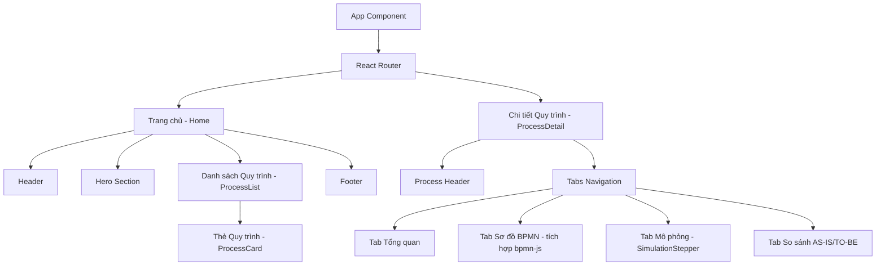

# CHƯƠNG 3: XÂY DỰNG WEBSITE MÔ PHỎNG QUY TRÌNH NGHIỆP VỤ

Chương này trình bày chi tiết về quá trình phân tích, thiết kế và xây dựng website mô phỏng các quy trình nghiệp vụ của Công ty Cổ phần Dược phẩm FPT Long Châu. Trong bối cảnh môn học Hệ thống Quản trị Quy trình Nghiệp vụ, việc chuyển hóa các phân tích lý thuyết và sơ đồ BPMN thành một công cụ trực quan hóa đóng vai trò quan trọng trong việc đánh giá và kiểm chứng tính hợp lý của quy trình. Website được xây dựng không đóng vai trò là một hệ thống quản lý thực tế tham gia vào hoạt động vận hành của doanh nghiệp, mà đóng vai trò như một môi trường giả lập (simulation environment). Qua đó, hệ thống cho phép người dùng tương tác, theo dõi luồng thông tin, nhận diện rõ ràng các tác nhân (actors), các đầu vào và đầu ra tại từng bước công việc. Các phần tiếp theo sẽ trình bày cụ thể về kiến trúc hệ thống, cấu trúc dữ liệu mô phỏng, cũng như thiết kế giao diện để hiện thực hóa 6 quy trình trọng tâm đã được phân tích ở các chương trước.

## 3.1. Mục tiêu, yêu cầu và phạm vi website

**Mục tiêu**: 
Website được phát triển với mục tiêu cốt lõi là trực quan hóa 6 quy trình nghiệp vụ trọng yếu của FPT Long Châu. Nền tảng này cung cấp cho người dùng khả năng tiếp cận và xem xét các sơ đồ BPMN một cách tương tác, theo dõi chi tiết từng bước xử lý trong quy trình, đồng thời hiểu rõ vai trò của từng tác nhân cũng như luồng thông tin và dữ liệu luân chuyển qua các bước. Từ đó, website giúp minh họa rõ nét sự khác biệt và những điểm cải tiến giữa mô hình hiện tại (AS-IS) và mô hình đề xuất (TO-BE).

**Yêu cầu chức năng**:
- **Hiển thị danh mục quy trình**: Cung cấp giao diện tổng hợp danh sách 6 quy trình nghiệp vụ trọng tâm.
- **Xem thông tin chi tiết từng quy trình**: Trình bày rõ ràng mục tiêu, các tác nhân tham gia, cùng với thông tin đầu vào và đầu ra của quy trình.
- **Hiển thị sơ đồ BPMN tương tác**: Tích hợp công cụ hiển thị sơ đồ BPMN cho phép người dùng phóng to, thu nhỏ và tương tác với các thành phần (event, gateway, task) trên sơ đồ.
- **Mô phỏng từng bước xử lý**: Cung cấp tính năng diễn hoạt (animation) các bước thực thi, cho phép chuyển tiếp (next) và quay lại (back) để quan sát chi tiết luồng công việc.
- **So sánh AS-IS và TO-BE**: Hỗ trợ chuyển đổi nhanh chóng giữa hai trạng thái quy trình để làm nổi bật các điểm tối ưu hóa.

**Yêu cầu phi chức năng**:
- **Tính đáp ứng (Responsive)**: Giao diện hiển thị tốt trên các thiết bị khác nhau (desktop, tablet, mobile).
- **Hiệu năng**: Thời gian tải trang ban đầu và phản hồi tương tác dưới 3 giây, đảm bảo trải nghiệm người dùng mượt mà.
- **Tính tương thích**: Hỗ trợ ổn định trên các trình duyệt web phổ biến hiện nay như Google Chrome, Mozilla Firefox, Safari và Microsoft Edge.

**Phạm vi**: 
Website được thiết kế chủ yếu đóng vai trò frontend hoạt động phía client dưới dạng tĩnh hoặc động dựa trên dữ liệu giả lập. Hệ thống không bao gồm backend để xử lý nghiệp vụ thực tế hay thao tác trên cơ sở dữ liệu quan hệ, mà sử dụng dữ liệu định dạng JSON được cấu trúc sẵn để phục vụ mục đích mô phỏng và trình diễn quy trình.

## 3.2. Kiến trúc hệ thống

Website được thiết kế theo kiến trúc Single Page Application (SPA), giúp tối ưu hóa trải nghiệm người dùng thông qua việc không cần tải lại toàn bộ trang web khi chuyển hướng giữa các chức năng. Kiến trúc này bao gồm các thành phần chính:

- **Frontend**: Sử dụng thư viện React.js để xây dựng các thành phần giao diện người dùng (UI components) có khả năng tái sử dụng cao và quản lý trạng thái hiệu quả.
- **Thư viện render BPMN**: Tích hợp bpmn-js (thuộc hệ sinh thái Camunda) để render và cung cấp các tính năng tương tác với sơ đồ BPMN trực tiếp trên trình duyệt.
- **Routing**: Sử dụng React Router để quản lý điều hướng giữa trang chủ, danh mục quy trình và trang chi tiết quy trình mà không làm gián đoạn trải nghiệm người dùng.
- **State management**: Sử dụng các React Hooks cơ bản (`useState`, `useEffect`, `useContext`) để quản lý trạng thái của ứng dụng, đặc biệt là tiến trình mô phỏng các bước trong quy trình nghiệp vụ.
- **Deploy**: Ứng dụng được triển khai (deploy) trên nền tảng Vercel, đảm bảo tính ổn định và khả năng phân phối nội dung nhanh chóng.

**Sơ đồ Cấu trúc Thành phần (Component Tree)**:



## 3.3. Công nghệ và công cụ sử dụng

Để xây dựng hệ thống mô phỏng đáp ứng các yêu cầu đề ra, nhóm đã lựa chọn và phối hợp sử dụng các công nghệ, công cụ hiện đại, được liệt kê chi tiết trong Bảng 3.1.

*Bảng 3.1: Các công nghệ và công cụ sử dụng trong xây dựng website*

| Tên công nghệ / Công cụ | Phiên bản | Mục đích sử dụng |
| --- | --- | --- |
| **React.js** | 18.x | Xây dựng giao diện người dùng theo kiến trúc SPA, quản lý vòng đời ứng dụng và trạng thái cục bộ. |
| **Tailwind CSS** | 3.x | Cung cấp hệ thống utility classes giúp thiết kế giao diện responsive và custom UI nhanh chóng. |
| **bpmn-js** | 12.x | Render sơ đồ chuẩn BPMN 2.0 từ file XML, hỗ trợ tương tác (zoom, pan, highlight). |
| **Chart.js** | 4.x | Trực quan hóa dữ liệu mô phỏng, biểu đồ phân tích hiệu suất trong quy trình TO-BE. |
| **Figma** | N/A | Thiết kế wireframe, prototype và hoàn thiện UI/UX trước khi tiến hành code. |
| **VS Code & Git** | N/A | Trình soạn thảo mã nguồn và công cụ quản lý phiên bản mã nguồn, phối hợp nhóm qua GitHub. |
| **Vercel** | N/A | Nền tảng cloud để triển khai ứng dụng web frontend với CI/CD tự động từ GitHub repository. |

## 3.4. Thiết kế cơ sở dữ liệu

Do tính chất của dự án là website mô phỏng (simulation frontend) và không có hệ thống backend thực thụ, cơ sở dữ liệu được thiết kế dưới dạng các tệp JSON tĩnh lưu trữ trực tiếp trên client. Cấu trúc dữ liệu được tổ chức chuẩn hóa nhằm dễ dàng ánh xạ vào các component của React.

Các tập tin dữ liệu chính bao gồm:
- `processes.json`: Chứa siêu dữ liệu về danh sách 6 quy trình (ID, tên quy trình, phân loại, mô tả ngắn gọn).
- `steps.json`: Định nghĩa chi tiết các task xử lý của từng quy trình, bao gồm thứ tự thực thi, tác nhân, đầu vào, và đầu ra tại mỗi bước.
- `actors.json`: Danh sách các tác nhân (actor/role) tham gia vào hệ thống (ví dụ: Dược sĩ, Nhân viên kho, Khách hàng).
- `bpmn_data.json`: Lưu trữ cấu trúc XML định dạng chuỗi (stringified) của các sơ đồ BPMN cho mô hình AS-IS và TO-BE tương ứng với mỗi quy trình.

**Ví dụ cấu trúc JSON cho quy trình Bán thuốc tại nhà thuốc (`steps.json`):**

```json
{
  "processId": "P_SALES_STORE_01",
  "processName": "Bán thuốc tại nhà thuốc",
  "steps": [
    {
      "stepId": 1,
      "taskName": "Tiếp nhận và tư vấn khách hàng",
      "actor": "Dược sĩ tư vấn",
      "inputs": ["Yêu cầu của khách hàng", "Đơn thuốc (nếu có)"],
      "outputs": ["Xác định nhu cầu mua thuốc"],
      "description": "Dược sĩ lắng nghe nhu cầu, kiểm tra đơn thuốc và tư vấn sản phẩm phù hợp."
    },
    {
      "stepId": 2,
      "taskName": "Kiểm tra tồn kho",
      "actor": "Hệ thống ERP",
      "inputs": ["Danh mục thuốc cần mua"],
      "outputs": ["Trạng thái tồn kho của thuốc"],
      "description": "Truy xuất hệ thống để xác nhận số lượng thuốc hiện có tại cửa hàng."
    },
    {
      "stepId": 3,
      "taskName": "Lên đơn và thanh toán",
      "actor": "Thu ngân",
      "inputs": ["Danh sách thuốc", "Thông tin thành viên (nếu có)"],
      "outputs": ["Hóa đơn thanh toán", "Phiếu xuất kho"],
      "description": "Tạo đơn hàng trên hệ thống POS, áp dụng khuyến mãi và tiến hành thu tiền."
    }
  ]
}
```

## 3.5. Thiết kế giao diện và các chức năng chính

### 3.5.1. Trang chủ và danh mục quy trình
Giao diện trang chủ được thiết kế nhằm mang lại cái nhìn tổng quan và định hướng người dùng ngay từ lần đầu truy cập. Phía trên cùng là **Hero section** với logo FPT Long Châu nổi bật, kèm theo thông điệp giới thiệu về hệ thống mô phỏng các quy trình nghiệp vụ cốt lõi. 

Phần trọng tâm của trang chủ là **Grid danh sách quy trình**, hiển thị dưới dạng 6 thẻ (card) trực quan. Mỗi thẻ bao gồm icon đại diện, tên quy trình, phân loại (Quy trình cốt lõi, Quy trình hỗ trợ, Quy trình quản lý) và một đoạn mô tả ngắn gọn. Để hỗ trợ việc tìm kiếm, trang web cung cấp thanh tìm kiếm (Search bar) và các nút lọc (Filter buttons) dựa trên phân loại quy trình. Màu sắc chủ đạo sử dụng là xanh dương và trắng – bộ nhận diện thương hiệu của Long Châu, kết hợp với các hiệu ứng hover mượt mà nhằm tăng trải nghiệm UI/UX.

### 3.5.2. Chức năng xem thông tin quy trình
Khi người dùng chọn một quy trình từ trang chủ, hệ thống sẽ điều hướng đến trang chi tiết quy trình. Trang này được cấu trúc theo dạng Tab (thẻ điều hướng) bao gồm: Tổng quan, Sơ đồ BPMN, Mô phỏng, và So sánh.

Tại **Tab Tổng quan**, thông tin quy trình được trình bày rõ ràng thông qua các bảng biểu. Nội dung bao gồm mục tiêu quy trình, các tác nhân (swimlane roles) liên quan, các tài liệu/thông tin đầu vào và đầu ra. Dưới cùng là danh sách các bước xử lý (tasks) được đánh số thứ tự tuần tự, giúp người dùng nắm bắt nhanh luồng công việc tổng thể trước khi đi sâu vào sơ đồ kỹ thuật.

### 3.5.3. Chức năng hiển thị sơ đồ BPMN
Chức năng này đóng vai trò cốt lõi trong việc minh họa nghiệp vụ chuyên sâu. Tại **Tab Sơ đồ BPMN**, thư viện `bpmn-js` được sử dụng để nhúng và render trực tiếp nội dung XML của sơ đồ BPMN 2.0. 

Sơ đồ không chỉ hiển thị tĩnh mà còn cung cấp các công cụ tương tác: người dùng có thể thực hiện thao tác zoom in/out, pan (di chuyển) khung nhìn để khám phá các quy trình phức tạp. Khi hover vào một phần tử (task, gateway, event), phần tử đó sẽ được highlight, kèm theo tooltip hiển thị chú thích chi tiết. Các đường phân luồng (sequence flow) và các phân làn (swimlane) được thể hiện rõ ràng, tuân thủ nghiêm ngặt chuẩn mô hình hóa BPM.

### 3.5.4. Chức năng mô phỏng các bước xử lý
Chức năng mô phỏng (Simulation) mang lại giá trị thực tiễn nhất của website. Tại **Tab Mô phỏng**, quy trình được chia nhỏ thành một trình tự các bước thông qua component Stepper (Wizard). Người dùng điều khiển luồng bằng các nút "Next" và "Back".

Tại mỗi bước, hệ thống áp dụng animation để làm nổi bật tác nhân đang thực thi nhiệm vụ tương ứng trên một sơ đồ minh họa thu gọn. Bên cạnh đó, các thông số về dữ liệu đầu vào và kết quả đầu ra của bước hiện tại được hiển thị sinh động. Một thanh tiến trình (Progress bar) trực quan giúp người dùng biết họ đang ở giai đoạn nào của quy trình. Đặc biệt, người dùng có thể sử dụng nút toggle "Xem AS-IS" và "Xem TO-BE" để trực tiếp đối chiếu luồng công việc, từ đó đánh giá được tác động của các điểm thắt cổ chai (bottleneck) đã được giải quyết trong quy trình mới.

## 3.6. Mô phỏng 6 quy trình nghiệp vụ trên website

Website cung cấp trải nghiệm mô phỏng chuyên biệt, làm nổi bật đặc thù của 6 quy trình nghiệp vụ cốt lõi tại FPT Long Châu:

### 3.6.1. Quản lý chuỗi cung ứng
Giao diện mô phỏng quy trình này tập trung vào sự luân chuyển hàng hóa và thông tin giữa nhà cung cấp, tổng kho trung tâm và các nhà thuốc chi nhánh. Sơ đồ mô phỏng làm nổi bật các gateway quyết định (tái đặt hàng, kiểm tra chất lượng) và minh họa trực quan sự thay đổi trạng thái tồn kho (từ "Đang vận chuyển" đến "Đã nhập kho") thông qua các cảnh báo màu sắc tương tác.

### 3.6.2. Quản lý chất lượng
Quy trình được mô phỏng tập trung vào khâu kiểm định đạt chuẩn GPP. Giao diện Stepper mô phỏng các task như kiểm tra cảm quan, kiểm tra lô/hạn sử dụng. Khi có sự cố giả định (ví dụ thuốc cận date), luồng BPMN sẽ rẽ nhánh (exclusive gateway) để hướng dẫn người dùng theo dõi cách xử lý trả hàng hoặc tiêu hủy một cách rõ ràng và trực quan.

### 3.6.3. Bán thuốc tại nhà thuốc
Đây là quy trình có tần suất cao nhất, do đó giao diện tập trung vào tương tác giữa dược sĩ, khách hàng và hệ thống ERP/POS. Trong mô phỏng TO-BE, chức năng làm nổi bật việc tích hợp quét mã vạch và kiểm tra tồn kho tự động, rút ngắn số bước so với AS-IS, được thể hiện rõ rệt qua việc thanh tiến trình (progress bar) hoàn thành nhanh hơn.

### 3.6.4. Bán thuốc online
Mô phỏng quy trình này thể hiện hành trình đa kênh (Omnichannel), từ lúc khách hàng thao tác trên website/app Long Châu đến khi tổng đài viên xác nhận và nhân viên giao hàng (Shipper) tiếp nhận. Hoạt ảnh (animation) minh họa chi tiết sự chuyển giao trách nhiệm giữa các swimlane hệ thống, telesale và vận chuyển.

### 3.6.5. Quản lý kho
Giao diện của quy trình này làm rõ các thao tác xuất, nhập, và kiểm kê kho tại chi nhánh nhà thuốc. Tính năng mô phỏng đặc biệt chú trọng vào việc minh họa hệ thống quản lý theo FEFO (First Expired, First Out - Hết hạn trước, Xuất trước). Sơ đồ TO-BE cho thấy rõ sự can thiệp của ERP trong việc tự động đề xuất vị trí lấy thuốc thay vì tìm kiếm thủ công như AS-IS.

### 3.6.6. Tuyển dụng và đào tạo
Quy trình mô phỏng các bước từ việc xác định nhu cầu nhân sự, phỏng vấn dược sĩ đến đào tạo hội nhập và chuyên môn. Trải nghiệm tập trung vào việc thể hiện luồng xét duyệt nhiều cấp (Trưởng cửa hàng, Nhân sự vùng, Giám đốc đào tạo). Các task có tính song song (parallel gateway) như chuẩn bị tài liệu và xếp lịch thực hành được trực quan hóa sinh động.

## 3.7. Đánh giá kết quả xây dựng website

Sau quá trình thiết kế và phát triển, website mô phỏng quy trình nghiệp vụ của FPT Long Châu đã hoàn thiện và đáp ứng cơ bản các yêu cầu đặt ra. Việc xây dựng công cụ này giúp nhóm có cái nhìn trực quan và sâu sắc hơn về luồng tương tác giữa các tác nhân và dữ liệu theo chuẩn BPM.

**Bảng 3.2: Đánh giá trạng thái hoàn thành các chức năng**

| Chức năng | Trạng thái | Ghi chú |
| --- | --- | --- |
| Trang chủ & Danh mục | Hoàn thành | Hoạt động mượt mà, phân loại rõ ràng. |
| Chi tiết quy trình | Hoàn thành | Hiển thị đầy đủ thông tin từ JSON. |
| Hiển thị sơ đồ BPMN | Hoàn thành | Tích hợp tốt `bpmn-js`, tương tác zoom/pan tốt. |
| Mô phỏng theo bước | Hoàn thành | Animation hoạt động tốt, highlight rõ ràng tác nhân. |
| So sánh AS-IS và TO-BE | Hoàn thành | Chuyển đổi trạng thái nhanh, không cần load lại trang. |

**Đánh giá về Giao diện và Trải nghiệm (UI/UX)**:
Giao diện website được thiết kế bám sát bộ nhận diện thương hiệu của FPT Long Châu. Các nguyên tắc responsive design được áp dụng triệt để, cho phép hiển thị tốt và tương tác ổn định trên đa nền tảng thiết bị. Trải nghiệm người dùng được tối ưu hóa thông qua các hiệu ứng chuyển cảnh mượt mà và tính năng tooltip hỗ trợ thông tin ngữ cảnh.

**Hạn chế của hệ thống**:
Bên cạnh những điểm tích cực, do giới hạn về mặt thời gian và phạm vi đồ án, website vẫn tồn tại một số hạn chế nhất định. Hệ thống hiện hoạt động hoàn toàn ở phía client (Static Frontend) mà không có backend xử lý nghiệp vụ thực tế hay cơ sở dữ liệu động. Dữ liệu được fix cứng (hardcode) dưới dạng tệp JSON, do đó việc cập nhật hoặc chỉnh sửa quy trình đòi hỏi phải can thiệp trực tiếp vào mã nguồn. Hệ thống cũng chưa tích hợp phân quyền đăng nhập hay quản lý phiên người dùng (session management).

**Đề xuất cải thiện trong tương lai**:
Để nâng cấp hệ thống thành một công cụ quản lý toàn diện hơn, các hướng phát triển trong tương lai có thể bao gồm: (1) Xây dựng backend (Node.js hoặc Java Spring Boot) và sử dụng cơ sở dữ liệu quan hệ (PostgreSQL) để quản lý metadata của quy trình; (2) Tích hợp một hệ thống BPM Engine thực thụ (như Camunda Engine) để tự động hóa và thực thi các quy trình nghiệp vụ; (3) Thêm tính năng phân quyền người dùng (Dược sĩ, Quản lý, Giám đốc) để cá nhân hóa việc truy cập và thực thi các task trên quy trình.
