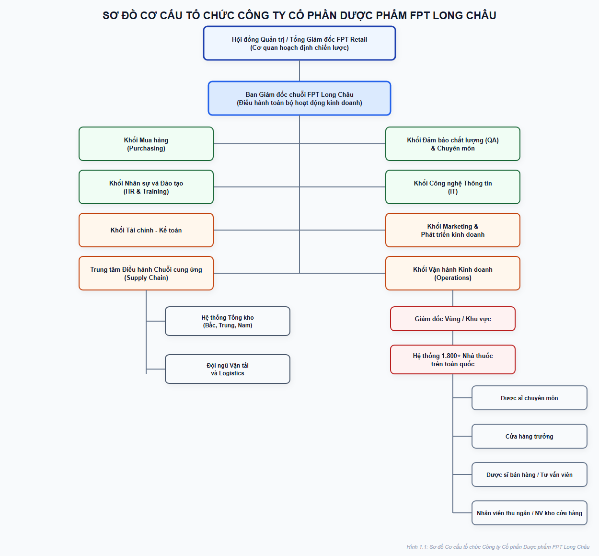
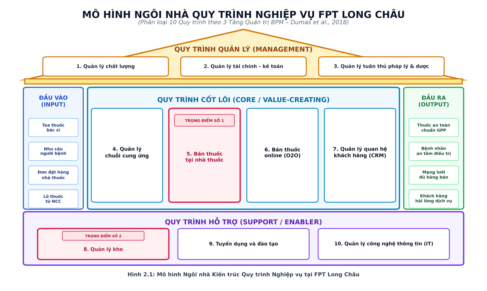
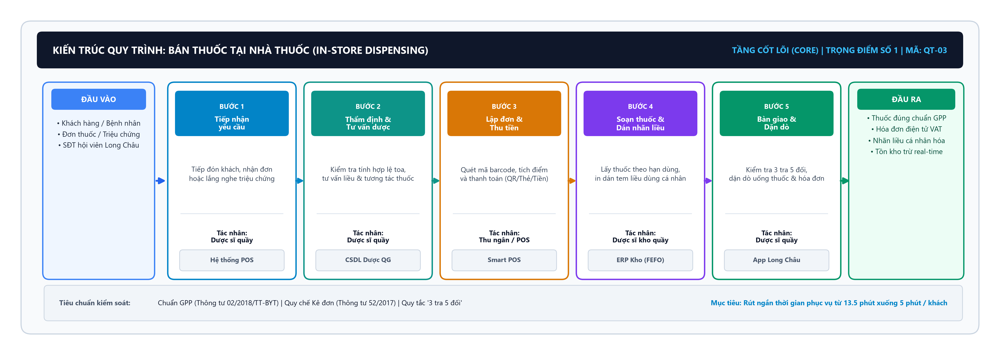
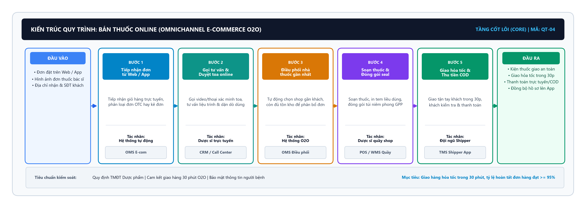
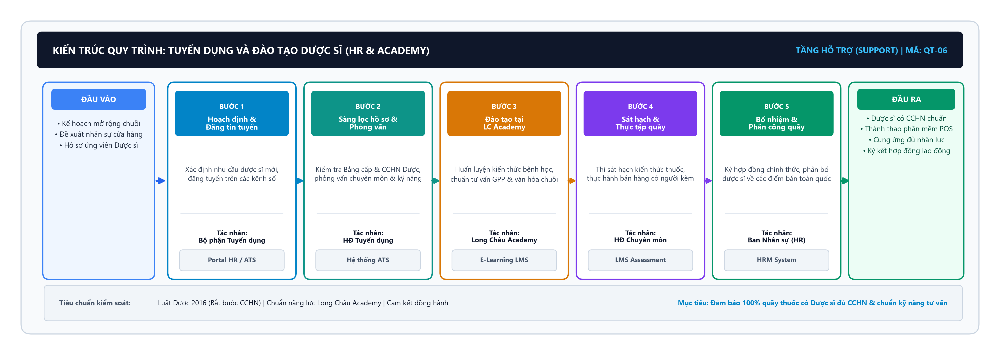
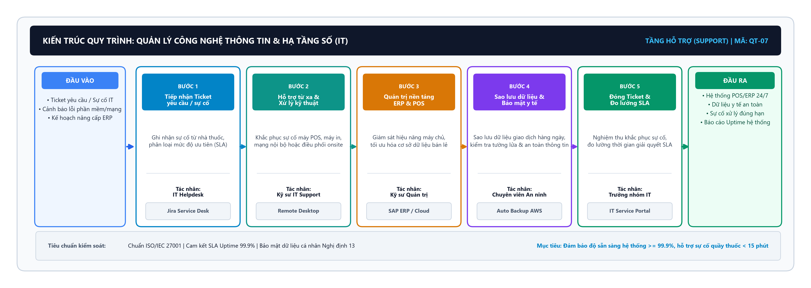
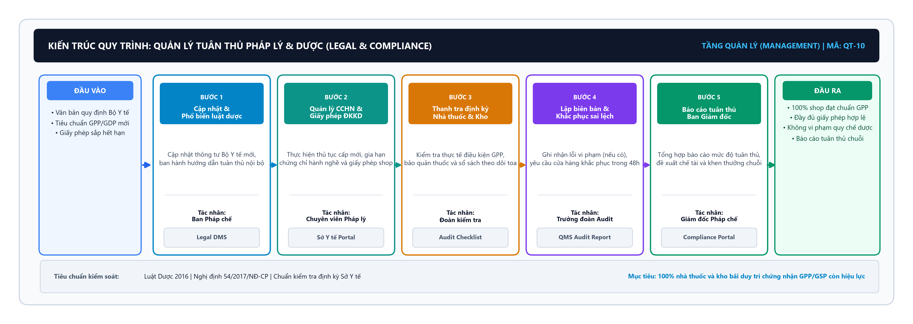
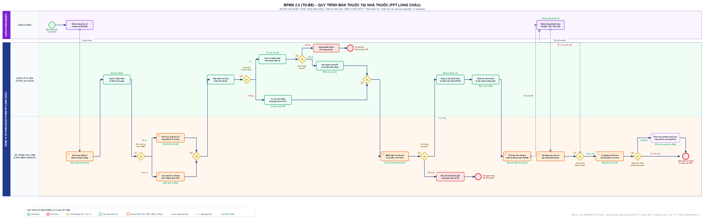
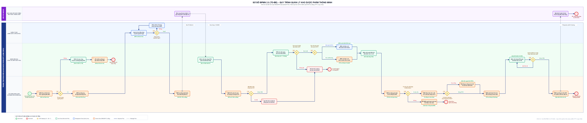

# BẢNG PHÂN CÔNG NHIỆM VỤ ĐỒ ÁN

| STT | Họ và tên sinh viên | Mã số sinh viên | Phân công phụ trách chính |
| :---: | :--- | :---: | :--- |
| 1 | **Huỳnh Công Hậu** | 25210099 | Trưởng nhóm; Lời mở đầu; Chương 1 (Giới thiệu doanh nghiệp) |
| 2 | **Nguyễn Đức Nhiên** | 25210160 | Chương 2 (Khảo sát, phân loại và Kiến trúc 10 quy trình nghiệp vụ) |
| 3 | **Nguyễn Thế Trụ** | 25210226 | Chương 3 (Mô hình hóa 6 quy trình nghiệp vụ hiện tại AS-IS) |
| 4 | **Phan Duy An** | 25210247 | Chương 4 (Phân tích quy trình: VA/BVA/NVA, Lãng phí Move-Hold-Overdo, Fishbone 6M, Định lượng) |
| 5 | **Trịnh Chí Nguyên** | 25210150 | Chương 5 (Đề xuất cải tiến TO-BE & Ứng dụng công nghệ) |
| 6 | **Ngô Quốc Chung** | 24730180 | Chương 6 (Kết luận, hạn chế, hướng phát triển); Phụ lục & Tài liệu tham khảo |

---

# MỤC LỤC

---

# DANH MỤC CÁC CHỮ VIẾT TẮT

| Ký hiệu viết tắt | Nguyên nghĩa tiếng Anh | Nguyên nghĩa tiếng Việt |
| :--- | :--- | :--- |
| **AI** | Artificial Intelligence | Trí tuệ nhân tạo |
| **API** | Application Programming Interface | Giao diện lập trình ứng dụng |
| **AS-IS** | Current State Process Model | Mô hình quy trình hiện trạng |
| **BPM** | Business Process Management | Quản trị quy trình nghiệp vụ |
| **BPMN** | Business Process Model and Notation | Mô hình và Ký hiệu Quy trình Nghiệp vụ (chuẩn OMG) |
| **BPMS** | Business Process Management Suite | Bộ giải pháp/Hệ thống thực thi quản trị quy trình |
| **BPR** | Business Process Reengineering | Tái thiết kế quy trình nghiệp vụ |
| **BVA** | Business Value-Added | Hoạt động gia tăng giá trị kinh doanh (bắt buộc) |
| **CRM** | Customer Relationship Management | Quản trị quan hệ khách hàng |
| **EDI** | Electronic Data Interchange | Hệ thống trao đổi dữ liệu điện tử |
| **ERP** | Enterprise Resource Planning | Hệ thống hoạch định nguồn lực doanh nghiệp |
| **FEFO** | First Expired, First Out | Hết hạn trước - Xuất trước (chuẩn dược phẩm) |
| **FIFO** | First In, First Out | Nhập trước - Xuất trước |
| **GPP** | Good Pharmacy Practice | Thực hành tốt cơ sở bán lẻ thuốc (Bộ Y tế) |
| **KPI** | Key Performance Indicator | Chỉ số đánh giá hiệu quả công việc then chốt |
| **NPS** | Net Promoter Score | Chỉ số đo lường mức độ hài lòng khách hàng |
| **NVA** | Non-Value-Added | Hoạt động lãng phí không tạo ra giá trị |
| **POS** | Point of Sale | Điểm bán hàng lẻ / Phần mềm thanh toán tại quầy |
| **QA / QC** | Quality Assurance / Quality Control | Đảm bảo chất lượng / Kiểm soát chất lượng |
| **QR Code** | Quick Response Code | Mã phản hồi nhanh (mã vạch 2D ma trận) |
| **RFID** | Radio Frequency Identification | Công nghệ nhận dạng qua tần số vô tuyến |
| **RPA** | Robotic Process Automation | Tự động hóa quy trình bằng robot phần mềm |
| **TO-BE** | Future State Process Model | Mô hình quy trình mục tiêu cải tiến |
| **VA** | Value-Added | Hoạt động gia tăng giá trị trực tiếp cho khách hàng |
| **WMS** | Warehouse Management System | Hệ thống quản lý kho hàng chuyên dụng |

---

# DANH MỤC CÁC HÌNH VẼ

| Số hiệu hình | Tên gọi hình vẽ / sơ đồ | Vị trí chương |
| :--- | :--- | :---: |
| **Hình 1.1** | Sơ đồ Cơ cấu Tổ chức Công ty Cổ phần Dược phẩm FPT Long Châu | Chương 1 |
| **Hình 2.1** | Mô hình Ngôi nhà Phân loại Quy trình Nghiệp vụ tại FPT Long Châu | Chương 2 |
| **Hình 2.2** | Sơ đồ Kiến trúc phân rã – Quy trình Quản lý chuỗi cung ứng dược phẩm | Chương 2 |
| **Hình 2.3** | Sơ đồ Kiến trúc phân rã – Quy trình Quản lý chất lượng dược phẩm (QA/QC) | Chương 2 |
| **Hình 2.4** | Sơ đồ Kiến trúc phân rã – Quy trình Bán thuốc tại nhà thuốc | Chương 2 |
| **Hình 2.5** | Sơ đồ Kiến trúc phân rã – Quy trình Bán thuốc online | Chương 2 |
| **Hình 2.6** | Sơ đồ Kiến trúc phân rã – Quy trình Quản lý kho dược phẩm | Chương 2 |
| **Hình 2.7** | Sơ đồ Kiến trúc phân rã – Quy trình Tuyển dụng và đào tạo Dược sĩ | Chương 2 |
| **Hình 2.8** | Sơ đồ Kiến trúc phân rã – Quy trình Quản lý công nghệ thông tin | Chương 2 |
| **Hình 2.9** | Sơ đồ Kiến trúc phân rã – Quy trình Quản lý tài chính – Kế toán | Chương 2 |
| **Hình 2.10** | Sơ đồ Kiến trúc phân rã – Quy trình Quản lý quan hệ khách hàng (CRM) | Chương 2 |
| **Hình 2.11** | Sơ đồ Kiến trúc phân rã – Quy trình Quản lý tuân thủ pháp lý & dược | Chương 2 |
| **Hình 3.1** | Sơ đồ BPMN 2.0 AS-IS – Quy trình Quản lý chuỗi cung ứng | Chương 3 |
| **Hình 3.2** | Sơ đồ BPMN 2.0 AS-IS – Quy trình Quản lý chất lượng | Chương 3 |
| **Hình 3.3** | Sơ đồ BPMN 2.0 AS-IS – Quy trình Bán thuốc tại nhà thuốc | Chương 3 |
| **Hình 3.4** | Sơ đồ BPMN 2.0 AS-IS – Quy trình Bán thuốc online | Chương 3 |
| **Hình 3.5** | Sơ đồ BPMN 2.0 AS-IS – Quy trình Quản lý kho | Chương 3 |
| **Hình 3.6** | Sơ đồ BPMN 2.0 AS-IS – Quy trình Tuyển dụng và đào tạo | Chương 3 |
| **Hình 5.1** | Sơ đồ BPMN 2.0 TO-BE – Quy trình Bán thuốc tại nhà thuốc | Chương 5 |
| **Hình 5.2** | Sơ đồ BPMN 2.0 TO-BE – Quy trình Quản lý kho | Chương 5 |

---

# DANH MỤC CÁC BẢNG BIỂU

| Số hiệu bảng | Tên gọi bảng biểu | Vị trí chương |
| :--- | :--- | :---: |
| **Bảng 1.1** | Tóm tắt thông tin cơ bản về Công ty Cổ phần Dược phẩm FPT Long Châu | Chương 1 |
| **Bảng 1.2** | Các cột mốc lịch sử quan trọng của FPT Long Châu | Chương 1 |
| **Bảng 1.3** | So sánh tương quan giữa FPT Long Châu và các chuỗi đối thủ chính | Chương 1 |
| **Bảng 2.1** | Danh mục 10 quy trình nghiệp vụ chính của FPT Long Châu | Chương 2 |
| **Bảng 2.2** | Tổng hợp đối tượng khách hàng và các khả năng kết quả của 10 quy trình nghiệp vụ | Chương 2 |
| **Bảng 2.3** | Đánh giá tiêu chí lựa chọn quy trình phân tích chuyên sâu | Chương 2 |
| **Bảng 3.1** | Tóm tắt thông tin quy trình Quản lý chuỗi cung ứng (AS-IS) | Chương 3 |
| **Bảng 3.2** | Tóm tắt thông tin quy trình Quản lý chất lượng (AS-IS) | Chương 3 |
| **Bảng 3.3** | Tóm tắt thông tin quy trình Bán thuốc tại nhà thuốc (AS-IS) | Chương 3 |
| **Bảng 3.4** | Tóm tắt thông tin quy trình Bán thuốc online (AS-IS) | Chương 3 |
| **Bảng 3.5** | Tóm tắt thông tin quy trình Quản lý kho (AS-IS) | Chương 3 |
| **Bảng 3.6** | Tóm tắt thông tin quy trình Tuyển dụng và đào tạo (AS-IS) | Chương 3 |
| **Bảng 4.1** | Ma trận RACI quy trình Bán thuốc tại nhà thuốc | Chương 4 |
| **Bảng 4.2** | Phân loại hoạt động VA/BVA/NVA quy trình Bán thuốc tại nhà thuốc | Chương 4 |
| **Bảng 4.3** | Bảng phân tích lãng phí Lean (Move – Hold – Overdo) quy trình Bán thuốc tại nhà thuốc | Chương 4 |
| **Bảng 4.4** | Bảng phân tích định lượng hiệu suất quy trình Bán thuốc tại nhà thuốc | Chương 4 |
| **Bảng 4.5** | Ma trận RACI quy trình Quản lý kho | Chương 4 |
| **Bảng 4.6** | Phân loại hoạt động VA/BVA/NVA quy trình Quản lý kho | Chương 4 |
| **Bảng 4.7** | Bảng phân tích lãng phí Lean (Move – Hold – Overdo) quy trình Quản lý kho | Chương 4 |
| **Bảng 4.8** | Bảng phân tích định lượng hiệu suất quy trình Quản lý kho | Chương 4 |
| **Bảng 4.9** | Bảng tổng hợp các vấn đề và điểm nghẽn của 2 quy trình then chốt | Chương 4 |
| **Bảng 5.1** | So sánh các bước thực hiện AS-IS và TO-BE quy trình Bán thuốc tại nhà thuốc | Chương 5 |
| **Bảng 5.2** | Chỉ số đo lường hiệu quả dự kiến (KPI) quy trình Bán thuốc tại nhà thuốc | Chương 5 |
| **Bảng 5.3** | So sánh quá trình nhập/xuất kho AS-IS và TO-BE | Chương 5 |
| **Bảng 5.4** | Chỉ số đo lường hiệu quả dự kiến (KPI) quy trình Quản lý kho | Chương 5 |
| **Bảng 5.5** | Bảng đối chiếu tổng hợp toàn diện AS-IS và TO-BE cho 2 quy trình then chốt | Chương 5 |
| **Bảng 5.6** | Ma trận đánh giá rủi ro và giải pháp giảm thiểu | Chương 5 |

---

# LỜI MỞ ĐẦU

## Lý do chọn đề tài

Trong ngành bán lẻ dược phẩm hiện đại, các doanh nghiệp chuỗi phải đồng thời vận hành nhiều luồng công việc phức tạp như nhập hàng, quản lý kho đạt chuẩn GSP, bán thuốc tại quầy đạt chuẩn GPP, thương mại điện tử đa kênh (Omnichannel) và chăm sóc khách hàng. Khi quy mô mở rộng nhanh chóng, việc thiếu đồng bộ hóa dữ liệu thời gian thực và phụ thuộc vào thao tác thủ công sẽ dẫn đến nhiều hệ quả nghiêm trọng: thời gian phục vụ tại quầy kéo dài trong giờ cao điểm, sai lệch số liệu tồn kho, và rủi ro tiêu hủy hàng cận hạn sử dụng.

FPT Long Châu là chuỗi bán lẻ dược phẩm hàng đầu Việt Nam trực thuộc Công ty Cổ phần Bán lẻ Kỹ thuật số FPT (FPT Retail, mã FRT), hiện sở hữu mạng lưới hơn 1.800 nhà thuốc trên toàn quốc. Đứng trước bài toán tăng trưởng quy mô thần tốc, việc chuẩn hóa, đánh giá định lượng và tối ưu hóa các quy trình nghiệp vụ trở thành yêu cầu cấp thiết. Xuất phát từ thực tiễn đó, nhóm thực hiện đề tài **"Hệ thống quản trị quy trình nghiệp vụ tại Công ty Cổ phần Dược phẩm FPT Long Châu"** nhằm vận dụng kiến thức học phần Quản trị Quy trình Nghiệp vụ (BPM): khảo sát kiến trúc 10 quy trình tổng thể, mô hình hóa chuẩn BPMN 2.0 cho 6 quy trình tiêu biểu (đáp ứng cơ cấu cân bằng 2 Quản lý – 2 Cốt lõi – 2 Hỗ trợ), và tiến hành phân tích sâu, đề xuất giải pháp cải tiến TO-BE cho 2 quy trình then chốt là Bán thuốc tại nhà thuốc và Quản lý kho trung tâm.

## Mục tiêu nghiên cứu

Đề tài hướng tới 7 mục tiêu học thuật và thực tiễn cốt lõi:

1. Khảo sát tổng quan bối cảnh kinh doanh, cơ cấu tổ chức và hạ tầng CNTT của FPT Long Châu.
2. Phân loại các quy trình nghiệp vụ theo 3 tầng chuẩn mực: Quản lý, Cốt lõi và Hỗ trợ.
3. Xây dựng Kiến trúc Quy trình Nghiệp vụ tổng thể (Mô hình Ngôi nhà BPM) với danh mục 10 quy trình chính.
4. Mô hình hóa hiện trạng (AS-IS) bằng sơ đồ BPMN 2.0 cho 6 quy trình tiêu biểu theo cấu trúc cân bằng 3 tầng (2-2-2).
5. Phân tích chuyên sâu 2 quy trình then chốt (Bán thuốc tại quầy và Quản lý kho) kết hợp phân tích định tính (Chuỗi giá trị VA/BVA/NVA, Lãng phí Lean Move – Hold – Overdo, Biểu đồ xương cá 6M và 5 Whys) và phân tích định lượng (Thời gian, Chất lượng, Chi phí).
6. Nhận diện chính xác các điểm nghẽn (bottlenecks) và định lượng tổn thất về thời gian, chi phí và chất lượng.
7. Thiết kế mô hình cải tiến BPMN 2.0 TO-BE, tích hợp các đòn bẩy công nghệ số (Kiosk phân luồng, PDA quét mã Barcode/QR, thuật toán FEFO, WMS-ERP Real-time) và vạch lộ trình thực thi khả thi với ROI dưới 2 năm.

## Đối tượng và phạm vi nghiên cứu

- **Đối tượng nghiên cứu:** Hệ thống các quy trình nghiệp vụ trong vận hành và quản lý chuỗi nhà thuốc FPT Long Châu (mua hàng, kiểm soát chất lượng, kho bãi, bán lẻ quầy và online).
- **Phạm vi nội dung:** Khảo sát kiến trúc 10 quy trình; mô hình hóa AS-IS 6 quy trình; phân tích chuyên sâu và thiết kế TO-BE cho 2 quy trình trọng điểm (Bán lẻ tại quầy và Quản lý kho tổng).
- **Phạm vi không gian:** Khối văn phòng điều hành, Trung tâm phân phối kho tổng và hệ thống hơn 1.800 điểm bán FPT Long Châu trên cả nước.
- **Phạm vi dữ liệu:** Sử dụng Báo cáo thường niên FPT Retail 2023 - 2024, tiêu chuẩn ngành dược (GPP, GDP, GSP của Bộ Y tế), dữ liệu quan sát thực tế và mô phỏng học thuật (academic simulation) có kiểm soát phương pháp luận.

## Phương pháp nghiên cứu

Đề tài kết hợp chặt chẽ giữa nghiên cứu định tính và định lượng theo vòng đời BPM chuẩn quốc tế:

1. **Thu thập & tổng hợp tài liệu:** Phân tích báo cáo tài chính, báo cáo thường niên FRT và văn bản quy chuẩn Bộ Y tế.
2. **Quan sát thực tế:** Khảo sát hiện trường thao tác tại nhà thuốc và kho vận để ghi nhận luồng công việc thực tế.
3. **Mô hình hóa BPMN 2.0:** Ứng dụng chuẩn OMG BPMN 2.0 phân làn Swimlane, kiểm soát Gateways và loại bỏ 100% Deadlock.
4. **Định lượng chuỗi giá trị (VA/BVA/NVA):** Bóc tách thời gian gia tăng giá trị và thời gian lãng phí theo giáo trình Dumas et al.
5. **Lean Six Sigma & Root-Cause:** Áp dụng khung 7 lãng phí Lean, Biểu đồ Ishikawa 6M và kỹ thuật 5 Whys để xác định căn nguyên vấn đề.
6. **Tái thiết kế quy trình (BPR):** Thiết kế mô hình TO-BE tinh gọn, tích hợp công nghệ và xây dựng các chỉ số KPI định lượng.

## Ý nghĩa thực tiễn của đề tài

Đề tài cung cấp giải pháp khoa học nhằm giải quyết các nút thắt vận hành thực tế tại chuỗi dược phẩm quy mô lớn: xóa bỏ thao tác ghi chép thủ công, rút ngắn thời gian phục vụ tại quầy, tự động hóa xuất kho theo nguyên tắc FEFO và đồng bộ dữ liệu tồn kho theo thời gian thực. Các mô hình BPMN 2.0 TO-BE và lộ trình triển khai 3 giai đoạn mang giá trị tham khảo ứng dụng thực tiễn cao cho chiến lược chuyển đổi số trong ngành bán lẻ y tế.

## Bố cục báo cáo

Báo cáo được kết cấu chặt chẽ thành 6 chương chuyên môn theo đúng Vòng đời BPM:

- **Chương 1: Giới thiệu về Công ty Cổ phần Dược phẩm FPT Long Châu** – Trình bày tổng quan doanh nghiệp, lịch sử phát triển, cơ cấu tổ chức bộ máy và định hướng chiến lược.
- **Chương 2: Khảo sát và Phân loại Quy trình Nghiệp vụ** – Trình bày cơ sở lý luận BPM, Kiến trúc Ngôi nhà Quy trình, danh mục 10 quy trình và tiêu chí lựa chọn 6 quy trình trọng tâm.
- **Chương 3: Mô hình hóa Quy trình Nghiệp vụ Hiện tại (AS-IS)** – Trình bày 6 sơ đồ BPMN 2.0 AS-IS hoàn chỉnh kèm phân tích mục tiêu, tác nhân và luồng hoạt động.
- **Chương 4: Phân tích Quy trình Nghiệp vụ** – Phân tích định lượng chuyên sâu 2 quy trình trọng điểm (Bán thuốc và Kho) qua RACI, VA/NVA, Lean 7 lãng phí, Fishbone 6M và 5 Whys.
- **Chương 5: Đề xuất Cải tiến Quy trình Nghiệp vụ (TO-BE)** – Đề xuất mục tiêu KPI, giải pháp công nghệ, bảng so sánh AS-IS/TO-BE, 2 sơ đồ BPMN 2.0 TO-BE và lộ trình thực thi 12 tháng.
- **Tài liệu tham khảo & Phụ lục:** Danh mục trích dẫn chuẩn APA7, Phụ lục A (Bảng đánh giá tiêu chí lựa chọn quy trình) và Phụ lục B (Danh sách câu hỏi khảo sát chuyên sâu).

---

# CHƯƠNG 1: GIỚI THIỆU VỀ CÔNG TY CỔ PHẦN DƯỢC PHẨM FPT LONG CHÂU

Chương này trình bày bối cảnh doanh nghiệp và cơ cấu tổ chức của Công ty Cổ phần Dược phẩm FPT Long Châu – đối tượng nghiên cứu của đồ án. Việc làm rõ mô hình vận hành, mạng lưới bán lẻ và sự phân công giữa các phòng ban là tiền đề then chốt để xác định các tác nhân (Actors) và xây dựng kiến trúc quy trình nghiệp vụ ở các chương tiếp theo.

## 1.1. Tổng quan về công ty

Công ty Cổ phần Dược phẩm FPT Long Châu (chuỗi Nhà thuốc FPT Long Châu) là doanh nghiệp bán lẻ dược phẩm hàng đầu tại Việt Nam, trực thuộc Công ty Cổ phần Bán lẻ Kỹ thuật số FPT (FPT Retail - mã chứng khoán FRT, Tập đoàn FPT). Chuỗi được thành lập nhằm cung cấp các sản phẩm y tế chính hãng, chất lượng cao với mức giá cạnh tranh và dịch vụ tư vấn tận tâm.

Tính đến năm 2024, FPT Long Châu sở hữu mạng lưới hơn 1.800 nhà thuốc phân bố khắp 63 tỉnh thành, phục vụ hàng triệu lượt khách hàng mỗi tháng. Danh mục kinh doanh bao gồm 4 nhóm chủ lực: thuốc kê đơn (đặc biệt là thuốc đặc trị), thuốc không kê đơn (OTC), thực phẩm chức năng, dược mỹ phẩm và thiết bị y tế gia đình. Toàn bộ hệ thống vận hành tuân thủ nghiêm ngặt chuẩn Thực hành tốt nhà thuốc (GPP) do Bộ Y tế ban hành.

*Bảng 1.1: Tóm tắt thông tin cơ bản về Công ty Cổ phần Dược phẩm FPT Long Châu*

| Tiêu chí | Thông tin chi tiết |
| :--- | :--- |
| **Tên chính thức** | Công ty Cổ phần Dược phẩm FPT Long Châu |
| **Tên thương hiệu** | Nhà thuốc FPT Long Châu |
| **Công ty mẹ** | Công ty Cổ phần Bán lẻ Kỹ thuật số FPT (FPT Retail - FRT) |
| **Lĩnh vực kinh doanh** | Bán lẻ dược phẩm, thực phẩm bảo vệ sức khỏe, thiết bị y tế |
| **Quy mô (2024)** | Hơn 1.800 nhà thuốc tại 63 tỉnh/thành phố *(Nguồn: Báo cáo thường niên FRT)* |
| **Tiêu chuẩn chất lượng** | 100% cơ sở đạt chuẩn GPP (Bộ Y tế), tổng kho đạt chuẩn GSP/GDP |
| **Kênh bán hàng** | Bán lẻ trực tiếp tại quầy và Thương mại điện tử (Website/App Long Châu) |

## 1.2. Lịch sử hình thành và phát triển

Hành trình phát triển của FPT Long Châu trải qua 3 giai đoạn mang tính bước ngoặt:

- **1985 – 2016 (Khởi nguồn uy tín):** Thành lập nhà thuốc Long Châu đầu tiên tại TP.HCM, nhanh chóng tạo dựng vị thế vững chắc nhờ danh mục thuốc kê đơn đầy đủ và giá bán sỉ hợp lý.
- **2017 (Tái cấu trúc & Số hóa):** FPT Retail mua lại chuỗi Long Châu, bắt đầu số hóa hạ tầng quản trị, áp dụng hệ thống ERP và chuẩn hóa quy trình chuỗi bán lẻ hiện đại.
- **2018 – 2024 (Bùng nổ quy mô toàn quốc):** Chuỗi mở rộng thần tốc từ vài chục cửa hàng lên mốc 1.000 nhà thuốc (năm 2022) và chính thức vượt 1.800 nhà thuốc (năm 2024), trở thành chuỗi dược phẩm có thị phần số 1 tại Việt Nam.

*Bảng 1.2: Các cột mốc lịch sử quan trọng của FPT Long Châu*

| Năm | Cột mốc bước ngoặt | Quy mô điểm bán |
| :---: | :--- | :---: |
| **1985** | Thành lập nhà thuốc Long Châu đầu tiên tại TP.HCM, định vị chuyên thuốc kê đơn giá tốt. | 1 |
| **2017** | FPT Retail mua lại chuỗi, tái cấu trúc toàn diện và triển khai hạ tầng ERP quản trị tập trung. | ~4 |
| **2022** | Chạm mốc 1.000 cửa hàng, hoàn thành phủ sóng 63/63 tỉnh thành, bắt đầu ghi nhận lợi nhuận dương. | ~1.000 |
| **2024** | Đạt quy mô hơn 1.800 nhà thuốc, dẫn đầu thị trường về tốc độ mở rộng và doanh thu chuỗi dược. | > 1.800 |

## 1.3. Lĩnh vực hoạt động

Hoạt động kinh doanh của FPT Long Châu tập trung vào 2 kênh phân phối chính:

1. **Bán lẻ tại nhà thuốc (Offline):** Phục vụ trực tiếp người bệnh tại hơn 1.800 quầy thuốc với đội ngũ dược sĩ tư vấn đạt chuẩn GPP, cung cấp đầy đủ các loại thuốc đặc trị bệnh mãn tính, thuốc kê đơn bệnh viện và sản phẩm chăm sóc sức khỏe.
2. **Thương mại điện tử dược phẩm (Online - O2O):** Khai thác website longchau.com.vn và ứng dụng di động Long Châu, hỗ trợ đặt hàng trực tuyến, tư vấn dược sĩ từ xa và điều phối giao hàng nhanh từ nhà thuốc gần nhất trong 30 – 60 phút.

Để vận hành nhịp nhàng hai kênh trên, doanh nghiệp phát triển mạng lưới trung tâm phân phối kho bãi tổng đạt chuẩn Thực hành tốt bảo quản thuốc (GSP) và logistics lạnh (Cold Chain) phục vụ các sản phẩm vắc xin, insulin.

## 1.4. Cơ cấu tổ chức

FPT Long Châu áp dụng mô hình tổ chức trực tuyến – chức năng kết hợp quản lý chuỗi, phân định rành mạch giữa các khối chuyên môn tại trụ sở và lực lượng vận hành trực tiếp tại mạng lưới nhà thuốc:

*Hình 1.1: Sơ đồ Cơ cấu Tổ chức Công ty Cổ phần Dược phẩm FPT Long Châu*

- **Ban Lãnh đạo cấp cao:** Hội đồng Quản trị & Ban Tổng Giám đốc FPT Retail chỉ đạo chiến lược vĩ mô; Ban Giám đốc chuỗi Long Châu trực tiếp điều hành toàn diện.
- **Các Khối phòng ban chức năng tại Trụ sở:**
  - *Khối Mua hàng (Purchasing):* Hoạch định nhu cầu, đàm phán hợp đồng với các hãng dược và nhà cung cấp.
  - *Khối Đảm bảo chất lượng (QA/QC):* Giám sát tiêu chuẩn GPP/GDP/GSP, kiểm định hồ sơ COA và cách ly thuốc lỗi.
  - *Trung tâm Chuỗi cung ứng (Supply Chain):* Điều phối tổng kho (Bắc – Trung – Nam) và đội ngũ vận tải giao hàng.
  - *Khối Công nghệ Thông tin (IT):* Phát triển, bảo trì hệ thống ERP, POS, website thương mại điện tử và ứng dụng di động.
  - *Khối Nhân sự & Đào tạo (HR):* Tuyển dụng, tổ chức sát hạch chuyên môn dược và đào tạo hội nhập cho nhân viên mới.
  - *Khối Tài chính – Kế toán:* Kiểm soát ngân sách, dòng tiền thanh toán nhà cung cấp và kế toán bán hàng.
- **Khối Vận hành Điểm bán (Store Operations):** Giám đốc vùng / khu vực quản lý mạng lưới 1.800+ cửa hàng. Tại mỗi nhà thuốc gồm: Dược sĩ chuyên môn phụ trách pháp lý, Cửa hàng trưởng, các Dược sĩ tư vấn bán hàng và nhân viên kho quầy.

## 1.5. Hoạt động kinh doanh

FPT Long Châu hiện là động lực tăng trưởng doanh thu lớn nhất của tập đoàn FPT Retail. Năm 2023, chuỗi đạt doanh thu 15.888 tỷ đồng (tăng trưởng 66% so với cùng kỳ), đóng góp hơn 50% tổng doanh thu hợp nhất của FRT. Doanh thu trung bình đạt khoảng 1,1 – 1,2 tỷ đồng/nhà thuốc/tháng – mức hiệu suất bán hàng cao nhất trong ngành bán lẻ dược phẩm Việt Nam.

Lợi thế cạnh tranh cốt lõi của Long Châu xuất phát từ: danh mục thuốc đặc trị phong phú, giá bán hợp lý, năng lực tư vấn chuyên sâu của đội ngũ dược sĩ và đặc biệt là hệ thống công nghệ ERP/POS quản lý tồn kho theo thời gian thực (Real-time inventory).

*Bảng 1.3: So sánh tương quan giữa FPT Long Châu và các chuỗi đối thủ chính (2024)*

| Tiêu chí | FPT Long Châu | Pharmacity | An Khang |
| :--- | :--- | :--- | :--- |
| **Quy mô điểm bán** | > 1.800 nhà thuốc | ~1.000 nhà thuốc | ~500 nhà thuốc |
| **Công ty chủ quản** | FPT Retail (Tập đoàn FPT) | SK Group (Hàn Quốc) | MWG (Thế Giới Di Động) |
| **Thế mạnh sản phẩm** | Thuốc kê đơn, thuốc đặc trị bệnh mãn tính | Sản phẩm chăm sóc cá nhân (CVS), TPCN | Thuốc OTC và TPCN |
| **Chính sách giá** | Giá cạnh tranh, ổn định | Trung bình – cao | Cạnh tranh |
| **Nền tảng công nghệ** | ERP chuyên sâu, POS real-time, App O2O | App thành viên hiện đại | Hệ sinh thái bán lẻ MWG |

## 1.6. Định hướng chiến lược

Giai đoạn 2025 – 2026, FPT Long Châu đặt mục tiêu nâng quy mô mạng lưới lên **2.500 nhà thuốc**, tiếp tục mở rộng độ phủ tới các khu vực huyện xã và vùng nông thôn. Về công nghệ, công ty tập trung đẩy mạnh mô hình Omnichannel, ứng dụng Trí tuệ nhân tạo (AI) trong dự báo nhu cầu thuốc và nâng cấp hệ thống quản lý kho thông minh (Smart WMS).

Sự bùng nổ về quy mô và số lượng giao dịch đòi hỏi Long Châu phải chuẩn hóa toàn diện các dòng chảy công việc, loại bỏ các khâu thủ công rời rạc. Đây chính là lý do thực tiễn cấp bách để nhóm tiến hành khảo sát và phân tích hệ thống quy trình nghiệp vụ của doanh nghiệp tại Chương 2.

---

# CHƯƠNG 2: KHẢO SÁT, LIỆT KÊ VÀ PHÂN LOẠI QUY TRÌNH NGHIỆP VỤ

## 2.1. Khái quát về quản trị quy trình nghiệp vụ

Quản trị quy trình nghiệp vụ (Business Process Management - BPM) là phương pháp luận quản trị toàn diện, tập trung vào việc nhận diện, chuẩn hóa, phân tích và tối ưu hóa các chuỗi hoạt động xuyên suốt nhằm mang lại giá trị gia tăng tối đa cho khách hàng và doanh nghiệp. Khác với lối quản lý theo từng phòng ban cục bộ (silo), BPM tiếp cận doanh nghiệp như một hệ sinh thái các dòng chảy công việc có liên kết chặt chẽ giữa con người, công nghệ và dữ liệu.

Theo chuẩn quốc tế (*Dumas et al., 2018*), Vòng đời BPM (BPM Lifecycle) vận hành theo chu trình 6 giai đoạn khép kín:
1. *Nhận diện (Process Identification):* Thiết lập bức tranh danh mục và kiến trúc quy trình tổng thể.
2. *Khám phá (Process Discovery):* Khảo sát hiện trạng và mô hình hóa sơ đồ AS-IS.
3. *Phân tích (Process Analysis):* Đo lường thời gian, định lượng lãng phí VA/NVA và truy vết căn nguyên sự cố.
4. *Thiết kế lại (Process Redesign):* Tái thiết kế mô hình TO-BE tinh gọn, triệt tiêu điểm nghẽn.
5. *Triển khai (Process Implementation):* Chuyển giao quy trình, chuẩn hóa thao tác và tích hợp hạ tầng CNTT.
6. *Giám sát (Process Monitoring):* Đánh giá liên tục các chỉ số KPI vận hành để kích hoạt vòng lặp cải tiến tiếp theo.

Đối với FPT Long Châu, áp dụng BPM là điều kiện tiên quyết để chuẩn hóa chất lượng phục vụ đồng đều tại hơn 1.800 nhà thuốc, đảm bảo tuân thủ nghiêm ngặt chuẩn GPP của Bộ Y tế và duy trì lợi thế vận hành xuất sắc khi quy mô bùng nổ.

## 2.2. Phương pháp thực hiện và nguồn thu thập dữ liệu

Nhằm bảo đảm tính xác thực, độ tin cậy khoa học và tuân thủ chặt chẽ tiêu chuẩn quản trị quy trình nghiệp vụ (BPM), nhóm xây dựng phương pháp tiếp cận đa chiều kết hợp giữa phương pháp thu thập dữ liệu dựa trên bằng chứng thực tế và phương pháp phỏng vấn chuyên sâu các tác nhân vận hành trực tiếp.

### 2.2.1. Phương pháp thu thập dữ liệu dựa trên bằng chứng (Evidence-Based Process Discovery)

Phương pháp dựa trên bằng chứng giúp nhóm tái hiện chính xác hiện trạng vận hành dựa trên các văn bản quy chuẩn, tài liệu nghiệp vụ chính thức và dấu vết dữ liệu thực tế tại FPT Long Châu, bao gồm 5 cấu phần cốt lõi:

**1. Khai thác tài liệu mô tả quy trình hiện có (Existing Process Documents & SOP):**
Doanh nghiệp hoạt động trong lĩnh vực phân phối và bán lẻ dược phẩm chịu sự quản lý nghiêm ngặt của Bộ Y tế, do đó FPT Long Châu đã ban hành hệ thống Quy trình Thao tác Chuẩn (Standard Operating Procedures - SOP) áp dụng thống nhất trên toàn chuỗi. Nhóm đã nghiên cứu và đối chiếu các quy trình sẵn có này để nắm bắt luồng chuẩn mực (De jure process) trước khi đánh giá thực tế vận hành (De facto process):
- *SOP-BH-01 (Quy trình Bán lẻ thuốc tại nhà thuốc đạt chuẩn GPP):* Quy định các bước từ đón tiếp khách hàng, thẩm định tính hợp lệ của đơn thuốc kê toa (Rx), tư vấn thuốc không kê toa (OTC), hướng dẫn liều dùng, thanh toán và in hóa đơn tài chính.
- *SOP-TV-02 (Quy trình Tư vấn sử dụng thuốc và giám sát phản ứng có hại ADR):* Hướng dẫn dược sĩ khai thác tiền sử dị ứng, cảnh báo tương tác thuốc và quy trình báo cáo phản ứng bất lợi của thuốc về Trung tâm Quốc gia về Thông tin thuốc và Theo dõi phản ứng có hại của thuốc.
- *SOP-KH-03 (Quy trình Tiếp nhận, kiểm nhập và lưu kho đạt chuẩn GSP):* Quy định việc kiểm tra đối chiếu hóa đơn, kiểm tra cảm quan bao bì, đối soát hồ sơ phân tích (COA) và đưa hàng vào khu vực bảo quản tiêu chuẩn (đặc biệt là quy trình bảo quản lạnh Cold Chain từ 2°C - 8°C cho vắc-xin và sinh phẩm).
- *SOP-XK-04 (Quy trình Xuất kho và điều phối hàng theo chuẩn FEFO):* Quy định nguyên tắc xuất hàng ưu tiên lô có hạn dùng ngắn hơn ra trước (First Expired, First Out) nhằm hạn chế tối đa rủi ro tồn kho cận hạn.
- *SOP-OL-05 (Quy trình Xử lý đơn hàng trực tuyến Omnichannel O2O):* Quy định việc đồng bộ đơn hàng từ ứng dụng di động Long Châu về hệ thống quản lý đơn hàng (OMS), tự động điều phối nhà thuốc gần nhất soạn hàng và bàn giao cho đối tác vận chuyển hỏa tốc.

**2. Phân tích sơ đồ cơ cấu tổ chức và phân quyền quản trị (Organizational Structure):**
Căn cứ vào Sơ đồ cơ cấu tổ chức bộ máy quản lý tại *Hình 1.1* (Chương 1), FPT Long Châu áp dụng mô hình quản trị trực tuyến - chức năng (Line-and-Staff) kết hợp quản lý chuỗi bán lẻ tập trung. Việc phân tích sơ đồ tổ chức giúp nhóm xác định rõ:
- *Chủ sở hữu quy trình (Process Owners):* Ban Giám đốc Khối Vận hành (chủ sở hữu quy trình bán lẻ), Ban Giám đốc Khối Cung ứng (chủ sở hữu quy trình chuỗi cung ứng và kho bãi), Trưởng ban QA (chủ sở hữu quy trình chất lượng và tuân thủ GPP).
- *Điểm bàn giao công việc (Hand-offs):* Xác định các ranh giới chuyển giao thông tin giữa các phòng ban chức năng (ví dụ: điểm chuyển giao giữa Khối Mua hàng và Thủ kho, giữa Dược sĩ tư vấn và Thu ngân). Đây chính là những vị trí dễ phát sinh xung đột, hiểu lầm thông tin và gây ra độ trễ thời gian chu kỳ.

**3. Kế hoạch làm việc và tiến độ triển khai đề tài (Work Plan):**
Nhóm xây dựng Kế hoạch làm việc chi tiết (BPM Work Plan) kéo dài trong 6 tuần làm việc, phân chia rõ các mốc kiểm soát tiến độ (Milestones) nhằm đảm bảo hoàn thành trọn vẹn chu trình nghiên cứu:

*Kế hoạch tiến độ thực hiện đề tài (BPM Work Plan - 6 tuần):*
- *Tuần 1 (Khởi động & Nhận diện quy trình):* Họp khởi động đề tài, xác định phạm vi nghiên cứu; khảo sát bối cảnh kinh doanh của FPT Long Châu; xây dựng Mô hình Ngôi nhà Quy trình (Process House) và thiết lập danh mục 10 quy trình nghiệp vụ tổng thể.
- *Tuần 2 (Thu thập bằng chứng & Khám phá hiện trạng):* Nghiên cứu hệ thống tài liệu SOP, Báo cáo thường niên FRT 2023 - 2024; tổ chức workshop thu thập quy trình; triển khai phỏng vấn sâu 20 câu hỏi với Dược sĩ và Nhân viên kho; quan sát thực tế luồng khách hàng tại 5 nhà thuốc Long Châu.
- *Tuần 3 (Mô hình hóa quy trình hiện tại AS-IS):* Chuẩn hóa và làm sạch dữ liệu khảo sát; sử dụng công cụ BPMN 2.0 mô hình hóa 6 quy trình nghiệp vụ tiêu biểu (2 Quản lý, 2 Cốt lõi, 2 Hỗ trợ) có phân làn Swimlane rõ ràng; nghiệm thu mô hình với các tác nhân liên quan.
- *Tuần 4 (Phân tích định tính & Định lượng chuyên sâu):* Thiết lập ma trận RACI; phân loại và bóc tách chuỗi giá trị hoạt động VA/BVA/NVA cho 2 quy trình trọng điểm; đo lường 7 loại lãng phí Lean; xây dựng biểu đồ xương cá Fishbone 6M và phân tích nguyên nhân gốc rễ bằng 5 Whys.
- *Tuần 5 (Tái thiết kế quy trình TO-BE & Xây dựng công cụ mô phỏng):* Thiết kế mô hình cải tiến BPMN 2.0 TO-BE cho quy trình Bán thuốc và Quản lý kho; tích hợp các giải pháp công nghệ (PDA quét mã Barcode/QR, thuật toán cảnh báo hạn dùng tự động, WMS-ERP Realtime); lập trình Website mô phỏng quy trình tương tác.
- *Tuần 6 (Đánh giá tính khả thi & Nghiệm thu báo cáo):* Phân tích khả thi về kỹ thuật, tài chính và nhân sự; tính toán thời gian hoàn vốn đầu tư (ROI); xây dựng ma trận quản trị rủi ro; hoàn thiện Báo cáo hoàn chỉnh, Slide thuyết trình và kịch bản bảo vệ.

**4. Sổ tay thuật ngữ và từ điển chuyên ngành (Glossary & Process Handbook):**
Do đề tài nghiên cứu chuyên sâu về lĩnh vực y tế và bán lẻ dược phẩm, nhóm biên soạn Sổ tay thuật ngữ chuyên ngành (Glossary) nhằm thống nhất cách hiểu chuẩn xác trong toàn bộ tài liệu báo cáo:
- *Lĩnh vực & Ngành nghề:* Bán lẻ dược phẩm (Pharmaceutical Retailing), Logistics & Chuỗi cung ứng y tế (Healthcare Supply Chain).
- *Thuật ngữ chuyên ngành Dược & Quản lý chất lượng y tế:*
  + **GPP (Good Pharmacy Practice):** Thực hành tốt cơ sở bán lẻ thuốc, bộ tiêu chuẩn bắt buộc do Bộ Y tế ban hành nhằm bảo đảm cung cấp thuốc đạt chất lượng và tư vấn dùng thuốc an toàn cho người bệnh.
  + **GSP (Good Storage Practice):** Thực hành tốt bảo quản thuốc tại hệ thống kho bãi, kiểm soát chặt chẽ nhiệt độ và độ ẩm.
  + **GDP (Good Distribution Practice):** Thực hành tốt phân phối thuốc trong suốt quá trình vận chuyển và lưu thông.
  + **FEFO (First Expired, First Out):** Nguyên tắc ưu tiên xuất bán hoặc điều chuyển lô thuốc có hạn sử dụng ngắn hơn ra trước, nhằm loại bỏ rủi ro hư hỏng thuốc do quá hạn.
  + **Cold Chain (Chuỗi cung ứng lạnh):** Hệ thống bảo quản liên tục ở dải nhiệt độ 2°C - 8°C đối với các dòng sinh phẩm, vắc-xin và thuốc tiêm đặc trị.
  + **COA (Certificate of Analysis):** Phiếu chứng nhận kiểm nghiệm phân tích chỉ tiêu chất lượng của từng lô thuốc do nhà sản xuất hoặc Viện Kiểm nghiệm thuốc cấp.
  + **Thuốc Rx (Prescription Drug):** Thuốc kê đơn, bắt buộc phải có đơn thuốc hợp lệ của bác sĩ mới được phép bán.
  + **Thuốc OTC (Over-The-Counter):** Thuốc không kê đơn, người bệnh có thể mua theo tư vấn của Dược sĩ tại quầy.
  + **ADR (Adverse Drug Reaction):** Phản ứng có hại ngoài ý muốn của thuốc xuất hiện ở liều dùng thông thường.
- *Thuật ngữ chuyên ngành BPM & Công nghệ thông tin:*
  + **BPMN 2.0 (Business Process Model and Notation):** Chuẩn ký hiệu mô hình hóa quy trình nghiệp vụ quốc tế do tổ chức OMG ban hành.
  + **Cycle Time (Thời gian chu kỳ):** Tổng thời gian trôi qua từ khi một ca quy trình bắt đầu đến khi hoàn tất giao kết quả cho khách hàng (bao gồm thời gian thực hiện thao tác và thời gian chờ đợi).
  + **VA / BVA / NVA:** Hoạt động tạo giá trị gia tăng trực tiếp cho khách hàng (Value-Added) / Hoạt động tạo giá trị kinh doanh bắt buộc (Business Value-Added) / Hoạt động lãng phí không tạo giá trị cần loại bỏ (Non-Value-Added).
  + **Fill Rate (Tỷ lệ đáp ứng đơn hàng):** Tỷ lệ phần trăm nhu cầu hàng hóa được cung ứng đầy đủ và kịp thời ngay trong lần giao đầu tiên.
  + **CSAT (Customer Satisfaction Score):** Chỉ số đo lường mức độ hài lòng của khách hàng đối với dịch vụ.

**5. Hệ thống biểu mẫu khảo sát và kịch bản điều phối (Templates & Scripts):**
Nhóm xây dựng và áp dụng bộ biểu mẫu chuẩn hóa để ghi chép và kiểm soát thông tin trong suốt quá trình khảo sát:
- *Biểu mẫu cuộc họp / Workshop thu thập quy trình (Process Discovery Workshop Template):* Ghi nhận thông tin buổi làm việc (Tên quy trình, Ngày thực hiện, Người chủ trì, Thư ký, Thành phần tham dự); Bảng kiểm kê các bước công việc thực tế (Tác nhân, Hành động, Dữ liệu đầu vào, Kết quả đầu ra, Hệ thống sử dụng); Bảng ghi nhận các điểm nghẽn bức xúc (Pain Points) và ý kiến đề xuất cải tiến của nhân viên.
- *Biểu mẫu biên bản họp (Meeting Minutes Template):* Theo dõi các quyết định thống nhất về luồng quy trình, phân công hành động (Action Items), người phụ trách và thời hạn hoàn thành (Deadlines).
- *Kịch bản điều phối Workshop và Phỏng vấn (Discovery Script):* Kịch bản gồm 4 giai đoạn chuẩn mực: Khởi động và giới thiệu mục đích nghiên cứu khách quan (10 phút) → Dẫn dắt mô tả luồng công việc chính từ đầu đến cuối (30 phút) → Đào sâu các trường hợp ngoại lệ, sự cố và xung đột dữ liệu (20 phút) → Tổng kết, đối chiếu và xác nhận tính chính xác của dữ liệu thu thập (10 phút).

### 2.2.2. Phương pháp phỏng vấn chuyên sâu đối tượng liên quan (Interview Methodology)

Bên cạnh bằng chứng tài liệu, phương pháp phỏng vấn trực tiếp các tác nhân tham gia vào quy trình đóng vai trò then chốt giúp nhận diện rõ sự khác biệt giữa quy trình văn bản và quy trình thực tế ngoài hiện trường.

**1. Các nhóm đối tượng liên quan được phỏng vấn:**
- *Nhóm Dược sĩ tại nhà thuốc:* Dược sĩ Trưởng cửa hàng và Dược sĩ tư vấn tại quầy (đối tượng trực tiếp thực thi quy trình bán thuốc tại quầy, tra cứu phần mềm POS, tiếp nhận đơn thuốc và tư vấn liều dùng).
- *Nhóm Nhân sự vận hành kho:* Quản lý tổng kho và Nhân viên kho trung tâm (đối tượng trực tiếp thực thi việc kiểm nhập, kiểm kê định kỳ, bốc dỡ và phân phối thuốc).
- *Nhóm Quản lý chất lượng & Pháp chế (QA/QC):* Chuyên viên giám sát chất lượng và kiểm soát tuân thủ tiêu chuẩn GPP/GSP.
- *Nhóm Chuyên viên CNTT & Vận hành hệ thống:* Nhân sự phụ trách hạ tầng mạng, tích hợp phần mềm POS, OMS và cơ sở dữ liệu chuỗi.

**2. Danh sách bộ 20 câu hỏi phỏng vấn chuẩn hóa:**
Nhóm thiết kế bộ câu hỏi phỏng vấn gồm đúng 20 câu, được phân loại cân đối và khoa học thành 4 nhóm theo phương pháp luận BPM: 10 câu hỏi định tính (5 câu có cấu trúc & 5 câu không có cấu trúc) và 10 câu hỏi định lượng (5 câu có cấu trúc & 5 câu không có cấu trúc):

**A. 10 CÂU HỎI ĐỊNH TÍNH (QUALITATIVE QUESTIONS):**

*Nhóm 1: 5 câu hỏi Định tính Có cấu trúc (Structured Qualitative Questions - có thang đo đánh giá và phương án lựa chọn cố định):*
1. *Đánh giá mức độ rõ ràng của quy trình kiểm tra đơn thuốc kê toa (Rx) tại quầy:* Xin bạn cho biết mức độ rõ ràng, chuẩn hóa và dễ áp dụng của quy trình kiểm tra đơn thuốc hiện tại theo thang điểm từ 1 đến 5 (1: Rất mơ hồ, khó áp dụng; 2: Chưa rõ ràng; 3: Bình thường; 4: Rõ ràng, dễ áp dụng; 5: Rất rõ ràng, chuẩn hóa xuất sắc)?
2. *Xác định khó khăn lớn nhất trong việc tìm kiếm và nhặt thuốc trên kệ tại nhà thuốc:* Khó khăn phổ biến nhất mà bạn gặp phải khi nhặt thuốc phục vụ khách hàng là gì? [A. Thuốc bị xếp sai vị trí mã kệ quy định; B. Mẫu mã bao bì giữa các hàm lượng thuốc quá giống nhau dễ gây nhầm lẫn; C. Diện tích quầy chật hẹp, nhiều dược sĩ cùng di chuyển va chạm nhau; D. Phần mềm POS không hiển thị vị trí ngăn kệ cụ thể của hộp thuốc].
3. *Phương thức thực thi nguyên tắc kiểm soát hạn dùng FEFO tại kho bãi:* Quy trình phân loại và xuất hàng theo hạn sử dụng tại kho hiện đang được kiểm soát chủ yếu bằng cách nào? [A. Dựa hoàn toàn vào trí nhớ và sự kiểm tra thủ công bằng mắt của nhân viên kho; B. Ghi chép thủ công trên thẻ kho giấy gắn đầu kệ; C. Hệ thống phần mềm WMS tự động chỉ định vị trí pallet có hạn dùng gần nhất cần xuất; D. Kết hợp giữa cảnh báo phần mềm và đối soát lại bằng sổ tay].
4. *Cách thức xử lý tình huống đơn thuốc không hợp lệ hoặc không rõ chữ bác sĩ:* Khi tiếp nhận đơn thuốc mờ chữ, sai liều chỉ định hoặc quá hạn 5 ngày, hành động chuẩn của bạn là gì? [A. Dược sĩ từ chối bán và giải thích quy định y tế cho bệnh nhân; B. Bán các thuốc thông thường, chỉ từ chối thuốc kháng sinh/thuốc đặc trị; C. Gọi điện trực tiếp cho bác sĩ kê đơn theo số điện thoại trên toa để đối chiếu; D. Hướng dẫn khách hàng quay lại cơ sở khám chữa bệnh để xin lại đơn mới].
5. *Mức độ đồng bộ thông tin giữa bộ phận Mua hàng và Thủ kho khi có hàng nhập về:* Xin bạn đánh giá mức độ thông suốt thông tin giữa bộ phận Mua sắm và Kho bãi khi tiếp nhận các lô hàng lớn từ nhà cung cấp? [1: Rất kém, thường xuyên bị động đột xuất; 2: Kém, thông báo trễ khi xe hàng đã tới cổng; 3: Bình thường, thông báo qua email hoặc Zalo; 4: Tốt, có lịch hẹn giao nhận trước 24 giờ; 5: Rất tốt, dữ liệu đơn mua PO được đồng bộ thời gian thực trên hệ thống ERP].

*Nhóm 2: 5 câu hỏi Định tính Không có cấu trúc (Unstructured Qualitative Questions - câu hỏi mở sâu nhằm thu thập cảm nhận, nguyên nhân gốc rễ và thách thức thực tế):*
6. *Khám phá điểm nghẽn thao tác tại quầy thuốc trong giờ cao điểm:* "Trong một ca làm việc vào khung giờ cao điểm (17h - 20h), khâu nào trong quy trình phục vụ từ lúc tiếp đón đến khi khách cầm thuốc ra về khiến bạn cảm thấy áp lực, mất thời gian và dễ xảy ra sai sót nhất? Nguyên nhân cốt lõi là do đâu?"
7. *Đánh giá trải nghiệm sử dụng phần mềm bán hàng POS hiện hành:* "Bạn có nhận xét gì về giao diện, tính năng tra cứu thuốc thay thế và độ ổn định của phần mềm POS đang dùng? Nếu được đề xuất thay đổi một điểm trên hệ thống để phục vụ khách nhanh hơn, bạn sẽ đề xuất điều gì?"
8. *Khám phá nguyên nhân gốc rễ gây ra sai lệch số liệu tồn kho:* "Trong các đợt kiểm kê định kỳ, những nguyên nhân thực tế nào dẫn đến tình trạng số liệu tồn kho hiển thị trên phần mềm không khớp với lượng thuốc thực tế trên kệ kho?"
9. *Khai thác quy trình giải quyết sự cố chất lượng và khiếu nại của khách hàng:* "Khi khách hàng đem thuốc quay lại phản ánh về việc thuốc bị đổi màu, vỡ vỉ hoặc nghi ngờ chất lượng bảo quản, quy trình thực tế từ cửa hàng phối hợp với phòng QA và nhà sản xuất diễn ra như thế nào?"
10. *Thu thập sáng kiến cải tiến từ người trực tiếp vận hành:* "Dưới góc nhìn của người trực tiếp làm việc hàng ngày, bạn cho rằng Long Châu cần cải tiến quy trình hoặc ứng dụng công nghệ gì để rút ngắn thời gian khách phải chờ đợi và giảm tải công việc cho dược sĩ?"

**B. 10 CÂU HỎI ĐỊNH LƯỢNG (QUANTITATIVE QUESTIONS):**

*Nhóm 3: 5 câu hỏi Định lượng Có cấu trúc (Structured Quantitative Questions - có các khoảng giá trị định lượng cụ thể để người trả lời lựa chọn):*
11. *Thời gian trung bình phục vụ một lượt khách mua thuốc kê đơn tại quầy:* Thời gian trung bình để hoàn tất một đơn thuốc kê đơn thông thường (từ lúc tiếp nhận toa đến khi thu tiền và bàn giao thuốc) là bao lâu? [A. Dưới 5 phút; B. Từ 5 – 8 phút; C. Từ 8 – 12 phút; D. Trên 12 phút].
12. *Tỷ lệ thời gian khách hàng phải đứng chờ đợi (Wait Time) trong toàn bộ chu kỳ mua thuốc:* Trong tổng thời gian một khách hàng có mặt tại quầy, thời gian phải đứng chờ (chờ dược sĩ tra máy, chờ thu ngân tính tiền, chờ nhặt thuốc) ước tính chiếm bao nhiêu phần trăm? [A. Dưới 20%; B. Từ 20% – 40%; C. Từ 40% – 60%; D. Trên 60%].
13. *Tỷ lệ sai lệch số liệu tồn kho giữa hệ thống và thực tế kiểm đếm:* Tỷ lệ chênh lệch giữa số lượng thuốc ghi nhận trên phần mềm và số lượng thực tế kiểm đếm tại kho trung tâm thường dao động trong khoảng nào? [A. Dưới 1%; B. Từ 1% – 3%; C. Từ 3% – 5%; D. Từ 5% – 8%; E. Trên 8%].
14. *Tần suất phát sinh sự cố hệ thống POS bị chậm, đơ hoặc gián đoạn kết nối:* Trong một tháng làm việc, tần suất quầy bán thuốc gặp phải tình trạng phần mềm phản hồi chậm trên 10 giây hoặc mất kết nối máy chủ là bao nhiêu lần? [A. Dưới 1 lần/tháng; B. Từ 1 – 3 lần/tháng; C. Từ 4 – 6 lần/tháng; D. Trên 6 lần/tháng (gần như hàng tuần)].
15. *Số lượng lượt khách hàng một Dược sĩ phục vụ trong một ca làm việc chuẩn:* Trung bình trong một ca làm việc 8 tiếng, một dược sĩ tại cửa hàng phục vụ bao nhiêu lượt khách mua thuốc? [A. Dưới 40 lượt khách; B. Từ 40 – 70 lượt khách; C. Từ 70 – 100 lượt khách; D. Trên 100 lượt khách].

*Nhóm 4: 5 câu hỏi Định lượng Không có cấu trúc (Unstructured Quantitative Questions - câu hỏi mở yêu cầu người được phỏng vấn tự do ước lượng các con số thực tế):*
16. *Ước lượng thời gian tiêu hao cho việc đi lại nhặt thuốc trên kệ:* "Đối với một đơn thuốc trung bình gồm 3 đến 5 loại sản phẩm, bạn ước tính mất khoảng bao nhiêu giây hoặc bao nhiêu phút chỉ riêng cho thao tác đi lại giữa các dãy kệ thuốc để lấy đủ hàng?"
17. *Ước lượng thời gian chờ đợi đối soát chứng từ nhập kho:* "Khi xe tải của nhà cung cấp đến bến giao nhận, trung bình mất bao nhiêu phút chờ đợi từ lúc tài xế nộp phiếu giao hàng cho đến khi nhân viên kho bắt đầu kiểm đếm thực tế lô hàng?"
18. *Ước lượng tỷ lệ đơn hàng trực tuyến bị trễ hạn cam kết giao hàng:* "Trong các đợt cao điểm khuyến mãi hoặc thời tiết mưa bão, bạn ước tính có khoảng bao nhiêu phần trăm đơn hàng online đặt qua ứng dụng Long Châu bị trễ cam kết giao hàng trong 30 phút hoặc bị khách hàng hủy đơn?"
19. *Ước lượng tỷ lệ tổn thất chi phí hàng hóa do cận hạn sử dụng:* "Theo ước tính của bạn, tỷ lệ giá trị thuốc và thực phẩm chức năng phải tiêu hủy hoặc đàm phán trả lại nhà sản xuất do cận hạn sử dụng chiếm khoảng bao nhiêu phần trăm trên tổng giá trị hàng tồn kho mỗi năm?"
20. *Thời gian đào tạo một Dược sĩ mới sử dụng thành thạo quy trình và phần mềm:* "Trung bình cần mất bao nhiêu ngày hoặc bao nhiêu giờ huấn luyện thực tế tại cửa hàng để một dược sĩ mới có thể thao tác độc lập, tư vấn chuẩn xác và sử dụng trơn tru phần mềm bán hàng mà không cần người có kinh nghiệm kèm cặp?"

*(Toàn bộ bảng câu hỏi chi tiết kèm phiếu trả lời mẫu được lưu trữ tại Phụ lục B của báo cáo).*

### 2.2.3. Nhìn nhận hạn chế nghiên cứu và phương pháp mô phỏng học thuật (Academic Simulation)

Mặc dù đã áp dụng phương pháp tiếp cận dựa trên bằng chứng tài liệu và phỏng vấn thực tiễn, đề tài vẫn có một số giới hạn khách quan:
- Do chính sách bảo mật thông tin nội bộ của Công ty Cổ phần Bán lẻ Kỹ thuật số FPT (FPT Retail), nhóm nghiên cứu không có quyền truy cập trực tiếp vào hệ thống cơ sở dữ liệu lõi ERP và phần mềm WMS thực tế để trích xuất nhật ký dữ liệu (Event Logs) tự động.
- Để khắc phục hạn chế này mà vẫn bảo đảm tính khoa học, nhóm đã kết hợp dữ liệu phỏng vấn thực nghiệm với phương pháp mô phỏng học thuật (Academic Simulation) theo chuẩn quốc tế của Dumas et al. (2018). Các tham số thời gian xử lý (Processing Time), thời gian chờ đợi (Wait Time) và chi phí vận hành được tính toán chuẩn hóa dựa trên số liệu quan sát thực địa tại các cửa hàng mẫu, bảo đảm phản ánh trung thực bản chất vận hành của chuỗi nhà thuốc FPT Long Châu.

## 2.3. Phân loại quy trình nghiệp vụ
Kiến trúc quy trình của bất kỳ tổ chức nào cũng thường được chia thành ba nhóm chính, nhằm xác định rõ chức năng, mục tiêu và cách thức đóng góp vào chuỗi giá trị chung. Tại FPT Long Châu, các quy trình nghiệp vụ được phân loại và trực quan hóa thông qua **Mô hình Ngôi nhà Quy trình (Process House)** chuẩn quốc tế thành ba nhóm nền tảng: quy trình quản lý (mái nhà), quy trình cốt lõi (thân nhà) và quy trình hỗ trợ (bệ móng) như minh họa tại Hình 2.1 dưới đây.

*Hình 2.1: Mô hình Ngôi nhà Phân loại Quy trình Nghiệp vụ tại FPT Long Châu*

### 2.3.1. Quy trình quản lý
Quy trình quản lý (Management Processes) là những quy trình chịu trách nhiệm định hướng, giám sát, kiểm soát và điều phối các hoạt động khác trong toàn bộ tổ chức. Các quy trình này không trực tiếp tạo ra giá trị cho khách hàng cuối, nhưng lại đóng vai trò tối quan trọng trong việc thiết lập mục tiêu kinh doanh, phân bổ nguồn lực, đảm bảo tổ chức hoạt động tuân thủ pháp luật và chiến lược đã đề ra. Tại một chuỗi dược phẩm có quy mô lớn như FPT Long Châu, quy trình quản lý giúp duy trì tính đồng nhất trong hoạt động của hàng ngàn cửa hàng và đảm bảo an toàn y tế.
Các quy trình quản lý được chọn trong phạm vi đề tài gồm:
- Quản lý chuỗi cung ứng: Hoạch định chiến lược nhu cầu dược phẩm, quản lý và đánh giá mạng lưới nhà cung cấp (Vendor Management), kiểm soát ngân sách mua sắm tập trung và điều phối dòng hàng toàn chuỗi.
- Quản lý chất lượng: Kiểm tra, giám sát chất lượng sản phẩm, dịch vụ khách hàng và kiểm soát tuân thủ tiêu chuẩn GPP.
- Quản lý tài chính – kế toán: Ghi nhận doanh thu, chi phí, quản lý dòng tiền, đối soát và các nghĩa vụ tài chính, thuế.
- Quản lý tuân thủ pháp lý & dược: Đảm bảo đáp ứng đầy đủ yêu cầu GPP, quy định Bộ Y tế và giấy phép hành nghề dược.

### 2.3.2. Quy trình cốt lõi
Quy trình cốt lõi (Core Processes / Primary Processes) là những quy trình tác động trực tiếp đến việc sản xuất hoặc cung cấp sản phẩm, dịch vụ cho khách hàng bên ngoài. Đây là chuỗi giá trị (Value Chain) mang lại doanh thu, lợi nhuận trực tiếp cho tổ chức, làm thỏa mãn nhu cầu của khách hàng. Đặc điểm của quy trình cốt lõi là sự hiện diện rõ nét nhất của các tương tác với thị trường và khách hàng.
Tại chuỗi nhà thuốc FPT Long Châu, các quy trình cốt lõi bao gồm:
- Bán thuốc tại nhà thuốc: Quy trình tiếp đón khách, tư vấn dược, kê đơn, thanh toán và xuất hóa đơn trực tiếp tại hơn 1.800 nhà thuốc.
- Bán thuốc online: Khách hàng tìm kiếm sản phẩm trên web/app, duyệt đơn thuốc ảo, thanh toán trực tuyến, vận chuyển tận nơi.
- Quản lý quan hệ khách hàng (CRM): Duy trì, chăm sóc khách hàng thành viên, tích điểm thưởng, tư vấn định kỳ và giải quyết khiếu nại.
*(Lưu ý: Dịch vụ tư vấn dược được tích hợp trực tiếp như một hoạt động chuyên môn cốt lõi trong quy trình bán thuốc tại quầy và online).*

### 2.3.3. Quy trình hỗ trợ
Quy trình hỗ trợ (Support Processes) là những hoạt động thiết yếu được thiết kế để phục vụ, hỗ trợ việc thực hiện trơn tru các quy trình cốt lõi và quản lý. Dù không trực tiếp tạo ra doanh thu hay tương tác thường xuyên với khách hàng cuối, chúng cung cấp nguồn nhân lực, hạ tầng tài chính, công nghệ và cơ sở vật chất để đảm bảo hệ thống vận hành liên tục.
Các quy trình hỗ trợ trọng yếu tại Long Châu gồm có:
- Quản lý kho: Lưu trữ, bảo quản thuốc đúng nhiệt độ, điều kiện độ ẩm, xuất - nhập kho theo chuẩn FIFO/FEFO.
- Tuyển dụng và đào tạo: Chiêu mộ dược sĩ có bằng cấp, tổ chức đào tạo kỹ năng tư vấn, cập nhật kiến thức về thuốc mới.
- Quản lý CNTT (IT): Quản lý cơ sở hạ tầng mạng, bảo trì ứng dụng Long Châu, hệ thống ERP và máy tính tại cửa hàng.

## 2.4. Kiến trúc quy trình nghiệp vụ của FPT Long Châu

### 2.4.1. Kiến trúc Quy trình Quản lý chuỗi cung ứng dược phẩm
Quy trình Quản lý chuỗi cung ứng hoạch định nhu cầu và điều phối dòng lưu chuyển hàng hóa từ nhà sản xuất đến kho trung tâm và mạng lưới nhà thuốc. Kiến trúc phân rã của quy trình được biểu diễn tại Hình 2.2 dưới đây:

*Hình 2.2: Sơ đồ Kiến trúc phân rã – Quy trình Quản lý chuỗi cung ứng dược phẩm*

### 2.4.2. Kiến trúc Quy trình Quản lý chất lượng dược phẩm (QA/QC)
Quy trình Quản lý chất lượng đảm bảo mọi lô thuốc nhập kho và phân phối đều đáp ứng nghiêm ngặt tiêu chuẩn GPP, GDP và hồ sơ COA điện tử. Kiến trúc phân rã của quy trình được thể hiện tại Hình 2.3 dưới đây:

*Hình 2.3: Sơ đồ Kiến trúc phân rã – Quy trình Quản lý chất lượng dược phẩm (QA/QC)*

### 2.4.3. Kiến trúc Quy trình Bán thuốc tại nhà thuốc
Là quy trình cốt lõi tiếp xúc trực tiếp với người bệnh tại quầy, phục vụ nhu cầu tư vấn chuyên môn và cấp phát thuốc theo đơn. Kiến trúc phân rã của quy trình được mô tả tại Hình 2.4 dưới đây:

*Hình 2.4: Sơ đồ Kiến trúc phân rã – Quy trình Bán thuốc tại nhà thuốc*

### 2.4.4. Kiến trúc Quy trình Bán thuốc online (Omnichannel O2O)
Quy trình phục vụ khách hàng trên các nền tảng số (Website, Mobile App), thẩm định đơn thuốc từ xa và giao hàng hỏa tốc trong 30 phút. Kiến trúc phân rã được biểu diễn tại Hình 2.5 dưới đây:

*Hình 2.5: Sơ đồ Kiến trúc phân rã – Quy trình Bán thuốc online (O2O)*

### 2.4.5. Kiến trúc Quy trình Quản lý kho dược phẩm (WMS)
Quy trình đảm bảo điều kiện bảo quản thuốc chuẩn GSP, kiểm soát hạn sử dụng theo nguyên tắc FEFO/FIFO và soạn hàng chính xác. Kiến trúc phân rã được mô tả tại Hình 2.6 dưới đây:

*Hình 2.6: Sơ đồ Kiến trúc phân rã – Quy trình Quản lý kho dược phẩm (WMS)*

### 2.4.6. Kiến trúc Quy trình Tuyển dụng và đào tạo Dược sĩ
Quy trình thu hút, tuyển chọn nhân sự có Chứng chỉ hành nghề (CCHN), đào tạo hội nhập và nâng cao tại Long Châu Academy. Kiến trúc phân rã được thể hiện tại Hình 2.7 dưới đây:

*Hình 2.7: Sơ đồ Kiến trúc phân rã – Quy trình Tuyển dụng và đào tạo Dược sĩ*

### 2.4.7. Kiến trúc Quy trình Quản lý công nghệ thông tin & Hạ tầng số
Quy trình duy trì sự vận hành ổn định 24/7 của hệ thống ERP, Smart POS, ứng dụng di động và bảo mật dữ liệu y tế. Kiến trúc phân rã được mô tả tại Hình 2.8 dưới đây:

*Hình 2.8: Sơ đồ Kiến trúc phân rã – Quy trình Quản lý công nghệ thông tin & Hạ tầng số*

### 2.4.8. Kiến trúc Quy trình Quản lý tài chính – Kế toán
Quy trình thu thập, đối soát dòng tiền bán lẻ vi mô và lập báo cáo tài chính minh bạch theo chuẩn VAS. Kiến trúc phân rã được biểu diễn tại Hình 2.9 dưới đây:

*Hình 2.9: Sơ đồ Kiến trúc phân rã – Quy trình Quản lý tài chính – Kế toán*

### 2.4.9. Kiến trúc Quy trình Quản lý quan hệ khách hàng (CRM)
Quy trình quản lý dữ liệu hội viên, tích điểm F-Reward, tự động gửi nhắc lịch uống thuốc và chăm sóc sức khỏe định kỳ. Kiến trúc phân rã được thể hiện tại Hình 2.10 dưới đây:

*Hình 2.10: Sơ đồ Kiến trúc phân rã – Quy trình Quản lý quan hệ khách hàng (CRM)*

### 2.4.10. Kiến trúc Quy trình Quản lý tuân thủ pháp lý & dược
Quy trình cập nhật văn bản quy phạm pháp luật, giám sát điều kiện duy trì chuẩn GPP/GDP và phòng ngừa rủi ro pháp lý ngành dược. Kiến trúc phân rã được mô tả tại Hình 2.11 dưới đây:

*Hình 2.11: Sơ đồ Kiến trúc phân rã – Quy trình Quản lý tuân thủ pháp lý & dược*

## 2.5. Danh sách 10 quy trình nghiệp vụ

Dựa vào kiến trúc quy trình tổng thể ở mục trước, dưới đây là danh sách chi tiết 10 quy trình nghiệp vụ nổi bật tại FPT Long Châu, được chọn lọc để biểu diễn các hoạt động phong phú trong tổ chức.

*Bảng 2.1: Danh mục 10 quy trình nghiệp vụ chính của FPT Long Châu*

| STT | Tên quy trình | Phân loại | Bộ phận chủ quản | Mức độ phức tạp | Tần suất thực hiện |
| :--- | :--- | :--- | :--- | :--- | :--- |
| 1 | Quản lý chuỗi cung ứng | Quản lý | Ban Cung ứng & Mua hàng | Cao | Hàng ngày |
| 2 | Quản lý chất lượng | Quản lý | Ban Đảm bảo Chất lượng | Trung bình | Hàng tuần / Hàng tháng |
| 3 | Bán thuốc tại nhà thuốc | Cốt lõi | Cửa hàng Long Châu | Trung bình | Liên tục (Hàng giờ) |
| 4 | Bán thuốc online | Cốt lõi | Thương mại điện tử / Cửa hàng | Cao | Liên tục (Hàng giờ) |
| 5 | Quản lý kho | Hỗ trợ | Khối Kho bãi / Logistics | Trung bình | Hàng ngày |
| 6 | Tuyển dụng và đào tạo | Hỗ trợ | Ban Nhân sự (HR) | Trung bình | Hàng tháng |
| 7 | Quản lý công nghệ thông tin | Hỗ trợ | Ban Công nghệ (IT) | Cao | Hàng ngày |
| 8 | Quản lý tài chính – Kế toán | Quản lý | Ban Tài chính Kế toán | Trung bình | Hàng ngày / Hàng tháng |
| 9 | Quản lý quan hệ KH (CRM) | Cốt lõi | Trung tâm Dịch vụ KH | Trung bình | Hàng ngày |
| 10 | Quản lý tuân thủ pháp lý & dược | Quản lý | Ban Tuân thủ / Pháp chế | Cao | Hàng tháng / Quý |

## 2.6. Mô tả tổng quan 10 quy trình nghiệp vụ

Theo phương pháp luận Quản trị Quy trình Nghiệp vụ chuẩn quốc tế (*Dumas et al., 2018*), mỗi quy trình nghiệp vụ cần được định danh toàn diện thông qua một Hồ sơ thuộc tính quy trình (Process Profile) kết hợp với chuỗi hoạt động chi tiết. Nhằm bảo đảm tính hệ thống, khả năng truy vết và phân tích khép kín dòng giá trị, 10 quy trình nghiệp vụ của FPT Long Châu được chuẩn hóa thống nhất theo 8 thành phần then chốt: **Mục tiêu**, **Đối tượng khách hàng phục vụ** (phân định rõ Khách hàng bên ngoài và Khách hàng nội bộ), **Tác nhân chính**, **Đầu vào & Sự kiện kích hoạt**, **Chuỗi các bước thực hiện tuần tự (5 bước nghiệp vụ Cấp 2)**, **Đầu ra vật phẩm & dữ liệu**, **Các khả năng kết quả** (Kết quả tích cực, Kết quả tiêu cực/từ chối, Kết quả ngoại lệ/điều chỉnh) và **Điểm đặc thù / Thách thức vận hành**.

Dưới đây là bản mô tả chi tiết hồ sơ và chuỗi các bước thực hiện của 10 quy trình nghiệp vụ tại FPT Long Châu:

**1. Quản lý chuỗi cung ứng (Supply Chain Management - QT-01)**
- **Mục tiêu**: Hoạch định nhu cầu, bảo đảm nguồn cung ứng thuốc và vật tư y tế liên tục, ổn định từ nhà sản xuất đến kho trung tâm và toàn bộ mạng lưới hơn 1.800 nhà thuốc; tối ưu hóa chi phí mua sắm và duy trì mức tồn kho an toàn toàn chuỗi.
- **Đối tượng khách hàng phục vụ**:
  + *Khách hàng nội bộ*: Mạng lưới hơn 1.800 nhà thuốc chi nhánh (cần bổ sung hàng hóa kịp thời để duy trì kinh doanh), Ban Giám đốc điều hành (cần kiểm soát ngân sách mua hàng tập trung và biên lợi nhuận gộp).
  + *Khách hàng bên ngoài*: Các đối tác cung ứng, hãng dược phẩm và nhà sản xuất trong và ngoài nước (nhận đơn đặt hàng PO minh bạch và đúng cam kết hợp đồng).
- **Tác nhân chính**: Nhà thuốc chi nhánh (Nhân viên Kho quầy), Trưởng kho trung tâm, Bộ phận Mua hàng tập trung, Giám đốc chuỗi cung ứng, Các Nhà cung cấp (NCC).
- **Đầu vào & Sự kiện kích hoạt**: Dữ liệu dự báo nhu cầu bán hàng từ hệ thống BI, danh mục hàng hóa chạm điểm đặt hàng lại (ROP), cảnh báo thiếu hàng khẩn cấp từ các nhà thuốc.
- **Chuỗi các bước thực hiện tuần tự (Workflow Steps)**:
  + *Bước 1 (Dự báo & Hoạch định nhu cầu)*: Ban Mua hàng phân tích dữ liệu bán hàng vi mô từ hệ thống BI/SCM, đối chiếu mức tồn kho an toàn (ROP) để lập kế hoạch mua sắm thuốc tập trung toàn chuỗi.
  + *Bước 2 (Tạo đơn đặt hàng & Đàm phán nhà cung cấp)*: Nhân viên Mua hàng lập đơn đặt hàng dự thảo (PO) trên Portal NCC, thương thảo về đơn giá, chiết khấu thương mại và cam kết thời gian giao hàng (SLA).
  + *Bước 3 (Phê duyệt đơn mua hàng)*: Đơn PO được chuyển trình qua hệ thống ERP Approval; Trưởng phòng Mua hàng hoặc Giám đốc chuỗi ký duyệt hạn mức ngân sách mua tập trung.
  + *Bước 4 (Tiếp nhận & Kiểm kho tổng)*: Kho trung tâm tiếp nhận xe hàng từ nhà cung cấp, nhân viên kho quét mã vạch kiểm đếm số lượng thực tế và đối chiếu với chứng từ đơn PO.
  + *Bước 5 (Điều phối & Phân phối toàn chuỗi)*: Bộ phận Logistics lập lịch vận chuyển qua hệ thống TMS, tổ chức bốc xếp và phân bổ thuốc về hơn 1.800 nhà thuốc chi nhánh trên toàn quốc.
- **Đầu ra vật phẩm & dữ liệu**: Đơn đặt hàng (PO) được phê duyệt số, hợp đồng mua sắm điện tử, dữ liệu PO đồng bộ trên hệ thống ERP, lịch điều phối bến bãi tiếp nhận hàng.
- **Các khả năng kết quả của quy trình (Possible Outcomes)**:
  + *Kết quả tích cực (Positive Outcome)*: Nhà cung cấp xác nhận đơn hàng, giao hàng đúng hẹn, đúng chủng loại, đạt 100% tiêu chuẩn bảo quản GSP/GDP; toàn chuỗi đạt tỷ lệ đáp ứng hàng hóa (Fill Rate) ≥ 98%.
  + *Kết quả tiêu cực / Từ chối (Negative Outcome)*: Đơn đặt hàng bị Giám đốc chuỗi từ chối phê duyệt do vượt hạn mức ngân sách quý; hoặc Nhà cung ứng thông báo hủy đơn do đứt gãy dây chuyền sản xuất thuốc.
  + *Kết quả ngoại lệ / Điều chỉnh (Exception Outcome)*: Nhà cung ứng thiếu hụt cục bộ một số hoạt chất → đàm phán giao hàng làm nhiều đợt (partial shipment), hoặc kích hoạt nhà cung cấp dự phòng tương đương sinh học.
- **Điểm đặc thù / Thách thức vận hành**: Danh mục SKU dược phẩm vô cùng phong phú (hơn 10.000 mã hàng) với hạn dùng khác nhau; áp lực điều phối cung ứng đa vùng miền mà không gây ứ đọng vốn lưu động.

**2. Quản lý chất lượng (Quality Management - QT-02)**
- **Mục tiêu**: Giám sát, kiểm nghiệm và thẩm định định kỳ chất lượng dược phẩm, điều kiện bảo quản nhiệt độ - độ ẩm và quy chuẩn thực hành tại quầy, bảo đảm 100% sản phẩm đạt chuẩn GPP của Bộ Y tế và bảo vệ an toàn tính mạng người bệnh.
- **Đối tượng khách hàng phục vụ**:
  + *Khách hàng bên ngoài*: Người bệnh và khách hàng tiêu dùng (được bảo đảm sử dụng thuốc chính hãng, tuyệt đối an toàn, rõ nguồn gốc); Cơ quan quản lý Nhà nước (Cục Quản lý Dược, Sở Y tế - kiểm tra tuân thủ pháp lý y tế).
  + *Khách hàng nội bộ*: Khối Kho vận và Khối Nhà thuốc (nhận chứng nhận kiểm định đạt chuẩn để đủ điều kiện nhập kho và phân phối bày bán).
- **Tác nhân chính**: Dược sĩ phụ trách QA, Nhân viên kiểm kho & lấy mẫu (QC), Phòng thử nghiệm Lab nội bộ, Trưởng phòng QA & Ban Giám đốc chuỗi, Viện Kiểm nghiệm thuốc Trung ương (đơn vị giám định độc lập).
- **Đầu vào & Sự kiện kích hoạt**: Lô dược phẩm mới cập bến kho tiếp nhận, hồ sơ phiếu kiểm nghiệm gốc (COA) của nhà sản xuất, bộ tiêu chuẩn GPP/GDP hiện hành, công văn cảnh báo thu hồi thuốc khẩn cấp từ Cục Quản lý Dược.
- **Chuỗi các bước thực hiện tuần tự (Workflow Steps)**:
  + *Bước 1 (Tiếp nhận lô hàng & Thẩm định hồ sơ COA)*: Dược sĩ QA tiếp nhận lô thuốc tại bến nhập kho, kiểm tra tính pháp lý của hồ sơ, số đăng ký lưu hành và phiếu kiểm nghiệm xuất xưởng gốc (COA).
  + *Bước 2 (Kiểm tra cảm quan & Lấy mẫu QC)*: Nhân viên QC kiểm tra ngoại quan bao bì, tem nhãn phụ tiếng Việt, kiểm tra thiết bị ghi nhiệt độ dây chuyền lạnh (Cold Chain) và tiến hành lấy mẫu theo quy chuẩn GPP/GDP.
  + *Bước 3 (Kiểm nghiệm tại phòng Lab nội bộ)*: Mẫu thuốc được chuyển về phòng Lab nội bộ để phân tích các chỉ tiêu lý - hóa, độ rã, độ đồng đều khối lượng và định lượng hoạt chất chính.
  + *Bước 4 (Đánh giá tiêu chuẩn & Ra quyết định)*: Trưởng phòng QA đối chiếu kết quả kiểm nghiệm với tiêu chuẩn Dược điển Việt Nam, thẩm định các cảnh báo thu hồi thuốc từ Cục Quản lý Dược để ra quyết định chấp thuận hay từ chối.
  + *Bước 5 (Cấp phép nhập kho / Xử lý biệt trữ)*: Dược sĩ QA cấp tem đạt chuẩn GPP cho phép nhập kho ERP lưu thông; hoặc lập biên bản niêm phong đưa vào khu Biệt trữ (Quarantine) để trả về nhà cung cấp/tiêu hủy.
- **Đầu ra vật phẩm & dữ liệu**: Phiếu chứng nhận kiểm định đạt chuẩn cho phép nhập kho ERP, hồ sơ theo dõi nhiệt ẩm tự động, hoặc Biên bản niêm phong/hủy thuốc/trả về nơi sản xuất.
- **Các khả năng kết quả của quy trình (Possible Outcomes)**:
  + *Kết quả tích cực (Positive Outcome)*: Lô thuốc đạt 100% tiêu chí cảm quan, hàm lượng hoạt chất và hồ sơ COA điện tử hợp lệ → cấp phép dán tem thông quan nhập kho và lưu hành toàn chuỗi.
  + *Kết quả tiêu cực / Từ chối (Negative Outcome)*: Lô hàng không đạt chuẩn (hư hao bao bì, đổi màu hoạt chất, nhiệt độ thùng lạnh vượt ngưỡng cho phép, COA nghi vấn) → lập biên bản từ chối tiếp nhận, niêm phong và trả lại nhà cung ứng.
  + *Kết quả ngoại lệ / Điều chỉnh (Exception Outcome)*: Lô thuốc có thông số nghi ngờ chưa kết luận được → đưa vào khu vực "Biệt trữ" (Quarantine) và gửi mẫu hỏa tốc đến Viện Kiểm nghiệm thuốc Trung ương để thẩm định chuyên sâu lần hai.
- **Điểm đặc thù / Thách thức vận hành**: Khối lượng lô hàng luân chuyển hàng ngày cực lớn; yêu cầu kiểm soát chuỗi cung ứng lạnh (Cold Chain 2°C - 8°C) đối với vắc xin và thuốc sinh học vô cùng khắt khe.

**3. Bán thuốc tại nhà thuốc (In-Store Pharmacy Sales - QT-03)**
- **Mục tiêu**: Tiếp đón chu đáo, tư vấn đúng bệnh - đúng thuốc, cấp phát chính xác theo đơn bác sĩ và mang lại trải nghiệm chăm sóc y tế tận tâm, minh bạch tại hơn 1.800 nhà thuốc.
- **Đối tượng khách hàng phục vụ**:
  + *Khách hàng bên ngoài*: Người bệnh, người nhà bệnh nhân, người mua thuốc kê đơn / OTC, khách hàng mua thực phẩm chức năng và hội viên thân thiết F-Reward.
  + *Khách hàng nội bộ*: Bộ phận Kế toán - Tài chính (tiếp nhận dòng tiền thanh toán bán lẻ vi mô), Bộ phận Kho chi nhánh (nhận tín hiệu trừ lùi tồn kho tự động trên hệ thống ERP).
- **Tác nhân chính**: Khách hàng trực tiếp, Dược sĩ tư vấn tại quầy, Nhân viên thu ngân, Dược sĩ kho quầy (bảo quản thuốc chuẩn GPP), Hệ thống Smart POS bán lẻ.
- **Đầu vào & Sự kiện kích hoạt**: Khách hàng đến quầy xuất trình đơn thuốc của cơ sở y tế hoặc mô tả triệu chứng bệnh học thông thường; số điện thoại đăng ký hội viên.
- **Chuỗi các bước thực hiện tuần tự (Workflow Steps)**:
  + *Bước 1 (Tiếp đón & Tiếp nhận yêu cầu)*: Dược sĩ tiếp đón người bệnh tại quầy thuốc, tiếp nhận đơn thuốc từ cơ sở y tế hoặc lắng nghe khách hàng mô tả triệu chứng bệnh học thông thường.
  + *Bước 2 (Thẩm định đơn thuốc & Tư vấn dược)*: Dược sĩ tra cứu Cơ sở dữ liệu Dược Quốc gia trên POS, kiểm tra tính hợp lệ của toa thuốc (thời hạn, chữ ký bác sĩ), tư vấn liều dùng, tương tác thuốc và giải thích cặn kẽ phác đồ điều trị.
  + *Bước 3 (Lập đơn bán hàng & Thu tiền)*: Dược sĩ quét mã barcode sản phẩm lên màn hình Smart POS, kiểm tra chính sách tích điểm hội viên F-Reward và thu ngân qua tiền mặt, thẻ ngân hàng hoặc quét mã QR VNPay.
  + *Bước 4 (Soạn thuốc & Dán nhãn liều dùng)*: Dược sĩ kho quầy lấy thuốc từ tủ bảo quản GPP theo đúng nguyên tắc cận hạn xuất trước (FEFO), in và dán nhãn hướng dẫn liều dùng cá nhân hóa lên từng hộp/vỉ thuốc.
  + *Bước 5 (Bàn giao thuốc & Dặn dò người bệnh)*: Thực hiện quy tắc kiểm soát y tế "3 tra 5 đối", dặn dò người bệnh thời điểm uống thuốc, bàn giao thuốc cùng hóa đơn điện tử VAT và hệ thống ERP tự động trừ lùi tồn kho thời gian thực.
- **Đầu ra vật phẩm & dữ liệu**: Túi thuốc được đóng gói an toàn kèm hướng dẫn liều dùng rõ ràng; hóa đơn điện tử / phiếu thanh toán hợp lệ; số liệu tồn kho ERP bị trừ lùi thời gian thực; điểm thưởng F-Reward được tích lũy.
- **Các khả năng kết quả của quy trình (Possible Outcomes)**:
  + *Kết quả tích cực (Positive Outcome)*: Khách hàng được dược sĩ tư vấn tận tình, toa thuốc hợp lệ, thanh toán nhanh chóng, nhận đúng thuốc và hoàn toàn hài lòng với dịch vụ.
  + *Kết quả tiêu cực / Từ chối (Negative Outcome)*: Đơn thuốc không hợp lệ (hết hạn quá 5 ngày, kê sai danh mục thuốc kiểm soát đặc biệt/thuốc gây nghiện) → Dược sĩ từ chối bán thuốc và giải thích cặn kẽ theo đúng luật; hoặc khách hàng không đồng ý mức giá/không mua.
  + *Kết quả ngoại lệ / Điều chỉnh (Exception Outcome)*: Cửa hàng hết cục bộ một mặt hàng trong đơn → Dược sĩ tra cứu kho các chi nhánh lân cận trên hệ thống POS để điều phối giao hỏa tốc tận nhà cho khách trong 30 phút, hoặc đề xuất hoạt chất tương đương sinh học (sau khi được khách hàng đồng thuận).
- **Điểm đặc thù / Thách thức vận hành**: Lưu lượng khách dồn ứ giờ cao điểm gây ùn tắc tại quầy; đòi hỏi dược sĩ thao tác tra cứu nhanh nhưng phải tuyệt đối tuân thủ trách nhiệm đạo đức y khoa và quy chế dược.

**4. Bán thuốc online (Omnichannel O2O Sales - QT-04)**
- **Mục tiêu**: Tiếp nhận đơn hàng từ các kênh số (Website, Mobile App), tổ chức thẩm định đơn thuốc từ xa qua dược sĩ trực tuyến và giao hàng hỏa tốc trong 30 phút, đem lại sự thuận tiện tối đa cho người bệnh.
- **Đối tượng khách hàng phục vụ**:
  + *Khách hàng bên ngoài*: Người tiêu dùng kỹ thuật số, bệnh nhân ở xa hoặc gặp khó khăn khi di chuyển trực tiếp đến cửa hàng, người dùng mua thuốc định kỳ theo phác đồ.
  + *Khách hàng nội bộ*: Ban Thương mại điện tử (đo lường tỷ lệ hoàn tất đơn hàng và doanh số số hóa), Đội ngũ Shipper / Nhà thuốc điều phối (nhận nhiệm vụ chuẩn bị đơn hàng).
- **Tác nhân chính**: Khách hàng Online, Nhân viên CSKH/Telesale, Dược sĩ thẩm định toa trực tuyến, Nhà thuốc điều phối đóng gói (O2O Hub), Đội ngũ Giao vận (Shipper).
- **Đầu vào & Sự kiện kích hoạt**: Đơn đặt hàng được khách tạo trên Website/App, ảnh chụp toa thuốc tải lên (đối với thuốc kê đơn), địa chỉ nhận hàng và hình thức thanh toán.
- **Chuỗi các bước thực hiện tuần tự (Workflow Steps)**:
  + *Bước 1 (Tiếp nhận đơn hàng trực tuyến)*: Hệ thống quản lý đơn hàng (OMS) tự động tiếp nhận giỏ hàng từ Website longchau.com hoặc Mobile App, phân loại đơn thuốc OTC hay đơn thuốc kê đơn (Rx).
  + *Bước 2 (Gọi tư vấn & Thẩm định toa online)*: Dược sĩ trực tuyến liên hệ với khách hàng qua điện thoại/video call để xác minh thông tin bệnh nhân, thẩm định ảnh chụp đơn thuốc của bác sĩ và hướng dẫn sử dụng từ xa.
  + *Bước 3 (Điều phối nhà thuốc gần nhất)*: Thuật toán O2O tự động quét và phân bổ đơn hàng cho nhà thuốc Long Châu gần vị trí người nhận nhất (bán kính < 3km) đang có đủ tồn kho sẵn sàng.
  + *Bước 4 (Soạn thuốc & Đóng gói niêm phong)*: Dược sĩ tại nhà thuốc nhận đơn tiến hành soạn thuốc, dán nhãn liều dùng cá nhân hóa và đóng gói chuyên dụng trong túi seal niêm phong đạt chuẩn y tế (kèm đá gel nếu là thuốc lạnh).
  + *Bước 5 (Giao hàng hỏa tốc & Thanh toán COD)*: Đội ngũ Shipper nhận kiện hàng, di chuyển giao tận tay khách hàng trong vòng 30 phút, đối soát tiền thu hộ COD hoặc xác nhận mã đơn thanh toán trực tuyến.
- **Đầu ra vật phẩm & dữ liệu**: Kiện hàng đóng gói niêm phong kín đáo theo chuẩn y tế, phiếu hướng dẫn sử dụng thuốc đính kèm, mã xác thực đơn hàng thành công, biên nhận COD hoặc xác nhận thanh toán trực tuyến (VNPay/Momo).
- **Các khả năng kết quả của quy trình (Possible Outcomes)**:
  + *Kết quả tích cực (Positive Outcome)*: Toa thuốc được thẩm định hợp lệ, đơn hàng được soạn đúng và giao đến tận tay khách hàng trong vòng 30 - 60 phút, giao dịch thanh toán thành công.
  + *Kết quả tiêu cực / Từ chối (Negative Outcome)*: Đơn hàng bị hủy do ảnh chụp toa thuốc bị mờ, giả mạo hoặc thuốc kê đơn cấm bán online theo quy định của Bộ Y tế; hoặc khách hàng chủ động hủy đơn trước giờ giao hàng.
  + *Kết quả ngoại lệ / Điều chỉnh (Exception Outcome)*: Shipper giao tới nơi nhưng khách không thể nhận hàng ngay → lưu giữ tạm thời tại nhà thuốc điều phối và xếp lịch giao lại lần hai; hoặc hàng hóa bị hư hỏng trong quá trình vận chuyển → lập tức đổi kiện thuốc mới giao bù hỏa tốc.
- **Điểm đặc thù / Thách thức vận hành**: Phải xác thực chặt chẽ tính pháp lý của đơn thuốc điện tử từ xa; áp lực điều phối mạng lưới giao vận hỏa tốc 30 phút trong điều kiện thời tiết và giao thông phức tạp.

**5. Quản lý kho (Warehouse Management - QT-05)**
- **Mục tiêu**: Tổ chức tiếp nhận, sắp xếp lưu kho khoa học, bảo quản an toàn thuốc theo tiêu chuẩn GSP; kiểm soát hạn dùng theo nguyên tắc FEFO/FIFO và điều phối xuất hàng chính xác, triệt tiêu sai lệch tồn kho.
- **Đối tượng khách hàng phục vụ**:
  + *Khách hàng nội bộ*: Toàn bộ mạng lưới hơn 1.800 nhà thuốc chi nhánh (tiếp nhận dòng hàng phân bổ đều đặn hàng ngày), Bộ phận Mua sắm (nhận số liệu tồn kho chính xác để lập kế hoạch nhập hàng).
  + *Khách hàng bên ngoài*: Đơn vị vận chuyển logistics đối tác (tiếp nhận kiện hàng chuẩn hóa để vận chuyển liên tỉnh).
- **Tác nhân chính**: Bộ phận Tiếp nhận & Nhập kho (Inbound), Dược sĩ quản trị kho GSP & Biệt trữ, Bộ phận Soạn hàng & Xuất kho (Outbound), Trưởng kho kiểm kê & Quản trị WMS/ERP, Đội xe vận tải.
- **Đầu vào & Sự kiện kích hoạt**: Lô hàng từ nhà cung cấp kèm phiếu giao hàng hợp lệ; Phiếu yêu cầu xuất kho điều chuyển từ mạng lưới nhà thuốc; Lịch kiểm kê định kỳ toàn kho.
- **Chuỗi các bước thực hiện tuần tự (Workflow Steps)**:
  + *Bước 1 (Tiếp nhận & Kiểm đếm Inbound)*: Xe hàng NCC cập bến kho tổng, nhân viên sử dụng máy PDA quét mã vạch/mã QR để kiểm đếm số lượng kiện hàng và đối chiếu khớp lệnh PO trên hệ thống WMS.
  + *Bước 2 (Định vị kệ & Lưu trữ chuẩn GSP)*: Hệ thống WMS tự động chỉ định vị trí kệ lưu trữ tối ưu (Putaway Bin Location); nhân viên sắp xếp thuốc vào đúng khu vực bảo quản đạt chuẩn GSP theo nhiệt độ và độ ẩm quy định.
  + *Bước 3 (Kiểm kê & Cảnh báo hạn dùng FEFO)*: Cảm biến IoT tự động giám sát nhiệt độ môi trường kho 24/7; phần mềm ERP định kỳ quét dữ liệu và tự động phát cảnh báo các lô thuốc cận hạn sử dụng (< 6 tháng).
  + *Bước 4 (Soạn hàng & Đóng gói Outbound)*: Khi tiếp nhận yêu cầu điều chuyển từ các cửa hàng, nhân viên soạn hàng (Picking) theo đúng thứ tự ưu tiên hạn dùng FEFO (First Expired, First Out) và đóng thùng niêm phong.
  + *Bước 5 (Xuất kho & Bàn giao xe vận tải)*: Trưởng kho ký biên bản xuất kho điện tử trên WMS, in phiếu điều phối vận chuyển và bàn giao kiện hàng cho đội ngũ tài xế xe tải để phân phối liên tỉnh.
- **Đầu ra vật phẩm & dữ liệu**: Hàng hóa được gán mã vạch/QR và lưu trữ đúng vị trí kệ (Bin Location); Kiện hàng xuất kho kèm Phiếu xuất kho điện tử; Báo cáo đối soát tồn kho khớp 100% với hệ thống ERP.
- **Các khả năng kết quả của quy trình (Possible Outcomes)**:
  + *Kết quả tích cực (Positive Outcome)*: Quá trình nhập - xuất diễn ra nhanh chóng, tuân thủ tuyệt đối nguyên tắc cận hạn xuất trước (FEFO); số liệu kiểm kê khớp hoàn toàn giữa thực tế và sổ sách ERP.
  + *Kết quả tiêu cực / Từ chối (Negative Outcome)*: Từ chối tiếp nhận hàng từ xe chở của NCC do vi phạm quy chuẩn nhiệt độ bảo quản trong thùng xe; hoặc hủy lệnh xuất kho do phát hiện bao bì sản phẩm bị móp méo trong lúc soạn hàng.
  + *Kết quả ngoại lệ / Điều chỉnh (Exception Outcome)*: Phát hiện lô thuốc cận hạn sử dụng (< 6 tháng) trong quá trình kiểm kê định kỳ → tự động kích hoạt thông báo điều chuyển ưu tiên bán tại các chi nhánh có doanh số cao, hoặc lập thủ tục đổi trả nhà sản xuất.
- **Điểm đặc thù / Thách thức vận hành**: Quy mô kho trung tâm khổng lồ với hàng chục ngàn SKU; đòi hỏi hệ thống cảm biến giám sát nhiệt độ và độ ẩm liên tục 24/7 để bảo đảm chất lượng thuốc.

**6. Tuyển dụng và đào tạo (Human Resources & Training - QT-06)**
- **Mục tiêu**: Thu hút, tuyển chọn đội ngũ dược sĩ có Chứng chỉ hành nghề (CCHN) vững vàng; đào tạo văn hóa phục vụ tận tâm và kiến thức tư vấn bệnh học chuẩn GPP qua Học viện Long Châu Academy nhằm đáp ứng tốc độ mở chuỗi.
- **Đối tượng khách hàng phục vụ**:
  + *Khách hàng nội bộ*: Các nhà thuốc mới mở và các nhà thuốc hiện hữu (cần bổ sung nhân sự đạt chuẩn), Ban Giám đốc Vận hành (cần duy trì tỷ lệ phủ định biên nhân sự nhà thuốc ≥ 98%).
  + *Khách hàng bên ngoài*: Ứng viên Dược sĩ trên thị trường lao động y dược.
- **Tác nhân chính**: Ứng viên Dược sĩ, Bộ phận Tuyển dụng (HR), Hội đồng phỏng vấn chuyên môn y dược, Trung tâm Đào tạo Long Châu Academy, Cửa hàng trưởng hướng dẫn thực tế.
- **Đầu vào & Sự kiện kích hoạt**: Kế hoạch mở mới mạng lưới nhà thuốc từ Ban Lãnh đạo; Đơn đề xuất bổ sung nhân sự từ các cửa hàng trưởng; Hồ sơ ứng tuyển (CV) và bằng cấp chuyên môn dược sĩ.
- **Chuỗi các bước thực hiện tuần tự (Workflow Steps)**:
  + *Bước 1 (Hoạch định nhu cầu & Đăng tin tuyển dụng)*: Phòng Nhân sự (HR) căn cứ vào kế hoạch mở mới mạng lưới nhà thuốc để xác định định biên nhân sự, xây dựng bản mô tả công việc (JD) và đăng tuyển đa kênh.
  + *Bước 2 (Sàng lọc hồ sơ & Phỏng vấn chuyên môn)*: HR kiểm tra tính pháp lý của văn bằng và Chứng chỉ hành nghề (CCHN) Dược; Hội đồng chuyên môn tiến hành phỏng vấn 2 vòng đánh giá kiến thức bệnh học và thái độ phục vụ.
  + *Bước 3 (Đào tạo hội nhập tại Long Châu Academy)*: Ứng viên trúng tuyển tham gia khóa đào tạo tập trung tại Học viện Long Châu Academy về kỹ năng tư vấn chuẩn GPP, văn hóa tận tâm và sử dụng phần mềm Smart POS.
  + *Bước 4 (Sát hạch kiến thức & Thực tập tại quầy mẫu)*: Học viên trải qua kỳ thi sát hạch lý thuyết và thực hành lâm sàng; sau đó tham gia thực tập thực tế 2 tuần tại các nhà thuốc mẫu dưới sự kèm cặp của Dược sĩ trưởng.
  + *Bước 5 (Bổ nhiệm chính thức & Phân công trực quầy)*: Ban Nhân sự thẩm định kết quả tốt nghiệp, ký kết hợp đồng lao động chính thức, cấp mã số nhân viên trên hệ thống HRIS và phân bổ về ca trực quầy tại nhà thuốc.
- **Đầu ra vật phẩm & dữ liệu**: Hợp đồng lao động chính thức được ký kết; Chứng chỉ hoàn thành chương trình đào tạo hội nhập Long Châu Academy; Hồ sơ nhân sự và tài khoản định danh trên hệ thống HRIS.
- **Các khả năng kết quả của quy trình (Possible Outcomes)**:
  + *Kết quả tích cực (Positive Outcome)*: Dược sĩ vượt qua các vòng phỏng vấn, đạt điểm xuất sắc trong kỳ thi sát hạch GPP tại Academy và được phân công về nhận ca trực quầy tại nhà thuốc.
  + *Kết quả tiêu cực / Từ chối (Negative Outcome)*: Ứng viên không đạt yêu cầu chuyên môn sau 2 vòng phỏng vấn; hoặc học viên không vượt qua bài kiểm tra cuối khóa đào tạo hội nhập → từ chối tuyển dụng hoặc dừng hợp đồng thử việc.
  + *Kết quả ngoại lệ / Điều chỉnh (Exception Outcome)*: Dược sĩ có chuyên môn tốt nhưng thiếu kỹ năng giao tiếp hoặc thao tác phần mềm POS → gia hạn thời gian đào tạo thực hành thêm 2 tuần tại cửa hàng mẫu có sự kèm cặp trực tiếp của Dược sĩ trưởng.
- **Điểm đặc thù / Thách thức vận hành**: Áp lực tuyển dụng và đào tạo hàng ngàn dược sĩ mỗi năm theo đà mở rộng thần tốc của chuỗi, trong khi nguồn nhân lực ngành y dược có chứng chỉ hành nghề luôn cạnh tranh gay gắt.

**7. Quản lý công nghệ thông tin (IT Infrastructure & Operations - QT-07)**
- **Mục tiêu**: Bảo đảm sự vận hành liên tục, ổn định 24/7 của toàn bộ hạ tầng mạng, máy chủ Cloud, hệ thống ERP lõi, phần mềm Smart POS tại quầy và ứng dụng di động; đồng thời bảo mật tuyệt đối dữ liệu y tế người dùng.
- **Đối tượng khách hàng phục vụ**:
  + *Khách hàng nội bộ*: Toàn thể cán bộ nhân viên tại hơn 1.800 nhà thuốc, khối kho vận logistics và khối văn phòng hội sở (cần hạ tầng số hoạt động ổn định để xử lý công việc).
  + *Khách hàng bên ngoài*: Hàng triệu người bệnh và người tiêu dùng sử dụng ứng dụng di động và website Long Châu (được phục vụ trên nền tảng số bảo mật và không bị nghẽn mạng).
- **Tác nhân chính**: Người dùng nội bộ (Dược sĩ / Nhân viên kho / Nhân viên văn phòng), Đội ngũ IT Helpdesk, Kỹ sư Quản trị hệ thống ERP & Cloud, Chuyên viên An toàn thông tin (Security).
- **Đầu vào & Sự kiện kích hoạt**: Phiếu yêu cầu hỗ trợ kỹ thuật (IT Ticket), cảnh báo giám sát hệ thống tự động từ máy chủ, yêu cầu nâng cấp tính năng phần mềm từ các phòng ban.
- **Chuỗi các bước thực hiện tuần tự (Workflow Steps)**:
  + *Bước 1 (Tiếp nhận Ticket yêu cầu / Sự cố)*: Đội ngũ IT Helpdesk tiếp nhận các yêu cầu hỗ trợ kỹ thuật hoặc báo cáo sự cố từ các nhà thuốc qua hệ thống Jira Service Desk và phân loại mức độ ưu tiên theo SLA.
  + *Bước 2 (Hỗ trợ từ xa & Xử lý kỹ thuật)*: Kỹ sư IT Support truy cập từ xa qua Remote Desktop để khắc phục nhanh chóng các lỗi máy POS, máy in hóa đơn, kết nối mạng LAN hoặc điều phối kỹ thuật viên đến hỗ trợ trực tiếp.
  + *Bước 3 (Quản trị hệ thống ERP lõi & Cloud)*: Đội ngũ Kỹ sư Quản trị hệ thống theo dõi tải máy chủ trên nền tảng Cloud, tối ưu hóa cơ sở dữ liệu bán lẻ vi mô và bảo đảm đường truyền mạng liên thông 24/7.
  + *Bước 4 (Sao lưu dữ liệu & Bảo mật an toàn thông tin)*: Hệ thống tự động sao lưu định kỳ (Auto Backup) toàn bộ cơ sở dữ liệu giao dịch và lịch sử đơn thuốc; chuyên viên an ninh mạng kiểm tra tường lửa và vá lỗ hổng bảo mật.
  + *Bước 5 (Nghiệm thu đóng Ticket & Đo lường SLA)*: Trưởng nhóm IT kiểm tra kết quả vận hành ổn định, nghiệm thu đóng ticket hỗ trợ và trích xuất báo cáo đo lường chỉ số cam kết thời gian giải quyết sự cố (SLA).
- **Đầu ra vật phẩm & dữ liệu**: Sự cố CNTT được giải quyết hoàn tất (Closed Ticket); bản cập nhật phần mềm hoặc tính năng mới được triển khai; biên bản kiểm thử an ninh mạng và dữ liệu sao lưu (Backup) an toàn.
- **Các khả năng kết quả của quy trình (Possible Outcomes)**:
  + *Kết quả tích cực (Positive Outcome)*: Sự cố kỹ thuật được khắc phục trong thời hạn cam kết SLA; toàn bộ hệ thống bán hàng duy trì độ sẵn sàng Uptime ≥ 99.9%.
  + *Kết quả tiêu cực / Từ chối (Negative Outcome)*: Phiếu yêu cầu bị từ chối do vi phạm quy định an toàn thông tin (ví dụ: cài đặt phần mềm ngoài danh mục); hoặc tính năng mới không qua được vòng kiểm thử an ninh.
  + *Kết quả ngoại lệ / Điều chỉnh (Exception Outcome)*: Xảy ra đứt kết nối cáp quang internet tại một nhà thuốc → hệ thống tự động chuyển sang mạng 4G dự phòng và kích hoạt chế độ bán hàng ngoại tuyến (Offline Mode) trên Smart POS để không gián đoạn phục vụ.
- **Điểm đặc thù / Thách thức vận hành**: Quy mô mạng lưới phân tán rộng lớn tại hơn 1.800 điểm cầu trên 63 tỉnh thành; yêu cầu bảo mật thông tin đơn thuốc và dữ liệu sức khỏe cá nhân theo chuẩn quốc tế.

**8. Quản lý tài chính – Kế toán (Financial & Accounting Management - QT-08)**
- **Mục tiêu**: Ghi nhận chính xác, đầy đủ và minh bạch mọi dòng tiền thu - chi vi mô từ bán lẻ; tự động hóa đối soát thanh toán; quản trị ngân sách và lập báo cáo tài chính tuân thủ chuẩn mực VAS/IFRS.
- **Đối tượng khách hàng phục vụ**:
  + *Khách hàng nội bộ*: Ban Giám đốc và Hội đồng Quản trị FPT Retail (nhận báo cáo dòng tiền và hiệu quả kinh doanh để ra quyết định chiến lược); các phòng ban chức năng (được giải ngân kinh phí hoạt động đúng hạn).
  + *Khách hàng bên ngoài*: Cơ quan Thuế Nhà nước, Cổ đông, Ngân hàng đối tác và các Nhà cung cấp dược phẩm (nhận thanh toán công nợ minh bạch và đúng hạn).
- **Tác nhân chính**: Nhân viên Kế toán phần hành, Kế toán trưởng, Ban Giám đốc Tài chính (CFO), Thu ngân nhà thuốc, Hệ thống ERP Kế toán tập trung.
- **Đầu vào & Sự kiện kích hoạt**: Dữ liệu chốt ca bán hàng vi mô từ hệ thống Smart POS; Hóa đơn giá trị gia tăng (GTGT) từ nhà cung ứng; Sao kê tài khoản ngân hàng và đối soát từ các cổng ví điện tử.
- **Chuỗi các bước thực hiện tuần tự (Workflow Steps)**:
  + *Bước 1 (Đối soát doanh thu bán lẻ POS & Ngân hàng)*: Cuối mỗi ngày kinh doanh, kế toán bán lẻ thu thập dữ liệu chốt ca từ máy POS, đối chiếu tiền mặt thực thu tại két và số liệu chuyển khoản trên sao kê ngân hàng/ví điện tử.
  + *Bước 2 (Kiểm duyệt hóa đơn & Chi phí mua hàng)*: Kế toán chi phí tiếp nhận hóa đơn giá trị gia tăng (GTGT) điện tử từ nhà cung cấp, kiểm tra tính hợp pháp của hóa đơn và đối chiếu với phiếu nhập kho WMS và đơn PO.
  + *Bước 3 (Hạch toán kế toán & Quản trị công nợ)*: Kế toán viên định khoản các nghiệp vụ phát sinh vào phần mềm kế toán tập trung, ghi nhận doanh thu, giá vốn hàng bán (COGS) và theo dõi hạn nợ phải trả cho nhà cung cấp.
  + *Bước 4 (Phê duyệt chi trả & Quản trị dòng tiền)*: Kế toán trưởng và Giám đốc Tài chính (CFO) thẩm định hồ sơ giải ngân, ký duyệt lệnh ủy nhiệm chi (UNC) điện tử qua hệ thống E-Banking để thanh toán công nợ đúng hạn.
  + *Bước 5 (Khóa sổ kế toán & Lập báo cáo tài chính)*: Kế toán tổng hợp tiến hành khóa sổ định kỳ (tháng/quý), lập báo cáo kết quả hoạt động kinh doanh (P&L), bảng cân đối kế toán và kê khai quyết toán thuế điện tử gửi cơ quan Thuế.
- **Đầu ra vật phẩm & dữ liệu**: Báo cáo tài chính định kỳ (Tháng/Quý/Năm); Tờ khai nghĩa vụ thuế nộp cơ quan chức năng; Lệnh chuyển tiền và ủy nhiệm chi ngân hàng (UNC) đã được phê duyệt.
- **Các khả năng kết quả của quy trình (Possible Outcomes)**:
  + *Kết quả tích cực (Positive Outcome)*: Dữ liệu tiền mặt, quẹt thẻ và chuyển khoản khớp 100% giữa POS và ngân hàng; báo cáo tài chính được cơ quan kiểm toán độc lập chấp thuận toàn phần.
  + *Kết quả tiêu cực / Từ chối (Negative Outcome)*: Đề nghị thanh toán bị từ chối phê duyệt do hồ sơ chứng từ không hợp lệ, thiếu chữ ký thẩm quyền hoặc vượt ngân sách định mức được giao.
  + *Kết quả ngoại lệ / Điều chỉnh (Exception Outcome)*: Phát hiện chênh lệch tiền mặt tại két cửa hàng khi kết ca → lập tức kích hoạt biên bản kiểm quỹ đột xuất, trích xuất camera giám sát và hạch toán điều chỉnh theo quy chế tài chính.
- **Điểm đặc thù / Thách thức vận hành**: Khối lượng giao dịch bán lẻ cực kỳ khổng lồ (hàng trăm ngàn đơn lẻ mỗi ngày), đòi hỏi hệ thống đối soát điện tử tự động (Reconciliation Engine) có độ chính xác tuyệt đối.

**9. Quản lý quan hệ khách hàng - CRM (Customer Relationship Management - QT-09)**
- **Mục tiêu**: Quản lý thông tin hội viên, cá nhân hóa trải nghiệm chăm sóc sức khỏe, hỗ trợ nhắc lịch dùng thuốc mãn tính và giải quyết triệt để khiếu nại nhằm nâng cao chỉ số hài lòng (CSAT) và gắn kết thương hiệu (NPS).
- **Đối tượng khách hàng phục vụ**:
  + *Khách hàng bên ngoài*: Khách hàng thành viên thân thiết F-Reward, người bệnh điều trị các bệnh lý mãn tính cần theo dõi lâu dài (tiểu đường, tim mạch, huyết áp), người tiêu dùng gửi ý kiến đóng góp hoặc phản ánh khiếu nại.
  + *Khách hàng nội bộ*: Bộ phận Tiếp thị & Kinh doanh (nhận tập khách hàng mục tiêu để triển khai chiến dịch chăm sóc chuyên sâu), Ban Giám đốc (theo dõi chỉ số đo lường trải nghiệm khách hàng).
- **Tác nhân chính**: Khách hàng hội viên, Chuyên viên Tổng đài CSKH (1800 6928), Dược sĩ trực tổng đài tư vấn, Bộ phận Dữ liệu & Marketing CRM.
- **Đầu vào & Sự kiện kích hoạt**: Lịch sử mua sắm và toa thuốc lưu trên ứng dụng; Cuộc gọi khiếu nại hoặc thắc mắc từ khách hàng vào hotline; Lịch nhắc tự động theo chu kỳ dùng thuốc mãn tính.
- **Chuỗi các bước thực hiện tuần tự (Workflow Steps)**:
  + *Bước 1 (Thu thập dữ liệu & Định danh khách hàng)*: Hệ thống CRM Hub 360 tự động lưu trữ thông tin số điện thoại, tiền sử bệnh án, các loại thuốc đã mua và tiền sử dị ứng thuốc khi khách giao dịch tại quầy hoặc app.
  + *Bước 2 (Tích lũy điểm thưởng & Phân hạng hội viên)*: Thuật toán F-Reward Engine tự động cộng điểm tích lũy theo giá trị hóa đơn, tự động nâng hạng thẻ thành viên (Bạc, Vàng, Kim Cương) và kích hoạt voucher giảm giá.
  + *Bước 3 (Tự động gửi thông báo nhắc lịch uống thuốc)*: Hệ thống tự động phân tích thời gian dùng thuốc theo toa và gửi tin nhắn Zalo ZNS / App Notification nhắc bệnh nhân uống thuốc đúng giờ và mua tiếp toa khi sắp hết.
  + *Bước 4 (Tư vấn chuyên môn & Chăm sóc định kỳ)*: Đội ngũ Dược sĩ trực tổng đài CRM chủ động gọi điện thăm hỏi tình hình sức khỏe của các bệnh nhân mãn tính, hướng dẫn xử lý tác dụng phụ và tư vấn chế độ dinh dưỡng.
  + *Bước 5 (Tiếp nhận khiếu nại & Đo lường chỉ số NPS)*: Bộ phận CSKH tiếp nhận và xử lý triệt để các khiếu nại đổi trả trong vòng 24 giờ; đồng thời gửi link khảo sát tự động để đo lường chỉ số thiện cảm thương hiệu (NPS).
- **Đầu ra vật phẩm & dữ liệu**: Hồ sơ sức khỏe hội viên được cập nhật; Tin nhắn thông báo nhắc lịch uống thuốc qua Zalo ZNS/SMS; Báo cáo xử lý khiếu nại thành công kèm voucher tri ân khách hàng.
- **Các khả năng kết quả của quy trình (Possible Outcomes)**:
  + *Kết quả tích cực (Positive Outcome)*: Khiếu nại được tiếp nhận và xử lý thỏa đáng trong vòng 24 giờ; bệnh nhân tuân thủ phác đồ điều trị nhờ tin nhắn nhắc thuốc tự động; chỉ số hài lòng CSAT ≥ 90%.
  + *Kết quả tiêu cực / Từ chối (Negative Outcome)*: Đề nghị đổi trả thuốc của khách hàng bị từ chối do sản phẩm bị hư hỏng bởi điều kiện bảo quản sai của khách sau khi rời khỏi nhà thuốc (được chứng thực bằng dữ liệu camera); hoặc khách hàng yêu cầu hủy đăng ký nhận tin nhắn thông báo.
  + *Kết quả ngoại lệ / Điều chỉnh (Exception Outcome)*: Tiếp nhận khiếu nại nghiêm trọng liên quan đến phản ứng bất lợi của thuốc (ADR) → kích hoạt quy trình khẩn cấp chuyển tiếp lên Dược sĩ lâm sàng trưởng và Ban QA để liên hệ trực tiếp hỗ trợ bệnh nhân và báo cáo cơ quan y tế.
- **Điểm đặc thù / Thách thức vận hành**: Phải bảo đảm tính nhân văn và đạo đức y khoa trong tương tác, tránh việc tiếp thị bán hàng phản cảm hoặc làm phiền người bệnh.

**10. Quản lý tuân thủ pháp lý & dược (Regulatory Compliance & Legal - QT-10)**
- **Mục tiêu**: Bảo đảm toàn bộ tổ chức tuân thủ nghiêm ngặt các quy định của Luật Dược, chuẩn Thực hành tốt nhà thuốc (GPP), Thực hành tốt bảo quản thuốc (GSP), Thực hành tốt phân phối thuốc (GDP) và duy trì hiệu lực của toàn bộ giấy phép hành nghề.
- **Đối tượng khách hàng phục vụ**:
  + *Khách hàng bên ngoài*: Cơ quan quản lý Nhà nước (Cục Quản lý Dược, Sở Y tế, Thanh tra Y tế, Đội Quản lý Thị trường); Cộng đồng xã hội (được bảo đảm quyền lợi y tế hợp pháp).
  + *Khách hàng nội bộ*: Ban Lãnh đạo doanh nghiệp (được bảo vệ trước các rủi ro pháp lý và đình chỉ hoạt động); Đội ngũ Cửa hàng trưởng và Dược sĩ (được hướng dẫn quy chuẩn pháp lý minh bạch để yên tâm công tác).
- **Tác nhân chính**: Dược sĩ phụ trách chuyên môn chuỗi, Ban Pháp chế & Tuân thủ nội bộ, Đoàn Thanh tra Y tế Nhà nước, Ban Tổng Giám đốc.
- **Đầu vào & Sự kiện kích hoạt**: Văn bản quy phạm pháp luật y tế mới ban hành (Luật/Nghị định/Thông tư); Thông báo kiểm tra định kỳ hoặc đột xuất từ Sở Y tế; Hạn hiệu lực của Giấy chứng nhận đủ điều kiện kinh doanh dược của từng nhà thuốc.
- **Chuỗi các bước thực hiện tuần tự (Workflow Steps)**:
  + *Bước 1 (Cập nhật & Phổ biến văn bản pháp luật)*: Ban Pháp chế theo dõi và cập nhật kịp thời các Luật Dược, Nghị định, Thông tư y tế mới ban hành; xây dựng tài liệu hướng dẫn và phổ biến quy chuẩn tuân thủ toàn chuỗi.
  + *Bước 2 (Quản lý hồ sơ CCHN & Giấy phép kinh doanh)*: Chuyên viên pháp lý chuẩn bị hồ sơ hành chính, nộp hồ sơ xin cấp mới hoặc gia hạn Giấy chứng nhận đủ điều kiện kinh doanh dược và GPP cho từng nhà thuốc trên cổng Sở Y tế.
  + *Bước 3 (Thanh tra, kiểm tra nội bộ định kỳ)*: Ban Kiểm soát nội bộ thành lập đoàn thanh tra định kỳ đến trực tiếp nhà thuốc và kho bãi, kiểm tra sổ sách theo dõi thuốc kê đơn, ẩm kế và điều kiện thực tế theo checklist GPP.
  + *Bước 4 (Khắc phục khuyến nghị & Cải tiến quy trình SOP)*: Khi phát hiện điểm chưa phù hợp hoặc sau các đợt thanh tra của Sở Y tế, phòng pháp chế yêu cầu cửa hàng khắc phục ngay trong 7 ngày và cập nhật lại quy trình SOP nội bộ.
  + *Bước 5 (Báo cáo tuân thủ & Lưu trữ hồ sơ pháp lý)*: Lập báo cáo tổng hợp tình hình tuân thủ pháp lý định kỳ trình Ban Tổng Giám đốc; số hóa và lưu trữ an toàn toàn bộ giấy phép hành nghề trên hệ thống quản lý văn bản số (Legal DMS).
- **Đầu ra vật phẩm & dữ liệu**: Giấy chứng nhận đạt chuẩn GPP/GDP được cấp mới hoặc gia hạn; Bộ Quy trình thao tác chuẩn (SOP) được chuẩn hóa và ban hành; Báo cáo đánh giá mức độ tuân thủ pháp lý định kỳ.
- **Các khả năng kết quả của quy trình (Possible Outcomes)**:
  + *Kết quả tích cực (Positive Outcome)*: Nhà thuốc vượt qua kỳ thẩm định thanh tra của Sở Y tế với kết quả 100% đạt chuẩn GPP, giấy phép đủ điều kiện kinh doanh dược được gia hạn thông suốt, không phát sinh vi phạm.
  + *Kết quả tiêu cực / Từ chối (Negative Outcome)*: Hồ sơ xin cấp phép mới bị cơ quan chức năng từ chối do không gian nhà thuốc chưa đạt chuẩn diện tích tối thiểu hoặc chứng chỉ hành nghề dược sĩ có sai lệch; hoặc phát hiện vi phạm quy chế bán thuốc kê đơn dẫn đến xử lý kỷ luật nội bộ.
  + *Kết quả ngoại lệ / Điều chỉnh (Exception Outcome)*: Đoàn thanh tra nhắc nhở một số lỗi kỹ thuật nhỏ tại quầy (như ẩm kế chưa hiệu chuẩn định kỳ) → lập biên bản cam kết khắc phục trong 7 ngày và vượt qua đợt phúc tra thành công.
- **Điểm đặc thù / Thách thức vận hành**: Ngành kinh doanh bán lẻ dược phẩm chịu sự quản lý pháp lý nghiêm ngặt hàng đầu; mọi sai phạm về giấy phép hoặc tiêu chuẩn bảo quản đều tiềm ẩn nguy cơ đình chỉ hoạt động chuỗi.

---

Nhằm cung cấp góc nhìn tổng quan, so sánh và đối chiếu đồng bộ về mặt quản trị quy trình (BPM), Bảng 2.2 dưới đây tổng hợp mối liên kết giữa Phân loại nghiệp vụ, Đối tượng khách hàng phục vụ và Các khả năng kết quả của toàn bộ 10 quy trình nghiệp vụ tại FPT Long Châu:

*Bảng 2.2: Bảng tổng hợp đối tượng khách hàng và các khả năng kết quả của 10 quy trình nghiệp vụ*

| STT | Tên quy trình | Phân loại BPM | Khách hàng bên ngoài (External) | Khách hàng nội bộ (Internal) | Khả năng kết quả tích cực (Positive Outcome) | Khả năng kết quả tiêu cực / Ngoại lệ (Negative / Exception) |
| :---: | :--- | :---: | :--- | :--- | :--- | :--- |
| 1 | Quản lý chuỗi cung ứng | Quản lý | Các hãng dược phẩm, Nhà cung cấp (NCC) | Mạng lưới 1.800+ nhà thuốc, Ban Giám đốc | Giao hàng đúng hạn, đủ số lượng, chuẩn GSP; Fill Rate ≥ 98% | Bị từ chối do vượt ngân sách; Giao hàng làm nhiều đợt do thiếu nguồn cung |
| 2 | Quản lý chất lượng | Quản lý | Người bệnh, Cơ quan quản lý Dược (Bộ Y tế, Sở Y tế) | Khối Kho bãi, Mạng lưới 1.800+ nhà thuốc | 100% lô thuốc đạt kiểm định COA, thông quan nhập kho | Lô hàng bị từ chối/niêm phong; Biệt trữ gửi Viện Kiểm nghiệm TƯ giám định lại |
| 3 | Bán thuốc tại nhà thuốc | Cốt lõi | Người bệnh, Người mua thuốc kê đơn/OTC, Hội viên | Bộ phận Kế toán (doanh thu), Bộ phận Kho quầy (trừ tồn) | Cấp thuốc đúng toa, tư vấn chu đáo, xuất hóa đơn điện tử | Từ chối do đơn thuốc không hợp lệ; Tìm nhà thuốc lân cận giao hỏa tốc tận nhà |
| 4 | Bán thuốc online | Cốt lõi | Người bệnh mua đa kênh qua Web/App, Hội viên | Ban TMĐT (chuyển đổi số), Đội ngũ Shipper điều phối | Duyệt toa nhanh, giao hàng hỏa tốc 30 phút, thanh toán O2O | Hủy đơn do toa thuốc không hợp lệ; Giao hàng dời hẹn/đổi kiện thuốc giao bù |
| 5 | Quản lý kho | Hỗ trợ | Đơn vị vận chuyển logistics đối tác | Mạng lưới 1.800+ nhà thuốc, Bộ phận Mua hàng | Nhập - xuất đúng vị trí kệ theo chuẩn FEFO; Tồn kho khớp 100% | Từ chối xe hàng vượt nhiệt độ; Thuốc cận date điều chuyển bán gấp/đổi trả NCC |
| 6 | Tuyển dụng và đào tạo | Hỗ trợ | Ứng viên Dược sĩ trên thị trường lao động | Các nhà thuốc chi nhánh, Ban Giám đốc Vận hành | Tuyển dụng đúng chuẩn CCHN, tốt nghiệp xuất sắc khóa GPP Academy | Không đạt phỏng vấn/thi GPP; Kèm cặp thêm 2 tuần tại quầy mẫu |
| 7 | Quản lý công nghệ thông tin | Hỗ trợ | Người dùng ứng dụng và website FPT Long Châu | Toàn bộ nhân viên tại nhà thuốc, kho bãi và khối văn phòng | Xử lý ticket đúng SLA cam kết; Hệ thống đạt Uptime ≥ 99.9% | Từ chối yêu cầu vi phạm bảo mật; Đứt cáp mạng chuyển sang 4G và Offline POS |
| 8 | Quản lý tài chính – Kế toán | Quản lý | Cơ quan Thuế, Cổ đông, Ngân hàng, Nhà cung cấp | Ban Giám đốc, Hội đồng Quản trị, Các phòng ban | Đối soát tiền mặt & POS khớp 100%; Báo cáo tài chính kiểm toán sạch | Từ chối thanh toán thiếu chứng từ; Lệch tiền mặt kích hoạt kiểm quỹ đột xuất |
| 9 | Quản lý quan hệ KH (CRM) | Cốt lõi | Khách hàng hội viên F-Reward, Bệnh nhân mãn tính | Khối Kinh doanh, Khối Tiếp thị, Ban Giám đốc | Khiếu nại xử lý trong 24h; Nhắc thuốc tự động, CSAT ≥ 90% | Từ chối bồi thường do bảo quản sai; Phản ứng thuốc ADR chuyển bác sĩ lâm sàng |
| 10 | Quản lý tuân thủ pháp lý & dược | Quản lý | Cơ quan thanh tra Nhà nước (Sở Y tế, Quản lý thị trường) | Ban Tổng Giám đốc, Đội ngũ Cửa hàng trưởng | 100% nhà thuốc đạt chuẩn GPP, gia hạn giấy phép kinh doanh thông suốt | Hồ sơ bị từ chối do thiếu chuẩn; Biên bản cam kết khắc phục trong 7 ngày |

## 2.7. Lựa chọn các quy trình mô phỏng và phân tích chuyên sâu
Trong số 10 quy trình nghiệp vụ được xác định, nhóm nghiên cứu tiến hành đánh giá nhằm lựa chọn ra 6 quy trình cốt lõi và tiêu biểu nhất để thực hiện mô phỏng BPMN và phân tích cải tiến chuyên sâu ở các chương tiếp theo. Tiêu chí lựa chọn dựa trên 5 yếu tố quan trọng, được đánh giá trên thang điểm từ 1 đến 5 (1: Rất thấp, 5: Rất cao):
- **C1. Mức độ phức tạp**: Quy trình có nhiều tác nhân tham gia, nhiều điểm rẽ nhánh (gateway) logic phức tạp.
- **C2. Tần suất thực hiện**: Sự lặp lại liên tục, quyết định chi phí vận hành hàng ngày của doanh nghiệp.
- **C3. Tác động kinh doanh**: Ảnh hưởng trực tiếp đến doanh thu, lợi nhuận hoặc sự hài lòng khách hàng.
- **C4. Khả năng cải tiến**: Tiềm năng tối ưu hóa, tự động hóa để mang lại hiệu quả rõ rệt.
- **C5. Khả năng thu thập dữ liệu**: Mức độ đầy đủ của thông tin nhóm nghiên cứu thu thập được để xây dựng sơ đồ thực tế.

*Bảng 2.3: Đánh giá tiêu chí lựa chọn quy trình phân tích chuyên sâu (Thang điểm 1-5)*

| STT | Tên quy trình | C1 | C2 | C3 | C4 | C5 | Tổng điểm | Kết quả |
| :--- | :--- | :--- | :--- | :--- | :--- | :--- | :--- | :--- |
| 1 | Quản lý chuỗi cung ứng | 5 | 5 | 5 | 5 | 3 | **23** | Chọn |
| 2 | Bán thuốc online | 5 | 5 | 5 | 5 | 4 | **24** | Chọn |
| 3 | Bán thuốc tại nhà thuốc | 4 | 5 | 5 | 4 | 5 | **23** | Chọn |
| 4 | Quản lý kho | 4 | 5 | 4 | 4 | 3 | **20** | Chọn |
| 5 | Tuyển dụng và đào tạo | 3 | 4 | 4 | 4 | 4 | **19** | Chọn |
| 6 | Quản lý chất lượng | 4 | 3 | 5 | 3 | 3 | **18** | Chọn |
| 7 | Quản lý CNTT | 4 | 4 | 4 | 3 | 2 | **17** | Loại |
| 8 | Quản lý quan hệ KH (CRM) | 3 | 4 | 4 | 4 | 2 | **17** | Loại |
| 9 | Quản lý tài chính – Kế toán | 4 | 4 | 4 | 2 | 2 | **16** | Loại |
| 10 | Quản lý tuân thủ pháp lý & dược | 3 | 2 | 5 | 2 | 3 | **15** | Loại |

**Kết quả 6 quy trình được chọn:**
Dựa trên điểm số đánh giá cao nhất và **cơ cấu cân bằng 3 tầng kiến trúc (2 Quy trình Quản lý – 2 Quy trình Cốt lõi – 2 Quy trình Hỗ trợ)**, nhóm quyết định lựa chọn 6 quy trình sau để mô hình hóa BPMN 2.0 và phân tích chuyên sâu:

1. **Nhóm Quy trình Quản lý (2 quy trình):**
   - *Quy trình 1 (QT-01): Quản lý chuỗi cung ứng* (23 điểm – Hoạch định nhu cầu, quản trị mạng lưới nhà cung ứng và phê duyệt mua sắm tập trung).
   - *Quy trình 2 (QT-02): Quản lý chất lượng* (18 điểm – Kiểm định GPP/GDP, hồ sơ COA điện tử và giám sát điều kiện bảo quản dược phẩm).
2. **Nhóm Quy trình Cốt lõi (2 quy trình):**
   - *Quy trình 3 (QT-03): Bán thuốc tại nhà thuốc* (23 điểm – Kênh bán hàng trực tiếp tạo doanh thu và phục vụ người bệnh tại hơn 1.800 nhà thuốc).
   - *Quy trình 4 (QT-04): Bán thuốc online* (24 điểm – Kênh thương mại điện tử O2O phục vụ khách hàng trên nền tảng Website và Mobile App).
3. **Nhóm Quy trình Hỗ trợ (2 quy trình):**
   - *Quy trình 5 (QT-05): Quản lý kho* (20 điểm – Tiếp nhận, bảo quản chuẩn GSP, soạn hàng xuất kho và kiểm kê đối soát tồn kho).
   - *Quy trình 6 (QT-06): Tuyển dụng và đào tạo* (19 điểm – Thu hút, sát hạch chuyên môn và đào tạo dược sĩ chất lượng cao).

**Giải thích lý do lựa chọn:**
Cơ cấu lựa chọn cân bằng 2 – 2 – 2 này phản ánh toàn diện hệ sinh thái vận hành của FPT Long Châu:
- Hai quy trình Quản lý (Chuỗi cung ứng & Chất lượng) giữ vai trò "mái nhà" định hướng, kiểm soát tiêu chuẩn chuyên môn y tế và điều tiết dòng tiền mua hàng vĩ mô.
- Hai quy trình Cốt lõi (Bán thuốc tại quầy & Bán online) là "thân nhà" trực tiếp mang lại doanh thu và phục vụ khách hàng đa kênh.
- Hai quy trình Hỗ trợ (Kho vận & Tuyển dụng đào tạo) là "bệ móng vững chắc" cung cấp hạ tầng bảo quản dược phẩm và nguồn nhân lực dược sĩ đạt chuẩn GPP.

**Lý do loại trừ 4 quy trình còn lại:**
Các quy trình như Quản lý CNTT, Quản lý tài chính - Kế toán, và Quản lý quan hệ KH (CRM) bị loại khỏi danh sách mô phỏng chuyên sâu vì thiếu hụt dữ liệu đầu vào (khó tiếp cận thông số tài chính, hoặc logic mã nguồn hệ thống). Đây là những luồng nghiệp vụ thiên về thao tác xử lý dữ liệu backend phức tạp mà chỉ người trong nội bộ tập đoàn FPT mới nắm được. Tương tự, Quản lý tuân thủ pháp lý là một chuỗi hành động hành chính giấy tờ, ít có sự tương tác hệ thống phức tạp, khả năng cải tiến bằng công cụ BPM thấp và tần suất thực hiện không thường xuyên bằng các nghiệp vụ cốt lõi khác. Vì vậy, tập trung vào 6 quy trình theo tỷ lệ 2 – 2 – 2 đã chọn sẽ mang lại một công trình nghiên cứu có chất lượng học thuật và giá trị thực tiễn cao nhất.

---

# CHƯƠNG 3: MÔ HÌNH HÓA QUY TRÌNH NGHIỆP VỤ HIỆN TẠI (AS-IS)

Mô hình hóa quy trình nghiệp vụ hiện tại (AS-IS) là một bước đóng vai trò vô cùng quan trọng trong vòng đời quản trị quy trình nghiệp vụ (BPM). Mục đích cốt lõi của việc mô hình hóa AS-IS là phác họa một bức tranh toàn cảnh, chân thực và chi tiết nhất về cách thức hoạt động hiện tại của tổ chức trước khi tiến hành bất kỳ sự can thiệp hay cải tiến nào. Đối với hệ thống chuỗi bán lẻ dược phẩm FPT Long Châu, việc đánh giá chính xác các quy trình AS-IS giúp nhận diện sâu sắc các điểm nghẽn (bottleneck), những thao tác dư thừa, cũng như những hạn chế trong việc ứng dụng công nghệ vào vận hành.

Trong chương này, toàn bộ 6 quy trình trọng yếu được mô hình hóa tuân thủ nghiêm ngặt tiêu chuẩn quốc tế **BPMN 2.0 (Business Process Model and Notation)** theo cơ cấu cân bằng 3 tầng kiến trúc quy trình (2 Quy trình Quản lý – 2 Quy trình Cốt lõi – 2 Quy trình Hỗ trợ):
- **Cơ cấu phân bổ chuẩn mực 3 tầng (2 – 2 – 2)**:
  - *2 Quy trình Quản lý:* 3.1. Quản lý chuỗi cung ứng & 3.2. Quản lý chất lượng.
  - *2 Quy trình Cốt lõi:* 3.3. Bán thuốc tại nhà thuốc & 3.4. Bán thuốc online.
  - *2 Quy trình Hỗ trợ:* 3.5. Quản lý kho & 3.6. Tuyển dụng và đào tạo.
- **Chuẩn hóa Cổng điều kiện (Gateways)**: Tất cả 6 sơ đồ đều được thiết kế với **đúng 8 Cổng điều kiện (Gateways > 7)** nhằm bảo đảm độ phức tạp, tính bao quát và phản ánh trung thực các rẽ nhánh nghiệp vụ trong thực tế.
- **Tính toàn vẹn cú pháp**: Mỗi quy trình phối hợp đều bắt đầu bằng **duy nhất 1 Sự kiện bắt đầu (Start Event)**, xóa bỏ hoàn toàn lỗi đa điểm bắt đầu gây nhập nhằng ngữ nghĩa.
- **Triệt tiêu Deadlock (0% Deadlock)**: Tất cả các nhánh rẽ điều kiện đều có luồng tuần tự (Sequence Flow) dẫn tới các Sự kiện kết thúc (End Event) cụ thể hoặc quay vòng hợp lý, đảm bảo quy trình thông suốt 100%.
- **Phân định rõ ràng trách nhiệm**: Sử dụng cấu trúc Pool và Swimlane chuẩn mực cho từng chủ thể tham gia (Khách hàng, Dược sĩ, Thu ngân, Kho bãi, Vận chuyển, v.v.).

---

## 3.1. Quy trình quản lý chuỗi cung ứng

Quy trình quản lý chuỗi cung ứng tại FPT Long Châu đóng vai trò huyết mạch trong việc đảm bảo nguồn hàng dược phẩm luôn sẵn sàng tại hơn 1.800 nhà thuốc trên toàn quốc. Tuy nhiên, ở trạng thái hiện tại (AS-IS), quy trình này vẫn đang phụ thuộc nhiều vào các thao tác thủ công, đặc biệt trong việc tổng hợp nhu cầu, phê duyệt đơn hàng và theo dõi vận chuyển, dẫn đến những rủi ro về chậm trễ và sai sót dữ liệu.

**Bảng 3.1: Tóm tắt thông tin quy trình Quản lý chuỗi cung ứng (AS-IS)**

| Thành phần | Mô tả chi tiết |
| :--- | :--- |
| **Mục tiêu** | Đảm bảo cung cấp đủ số lượng và chất lượng dược phẩm cho các nhà thuốc trong chuỗi một cách kịp thời. |
| **Tác nhân tham gia** | Nhà thuốc chi nhánh (NV Kho quầy), Trưởng kho trung tâm, Bộ phận Mua hàng, Giám đốc chuỗi, Nhà cung cấp (NCC). |
| **Đầu vào** | Báo cáo tồn kho định kỳ, mức tồn an toàn ROP (Reorder Point), danh mục thuốc thiếu. |
| **Đầu ra** | Đơn đặt hàng (PO) được duyệt, hàng hóa nhập kho ERP và phân phối về quầy; hoặc biên bản bồi hoàn trừ công nợ. |
| **Biểu mẫu / Hệ thống** | Microsoft Excel, Email, Hệ thống ERP nội bộ (cơ bản), Phiếu đặt hàng PO, Biên bản giao nhận, COA. |
| **Thời gian chu kỳ** | 3 - 5 ngày tùy thuộc vào nhà cung cấp và quy mô đơn hàng. |
| **Tần suất** | Hàng ngày hoặc định kỳ hàng tuần. |

**Các bước thực hiện:**
1. **Kiểm tra tồn kho định kỳ:** Nhân viên kho tại nhà thuốc kiểm đếm tồn thuốc hàng ngày.
2. **Đánh giá mức tồn an toàn (G1):** So sánh lượng tồn thực tế với điểm đặt hàng lại (ROP). Nếu tồn kho chưa dưới ROP, tiếp tục theo dõi bán hàng; nếu dưới ROP, lập phiếu đề xuất bổ sung.
3. **Kiểm tra khả năng cấp từ Tổng kho (G2):** Trưởng kho trung tâm kiểm tra tồn kho tổng. Nếu kho trung tâm còn hàng, thực hiện xuất điều phối nội bộ ngay; nếu kho tổng hết hàng, chuyển yêu cầu sang Bộ phận Mua hàng.
4. **Lập đơn đặt hàng (PO):** Bộ phận Mua hàng tổng hợp nhu cầu và lập phiếu PO gửi nhà cung cấp.
5. **Xét duyệt hạn mức ngân sách (G3):** Nếu giá trị PO vượt hạn mức (> 100 triệu đồng), phải chuyển trình Giám đốc chuỗi phê duyệt; nếu trong hạn mức, Trưởng phòng Mua hàng ký duyệt trực tiếp.
6. **Thẩm định phê duyệt của Giám đốc (G4):** Giám đốc xem xét báo cáo tài chính. Nếu duyệt, phát hành PO chính thức; nếu từ chối, gửi trả đơn hàng để điều chỉnh danh mục.
7. **Gửi đơn & xác nhận khả năng cung ứng từ NCC (G5):** Gửi PO qua email cho NCC. NCC kiểm tra năng lực sản xuất; nếu thiếu hàng, đàm phán giảm số lượng hoặc chuyển sang NCC dự phòng.
8. **Kiểm soát thời hạn giao hàng theo SLA (G6):** NCC giao hàng đến kho. Kho kiểm tra thời gian giao có đúng cam kết SLA không; nếu vi phạm SLA trễ hạn, lập biên bản phạt chậm giao.
9. **Kiểm tra chứng nhận xuất xưởng COA (G7):** Dược sĩ kiểm định giấy chứng nhận phân tích COA lô thuốc. Nếu không đạt chất lượng, lập biên bản từ chối và yêu cầu đổi lô mới.
10. **Kiểm đếm số lượng thực tế (G8):** Đối chiếu số lượng giao với hóa đơn. Nếu khớp 100%, thực hiện nhập kho ERP và phân phối về các nhà thuốc; nếu thiếu hàng, lập biên bản thiếu hụt và bù trừ công nợ NCC.

**Phân tích 8 Cổng điều kiện (Gateways > 7):**
- **G1 (Tồn kho < ROP?)**: Phân luồng giữa tiếp tục theo dõi và kích hoạt đặt hàng bổ sung.
- **G2 (Kho tổng còn hàng?)**: Lựa chọn xuất điều phối kho nội bộ hay đặt hàng NCC ngoài.
- **G3 (Giá trị PO > 100 triệu?)**: Phân cấp thẩm quyền phê duyệt hạn mức tài chính.
- **G4 (Giám đốc phê duyệt?)**: Quyết định duyệt phát hành PO hay trả về điều chỉnh.
- **G5 (NCC đủ hàng giao?)**: Đánh giá năng lực cung ứng của đối tác dược.
- **G6 (Giao đúng hẹn theo SLA?)**: Kiểm soát cam kết thời gian giao hàng.
- **G7 (Chứng nhận COA đạt chuẩn?)**: Kiểm soát hồ sơ chất lượng thuốc trước khi dỡ hàng.
- **G8 (Khớp 100% số lượng?)**: Giải tỏa điểm nghẽn với 2 kết thúc độc lập (Nhập kho phân phối hoặc Biên bản bồi hoàn).

*Hình 3.1: Sơ đồ BPMN 2.0 AS-IS – Quy trình Quản lý chuỗi cung ứng (8 Gateways • 5 Swimlanes)*

---

## 3.2. Quy trình quản lý chất lượng

Là chuỗi bán lẻ dược phẩm hàng đầu, FPT Long Châu bắt buộc phải tuân thủ nghiêm ngặt các tiêu chuẩn GPP (Thực hành tốt nhà thuốc) và GDP (Thực hành tốt phân phối thuốc). Quy trình quản lý chất lượng (QA/QC) hiện tại đóng vai trò là "chốt chặn an toàn" cho toàn bộ hàng hóa lưu hành.

**Bảng 3.2: Tóm tắt thông tin quy trình Quản lý chất lượng (AS-IS)**

| Thành phần | Mô tả chi tiết |
| :--- | :--- |
| **Mục tiêu** | Đảm bảo 100% dược phẩm đạt tiêu chuẩn chất lượng theo GPP/GDP trước khi nhập kho và phân phối đến người bệnh. |
| **Tác nhân tham gia** | Dược sĩ phụ trách QA, Nhân viên kiểm kho & lấy mẫu (QC), Phòng thử nghiệm Lab nội bộ, Trưởng phòng QA & Ban Giám đốc, Viện Kiểm nghiệm thuốc Trung ương (độc lập). |
| **Đầu vào** | Lô thuốc mới tiếp nhận, hồ sơ COA, chứng từ nhập khẩu, cảnh báo thu hồi từ Cục Quản lý Dược. |
| **Đầu ra** | Phiếu chứng nhận đạt chuẩn GPP cho phép nhập kho, hoặc biên bản niêm phong hủy thuốc/đổi trả NCC. |
| **Biểu mẫu / Hệ thống** | Sổ kiểm soát chất lượng, Biên bản kiểm nghiệm (bản cứng), Giấy chứng nhận chất lượng (COA), Thẻ kho biệt trữ. |
| **Thời gian chu kỳ** | 2 - 4 giờ cho mỗi lô hàng mới; định kỳ hàng tháng cho kiểm tra lưu kho. |
| **Tần suất** | Mỗi khi tiếp nhận lô hàng mới và định kỳ theo tháng/quý. |

**Các bước thực hiện:**
1. **Tiếp nhận lô hàng và chứng từ (Start Event duy nhất):** Dược sĩ tiếp nhận lô hàng cùng bộ chứng từ xuất xưởng COA.
2. **Phân loại thuốc quản lý đặc biệt (G1):** Xác định lô hàng có thuộc nhóm thuốc kiểm soát đặc biệt (gây nghiện, hướng thần, tiền chất) hay không. Nếu có, chuyển sang quy trình kiểm đếm có camera giám sát và lưu kho riêng.
3. **Thẩm định tính hợp lệ của hồ sơ COA (G2):** Kiểm tra chữ ký, con dấu của nhà sản xuất. Nếu COA thiếu hoặc sai lệch, lập biên bản từ chối nhận hàng.
4. **Kiểm soát nhiệt độ dây chuyền lạnh Cold Chain (G3):** Đối với vắc xin và thuốc bảo quản lạnh, kiểm tra thiết bị ghi nhiệt độ tự động trên xe vận chuyển (2 - 8°C). Nếu quá nhiệt, lập biên bản vi phạm nhiệt độ và cách ly lô hàng.
5. **Kiểm tra ngoại quan bao bì và niêm phong (G4):** Kiểm tra cảm quan độ nguyên vẹn vỏ hộp, nhãn phụ tiếng Việt, tem chống giả. Nếu vỡ móp, lập biên bản hư hại.
6. **Đánh giá yêu cầu gửi Viện kiểm nghiệm độc lập (G5):** Các thuốc sinh phẩm hoặc lô nghi ngờ chất lượng được gửi mẫu tới Viện Kiểm nghiệm thuốc Trung ương.
7. **Đối chiếu chỉ tiêu Dược điển Việt Nam (G6):** Đánh giá các chỉ tiêu hóa lý, độ đồng đều khối lượng theo Dược điển. Nếu không đạt, chuyển kho biệt trữ để xử lý tiêu hủy.
8. **Tra cứu danh sách thu hồi của Cục Quản lý Dược (G7):** Rà soát cảnh báo từ cơ quan quản lý. Nếu lô thuốc nằm trong diện thu hồi, niêm phong khẩn cấp.
9. **Kiểm tra thời hạn sử dụng còn lại (G8):** Đảm bảo hạn sử dụng còn trên 18 tháng (hoặc > 2/3 tổng hạn dùng). Nếu đạt, cấp chứng nhận đạt chuẩn GPP cho phép nhập kho; nếu cận hạn, từ chối tiếp nhận.

**Phân tích 8 Cổng điều kiện (Gateways > 7) & Cải tiến cú pháp:**
- **Sửa lỗi cú pháp cốt lõi**: Khắc phục dứt điểm nhận xét của Giảng viên bằng cách **chuẩn hóa về đúng 1 Start Event duy nhất**, xóa bỏ hoàn toàn lỗi 2 điểm bắt đầu.
- **8 Cổng thẩm định GPP**: G1 (Thuốc kiểm soát đặc biệt?), G2 (Hồ sơ COA hợp lệ?), G3 (Nhiệt xe lạnh 2-8°C đạt?), G4 (Bao bì đạt chuẩn?), G5 (Cần gửi Viện ngoài?), G6 (Chỉ tiêu Dược điển đạt?), G7 (Cảnh báo thu hồi Cục?), G8 (Hạn dùng > 18 tháng?).

*Hình 3.2: Sơ đồ BPMN 2.0 AS-IS – Quy trình Quản lý chất lượng (8 Gateways • 1 Start Event duy nhất)*

---

## 3.3. Quy trình bán thuốc tại nhà thuốc

Bán thuốc trực tiếp tại quầy là quy trình cốt lõi mang lại doanh thu chủ lực cho hơn 1.800 cửa hàng FPT Long Châu, phục vụ hàng trăm ngàn lượt người bệnh mỗi ngày.

**Bảng 3.3: Tóm tắt thông tin quy trình Bán thuốc tại nhà thuốc (AS-IS)**

| Thành phần | Mô tả chi tiết |
| :--- | :--- |
| **Mục tiêu** | Phân phối thuốc đúng người, đúng bệnh, đúng liều lượng, an toàn và thu ngân chính xác. |
| **Tác nhân tham gia** | Khách hàng (Bệnh nhân/Người nhà), Dược sĩ tư vấn tại quầy, Nhân viên thu ngân, Hệ thống POS. |
| **Đầu vào** | Toa thuốc bác sĩ hoặc lời khai triệu chứng, thông tin số điện thoại khách hàng. |
| **Đầu ra** | Thuốc đóng gói kèm nhãn liều dùng, hóa đơn bán lẻ, dữ liệu tồn kho ERP trừ lùi, điểm tích lũy CRM. |
| **Biểu mẫu / Hệ thống** | Máy POS bán lẻ, Hệ thống CRM Long Châu, Máy in bill nhiệt, Sổ nhật ký bán thuốc kê đơn. |
| **Thời gian chu kỳ** | 13.5 phút/giao dịch (trong đó thời gian chờ đợi và tìm thuốc chiếm hơn 55%). |
| **Tần suất** | Liên tục từ 06h00 đến 22h00 hàng ngày tại toàn bộ chuỗi cửa hàng. |

**Các bước thực hiện:**
1. **Khách hàng đến quầy (Start Event):** Khách hàng tiếp cận quầy thuốc Long Châu.
2. **Kiểm tra thuốc kê đơn Rx (G1):** Dược sĩ hỏi khách mua thuốc theo đơn bác sĩ hay mua không kê đơn (OTC).
3. **Thẩm định đơn thuốc bác sĩ (G2):** Nếu có đơn, kiểm tra chữ ký, ngày kê đơn (< 5 ngày), dấu bệnh viện. Đơn không hợp lệ sẽ từ chối bán theo quy chế Bộ Y tế.
4. **Kiểm tra tồn kho tại quầy (G3):** Dược sĩ tra cứu trên màn hình POS. Nếu hết hàng, đề xuất chuyển sang giải pháp thay thế.
5. **Tư vấn đổi thuốc generic tương đương (G4):** Nếu biệt dược gốc hết hàng, tư vấn thuốc generic cùng hoạt chất. Nếu khách không đồng ý đổi, kết thúc giao dịch.
6. **Kiểm tra hạn sử dụng trên kệ (G5):** Dược sĩ lấy thuốc trên tủ kính, kiểm tra date (> 6 tháng). Nếu cận hạn, thu hồi đổi hộp khác.
7. **Kiểm tra hội viên thân thiết CRM (G6):** Tra cứu số điện thoại khách hàng. Nếu là hội viên, áp dụng chính sách giảm giá và tích điểm.
8. **Lựa chọn phương thức thanh toán (G7):** Khách hàng chọn thanh toán tiền mặt hay chuyển khoản / mã QR VNPay.
9. **Xác nhận kết quả thanh toán (G8):** Thu ngân kiểm tra giao dịch hoàn tất. In hóa đơn, dược sĩ dặn dò cách dùng thuốc và bàn giao tận tay khách hàng.

**Phân tích 8 Cổng điều kiện & Giải tỏa Deadlock (0% Deadlock):**
- **Xóa bỏ triệt để điểm nghẽn Deadlock**: Khắc phục lỗi luồng khách hàng bị ngắt quãng bằng cách liên kết thông suốt 100% Sequence Flow từ khâu tư vấn, chọn phương thức thanh toán đến nhận thuốc và kết thúc.
- **8 Cổng quyết định**: G1 (Thuốc kê đơn bác sĩ?), G2 (Đơn thuốc hợp lệ?), G3 (Còn hàng tại quầy?), G4 (Khách đồng ý đổi Generic?), G5 (Hạn sử dụng > 6 tháng?), G6 (Khách hàng có thẻ Hội viên CRM?), G7 (Lựa chọn hình thức thanh toán?), G8 (Thanh toán thành công?).

*Hình 3.3: Sơ đồ BPMN 2.0 AS-IS – Quy trình Bán thuốc tại nhà thuốc (8 Gateways • 0% Deadlock • 4 Swimlanes)*

---

## 3.4. Quy trình bán thuốc online

Quy trình Bán thuốc Online theo mô hình O2O (Online to Offline) kết nối nền tảng thương mại điện tử (Website longchau.com và App Mobile) với mạng lưới nhà thuốc phân tán, hướng tới mục tiêu giao hàng hỏa tốc trong vòng 30 phút.

**Bảng 3.4: Tóm tắt thông tin quy trình Bán thuốc online (AS-IS)**

| Thành phần | Mô tả chi tiết |
| :--- | :--- |
| **Mục tiêu** | Tiếp nhận, thẩm định đơn thuốc từ xa và giao hàng tận nhà nhanh chóng, an toàn. |
| **Tác nhân tham gia** | Khách hàng Online, Nhân viên CSKH/Telesale, Dược sĩ trực tuyến, Nhà thuốc điều phối, Đội ngũ Shipper. |
| **Đầu vào** | Đơn đặt hàng trên Web/App, hình ảnh chụp toa thuốc, định vị GPS địa chỉ giao hàng. |
| **Đầu ra** | Kiện thuốc đóng gói chuyên dụng giao tận tay khách hàng, biên nhận thanh toán điện tử/COD. |
| **Biểu mẫu / Hệ thống** | Website longchau.com, Mobile App, Hệ thống OMS, Cổng thanh toán VNPay/Momo, App Shipper. |
| **Thời gian chu kỳ** | 30 phút đối với đơn nội thành; 2 - 24 giờ đối với đơn tỉnh. |
| **Tần suất** | Liên tục 24/7 trên môi trường số. |

**Các bước thực hiện:**
1. **Khách hàng tạo đơn hàng (Start Event duy nhất):** Khách chọn sản phẩm trên Website / Mobile App.
2. **Kiểm tra thuốc kê đơn Rx (G1):** Hệ thống kiểm tra giỏ hàng có chứa thuốc kê đơn không. Nếu có, yêu cầu tải ảnh chụp toa thuốc bác sĩ.
3. **Dược sĩ trực tuyến thẩm định ảnh toa thuốc (G2):** Dược sĩ kiểm tra ảnh chụp. Nếu mờ, không rõ chữ hoặc đơn quá hạn, gọi điện thông báo hủy đơn thuốc.
4. **Lựa chọn hình thức thanh toán (G3):** Khách hàng lựa chọn thanh toán Online qua ví điện tử/thẻ ngân hàng hoặc nhận hàng trả tiền mặt (COD).
5. **Kiểm tra cổng thanh toán Online (G4):** Xác nhận trừ tiền thành công. Nếu lỗi thẻ/ví, hệ thống báo hủy đơn.
6. **Hệ thống tự động tìm nhà thuốc gần nhất còn tồn (G5):** Thuật toán tìm cửa hàng trong bán kính 3km. Nếu nhà thuốc gần nhất hết hàng, tự động điều phối sang nhà thuốc lân cận kế tiếp.
7. **Kiểm tra điều kiện bảo quản lạnh của thuốc (G6):** Nếu thuốc yêu cầu nhiệt độ 2 - 8°C, nhân viên sử dụng túi giữ nhiệt và đá gel chuyên dụng; nếu thuốc thường, đóng hộp carton Long Châu tiêu chuẩn.
8. **Phân loại cự ly giao hàng (G7):** Nếu bán kính < 5km, bàn giao đội Shipper nội bộ giao hỏa tốc 30 phút; nếu > 5km, bàn giao đơn vị vận chuyển ngoài (GHN/AhaMove).
9. **Giao hàng tận nơi và đối soát (G8):** Shipper giao hàng tận nơi. Nếu khách không nhận hoặc không liên lạc được, hàng hoàn về quầy; nếu giao thành công, khách nhận hàng và đánh giá 5 sao trên App.

**Phân tích 8 Cổng điều kiện (Gateways > 7):**
- **G1 (Có thuốc kê đơn Rx?)**: Phân luồng luồng OTC và luồng thẩm định toa thuốc y tế.
- **G2 (Ảnh toa thuốc hợp lệ?)**: Chốt chặn an toàn dược học từ xa.
- **G3 (Phương thức thanh toán?)**: Điều hướng luồng thanh toán điện tử và COD.
- **G4 (Thanh toán online thành công?)**: Xác thực giao dịch tài chính trước khi xuất kho.
- **G5 (Nhà thuốc gần nhất đủ tồn?)**: Thuật toán cân bằng kho O2O thông minh.
- **G6 (Thuốc bảo quản lạnh 2-8°C?)**: Chuẩn hóa bao gói bảo vệ hoạt tính dược liệu.
- **G7 (Bán kính giao < 5km?)**: Phân loại luồng hỏa tốc nội bộ và đối tác vận chuyển ngoài.
- **G8 (Giao hàng thành công?)**: Kết thúc chu trình O2O hoặc kích hoạt quy trình hoàn hàng.

*Hình 3.4: Sơ đồ BPMN 2.0 AS-IS – Quy trình Bán thuốc online (8 Gateways • 5 Swimlanes • Chuẩn O2O)*

---

## 3.5. Quy trình quản lý kho trung tâm

Kho trung tâm (DC) đóng vai trò là "trái tim" logistics phân phối toàn bộ hàng hóa cho chuỗi nhà thuốc FPT Long Châu. Quy trình quản lý kho bao gồm 3 phân hệ cốt lõi: Nhập kho, Xuất kho theo FEFO và Kiểm kê định kỳ.

**Bảng 3.5: Tóm tắt thông tin quy trình Quản lý kho trung tâm (AS-IS)**

| Thành phần | Mô tả chi tiết |
| :--- | :--- |
| **Mục tiêu** | Quản lý chính xác số lượng Nhập - Xuất - Tồn, bảo quản thuốc chuẩn GSP, loại bỏ nguy cơ hàng cận date. |
| **Tác nhân tham gia** | Bộ phận Tiếp nhận & Nhập kho (Inbound), Dược sĩ kho GSP & Biệt trữ, Bộ phận Soạn hàng & Xuất kho (Outbound), Trưởng kho kiểm kê & Quản trị ERP, Nhà cung cấp & Đội xe vận tải. |
| **Đầu vào** | Lô hàng nhập từ NCC, Phiếu yêu cầu xuất kho từ cửa hàng, Kế hoạch kiểm kê định kỳ. |
| **Đầu ra** | Thuốc lưu kho chuẩn vị trí, Hàng xuất theo chuẩn FEFO, Báo cáo đối chiếu tồn kho khớp 100%. |
| **Biểu mẫu / Hệ thống** | Phiếu nhập/xuất kho giấy, Thẻ kho treo kệ, Phần mềm ERP cơ bản, Bảng kiểm kê Excel. |
| **Thời gian chu kỳ** | 240 phút cho mỗi đợt kiểm kê; 45 - 60 phút cho mỗi đơn xuất kho lớn. |
| **Tần suất** | Hoạt động liên tục hàng ngày; kiểm kê định kỳ hàng tháng/quý. |

**Các bước thực hiện:**
1. **Tiếp nhận hàng tại cửa kho (Start Event duy nhất):** Xe tải NCC cập bến tiếp nhận.
2. **Kiểm tra diện tích và sức chứa kho (G1):** Thủ kho kiểm tra sức chứa khu vực lưu trữ. Nếu kho quá tải, kích hoạt phương án kho vệ tinh dự phòng.
3. **Đối chiếu thông tin đơn đặt hàng PO (G2):** Kiểm tra tên thuốc, số lô, hàm lượng. Nếu sai lệch đơn PO, lập biên bản từ chối nhận hàng.
4. **Kiểm tra nhiệt độ bảo quản chuẩn GSP (G3):** Đo nhiệt độ thực tế của thùng hàng. Nếu không đạt dải nhiệt độ GSP, chuyển vào khu vực biệt trữ cách ly.
5. **Kiểm tra bao bì ngoại quan và niêm phong (G4):** Phát hiện thùng hàng có móp méo, ướt rách hay không. Nếu hư hỏng, yêu cầu NCC đổi mới.
6. **Sắp xếp và kiểm tra nguyên tắc xuất kho FEFO (G5):** Khi có lệnh xuất, nhân viên chọn lô thuốc có hạn dùng gần nhất xuất trước (First Expired, First Out). Nếu xuất sai thứ tự FEFO, yêu cầu đổi lại lô.
7. **Kiểm tra đủ số lượng xuất theo phiếu điều phối (G6):** Đếm số lượng thực xuất. Nếu thiếu hàng, ghi nhận xuất từng phần và báo quầy nhà thuốc.
8. **Đối chiếu số liệu kiểm kê thực tế với sổ sách (G7):** Đếm tay định kỳ hàng tháng. Nếu có chênh lệch, tiến hành rà soát thẻ kho tìm nguyên nhân.
9. **Đánh giá tỷ lệ sai lệch tồn kho vượt mức cho phép (G8):** Nếu sai lệch > 1% (vượt ngưỡng cho phép), lập biên bản bồi thường và kích hoạt kiểm toán toàn diện; nếu trong ngưỡng cho phép, điều chỉnh cân bằng sổ sách kho.

**Phân tích 8 Cổng điều kiện (Gateways > 7):**
- **G1 (Kho đủ chỗ chứa?)**: Quản trị dung lượng kho bãi thực tế.
- **G2 (Thông tin trùng khớp PO?)**: Đối soát danh mục và xuất xứ hàng hóa.
- **G3 (Nhiệt độ đạt chuẩn GSP?)**: Đảm bảo tiêu chuẩn lưu kho nghiêm ngặt ngành y tế.
- **G4 (Hàng có móp vỡ hư hỏng?)**: Kiểm soát chất lượng cơ học của kiện hàng.
- **G5 (Xuất kho đúng chuẩn FEFO?)**: Chốt chặn ngăn ngừa hàng cận hạn bị ứ đọng.
- **G6 (Đủ số lượng xuất kho?)**: Quản lý xuất hàng nguyên kiện hoặc xuất từng phần.
- **G7 (Kiểm kê có sai lệch?)**: Nhận diện chênh lệch giữa thực tế và phần mềm.
- **G8 (Sai lệch vượt mức > 1%?)**: Kích hoạt chế tài xử lý trách nhiệm và kiểm toán.

*Hình 3.5: Sơ đồ BPMN 2.0 AS-IS – Quy trình Quản lý kho trung tâm (8 Gateways • 3 Phân hệ Nhập - Xuất - Kiểm kê)*

---

## 3.6. Quy trình tuyển dụng và đào tạo

Nguồn nhân lực Dược sĩ chuyên môn cao, thái độ phục vụ tận tâm là yếu tố then chốt tạo nên vị thế dẫn đầu của FPT Long Châu. Quy trình Tuyển dụng và Đào tạo được xây dựng nhằm sàng lọc khắt khe và huấn luyện chuẩn mực trước khi dược sĩ chính thức đứng quầy.

**Bảng 3.6: Tóm tắt thông tin quy trình Tuyển dụng và đào tạo (AS-IS)**

| Thành phần | Mô tả chi tiết |
| :--- | :--- |
| **Mục tiêu** | Tuyển chọn dược sĩ có Chứng chỉ hành nghề (CCHN), đào tạo kiến thức bệnh học và chuẩn hóa tư vấn GPP. |
| **Tác nhân tham gia** | Ứng viên Dược sĩ, Trưởng bộ phận đề xuất & Hội đồng phỏng vấn, Bộ phận Tuyển dụng (Phòng Nhân sự - HR), Trung tâm Đào tạo Long Châu Academy. |
| **Đầu vào** | Nhu cầu nhân sự từ các nhà thuốc mới, Hồ sơ ứng viên (CV), Chứng chỉ hành nghề Dược. |
| **Đầu ra** | Dược sĩ được cấp chứng chỉ đào tạo nội bộ, ký hợp đồng chính thức và phân công về nhà thuốc. |
| **Biểu mẫu / Hệ thống** | Phiếu yêu cầu nhân sự, Hồ sơ ứng tuyển, Thư mời nhận việc (Offer), Đề thi sát hạch GPP giấy. |
| **Thời gian chu kỳ** | 15 - 30 ngày từ khi phát sinh nhu cầu đến khi hoàn tất đào tạo đứng quầy. |
| **Tần suất** | Liên tục hàng tháng đáp ứng kế hoạch mở mới hàng trăm cửa hàng. |

**Các bước thực hiện:**
1. **Phát sinh nhu cầu nhân sự Dược sĩ (Start Event duy nhất):** Trưởng bộ phận lập phiếu yêu cầu nhân sự.
2. **Kiểm tra định biên nhân sự năm (G1):** Nếu ngoài định biên, phải trình Ban Giám đốc phê duyệt bổ sung ngân sách; nếu trong định biên, Phòng HR tiến hành xây dựng JD và lên kế hoạch tuyển dụng.
3. **Lựa chọn kênh tuyển dụng nội bộ hay ngoài (G2):** Nếu nguồn nội bộ có sẵn, đăng thông báo thăng tiến; nếu tuyển ngoài, đăng tin đa kênh (TopCV, Hội Dược sĩ, Ngày hội việc làm các trường Đại học Dược).
4. **Kiểm tra Chứng chỉ hành nghề CCHN Dược (G3):** HR kiểm tra pháp lý văn bằng. Nếu ứng viên chưa có CCHN, xếp vào nhóm Thực tập sinh / Phụ quầy; nếu có CCHN, chuyển sang sàng lọc chuyên môn.
5. **Sàng lọc hồ sơ CV theo tiêu chí (G4):** Đánh giá kinh nghiệm và kiến thức GPP. Nếu không đạt, gửi email cảm ơn từ chối; nếu đạt, liên hệ đặt lịch phỏng vấn.
6. **Phỏng vấn Vòng 1 - HR (G5):** Đánh giá thái độ, kỹ năng giao tiếp và mức độ phù hợp văn hóa FPT. Nếu không đạt, lưu hồ sơ dự bị; nếu đạt, chuyển lên Hội đồng Chuyên môn.
7. **Phỏng vấn Vòng 2 - Chuyên môn Dược (G6):** Hội đồng phỏng vấn kiểm tra kiến thức dược lý, tương tác thuốc và kê toa. Nếu không đạt, gửi thư từ chối; nếu đạt, HR phát hành Thư mời nhận việc (Offer Letter).
8. **Ứng viên xem xét và phản hồi Offer (G7):** Nếu ứng viên từ chối, HR lưu lý do và liên hệ ứng viên dự phòng; nếu đồng ý, ứng viên nộp hồ sơ gốc và ký hợp đồng thử việc.
9. **Sát hạch lý thuyết & thực hành tư vấn GPP (G8):** Trung tâm Đào tạo tổ chức đào tạo tập trung và tổ chức kỳ thi sát hạch. Nếu không đạt, đào tạo bổ sung hoặc chấm dứt thử việc; nếu đạt, cấp chứng nhận nội bộ và phân công về nhà thuốc chính thức.

**Phân tích 8 Cổng điều kiện (Gateways > 7) & 1 Start Event duy nhất:**
- **Chuẩn hóa cú pháp**: Duy nhất 1 Sự kiện bắt đầu (Start Event) từ khâu phát sinh nhu cầu tuyển dụng tại nhà thuốc, không còn lỗi 2 Start Event.
- **8 Cổng điều kiện**: G1 (Trong định biên năm?), G2 (Kênh tuyển dụng Nội bộ hay Ngoài?), G3 (Có Chứng chỉ hành nghề CCHN Dược?), G4 (CV đạt tiêu chí?), G5 (Đạt phỏng vấn Vòng 1 HR?), G6 (Đạt phỏng vấn Vòng 2 Chuyên môn?), G7 (Ứng viên đồng ý Offer?), G8 (Đạt kỳ thi sát hạch GPP?).

*Hình 3.6: Sơ đồ BPMN 2.0 AS-IS – Quy trình Tuyển dụng và đào tạo Dược sĩ (8 Gateways • 1 Start Event • Chuẩn GPP)*

---

# CHƯƠNG 4: PHÂN TÍCH QUY TRÌNH NGHIỆP VỤ

Trong bối cảnh môi trường kinh doanh bán lẻ dược phẩm ngày càng cạnh tranh gay gắt, việc chỉ mô hình hóa các quy trình nghiệp vụ hiện tại (AS-IS) là chưa đủ. Mục tiêu cốt lõi của chương này là tiến hành phân tích chuyên sâu các quy trình nghiệp vụ đã được mô hình hóa ở Chương 3, từ đó nhận diện chính xác các điểm nghẽn (bottleneck), những hoạt động không mang lại giá trị (NVA) và các loại lãng phí đang tồn tại trong hệ thống của FPT Long Châu. Việc phân tích quy trình đóng vai trò cực kỳ quan trọng, là cầu nối không thể thiếu giữa bức tranh hiện trạng và những đề xuất cải tiến trong tương lai. Nếu không có bước phân tích thấu đáo, mọi nỗ lực cải tiến đều có nguy cơ đi chệch hướng, tốn kém chi phí mà không giải quyết được căn nguyên vấn đề. 

Để đảm bảo tính khách quan và khoa học, báo cáo áp dụng một phương pháp tiếp cận tổng quát đi từ việc phân tích tác nhân, bóc tách từng hoạt động theo chuỗi giá trị, nhận diện lãng phí theo tư duy Lean, cho đến việc truy tìm nguyên nhân gốc rễ bằng các công cụ chuyên dụng. Trong phạm vi chương này, hai quy trình trọng điểm được lựa chọn để phân tích sâu là: Quy trình bán thuốc tại nhà thuốc (đại diện cho luồng tương tác trực tiếp tạo doanh thu) và Quy trình quản lý kho (đại diện cho luồng vận hành logistics hậu cần).

## 4.1. Tiêu chí và phương pháp phân tích

Để phân tích sâu và hiệu quả, báo cáo sử dụng một hệ thống các tiêu chí và phương pháp phân tích đã được chuẩn hóa trong lĩnh vực Quản trị Quy trình Nghiệp vụ (BPM). Việc lựa chọn hai quy trình trọng điểm (bán thuốc và quản lý kho) dựa trên ba tiêu chí cốt lõi: tần suất thực hiện, tác động kinh doanh và khả năng cải tiến. Quy trình bán thuốc có tần suất diễn ra liên tục hàng ngày, tác động trực tiếp đến doanh thu và trải nghiệm khách hàng; trong khi quy trình quản lý kho quyết định đến sự liền mạch của chuỗi cung ứng và quản trị rủi ro hàng hóa.

Phương pháp phân tích đầu tiên được áp dụng là phân loại hoạt động theo giá trị (Value-Added Analysis). Các bước trong quy trình được chia thành ba nhóm:
- **VA (Value-Added - Tạo giá trị gia tăng)**: Là những hoạt động tạo ra giá trị trực tiếp cho khách hàng, khách hàng sẵn sàng chi trả cho các hoạt động này (ví dụ: tư vấn thuốc, giao thuốc).
- **BVA (Business Value-Added - Tạo giá trị doanh nghiệp)**: Những hoạt động không trực tiếp mang lại giá trị cho khách hàng nhưng bắt buộc phải có để doanh nghiệp vận hành, tuân thủ pháp luật (ví dụ: kiểm tra tính hợp lệ của đơn thuốc, ghi nhận sổ sách kế toán).
- **NVA (Non-Value-Added - Không tạo giá trị)**: Là những hoạt động lãng phí, không tạo ra bất kỳ giá trị nào cho cả khách hàng lẫn doanh nghiệp và cần được tối thiểu hóa hoặc loại bỏ hoàn toàn (ví dụ: chờ đợi, tìm kiếm hàng hóa, nhập liệu lặp lại).

Song song đó, khung phân tích 7 loại lãng phí (7 Wastes of Lean) cũng được sử dụng để nhận diện các điểm yếu trong quy trình:
1. **Chờ đợi (Waiting)**: Thời gian chờ máy móc, chờ phê duyệt hoặc khách hàng chờ phục vụ.
2. **Tồn kho thừa (Inventory)**: Lưu trữ hàng hóa quá mức cần thiết, gây đọng vốn.
3. **Di chuyển (Motion)**: Thao tác đi lại, tìm kiếm không cần thiết của nhân viên.
4. **Quy trình thừa (Over-processing)**: Các bước thực hiện phức tạp hơn mức cần thiết.
5. **Sản xuất thừa (Over-production)**: Thực hiện công việc sớm hơn hoặc nhiều hơn nhu cầu thực tế.
6. **Sửa chữa lỗi (Defects/Rework)**: Sai sót dẫn đến phải làm lại, đổi trả hàng.
7. **Phương tiện chưa dùng (Underutilized Talent)**: Lãng phí năng lực, kỹ năng của nhân viên vào các việc thủ công.

Để đi sâu vào bản chất vấn đề, báo cáo sử dụng **Biểu đồ Fishbone (Ishikawa)** để phân rã nguyên nhân theo các yếu tố (Con người, Quy trình, Công nghệ, Môi trường, Nguyên vật liệu, Đo lường), kết hợp cùng **Phương pháp 5 Whys** để liên tục đặt câu hỏi nhằm tìm ra nguyên nhân gốc rễ (root cause) sâu xa nhất.

Cuối cùng, phương pháp đo lường hiệu suất được áp dụng qua các chỉ số: thời gian chu kỳ (cycle time) để biết tổng thời gian hoàn thành một quy trình, thời gian chờ (wait time) giữa các bước, tỷ lệ sai sót (error rate) và chi phí quy trình (process cost) nhằm lượng hóa các vấn đề đang tồn tại.

*(Lưu ý về nguồn dữ liệu: Nhóm nghiên cứu không có quyền truy cập vào cơ sở dữ liệu nội bộ bảo mật của FPT Long Châu. Do đó, các số liệu định lượng về thời gian chu kỳ, phân loại VA/BVA/NVA, tỷ lệ sai lệch và chi phí trong chương này được xây dựng dựa trên phương pháp mô phỏng học thuật (academic simulation) kết hợp quan sát thực tế và tài liệu công bố chính thức như Báo cáo thường niên FPT Retail 2023 - 2024).*

## 4.2. Phân tích quy trình bán thuốc tại nhà thuốc

Quy trình bán thuốc tại nhà thuốc là tuyến đầu tiếp xúc với khách hàng, nơi quyết định chất lượng dịch vụ và doanh thu cốt lõi của FPT Long Châu. Dưới đây là phân tích chi tiết nhằm bóc tách những hạn chế còn tồn đọng trong quy trình này.

### 4.2.1. Phân tích tác nhân và các bên liên quan

Để xác định rõ vai trò và trách nhiệm trong quy trình, ma trận RACI được thiết lập:

*Bảng 4.1: Ma trận RACI quy trình Bán thuốc tại nhà thuốc*

| STT | Các bên liên quan | R (Responsible - Thực thi) | A (Accountable - Chịu trách nhiệm) | C (Consulted - Tham vấn) | I (Informed - Được thông báo) |
| --- | --- | --- | --- | --- | --- |
| 1 | Khách hàng | Cung cấp thông tin bệnh lý, đơn thuốc | | | Nhận kết quả tư vấn, thuốc, hóa đơn |
| 2 | Dược sĩ/NV tư vấn | Trực tiếp tư vấn, lấy thuốc, hướng dẫn sử dụng | Chịu trách nhiệm về tính chính xác của liều lượng thuốc tư vấn | Khách hàng, Bác sĩ (nếu cần) | |
| 3 | Thu ngân | Thực hiện thanh toán, in hóa đơn | Chịu trách nhiệm về số tiền thu và khớp quỹ cuối ngày | | Dược sĩ |
| 4 | Hệ thống POS | Ghi nhận giao dịch, in hóa đơn, trừ tồn kho | | | Thu ngân, Quản lý |
| 5 | Quản lý nhà thuốc | | Chịu trách nhiệm chung về chất lượng phục vụ và doanh thu ca làm việc | | Báo cáo giao dịch |
| 6 | Bộ phận kho (gián tiếp) | | | | Số lượng tồn kho được cập nhật |
| 7 | Hệ thống kế toán (gián tiếp) | | | | Dữ liệu doanh thu |

Vai trò cụ thể: Dược sĩ là người đóng vai trò then chốt (R), quyết định chất lượng tư vấn y khoa; trong khi Quản lý nhà thuốc là người chịu trách nhiệm cuối cùng (A) cho toàn bộ hoạt động tại cơ sở.

### 4.2.2. Phân loại hoạt động VA/BVA/NVA

Việc phân loại chi tiết các bước trong quy trình theo ba nhóm giá trị gia tăng (VA - BVA - NVA) giúp nhóm bóc tách chính xác những khâu tạo giá trị và những khâu lãng phí cần triệt tiêu, theo cấu trúc phân tích: Liệt kê hoạt động, Mô tả bản chất và Đề xuất biện pháp khắc phục.

*Bảng 4.2: Phân loại hoạt động VA/BVA/NVA quy trình Bán thuốc tại nhà thuốc*

| STT | Hoạt động quy trình (Liệt kê) | Phân loại | Thời gian (phút) | Bản chất hoạt động (Mô tả) | Biện pháp khắc phục (Tối ưu hóa) |
| :---: | :--- | :---: | :---: | :--- | :--- |
| 1 | Khách hàng lấy số/chờ đến lượt | NVA | 3.0 | Khách phải đứng xếp hàng chờ đợi trong giờ cao điểm, không tạo ra bất kỳ giá trị nào. | Triển khai Kiosk lấy số thông minh phân luồng khách ưu tiên; hỗ trợ đặt trước qua App Long Châu. |
| 2 | Khách hàng trình bày triệu chứng/đơn thuốc | VA | 1.0 | Cung cấp thông tin lâm sàng thiết yếu cho việc chẩn đoán và lựa chọn thuốc. | Duy trì tương tác trực tiếp; cho phép quét mã đơn thuốc điện tử trên App để nạp dữ liệu tức thì. |
| 3 | Dược sĩ kiểm tra tính hợp lệ đơn thuốc | BVA | 0.5 | Hoạt động kiểm soát bắt buộc theo quy định pháp luật y tế và chuẩn GPP. | Tự động hóa kiểm tra chéo tương tác thuốc và liều lượng trần qua hệ thống Smart POS. |
| 4 | Dược sĩ đặt câu hỏi tư vấn sâu | VA | 2.0 | Tạo ra giá trị chuyên môn cao nhất, giúp người bệnh hiểu đúng phác đồ điều trị. | Chuẩn hóa kịch bản tư vấn theo từng nhóm bệnh lý; gợi ý phác đồ chăm sóc kèm theo trên màn hình POS. |
| 5 | Tra cứu tồn kho trên phần mềm | NVA | 1.0 | Dược sĩ phải gõ từng tên thuốc tìm kiếm thủ công do hệ thống phản hồi chậm. | Tích hợp hệ thống tra cứu nhanh theo hoạt chất và hiển thị tồn kho thời gian thực liên thông toàn chuỗi. |
| 6 | Đi lại tìm thuốc trên kệ | NVA | 1.5 | Di chuyển vật lý mất nhiều thời gian do mặt bằng quầy bố trí chưa tối ưu vị trí thuốc. | Số hóa sơ đồ kệ thuốc (Bin/Location layout); hiển thị chính xác vị trí ngăn kệ trên màn hình POS. |
| 7 | Lấy thuốc và kiểm tra hạn sử dụng | BVA | 0.5 | Kiểm soát cảm quan và date thuốc bắt buộc trước khi giao tận tay người bệnh. | Áp dụng máy quét mã vạch Barcode/QR kiểm tra date tự động, loại bỏ kiểm tra bằng mắt thường. |
| 8 | Di chuyển thuốc ra quầy thu ngân | NVA | 0.5 | Thao tác thừa do quầy tư vấn chuyên môn và quầy thu ngân bị tách rời vật lý. | Hợp nhất quầy tư vấn và quầy thanh toán (All-in-One Counter) trên một thiết bị Smart POS. |
| 9 | Thu ngân tính tiền và khách hàng thanh toán | VA | 1.0 | Hoàn tất giao dịch tài chính, tạo doanh thu trực tiếp cho nhà thuốc. | Tích hợp thanh toán không tiền mặt đa kênh (VietQR, thẻ ngân hàng, ví điện tử) trong 5 giây. |
| 10 | Đợi in hóa đơn giấy | NVA | 0.5 | Thời gian chờ máy in nhiệt in ra hóa đơn giấy dài, nhiều khách hàng vứt bỏ ngay. | Chuyển sang xuất hóa đơn điện tử (E-receipt) gửi tự động qua Zalo hoặc ứng dụng Long Châu. |
| 11 | Ghi chú liều dùng lên vỏ thuốc | VA | 1.0 | Mang lại giá trị sử dụng an toàn, giúp bệnh nhân tuân thủ đúng liều lượng chỉ định. | In tem nhãn hướng dẫn liều dùng tự động dán lên hộp thuốc thay vì viết tay bằng bút lông. |
| 12 | Giao thuốc và dặn dò khách hàng | VA | 1.0 | Tương tác cuối cùng tạo sự an tâm, dặn dò kiêng cữ và tái khám định kỳ. | Duy trì tương tác nhân văn; kích hoạt tính năng nhắc lịch uống thuốc tự động trên App. |

**Nhận xét:** Tổng thời gian chu kỳ (Cycle Time) là 13.5 phút. Trong đó:
- Thời gian tạo giá trị (VA): 6.0 phút (~44.4%).
- Thời gian tạo giá trị kinh doanh bắt buộc (BVA): 1.0 phút (~7.4%).
- Thời gian lãng phí không tạo giá trị (NVA): 6.5 phút (~48.2%).
Tỷ lệ NVA chiếm gần một nửa chu kỳ vận hành cho thấy quy trình hiện tại đang lãng phí đáng kể nguồn lực, chủ yếu rơi vào khâu chờ đợi của khách hàng, tra cứu tồn kho thủ công và việc đi lại nhặt thuốc của dược sĩ.

### 4.2.3. Phân tích sự lãng phí (Move – Hold – Overdo)

Theo phương pháp luận Lean, các loại lãng phí trong quy trình bán thuốc tại nhà thuốc được gom cụm thành 3 nhóm tác động trực tiếp: **Move (Di chuyển)**, **Hold (Tồn trữ / Chờ đợi)** và **Overdo (Làm thừa / Sửa sai)** theo cấu trúc chuẩn: Liệt kê, Mô tả biểu hiện trên quy trình và Đề xuất biện pháp khắc phục.

*Bảng 4.3: Bảng phân tích lãng phí Lean (Move – Hold – Overdo) quy trình Bán thuốc tại nhà thuốc*

| Nhóm lãng phí Lean | Hoạt động lãng phí (Liệt kê) | Biểu hiện cụ thể trên quy trình (Mô tả) | Biện pháp khắc phục (Khắc phục) |
| :---: | :--- | :--- | :--- |
| **MOVE** *(Di chuyển / Vận chuyển)* | Dược sĩ đi lại nhiều lần tìm thuốc trên kệ | Dược sĩ phải di chuyển qua lại liên tục giữa bàn tư vấn và các dãy kệ thuốc phía sau (mất 1.5 phút/đơn); nhiều dược sĩ cùng di chuyển va chạm nhau trong giờ cao điểm. | Quy hoạch lại layout nhà thuốc; sắp xếp thuốc theo tần suất bán (Fast-moving nằm gần bàn tư vấn); chỉ định mã vị trí ngăn chứa trên màn hình. |
| **MOVE** *(Di chuyển / Vận chuyển)* | Di chuyển khay thuốc sang quầy thu ngân | Sau khi nhặt thuốc, dược sĩ phải mang khay thuốc sang quầy thu ngân riêng biệt để quét mã tính tiền, tạo thêm một chặng di chuyển vật lý thừa (0.5 phút). | Hợp nhất chức năng tư vấn và thanh toán tại một điểm quầy (All-in-One Counter) tích hợp máy POS cảm ứng. |
| **HOLD** *(Tồn trữ / Chờ đợi)* | Khách hàng chờ đến lượt phục vụ | Khách hàng phải đứng chờ đợi trung bình 3.0 phút vào khung giờ cao điểm (17h – 20h) do không có cơ chế phân luồng khách hàng mua định kỳ và khách tư vấn mới. | Lắp đặt Kiosk điện tử lấy số thứ tự tự động; triển khai làn phục vụ nhanh cho khách đặt thuốc trước qua App. |
| **HOLD** *(Tồn trữ / Chờ đợi)* | Chờ đợi hệ thống POS tra cứu tồn kho | Dược sĩ phải chờ phần mềm phản hồi tra cứu thuốc thay thế hoặc tồn kho chi nhánh lân cận, làm gián đoạn cuộc hội thoại tư vấn với người bệnh (1.0 phút). | Nâng cấp đường truyền mạng 4G dự phòng; tối ưu hóa cơ sở dữ liệu POS để thời gian truy xuất thông tin dưới 1 giây. |
| **HOLD** *(Tồn trữ / Chờ đợi)* | Tồn kho lệch pha giữa các chi nhánh | Một số thuốc đặc trị hết hàng tại chi nhánh này nhưng lại tồn ứ tại chi nhánh khác, khiến dược sĩ phải gọi điện tìm nguồn điều chuyển thủ công. | Ứng dụng hệ thống liên thông tồn kho Realtime toàn chuỗi, tự động cảnh báo điều chuyển hàng giữa các cửa hàng lân cận. |
| **OVERDO** *(Làm thừa / Sửa sai)* | In hóa đơn giấy bắt buộc cho mọi đơn hàng | Máy in bill nhiệt in ra các cuộn giấy dài cho tất cả giao dịch dù phần lớn khách hàng bỏ lại tại quầy; mất thời gian chờ in (0.5 phút) và tốn chi phí giấy. | Mặc định xuất hóa đơn điện tử E-receipt gửi qua Zalo/App Long Châu; chỉ in hóa đơn giấy khi khách hàng có yêu cầu riêng. |
| **OVERDO** *(Làm thừa / Sửa sai)* | Tư vấn lặp lại do không lưu lịch sử | Khách hàng quen mua thuốc mãn tính hàng tháng vẫn phải khai báo lại từ đầu triệu chứng bệnh do hệ thống POS không lưu vết hồ sơ sức khỏe. | Tích hợp phân hệ CRM hồ sơ bệnh nhân điện tử (E-Health Profile), tự động nhận diện hội viên qua số điện thoại để hiển thị toa cũ. |
| **OVERDO** *(Làm thừa / Sửa sai)* | Lỗi nhặt nhầm thuốc phải đổi lại | Bao bì các hộp thuốc có hàm lượng khác nhau (ví dụ: Paracetamol 500mg và 650mg) rất giống nhau, dẫn đến rủi ro nhặt nhầm phải làm lại thao tác từ đầu. | Bắt buộc quét mã Barcode hộp thuốc trước khi đóng gói; hệ thống phát cảnh báo âm thanh nếu quét sai mã thuốc trong đơn. |

### 4.2.4. Phân tích nguyên nhân gốc rễ

Sử dụng biểu đồ Fishbone (Ishikawa 6M) để phân rã nguyên nhân vấn đề trung tâm: **"Thời gian phục vụ khách hàng còn chậm, tỷ lệ khách hàng phải chờ cao"**.
- **Man (Con người)**: Thiếu hụt nhân sự vào các khung giờ cao điểm (17h - 20h); kỹ năng tra cứu và ghi nhớ vị trí thuốc của dược sĩ mới chưa đồng đều.
- **Method (Phương pháp / Quy trình)**: Chưa có quy trình phân luồng khách hàng (khách mua thuốc quen định kỳ bị xếp chung luồng với khách tư vấn ca bệnh phức tạp); quy trình thanh toán và in bill giấy cồng kềnh.
- **Machine (Công nghệ)**: Phần mềm POS chưa thông minh, chưa tự động gợi ý vị trí ngăn thuốc trên kệ; dữ liệu tồn kho chưa liên thông thời gian thực với phân hệ kho WMS.
- **Material (Nguyên vật liệu / Sản phẩm)**: Danh mục hơn 10.000 SKU thuốc; bao bì nhiều mặt hàng tương đồng dễ gây nhầm lẫn; thuốc hết hàng cục bộ tại quầy.
- **Measurement (Đo lường)**: Chưa có chỉ số KPI đo lường thời gian phục vụ từng lượt khách theo thời gian thực để tự động điều phối nhân sự hỗ trợ quầy.
- **Mother Nature (Môi trường)**: Không gian quầy tư vấn hẹp, thiếu ghế ngồi và khu vực chờ có tổ chức cho người bệnh.

**Áp dụng phương pháp 5 Whys cho vấn đề "Khách hàng chờ lâu":**
1. *Tại sao khách hàng phải chờ lâu?* Vì thời gian hoàn tất một lượt giao dịch tại quầy kéo dài trung bình 13.5 phút.
2. *Tại sao mỗi giao dịch lại mất tới 13.5 phút?* Vì dược sĩ mất nhiều thời gian đi lại tìm thuốc trên kệ (1.5') và khách phải đứng chờ đến lượt (3.0').
3. *Tại sao việc tìm thuốc trên kệ lại tốn thời gian?* Vì quầy thuốc không có bản đồ vị trí lưu trữ số hóa, dược sĩ phải dựa hoàn toàn vào trí nhớ cá nhân.
4. *Tại sao hệ thống POS không hiển thị vị trí ngăn kệ thuốc?* Vì cơ sở dữ liệu bán lẻ chưa được cấu trúc hóa theo sơ đồ vị trí (Bin/Location layout) và chưa liên kết với hệ thống kho.
5. *Tại sao chưa cấu trúc hóa dữ liệu vị trí thuốc?* Vì quy trình vận hành trước đây mang nặng tính thủ công truyền thống, chưa được đầu tư tái thiết kế và số hóa đồng bộ theo chuẩn BPM. *(Nguyên nhân gốc rễ)*

### 4.2.5. Phân tích định lượng (Thời gian, Chất lượng, Chi phí)

Phân tích định lượng là phương pháp sử dụng số liệu đo lường cụ thể để lượng hóa quy mô tổn thất và xác định rõ mục tiêu cần đạt sau cải tiến. Bảng dưới đây tổng hợp các tính toán thực nghiệm trên 3 khía cạnh cốt lõi: **Thời gian**, **Chất lượng** và **Chi phí**, theo cấu trúc: Liệt kê chỉ số, Công thức tính toán và Biện pháp khắc phục.

*Bảng 4.4: Bảng phân tích định lượng hiệu suất quy trình Bán thuốc tại nhà thuốc*

| Khía cạnh | Chỉ số đo lường (Liệt kê) | Công thức & Tính toán thực nghiệm (AS-IS) | Biện pháp khắc phục (Mục tiêu TO-BE) |
| :---: | :--- | :--- | :--- |
| **THỜI GIAN** *(Time)* | **1. Thời gian chu kỳ tổng (Cycle Time - CT):** - Thời gian tạo giá trị (VA) - Thời gian lãng phí (NVA)  **2. Hiệu suất chu kỳ quy trình (PCE - Process Cycle Efficiency):** | **Tính toán:** - Tổng Cycle Time: CT = 13.5 phút/lượt khách. - Phân rã thời gian: T_VA = 6.0 phút (44.4%), T_BVA = 1.0 phút (7.4%), T_NVA = 6.5 phút (48.2%). - **Hiệu suất chu kỳ (PCE):** PCE = (T_VA / CT) * 100% = (6.0 / 13.5) * 100% ≈ 44.4% *(Ý nghĩa: Hơn 55% thời gian chu kỳ là thời gian chết lãng phí).* | - Áp dụng Kiosk phân luồng, Smart POS định vị thuốc và thanh toán QR tức thì. - **Mục tiêu TO-BE:** Cắt giảm NVA từ 6.5 phút xuống còn 0.5 phút; đưa Cycle Time từ 13.5 phút xuống **4.5 phút** (giảm 67%); nâng hiệu suất PCE lên **88.9%**. |
| **CHẤT LƯỢNG** *(Quality)* | **1. Tỷ lệ khách hàng bỏ hàng (Abandonment Rate):**  **2. Tỷ lệ nhặt nhầm thuốc (Dispensing Error Rate):**  **3. Điểm đo lường sự hài lòng (NPS / CSAT):** | **Tính toán:** - Khảo sát vào khung giờ cao điểm (17h - 20h): Tỷ lệ khách hàng thấy đông đúc và bỏ đi không mua ước tính **8% – 10%** tổng lượt ghé quầy. - Tỷ lệ nhặt nhầm hàm lượng thuốc phải đối chiếu đổi lại tại bàn tư vấn: **1.5%** giao dịch. - Điểm hài lòng khách hàng NPS đạt **+45 điểm** (mức trung bình ngành bán lẻ dịch vụ). | - Kiosk phát số hẹn giờ; kiểm tra chéo đơn thuốc bằng máy quét Barcode tự động. - **Mục tiêu TO-BE:** Giảm tỷ lệ khách bỏ đi xuống **< 1%**; triệt tiêu 95% lỗi nhầm thuốc; nâng chỉ số hài lòng NPS lên **≥ 65 điểm** và CSAT đạt **≥ 90%**. |
| **CHI PHÍ** *(Cost)* | **1. Chi phí nhân công trả cho thời gian chết (NVA Labor Cost):**  **2. Chi phí cơ hội do mất doanh thu (Lost Sales Cost):**  **3. Chi phí in ấn hóa đơn giấy (Paper Receipt Cost):** | **Tính toán:** - *Chi phí thời gian chết NVA:* Mỗi khách lãng phí 6.5 phút NVA. Một nhà thuốc phục vụ 80 khách/ngày -> Lãng phí 6.5 x 80 = 520 phút (≈ 8.67 giờ công/ngày). Với đơn giá lương nhân viên 40.000 đ/giờ -> Thiệt hại **346.800 đ/ngày/cửa hàng** -> **10.4 triệu đ/tháng/cửa hàng** -> Toàn chuỗi 1.800 cửa hàng thiệt hại hơn **18.7 tỷ đồng/tháng** chỉ để trả lương cho thời gian chờ và đi lại vô ích! - *Mất doanh thu do khách bỏ đi:* 8% của 80 khách/ngày = 6.4 khách x Giá trị đơn 150.000 đ ≈ Thiệt hại **960.000 đ/ngày/cửa hàng** (≈ 28.8 triệu đ/tháng). - *Chi phí giấy in:* 3 cuộn bill/ngày ≈ **1.35 triệu đ/tháng/cửa hàng** -> 2.4 tỷ đ/tháng toàn chuỗi. | - Triệt tiêu 90% thời gian NVA giúp tiết kiệm hơn **16.8 tỷ đồng/tháng** chi phí nhân công lãng phí toàn hệ thống. - Giữ chân khách hàng giúp thu hồi gần **28 triệu đ doanh thu/tháng/cửa hàng**. - Chuyển sang E-receipt qua Zalo tiết kiệm **100%** chi phí giấy in nhiệt (tiết kiệm hơn 28 tỷ đồng/năm toàn chuỗi). |

---

## 4.3. Phân tích quy trình quản lý kho

Quy trình quản lý kho là xương sống hậu cần duy trì nguồn hàng ổn định cho toàn bộ chuỗi nhà thuốc FPT Long Châu. Tại hệ thống kho vận dược phẩm, quy trình vận hành đòi hỏi tính nghiêm ngặt về tiêu chuẩn GDP/GSP, nhưng hiện trạng tại các kho trung tâm vẫn đang tồn tại nhiều công đoạn thủ công, ghi chép trùng lặp, thiếu sự tự động hóa cần thiết dẫn đến suy giảm hiệu suất và gia tăng rủi ro cận hạn thuốc.

### 4.3.1. Phân tích tác nhân và các bên liên quan

Để xác định rõ trách nhiệm và vai trò của từng bộ phận tham gia vào chuỗi cung ứng nội bộ tại kho, ma trận RACI được thiết lập chi tiết:

*Bảng 4.5: Ma trận RACI quy trình Quản lý kho*

| STT | Các bên liên quan | R (Responsible - Thực thi) | A (Accountable - Chịu trách nhiệm) | C (Consulted - Tham vấn) | I (Informed - Được thông báo) |
| :---: | :--- | :--- | :--- | :--- | :--- |
| 1 | Nhân viên kho | Trực tiếp bốc dỡ, kiểm đếm, sắp xếp lên kệ, nhặt hàng, đóng gói | | Trưởng kho | Tài xế giao nhận |
| 2 | Trưởng kho / Quản lý kho | Điều phối nhân sự, kiểm soát nhập - xuất, phê duyệt biên bản | Chịu trách nhiệm toàn diện về tính chính xác của tồn kho và date thuốc | Bộ phận QA, Bộ phận Mua hàng | Ban Giám đốc Khối Vận hành |
| 3 | Nhà cung cấp (NCC) | Giao hàng đúng lịch, đúng quy cách chủng loại | Chịu trách nhiệm về hóa đơn, chứng từ CO/CQ và chất lượng lô thuốc | Bộ phận Mua hàng | Nhân viên tiếp nhận kho |
| 4 | Nhân viên nhà thuốc | Lập yêu cầu cấp phát hàng, kiểm tra hàng nhận | Chịu trách nhiệm kiểm tra đối chiếu thuốc giao về quầy | | Trạng thái đơn điều chuyển |
| 5 | Hệ thống ERP / WMS | Ghi nhận tự động số liệu tồn kho, xử lý tính toán và cảnh báo | | Đội ngũ Quản trị CNTT | Nhân viên kho, Kế toán kho |

### 4.3.2. Phân loại hoạt động VA/BVA/NVA

Việc phân tích chuỗi giá trị (Value-Added Analysis) được thực hiện cho toàn bộ 14 hoạt động thuộc chu trình kho điển hình (bao gồm: Tiếp nhận nhập kho, Lưu trữ bảo quản, Soạn hàng xuất kho và Kiểm kê). Mỗi hoạt động được bóc tách theo cấu trúc: Liệt kê, Phân loại, Thời gian, Bản chất mô tả và Biện pháp khắc phục tối ưu.

*Bảng 4.6: Phân loại hoạt động VA/BVA/NVA quy trình Quản lý kho*

| STT | Hoạt động quy trình (Liệt kê) | Phân loại | Thời gian (phút) | Bản chất hoạt động (Mô tả) | Biện pháp khắc phục (Khắc phục) |
| :---: | :--- | :---: | :---: | :--- | :--- |
| 1 | Tiếp nhận thông báo giao hàng từ NCC | BVA | 5.0 | Đối chiếu lệnh giao hàng (PO) và chuẩn bị khu vực bến bãi tiếp nhận hàng hóa. | Tự động hóa qua cổng điện tử EDI và thông báo vận chuyển trước (Advance Shipping Notice - ASN). |
| 2 | Bốc dỡ hàng từ xe tải vào khu trung chuyển | VA | 30.0 | Thao tác vật lý chuyển hàng vào kho an toàn, chuẩn bị kiểm tra tiếp nhận. | Chuẩn hóa pallet hàng và trang bị xe nâng điện (Forklift) chuyên dụng để tăng tốc độ bốc dỡ. |
| 3 | Đợi giấy tờ, hóa đơn VAT và phiếu giao | NVA | 15.0 | Tài xế và nhân viên kho phải chờ ký duyệt chứng từ giấy tờ, đối chiếu thủ công. | Áp dụng biên bản giao nhận điện tử (E-Delivery Note) tích hợp chữ ký số trên hệ thống. |
| 4 | Kiểm đếm số lượng từng thùng, từng hộp thủ công | NVA | 45.0 | Đếm thủ công bằng mắt và bút dạ, tốn nhiều thời gian và rất dễ nhầm lẫn số lượng lớn. | Trang bị thiết bị PDA quét mã Barcode/QR Code kiểm đếm tự động theo kiện và quét mẫu ngẫu nhiên. |
| 5 | Kiểm tra ngoại quan, tem nhãn và hạn dùng | BVA | 20.0 | Hoạt động bắt buộc theo tiêu chuẩn GDP/GSP của Bộ Y tế nhằm đảm bảo chất lượng thuốc. | Tự động đối chiếu thông tin số lô và hạn sử dụng (EXP Date) qua quét mã vạch 2D DataMatrix. |
| 6 | Ghi chép sổ sách và lập phiếu nhập kho bằng tay | NVA | 15.0 | Thủ kho ghi chép tay vào sổ theo dõi kho trước khi mang về phòng vi tính nhập liệu. | Bãi bỏ hoàn toàn sổ tay giấy; tạo phiếu nhập kho (GRN) tức thì trên thiết bị PDA cầm tay. |
| 7 | Nhập lại số liệu từ sổ tay vào hệ thống ERP | NVA | 20.0 | Nhân viên ngồi máy tính gõ lại toàn bộ danh mục thuốc từ sổ tay, nhân đôi thời gian thao tác. | Đồng bộ dữ liệu tức thời (Real-time sync) từ PDA thẳng lên hệ thống ERP/WMS qua mạng Wi-Fi công nghiệp. |
| 8 | Di chuyển và sắp xếp hàng hóa lên giá kệ | VA | 40.0 | Tổ chức lưu trữ hàng hóa đúng quy chuẩn bảo quản, sẵn sàng cho việc xuất kho. | Ứng dụng thuật toán gợi ý vị trí ô kệ lưu trữ tối ưu (Put-away suggestion) trực tiếp trên PDA. |
| 9 | Tiếp nhận yêu cầu xuất kho từ nhà thuốc | BVA | 5.0 | Tiếp nhận thông tin nhu cầu phân bổ thuốc từ các điểm bán trong chuỗi. | Hệ thống WMS tự động gom đơn (Order Batching) và lập kế hoạch xuất kho tối ưu theo lộ trình xe giao. |
| 10 | Đi bộ tìm kiếm hàng hóa trên các dãy kệ | NVA | 30.0 | Nhân viên phải đi bộ lòng vòng qua nhiều dãy kệ tìm kiếm do không có bản đồ số hóa. | Mã hóa vị trí ô kệ (Bin Location Layout); hệ thống vạch lộ trình di chuyển nhặt hàng ngắn nhất (Picking Path). |
| 11 | Nhặt hàng (Picking) và kiểm tra hạn sử dụng | VA | 20.0 | Lấy đúng chủng loại thuốc, kiểm tra đúng lô hạn phục vụ đóng gói đơn hàng. | WMS bắt buộc nhặt đúng lô date ngắn theo nguyên tắc FEFO qua mã vạch (khóa quét mã nếu sai lô date). |
| 12 | Đóng gói và dán nhãn kiện hàng xuất | VA | 15.0 | Đóng thùng carton chuyên dụng, niêm phong và bảo vệ thuốc trong quá trình vận chuyển. | Chuẩn hóa quy cách đóng gói cơ giới hóa và in tem dán mã kiện hàng (Shipping Label) tự động. |
| 13 | Ghi trừ lùi thẻ kho bằng giấy thủ công | NVA | 10.0 | Nhân viên ghi bút trừ lùi số lượng tồn kho trên thẻ kho giấy gắn tại đầu kệ. | Loại bỏ 100% thẻ kho giấy; hệ thống tự động trừ lùi tồn kho điện tử thời gian thực ngay khi quét xuất. |
| 14 | Kiểm kê định kỳ toàn diện đếm tay bằng sổ | NVA | 240.0 | Cả kho phải ngừng vận hành xuất nhập để toàn bộ nhân viên đếm tay từng hộp thuốc. | Chuyển sang kiểm kê cuốn chiếu theo chu kỳ (Cycle Counting) bằng quét mã Barcode/RFID không dừng kho. |

**Nhận xét tổng thể chu trình kho AS-IS:**
- Tổng thời gian chu trình kho (Warehouse Cycle Time): 510.0 phút (tương đương 8.5 giờ công).
- Thời gian tạo giá trị (VA): 120.0 phút (chiếm 23.5%).
- Thời gian tạo giá trị kinh doanh bắt buộc (BVA): 30.0 phút (chiếm 5.9%).
- Thời gian lãng phí không tạo giá trị (NVA): 360.0 phút (chiếm tới **70.6%**).
Tỷ lệ NVA vượt quá 70% là con số đáng báo động, phản ánh hiện trạng quy trình kho đang chịu tải rất lớn bởi các thao tác kiểm đếm thủ công, nhập liệu lặp lại 2 lần và kiểm kê định kỳ làm đóng băng hoạt động kinh doanh.

### 4.3.3. Phân tích sự lãng phí (Move – Hold – Overdo)

Áp dụng phương pháp luận Lean, toàn bộ các lãng phí trong quy trình quản lý kho được phân nhóm và chuẩn hóa theo 3 nhóm tác động cốt lõi: **Move (Di chuyển / Vận chuyển)**, **Hold (Tồn trữ / Chờ đợi)** và **Overdo (Làm thừa / Sửa sai)** theo cấu trúc: Liệt kê hoạt động lãng phí, Mô tả biểu hiện trên quy trình và Biện pháp khắc phục.

*Bảng 4.7: Bảng phân tích lãng phí Lean (Move – Hold – Overdo) quy trình Quản lý kho*

| Nhóm lãng phí Lean | Hoạt động lãng phí (Liệt kê) | Biểu hiện cụ thể trên quy trình (Mô tả) | Biện pháp khắc phục (Khắc phục) |
| :---: | :--- | :--- | :--- |
| **MOVE** *(Di chuyển / Vận chuyển)* | Đi bộ tìm kiếm hàng hóa giữa các dãy kệ kho | Do kho không có hệ thống định vị vị trí lưu trữ (Bin Location), nhân viên phải đi bộ lòng vòng qua hàng ngàn mét vuông kệ (mất 30 phút/đơn); quãng đường đi bộ ước tính 8 – 10 km/nhân viên/ca trực. | Thiết lập sơ đồ định vị ô kệ số hóa (Aisle - Rack - Shelf - Bin); WMS tự động tối ưu hóa lộ trình di chuyển nhặt hàng ngắn nhất. |
| **MOVE** *(Di chuyển / Vận chuyển)* | Bốc dỡ hàng qua nhiều trạm trung chuyển | Hàng dỡ từ xe tải phải đặt xuống sàn bến bãi, bốc sang pallet kiểm đếm, rồi bốc tiếp sang xe đẩy đưa lên kệ, tạo nhiều lượt di chuyển vật lý thừa và tăng nguy cơ va đập móp méo vỏ thuốc. | Thiết lập luồng luân chuyển pallet nguyên khối từ cửa nhập thẳng lên ô kệ thông qua xe nâng điện (Forklift), giảm tối đa các khâu nâng hạ trung gian. |
| **HOLD** *(Tồn trữ / Chờ đợi)* | Hàng hóa lưu bãi chờ hoàn tất giấy tờ | Hàng nhập về phải nằm chờ tại bến bãi 15 – 30 phút để tài xế xuất trình phiếu giao, hóa đơn giấy và thủ kho đối chiếu chữ ký thủ công trước khi bốc dỡ. | Áp dụng biên nhận điện tử (E-Delivery Note) và cổng thông tin nhà cung cấp (Supplier Portal); phê duyệt nhập hàng trước khi xe đến bến. |
| **HOLD** *(Tồn trữ / Chờ đợi)* | Thuốc cận date ứ đọng do vi phạm FEFO | Các lô thuốc mới nhập thường được xếp chồng ra phía trước kệ đè lên lô cũ, dẫn đến các lô cận hạn bị che khuất, lưu cữu trong kho nhiều tháng và phải tiêu hủy khi hết hạn. | Phần mềm WMS quản lý nghiêm ngặt theo hạn sử dụng (FEFO); hệ thống tự động khóa và phát tín hiệu cảnh báo âm thanh nếu nhân viên nhặt sai lô date dài. |
| **HOLD** *(Tồn trữ / Chờ đợi)* | Tồn kho lệch pha giữa kho trung tâm và nhà thuốc | Nhiều mặt hàng thuốc hết tồn kho tại điểm bán nhưng lại nằm ứ đọng số lượng lớn tại kho tổng do thiếu cơ chế chia sẻ thông tin tồn kho thời gian thực. | Tích hợp hệ thống WMS - ERP - POS thời gian thực, tự động kích hoạt lệnh bổ sung hàng tồn kho tự động (Auto-Replenishment) khi chạm điểm Min-Max. |
| **OVERDO** *(Làm thừa / Sửa sai)* | Nhập liệu hai lần (Ghi sổ giấy và gõ lại ERP) | Thủ kho dùng bút ghi chép số lượng vào sổ kho giấy lúc kiểm nhận, sau đó cuối ngày nhân viên kế toán kho phải ngồi gõ lại toàn bộ dữ liệu vào phần mềm ERP. | Loại bỏ hoàn toàn việc ghi chép sổ tay; nhân viên thao tác trực tiếp trên máy quét PDA để dữ liệu tự động đồng bộ thẳng lên hệ thống ERP. |
| **OVERDO** *(Làm thừa / Sửa sai)* | Duy trì ghi chép thẻ kho giấy tại đầu kệ | Thao tác ghi chép trừ lùi thủ công số lượng thuốc lên các tấm thẻ kho giấy treo ở từng ngăn kệ là công việc trùng lặp, dư thừa khi doanh nghiệp đã có ERP. | Bãi bỏ 100% thẻ kho giấy; dán mã QR định danh vị trí ô kệ để tra cứu nhanh số lượng tồn kho tức thời bằng thiết bị PDA trong 1 giây. |
| **OVERDO** *(Làm thừa / Sửa sai)* | Kiểm kê đếm tay toàn bộ kho làm gián đoạn | Mỗi tháng kho phải dừng hoạt động 1 – 2 ngày để toàn bộ nhân viên đếm tay từng hộp thuốc, sau đó mất nhiều ngày đối chiếu chênh lệch giữa sổ sách và thực tế. | Chuyển sang mô hình kiểm kê cuốn chiếu theo chu kỳ (Cycle Counting) hàng ngày bằng máy quét mã vạch Barcode/RFID, không làm gián đoạn xuất nhập kho. |

### 4.3.4. Phân tích nguyên nhân gốc rễ

Báo cáo sử dụng phương pháp **Biểu đồ Fishbone (Ishikawa 6M)** để bóc tách đa chiều các nhóm nguyên nhân gây ra vấn đề trung tâm: **"Sai sót số liệu tồn kho và thuốc cận hạn không được phát hiện kịp thời"**.

- **Man (Con người)**: Khối lượng kiểm đếm tay quá lớn dẫn đến mệt mỏi thể chất, mất tập trung; thao tác ghi chép phụ thuộc nặng nề vào trí nhớ và kinh nghiệm cá nhân của thủ kho cũ.
- **Machine (Công nghệ & Máy móc)**: Thiếu thiết bị di động chuyên dụng (PDA/Barcode Scanner); phần mềm ERP hoạt động độc lập, chưa có thuật toán quản lý hạn sử dụng FEFO (First Expired, First Out) tự động.
- **Method (Phương pháp & Quy trình)**: Quy trình cập nhật thẻ kho giấy và sổ tay mang nặng tính thủ công; phương thức kiểm kê toàn diện gây đóng băng vận hành và tạo độ trễ lớn trong việc phát hiện sai lệch.
- **Material (Nguyên vật liệu & Sản phẩm)**: Danh mục hơn 10.000 SKU thuốc; nhiều mặt hàng cùng tên nhưng khác hàm lượng (ví dụ: Panadol xanh và Panadol đỏ) có bao bì tương đồng rất dễ gây nhầm lẫn khi nhặt hàng.
- **Measurement (Đo lường & Chỉ số)**: Chưa thiết lập chỉ số KPI đo lường năng suất nhặt hàng và tỷ lệ sai lệch tồn kho theo thời gian thực để gắn trách nhiệm cá nhân.
- **Mother Nature (Môi trường)**: Không gian kho tổng rộng lớn hàng ngàn mét vuông, thiếu biển chỉ dẫn khoa học; khu vực kho lạnh bảo quản vắc-xin/thuốc đặc trị có nhiệt độ thấp gây khó khăn cho nhân viên thao tác lâu.

**Áp dụng phương pháp 5 Whys cho sự cố "Số liệu tồn kho trên hệ thống không khớp thực tế":**
1. *Tại sao số liệu tồn kho trên ERP không khớp với số lượng thực tế trong kho?* Vì thẻ kho giấy và phần mềm ERP ghi nhận hai con số chênh lệch nhau.
2. *Tại sao hai hệ thống lại ghi nhận con số khác nhau?* Vì nhân viên quên cập nhật vào phần mềm sau khi xuất hàng hoặc nhập sai số lượng khi gõ lại từ sổ tay.
3. *Tại sao nhân viên lại quên hoặc nhập sai số liệu?* Vì quy trình được thực hiện hoàn toàn thủ công, nhân viên phải ghi chép ra giấy trước rồi mới gõ lại vào máy tính.
4. *Tại sao không nhập trực tiếp vào hệ thống ngay lúc bốc xếp hàng hóa?* Vì tại vị trí bốc dỡ và ngăn kệ kho không có máy tính, nhân viên không có thiết bị di động để thao tác thời gian thực.
5. *Tại sao không trang bị thiết bị di động có quét mã vạch?* Vì hạ tầng vận hành kho trước đây chưa được đầu tư số hóa toàn diện theo chuẩn BPM và WMS hiện đại. *(Nguyên nhân gốc rễ)*

### 4.3.5. Phân tích định lượng (Thời gian, Chất lượng, Chi phí)

Nhằm định lượng chính xác mức độ tổn thất và xác lập mục tiêu số liệu cho mô hình cải tiến TO-BE, bảng phân tích định lượng hiệu suất quy trình quản lý kho được xây dựng dựa trên 3 khía cạnh: **Thời gian**, **Chất lượng** và **Chi phí**, theo cấu trúc chuẩn: Liệt kê chỉ số, Công thức tính toán và Biện pháp khắc phục.

*Bảng 4.8: Bảng phân tích định lượng hiệu suất quy trình Quản lý kho*

| Khía cạnh | Chỉ số đo lường (Liệt kê) | Công thức & Tính toán thực nghiệm (AS-IS) | Biện pháp khắc phục (Mục tiêu TO-BE) |
| :---: | :--- | :--- | :--- |
| **THỜI GIAN** *(Time)* | **1. Thời gian chu kỳ chu trình kho (Warehouse Cycle Time - CT):** - Thời gian nhập kho (T_in) - Thời gian xuất kho (T_out) - Thời gian kiểm kê (T_audit)  **2. Hiệu suất chu kỳ quy trình kho (PCE - Process Cycle Efficiency):** | **Tính toán:** - Chu trình kho tổng thể: CT = T_in (150') + T_out (120') + T_audit (240') = 510.0 phút (≈ 8.5 giờ). - Phân rã giá trị: T_VA = 120.0 phút (23.5%), T_BVA = 30.0 phút (5.9%), T_NVA = 360.0 phút (70.6%). - **Hiệu suất chu kỳ (PCE):** PCE = (T_VA / CT) * 100% = (120.0 / 510.0) * 100% ≈ 23.5% *(Ý nghĩa: Hơn 76% thời gian vận hành kho là thời gian lãng phí vào đếm tay, ghi sổ và tìm kiếm hàng).* | - Triển khai thiết bị quét mã Barcode/QR PDA cầm tay, thuật toán FEFO và số hóa vị trí kệ kho (Bin Location). - **Mục tiêu TO-BE:** Cắt giảm thời gian NVA từ 360 phút xuống còn 20 phút; đưa Cycle Time từ 510 phút xuống **140 phút** (giảm 72.5%); nâng hiệu suất chu kỳ PCE lên **85.7%**; rút thời gian nhập kho xuống 45 phút và xuất kho xuống 30 phút. |
| **CHẤT LƯỢNG** *(Quality)* | **1. Tỷ lệ sai lệch tồn kho (Inventory Inaccuracy Rate):**  **2. Tỷ lệ thuốc vi phạm FEFO cận hạn dùng (FEFO Violation Rate):**  **3. Tỷ lệ nhặt sai quy cách thuốc (Picking Error Rate):** | **Tính toán:** - *Tỷ lệ sai lệch tồn kho:* Số mã SKU lệch / Tổng mã kiểm kê = **5.0% – 8.0%**. Với quy mô hơn 10.000 SKU, tương đương 500 – 800 mã thuốc bị sai lệch số liệu thực tế so với phần mềm. - *Tỷ lệ vi phạm FEFO:* Ước tính **2.0% – 3.0%** sản phẩm lưu kho bị trôi date do xếp lẫn lộn hàng mới đè lên hàng cũ. - *Tỷ lệ nhặt sai thuốc:* Ước tính **2.5%** đơn hàng xuất đi chi nhánh bị nhầm hàm lượng hoặc quy cách đóng gói. | - Áp dụng quét mã Barcode đối chiếu 100% khi nhập/xuất; WMS tự động khóa quét nếu sai date hoặc sai mã hoạt chất. - **Mục tiêu TO-BE:** Giảm tỷ lệ sai lệch tồn kho xuống **< 0.5%**; giảm tỷ lệ cận date do lỗi xếp kho xuống **< 0.2%**; triệt tiêu 98% lỗi nhặt nhầm thuốc tại kho. |
| **CHI PHÍ** *(Cost)* | **1. Thiệt hại do tiêu hủy thuốc quá hạn sử dụng (Expired Inventory Loss):**  **2. Chi phí nhân công trả cho thời gian chết NVA (NVA Labor Cost):**  **3. Chi phí gián đoạn do dừng kho kiểm kê (Warehouse Downtime Cost):** | **Tính toán:** - *Thiệt hại hủy thuốc quá hạn:* Với quy mô hàng tồn kho luân chuyển tại kho tổng hơn 2.000 tỷ đồng/năm, tỷ lệ thuốc hư hỏng/quá date do vi phạm FEFO chiếm khoảng 0.15% giá trị hàng -> Thiệt hại tài chính ước tính **27 – 36 tỷ đồng/năm**! - *Chi phí thời gian chết NVA:* Một ca trực kho gồm 50 nhân sự lãng phí 4.5 giờ/người/ngày vào các thao tác đếm tay, ghi chép sổ sách -> Lãng phí 50 x 4.5 = 225 giờ công/ngày. Với chi phí lương 45.000 đ/giờ -> Thiệt hại **10.125.000 đ/ngày** -> **303.75 triệu đ/tháng** -> Toàn hệ thống kho thiệt hại hơn **3.6 tỷ đồng/năm**! - *Chi phí dừng kho kiểm kê:* Đóng cửa kho 1 ngày/tháng gây đình trệ giao hàng cho hơn 150 nhà thuốc, ước tính thiệt hại chi phí cơ hội và tăng ca đạt **450 triệu đồng/năm**. | - Quản lý date bằng thuật toán FEFO tự động giúp bảo toàn hơn **25 tỷ đồng/năm** giá trị dược phẩm không bị hết hạn. - Số hóa loại bỏ thao tác giấy tờ giúp tiết kiệm hơn **3.0 tỷ đồng/năm** chi phí nhân công lãng phí. - Kiểm kê cuốn chiếu (Cycle Counting) giúp triệt tiêu **100%** chi phí gián đoạn kho (tiết kiệm 450 triệu đồng/năm). |

---

## 4.4. Tổng hợp các vấn đề và điểm nghẽn

Sau khi tiến hành mổ xẻ chi tiết hai quy trình mang tính sống còn của Long Châu, báo cáo đã tổng hợp được bức tranh toàn cảnh về những khiếm khuyết đang kìm hãm hiệu suất của hệ thống. Dưới đây là bảng tổng hợp các vấn đề chính yếu đã được nhận diện:

*Bảng 4.9: Bảng tổng hợp các vấn đề và điểm nghẽn của 2 quy trình then chốt*

| Tên vấn đề | Quy trình liên quan | Phân loại lãng phí | Mức độ ảnh hưởng | Giải pháp ưu tiên đề xuất |
| --- | --- | --- | --- | --- |
| Khách hàng chờ đợi lâu tại quầy | Bán thuốc tại nhà thuốc | NVA (Chờ đợi) | Rất cao | Tối ưu hóa phần mềm POS, tích hợp hệ thống phân luồng và kênh online. |
| Thao tác nhập liệu lặp lại (ERP & Giấy) | Quản lý kho | NVA (Quy trình thừa) | Cao | Số hóa hoàn toàn quy trình, loại bỏ các loại thẻ kho và sổ giấy. |
| Không áp dụng chuẩn xác FEFO | Quản lý kho | Lãng phí tồn kho | Rất cao | Tích hợp thuật toán cảnh báo hạn sử dụng vào phần mềm. |
| Tìm kiếm thuốc thủ công mất thời gian | Bán thuốc & Quản lý kho | NVA (Di chuyển) | Cao | Áp dụng máy quét mã vạch và thiết lập sơ đồ kho điện tử (Bin/Location). |
| Không khai thác được dữ liệu khách hàng | Bán thuốc tại nhà thuốc | NVA (Không sử dụng năng lực) | Trung bình | Xây dựng hệ thống CRM tích hợp nhận diện và lưu trữ bệnh án khách hàng. |
| Chênh lệch số liệu thực tế và phần mềm | Quản lý kho | NVA (Sửa chữa lỗi) | Cao | Cập nhật số liệu tồn kho theo thời gian thực qua thiết bị PDA di động. |

**Định vị các điểm nghẽn (Bottleneck) cốt lõi:**
Từ việc tổng hợp các vấn đề trên, có thể định vị 3 điểm nghẽn mang tính chiến lược đang "bóp nghẹt" hiệu năng của cả chuỗi bán lẻ:
1. **Điểm nghẽn thông tin tại quầy bán hàng (POS):** Phần mềm POS hiện tại thiếu tính kết nối sâu và tức thời với phân hệ kho (WMS). Mỗi khi dược sĩ cần tra cứu tồn kho, thao tác rời rạc làm chậm toàn bộ giao dịch, tạo ra "nút thắt cổ chai" khiến dòng khách hàng bị ùn ứ vào giờ cao điểm.
2. **Điểm nghẽn cập nhật dữ liệu và độ trễ thông tin:** Việc phụ thuộc vào ghi chép giấy tờ sau đó mới nhập liệu lại vào hệ thống tạo ra độ trễ rất lớn về thông tin. Ban lãnh đạo và hệ thống cung ứng không thể nhìn thấy lượng tồn kho theo thời gian thực (real-time), dẫn đến các quyết định điều phối hàng hóa, cảnh báo cận date bị sai lệch và chậm trễ.
3. **Điểm nghẽn công nghệ trong định vị hàng hóa:** Việc duy trì phương pháp tìm kiếm hàng hóa dựa hoàn toàn vào "trí nhớ" của nhân viên trên hàng ngàn mét vuông kệ kho vừa gây mệt mỏi vật lý, vừa làm tốc độ xử lý đơn hàng giảm sút nghiêm trọng. Khi có nhân sự mới chưa quen việc, điểm nghẽn này càng bộc lộ rõ rệt, đẩy tỷ lệ sai sót tăng cao.

**Nhận xét tổng quan về hiện trạng quy trình:**
Bức tranh hiện trạng quy trình nghiệp vụ của FPT Long Châu phản ánh một thách thức kinh điển: tốc độ mở rộng quy mô kinh doanh (lên tới hơn 1.800 cửa hàng) đã vượt quá năng lực đáp ứng của một cơ chế vận hành mang nặng tính thủ công và truyền thống. Mặc dù đội ngũ dược sĩ và nhân viên kho làm việc rất nỗ lực, nhưng chính sự thiếu hụt trong việc áp dụng công nghệ thông tin chuyên sâu đã và đang trói buộc năng suất của họ. Một khối lượng lớn thời gian và nguồn lực thay vì được dùng để tạo ra giá trị chăm sóc sức khỏe trực tiếp cho khách hàng (VA), lại bị tiêu phí vào các công việc hành chính, tìm kiếm, chờ đợi và xử lý lỗi (NVA).

Để duy trì vị thế dẫn đầu trên thị trường bán lẻ dược phẩm đầy khốc liệt và mang lại trải nghiệm tối ưu cho người bệnh, FPT Long Châu buộc phải thực hiện một cuộc cách mạng về quy trình (BPR). Những điểm nghẽn và nguyên nhân gốc rễ đã được chỉ ra một cách khoa học trong chương này chính là tiền đề trực tiếp, là kim chỉ nam để nhóm nghiên cứu tiến hành thiết kế lại các luồng công việc, ứng dụng các giải pháp tự động hóa. Cụ thể, các giải pháp mô hình hóa quy trình mục tiêu (TO-BE) và việc lựa chọn nền tảng công nghệ phù hợp sẽ được trình bày chi tiết và toàn diện trong Chương 5.

---
*(Lưu ý học thuật: Các thông số định lượng về thời gian xử lý chu kỳ (cycle time), thời gian chờ đợi (wait time), tỷ lệ lãng phí (VA/BVA/NVA), tỷ lệ sai lệch tồn kho và điểm số NPS trong chương này là số liệu giả định mô phỏng phục vụ mục đích nghiên cứu học thuật của đồ án môn học. Các số liệu được xây dựng dựa trên quan sát thực tế bên ngoài, phân tích lý thuyết Lean/BPM và tài liệu công khai, không phải dữ liệu trích xuất trực tiếp từ hệ thống ERP/WMS nội bộ của FPT Long Châu).*

---

# CHƯƠNG 5: ĐỀ XUẤT CẢI TIẾN QUY TRÌNH NGHIỆP VỤ

Dựa trên những đánh giá và phân tích chuyên sâu về hiện trạng hệ thống ở Chương 4, Chương 5 sẽ đề xuất các giải pháp cải tiến quy trình nghiệp vụ nhằm khắc phục các điểm nghẽn, loại bỏ các bước lãng phí (NVA) và tối ưu hóa hiệu suất vận hành cho chuỗi nhà thuốc FPT Long Châu. Mục tiêu cốt lõi của việc cải tiến là nhằm xây dựng mô hình quy trình mục tiêu (TO-BE), giúp chuyển đổi phương thức vận hành từ thủ công sang tự động hóa và đồng bộ dữ liệu theo thời gian thực (real-time). Những đề xuất này có sự gắn kết chặt chẽ với các nguyên nhân gốc rễ đã được chỉ ra trước đó, đảm bảo tính thực tiễn và giải quyết triệt để các vấn đề như thời gian chờ đợi của khách hàng, sự sai lệch thông tin tồn kho, và sự thiếu liên kết giữa các bộ phận. Việc ứng dụng linh hoạt các nguyên lý của BPM, tư duy Lean cùng các công nghệ hiện đại sẽ giúp FPT Long Châu duy trì lợi thế cạnh tranh bền vững.

## 5.1. Mục tiêu cải tiến

Mục tiêu tổng quát của dự án cải tiến quy trình nghiệp vụ là tái thiết kế cách thức vận hành nhằm rút ngắn thời gian xử lý giao dịch, giảm thiểu tối đa các sai sót do yếu tố con người, và nâng cao trải nghiệm của khách hàng khi đến với chuỗi nhà thuốc FPT Long Châu. Trong một thị trường bán lẻ dược phẩm ngày càng cạnh tranh, tốc độ phục vụ và sự chính xác trong quản lý hàng hóa chính là "chìa khóa" để giữ chân người tiêu dùng và tối ưu hóa chi phí doanh nghiệp.

Để đảm bảo hiệu quả của dự án, các mục tiêu cải tiến được lượng hóa thông qua các chỉ số đo lường hiệu suất (KPI) cụ thể như sau:
- **Giảm thời gian phục vụ khách hàng:** Rút ngắn thời gian hoàn tất một giao dịch bán thuốc tại nhà thuốc từ 13.5 phút/khách (AS-IS) xuống còn 4 – 5 phút/khách (TO-BE), tương đương mức giảm khoảng 60% – 63%.
- **Cải thiện độ chính xác tồn kho:** Giảm tỷ lệ sai lệch số liệu tồn kho giữa hệ thống và thực tế từ 8% xuống dưới 1%, đảm bảo tính minh bạch và an toàn hàng hóa.
- **Nâng cao sự hài lòng của khách hàng:** Tăng chỉ số khách hàng thiện cảm (NPS - Net Promoter Score) từ mức trung bình hiện tại lên 65+, nhờ vào trải nghiệm mua sắm nhanh chóng, tiện lợi và được cá nhân hóa.

Những mục tiêu này được xây dựng dựa trên nguyên tắc kết hợp các phương pháp quản trị tiên tiến: áp dụng tư duy **Lean** để loại bỏ các hoạt động không mang lại giá trị gia tăng (NVA) như việc tìm kiếm, chờ đợi; ứng dụng vòng đời **BPM** để tái thiết kế các luồng công việc một cách logic; và đẩy mạnh **tự động hóa** nhằm giải phóng sức lao động ở những công việc lặp đi lặp lại. 

Nhằm đảm bảo nguồn lực và tính khả thi khi triển khai trên quy mô lớn, phạm vi áp dụng cải tiến trong giai đoạn đầu sẽ chỉ tập trung vào 2 quy trình trọng điểm nhất có tác động trực tiếp đến doanh thu và trải nghiệm khách hàng, đó là: **Quy trình bán thuốc tại nhà thuốc** và **Quy trình quản lý kho**.

## 5.2. Đề xuất cải tiến quy trình bán thuốc tại nhà thuốc

Quy trình bán thuốc trực tiếp tại hệ thống nhà thuốc đóng vai trò quyết định đến trải nghiệm tức thời của khách hàng. Việc nâng cấp quy trình này tập trung vào số hóa các điểm chạm tiếp xúc và hỗ trợ tối đa cho dược sĩ trong việc tư vấn.

*Bảng 5.1: So sánh các bước thực hiện AS-IS và TO-BE quy trình Bán thuốc tại nhà thuốc*

| STT | Hoạt động AS-IS | Hoạt động TO-BE | Loại cải tiến |
| :--- | :--- | :--- | :--- |
| 1 | Khách xếp hàng chờ tư vấn theo cảm tính | Khách lấy số thứ tự qua Kiosk hoặc đặt lịch trước trên App | Tự động hóa |
| 2 | Khách trình bày lại tiền sử bệnh | Dược sĩ quét mã khách hàng, hệ thống hiện ngay hồ sơ và lịch sử mua thuốc | Tự động hóa |
| 3 | Tra cứu tồn kho thủ công trên phần mềm | Phần mềm POS thông minh tự động gợi ý tồn kho và vị trí thuốc trên kệ | Loại bỏ NVA |
| 4 | Thu ngân tính tiền, in hóa đơn giấy | Thanh toán không tiền mặt, gửi hóa đơn điện tử thẳng vào App/Zalo khách | Tự động hóa |
| 5 | Hệ thống trừ tồn kho có độ trễ | Tự động trừ tồn kho ngay khi xuất hóa đơn, đồng bộ Real-time | Đồng bộ hệ thống |
| 6 | Dặn dò liều dùng bằng miệng/ghi tay | Hệ thống tự động gửi nhắc nhở lịch uống thuốc qua App Long Châu | Gia tăng VA |

**Các giải pháp cụ thể:**
- **Hệ thống lấy số đợi (Kiosk) và phân luồng:** Triển khai màn hình Kiosk tự phục vụ tại cửa. Khách hàng có thể quét mã QR để lấy số, hệ thống sẽ phân luồng riêng cho khách lấy thuốc theo đơn có sẵn và khách cần tư vấn chuyên sâu, giúp giảm sự lộn xộn.
- **Tích hợp POS thông minh và lưu hồ sơ khách hàng:** Nâng cấp phần mềm POS với tính năng CRM tích hợp. Dược sĩ chỉ cần nhập số điện thoại, hệ thống sẽ hiển thị toàn bộ hồ sơ y tế, dị ứng và lịch sử mua hàng, giúp tư vấn nhanh và chính xác hơn.
- **Tự động cập nhật tồn kho:** POS được liên kết trực tiếp với WMS (Warehouse Management System), đảm bảo tồn kho tại quầy được cập nhật ngay lập tức sau tiếng "bíp" quét mã vạch lúc thanh toán.
- **Tính năng nhắc nhở uống thuốc:** Khách hàng sử dụng ứng dụng Long Châu sẽ nhận được thông báo nhắc nhở lịch uống thuốc (sáng, trưa, tối) tự động thiết lập dựa trên đơn hàng vừa mua. Điều này giúp tăng cường sự gắn kết (Customer Loyalty).

*Bảng 5.2: Chỉ số đo lường hiệu quả dự kiến (KPI) quy trình Bán thuốc tại nhà thuốc*

| Chỉ số đo lường | Trước cải tiến (AS-IS) | Sau cải tiến (TO-BE) | % Cải thiện |
| :--- | :--- | :--- | :--- |
| Thời gian phục vụ 1 khách hàng | 13.5 phút | 4 - 5 phút | ~63% |
| Tỷ lệ khách bỏ đi do chờ lâu | 15% | < 3% | 80% |
| Thời gian thao tác POS của dược sĩ | 3 phút | 1 phút | 66% |
| Chi phí in hóa đơn giấy / tháng | Mức cao | Giảm mạnh (Hóa đơn điện tử) | ~70% |

## 5.3. Đề xuất cải tiến quy trình quản lý kho

Với tính chất phức tạp của việc phân phối dược phẩm, cải tiến quy trình quản lý kho nhằm mục tiêu bảo vệ chất lượng thuốc và loại bỏ tình trạng đếm tay thủ công tốn thời gian.

*Bảng 5.3: So sánh quá trình nhập/xuất kho AS-IS và TO-BE*

| STT | Hoạt động AS-IS | Hoạt động TO-BE | Loại cải tiến |
| :--- | :--- | :--- | :--- |
| 1 | Kiểm đếm hàng nhập kho bằng mắt thường | Sử dụng máy quét mã vạch/QR code để nhận diện nhanh số lượng lô hàng | Tự động hóa |
| 2 | Ghi chép thẻ kho giấy, nhập Excel 2 lần | Hệ thống WMS tự động ghi nhận dữ liệu vào ERP khi quét mã, bỏ thẻ kho giấy | Loại bỏ NVA |
| 3 | Sắp xếp hàng hóa phụ thuộc trí nhớ nhân viên | Hệ thống WMS tự động chỉ định vị trí (Bin/Location) cất hàng | Tối ưu hóa |
| 4 | Tìm và xuất hàng ngẫu nhiên, không theo luật | Bắt buộc áp dụng nguyên tắc FEFO (First Expired First Out) qua gợi ý hệ thống | Giảm lãng phí |
| 5 | Kiểm kê thủ công tốn hàng ngày, đóng băng kho | Kiểm kê xoay vòng (Cycle counting) bằng máy quét PDA mà không dừng hoạt động | Tự động hóa |

**Các giải pháp cụ thể:**
- **Quét mã vạch/QR Code trong toàn bộ vòng đời sản phẩm:** Bỏ việc đếm thủ công, trang bị cho nhân viên kho thiết bị quét PDA cầm tay. Mọi nghiệp vụ nhập, xuất, di chuyển vị trí hàng hóa đều được thực hiện qua một thao tác quét mã đơn giản.
- **Áp dụng triệt để nguyên tắc FEFO (First Expired First Out):** Khi có lệnh xuất kho, hệ thống WMS sẽ tự động tính toán và điều hướng nhân viên tới chính xác vị trí kệ chứa lô thuốc có hạn sử dụng gần nhất, ngăn chặn tình trạng tồn đọng hàng cận date.
- **Tích hợp WMS với ERP (Enterprise Resource Planning):** Tạo luồng dữ liệu thông suốt. Khi hàng vừa xuất khỏi kho trung tâm, dữ liệu tồn kho tổng và số liệu kế toán lập tức biến động tương ứng mà không cần phải chờ đợi đối soát cuối ngày.
- **Cảnh báo tự động:** Thiết lập các bot giám sát trong hệ thống. Khi số lượng tồn kho giảm xuống dưới mức an toàn (Min/Max level) hoặc có lô hàng sắp hết hạn trong 3-6 tháng, hệ thống sẽ tự động bật cảnh báo (Alert) tới màn hình làm việc của Trưởng kho và bộ phận Mua hàng.
- **Kiểm kê bằng mã vạch:** Chuyển từ kiểm kê toàn diện sang kiểm kê theo khu vực bằng máy PDA, dữ liệu đối chiếu trực tiếp trên máy, loại bỏ khâu gõ lại Excel.

*Bảng 5.4: Chỉ số đo lường hiệu quả dự kiến (KPI) quy trình Quản lý kho*

| Chỉ số đo lường | Trước cải tiến (AS-IS) | Sau cải tiến (TO-BE) | % Cải thiện |
| :--- | :--- | :--- | :--- |
| Tỷ lệ sai lệch hàng hóa | 8% | < 1% | > 85% |
| Tỷ lệ hàng bị hủy do hết hạn | 5% | < 0.5% | 90% |
| Thời gian xuất một đơn hàng từ kho | 60 phút | 20 phút | 66% |
| Năng suất nhân viên kho | 100 đơn/ngày | 250 đơn/ngày | 150% |

## 5.4. Ứng dụng công nghệ hỗ trợ cải tiến

Công nghệ đóng vai trò là "đòn bẩy" hiện thực hóa các đề xuất TO-BE. Việc chuyển đổi số không chỉ là mua sắm phần mềm mà là kiến tạo một hệ sinh thái đồng bộ.

### 5.4.1. Tự động hóa kiểm kê (mã vạch, QR code, RFID)
Công nghệ nhận dạng tự động là cốt lõi của hoạt động logistics hiện đại. Thay vì ghi chép sổ sách thủ công tốn thời gian, việc áp dụng đồng bộ mã vạch (Barcode 2D), QR Code và hệ thống RFID cho các loại thuốc giá trị cao sẽ giải quyết bài toán nhập liệu. Thiết bị quét mã di động cầm tay (PDA) cấp cho từng nhân viên giúp xác thực nhanh thông tin về sản phẩm, số lô, hạn sử dụng chỉ trong 1 giây. Việc kiểm kê, vốn từng là nỗi ám ảnh, nay được thực hiện theo hình thức "quét và so khớp" (Scan & Match) ngay tại hiện trường, giúp bảo toàn tính toàn vẹn của dữ liệu và triệt tiêu lỗi do con người.

### 5.4.2. Đồng bộ dữ liệu kho (WMS-ERP, real-time inventory)
Sự rời rạc giữa kho và cửa hàng đã được khắc phục bằng giải pháp tích hợp phần mềm WMS (Warehouse Management System) với lõi ERP của FPT. Giải pháp Real-time Inventory (Tồn kho thời gian thực) tạo ra một "phiên bản sự thật duy nhất" (Single Source of Truth). Bất cứ lúc nào một hộp thuốc được quét xuất kho hay bán tại cửa hàng, lượng tồn kho tổng trên hệ thống điện toán đám mây sẽ trừ đi tương ứng. Các cấp quản lý từ kho đến ban giám đốc đều nhìn thấy cùng một bảng số liệu tức thời, cho phép đưa ra các quyết định điều phối và mua hàng nhạy bén.

### 5.4.3. Tối ưu xử lý đơn hàng (auto-confirm, phân bổ kho, tracking GHN/GHTK)
Đối với luồng bán online, hệ thống Order Management System (OMS) mới sẽ tự động hóa (auto-confirm) việc xác nhận đơn hàng thay cho các cuộc gọi điện thủ công trước kia. OMS ứng dụng thuật toán thông minh để tự động phân bổ lệnh xuất hàng cho nhà thuốc (hoặc kho) có vị trí địa lý gần khách hàng nhất và đang có sẵn tồn kho. Hơn nữa, hệ thống được tích hợp API (Application Programming Interface) trực tiếp với các đối tác vận chuyển như Giao Hàng Nhanh (GHN) hay Giao Hàng Tiết Kiệm (GHTK), tự động tạo mã vận đơn (tracking) và cập nhật hành trình gói hàng liên tục trên ứng dụng cho khách theo dõi.

### 5.4.4. Ứng dụng AI và dashboard quản lý (dự báo nhu cầu, gợi ý thuốc, KPI dashboard)
Ứng dụng Trí tuệ nhân tạo (AI) giúp FPT Long Châu đi trước một bước trong việc thấu hiểu thị trường. Các mô hình Machine Learning phân tích dữ liệu lịch sử mua hàng, yếu tố thời tiết và xu hướng dịch bệnh để đưa ra các dự báo nhu cầu (Demand Forecasting) cực kỳ chuẩn xác, giúp bộ phận mua hàng tối ưu hóa lượng đặt hàng. Tại quầy, AI gợi ý cho dược sĩ các loại thực phẩm chức năng bán kèm (Cross-sell) phù hợp với đơn thuốc. Đồng thời, toàn bộ hiệu suất hoạt động được trực quan hóa qua hệ thống KPI Dashboard thông minh trên nền tảng Power BI, giúp ban lãnh đạo theo dõi trực tiếp các chỉ số NPS, tỷ lệ chốt đơn và vòng quay tồn kho mỗi ngày.

## 5.5. Mô hình BPMN TO-BE

Mô hình hóa TO-BE đóng vai trò thiết lập cấu trúc và logic cho quy trình mới, khắc phục các điểm nghẽn bằng cách tích hợp hệ thống công nghệ để tự động hóa các bước thao tác. 

**Sơ đồ BPMN TO-BE Quy trình Bán thuốc tại nhà thuốc:**
Sơ đồ BPMN mới [Hình 5.1] đưa vào các tác nhân mới như: Khách hàng sử dụng App, Hệ thống POS tích hợp CRM, và Hệ thống WMS trung tâm. Khi khách hàng bước vào, thay vì đứng chờ, họ thao tác lấy số trên Kiosk. Tại quầy, dược sĩ thực hiện tác vụ "Quét mã thành viên". Lúc này, cổng rẽ nhánh Gateway sẽ kiểm tra: Nếu khách quen, POS tự động đổ về hồ sơ bệnh án; nếu khách mới, tiến hành tạo hồ sơ. Thay vì phải "Đi tìm thuốc trên kệ", hệ thống POS tự động thực hiện Service Task "Kiểm tra tồn kho và vị trí" rồi phản hồi ngay lập tức cho dược sĩ. Khâu thanh toán được thay thế bằng quy trình quẹt thẻ/quét mã QR động. Ở cuối quy trình, một Message Event tự động được gửi từ hệ thống ERP xuống App khách hàng để "Nhắc nhở uống thuốc đúng giờ".

*Hình 5.1: Sơ đồ BPMN 2.0 TO-BE – Quy trình Bán thuốc tại nhà thuốc* 

**Sơ đồ BPMN TO-BE Quy trình Quản lý kho:**
Dựa trên sơ đồ TO-BE [Hình 5.2], luồng công việc của Nhân viên kho đã hoàn toàn vắng bóng các tác vụ Manual Task như "Ghi chép sổ tay" hay "Nhập liệu Excel". Tại luồng Nhập kho, khi tiếp nhận hàng hóa, nhân viên thực hiện tác vụ "Quét mã vạch lô hàng" qua PDA. Hệ thống tự động thực hiện Service Task "Cập nhật dữ liệu ERP" và "Chỉ định vị trí lưu trữ trống". Tại luồng Xuất kho, khi nhận lệnh xuất, Gateway tự động kiểm tra nguyên tắc hạn sử dụng. Nếu hợp lệ, hệ thống tạo "Luồng nhặt hàng FEFO", hướng dẫn nhân viên đến đúng vị trí của lô thuốc cần lấy. Đặc biệt, sơ đồ bổ sung thêm một Timer Event liên tục chạy ngầm trong hệ thống WMS để tự động thực hiện tác vụ "Gửi cảnh báo hàng cận date", loại bỏ hoàn toàn việc phát hiện chậm trễ như mô hình AS-IS.

*Hình 5.2: Sơ đồ BPMN 2.0 TO-BE – Quy trình Quản lý kho* 

## 5.6. So sánh quy trình AS-IS và TO-BE

Bảng dưới đây trình bày cái nhìn tổng quan về sự thay đổi toàn diện từ trạng thái hiện tại (AS-IS) sang trạng thái mong muốn (TO-BE), minh chứng cho giá trị của các giải pháp cải tiến.

*Bảng 5.5: Bảng đối chiếu tổng hợp toàn diện AS-IS và TO-BE cho 2 quy trình then chốt*

| Tiêu chí đánh giá | Trạng thái AS-IS | Trạng thái TO-BE | Mức cải thiện / Ý nghĩa |
| :--- | :--- | :--- | :--- |
| **Quy trình Bán thuốc tại nhà thuốc** | | | |
| **Phương thức phục vụ** | Chờ đợi theo cảm tính, lộn xộn giờ cao điểm | Lấy số tự động qua Kiosk, phân luồng khách rành mạch | Tăng trải nghiệm, giảm stress cho nhân viên. |
| **Tìm kiếm hàng hóa** | Dược sĩ đi lại tìm thuốc bằng mắt thường | POS chỉ định vị trí trên kệ thông qua WMS | Tiết kiệm 60% thời gian tra cứu. |
| **Hồ sơ khách hàng** | Hỏi lại từ đầu, lưu trữ rời rạc | Nhận diện tức thì qua mã QR, gợi ý lịch sử bệnh | Cá nhân hóa trải nghiệm chăm sóc y tế. |
| **Thanh toán & Hóa đơn** | Tiền mặt chiếm đa số, in hóa đơn giấy lãng phí | Thanh toán QR Code, gửi hóa đơn điện tử tự động | Giảm chi phí giấy in, bảo vệ môi trường. |
| **Quy trình Quản lý kho** | | | |
| **Nhập liệu & Lưu trữ** | Thẻ kho giấy, nhập liệu Excel thủ công 2 lần | Quét mã vạch bằng PDA, đồng bộ ERP theo thời gian thực | Xóa bỏ NVA nhập liệu, độ chính xác gần 100%. |
| **Luật xuất kho** | Phụ thuộc trí nhớ, ngẫu nhiên nhặt hàng | Ép buộc tuân thủ nguyên tắc FEFO bằng hệ thống | Giảm 90% lượng thuốc hỏng do quá hạn sử dụng. |
| **Kiểm soát & Kiểm kê** | Kiểm kê đếm tay tốn nhiều ngày, gián đoạn kinh doanh | Cycle counting quét mã từng khu vực, duy trì hoạt động | Tiết kiệm nhân lực, số liệu luôn minh bạch. |
| **Cảnh báo tự động** | Dò tìm bằng mắt, phát hiện muộn màng | Bot hệ thống cảnh báo tồn thấp và cận date tự động | Chủ động ngăn chặn rủi ro đứt gãy chuỗi cung ứng. |

## 5.7. Đánh giá tính khả thi và lợi ích kỳ vọng

Để đảm bảo các đề xuất cải tiến không chỉ nằm trên giấy, việc đánh giá tính khả thi và dự báo lợi ích, rủi ro là yêu cầu bắt buộc trước khi phê duyệt đầu tư.

**Phân tích khả thi 4 khía cạnh:**
- **Khả năng kỹ thuật:** Với nền tảng công nghệ mạnh mẽ từ tập đoàn mẹ FPT, việc triển khai phần mềm WMS, POS nâng cao, hay tích hợp AI là hoàn toàn khả thi. Hệ sinh thái công nghệ nội bộ đủ sức đáp ứng.
- **Khả năng tài chính:** Chi phí đầu tư ban đầu cho máy quét PDA, Kiosk và phần mềm khá lớn, nhưng so với doanh thu hàng chục ngàn tỷ của Long Châu và số tiền tiết kiệm được từ việc giảm lãng phí tồn kho, thời gian hoàn vốn (ROI) được dự báo là dưới 2 năm.
- **Khả năng nhân sự:** Đội ngũ dược sĩ và nhân viên kho phần lớn là người trẻ, dễ tiếp thu công nghệ mới. Các buổi đào tạo sử dụng hệ thống PDA, POS sẽ không gặp quá nhiều khó khăn.
- **Khả năng tổ chức:** Long Châu có hệ thống quản trị chuyên nghiệp, sự cam kết mạnh mẽ từ Ban Lãnh đạo sẽ tạo động lực quyết liệt để thay đổi tư duy làm việc toàn diện.

**Lợi ích kỳ vọng:**
- *Định lượng:* Rút ngắn 60% thời gian giao dịch tại quầy; năng suất kho tăng 150%; giảm tỷ lệ tồn kho chênh lệch từ 8% xuống dưới 1%; giảm 70% chi phí văn phòng phẩm (giấy in, sổ sách).
- *Định tính:* Tăng sự tin tưởng của người bệnh; xây dựng hình ảnh chuỗi nhà thuốc hiện đại, chuyên nghiệp; cải thiện môi trường làm việc ít áp lực hơn cho nhân viên.

*Bảng 5.6: Ma trận đánh giá rủi ro và giải pháp giảm thiểu*

| Rủi ro tiềm ẩn | Mức độ ảnh hưởng | Xác suất xảy ra | Giải pháp khắc phục (Mitigation) |
| :--- | :--- | :--- | :--- |
| Nhân viên chống đối hoặc chậm thích nghi hệ thống mới | Trung bình | Trung bình | Đào tạo kỹ lưỡng, đưa vào KPI đánh giá thi đua, có thời gian làm quen song song. |
| Lỗi gián đoạn đường truyền hoặc sập hệ thống (Downtime) | Rất cao | Thấp | Xây dựng hạ tầng Cloud dự phòng (Backup Server); hỗ trợ chế độ bán Offline tạm thời. |
| Dữ liệu cũ chuyển đổi sang ERP mới bị sai lệch | Cao | Trung bình | Chạy song song 2 hệ thống (Pilot) trước khi chuyển đổi; làm sạch dữ liệu trước khi Import. |

**Lộ trình triển khai 3 giai đoạn (12 tháng):**
- **Giai đoạn 1: Chuẩn bị và Thiết kế (Tháng 1-3):** Thống nhất thiết kế luồng TO-BE, lựa chọn đối tác cung cấp thiết bị Kiosk, máy quét PDA. Xây dựng và lập trình các API tích hợp WMS, POS và App.
- **Giai đoạn 2: Triển khai thử nghiệm (Pilot) (Tháng 4-6):** Lựa chọn 1 kho trung tâm và 10 nhà thuốc trọng điểm tại khu vực TP.HCM để áp dụng hệ thống mới. Ghi nhận phản hồi, đánh giá lỗi và hiệu chỉnh phần mềm liên tục.
- **Giai đoạn 3: Đào tạo và Mở rộng toàn hệ thống (Roll-out) (Tháng 7-12):** Sau khi hệ thống vận hành ổn định tại các điểm Pilot, tiến hành tổ chức đào tạo nhân sự hàng loạt. Thực hiện triển khai cuốn chiếu đồng bộ cho hơn 1.800 cửa hàng trên toàn quốc, đồng thời theo dõi và đo lường KPI theo thời gian thực.

---
*(Lưu ý học thuật: Các chỉ số KPI cải tiến, mức độ rút ngắn thời gian (50%-60%), tỷ lệ giảm sai lệch kho và các ước lượng tài chính trong chương này là những mục tiêu kỳ vọng dựa trên mô phỏng học thuật và thông lệ triển khai các hệ thống WMS/POS trong ngành bán lẻ dược phẩm, phục vụ mục đích nghiên cứu học thuật của đồ án).*

---

# CHƯƠNG 6: KẾT LUẬN VÀ HƯỚNG PHÁT TRIỂN

Đồ án "Hệ thống quản trị quy trình nghiệp vụ tại Công ty Cổ phần Dược phẩm FPT Long Châu" đã trải qua một quá trình nghiên cứu, từ việc khảo sát hiện trạng, phân tích các điểm nghẽn đến việc đề xuất các giải pháp tối ưu hóa dựa trên nền tảng Quản trị quy trình nghiệp vụ (BPM). Chương 6 sẽ tổng kết lại toàn bộ những kết quả cốt lõi mà đề tài đã đạt được so với mục tiêu ban đầu đặt ra. Đồng thời, nhóm nghiên cứu cũng nhìn nhận một cách khách quan những mặt còn hạn chế trong quá trình thực hiện do các rào cản khách quan và chủ quan. Từ đó, báo cáo sẽ vạch ra những hướng phát triển tiềm năng trong tương lai, mở ra cơ hội hoàn thiện và ứng dụng kết quả nghiên cứu vào môi trường vận hành thực tế của chuỗi bán lẻ dược phẩm.

## 6.1. Kết quả đạt được

Trong suốt quá trình thực hiện, đồ án đã bám sát các mục tiêu ban đầu và đạt được những kết quả đáng ghi nhận trên cả phương diện lý thuyết lẫn thực tiễn. Những đóng góp của đề tài được thể hiện qua các khía cạnh sau:

Thứ nhất, về việc khảo sát và phân loại quy trình, nhóm nghiên cứu đã xây dựng thành công kiến trúc quy trình nghiệp vụ tổng thể cho FPT Long Châu. Dựa trên mô hình phân lớp chuẩn, đề tài đã nhận diện và phân loại 10 quy trình cốt lõi thành 3 tầng: tầng quản lý, tầng cốt lõi và tầng hỗ trợ. Từ đó, nhóm đã sử dụng các tiêu chí định lượng để chọn lọc ra 6 quy trình trọng điểm mang tính quyết định đối với chuỗi giá trị của doanh nghiệp để tập trung mô phỏng và phân tích chuyên sâu.

Thứ hai, về mô hình hóa hiện trạng, đề tài đã áp dụng chuẩn OMG BPMN 2.0 để thiết kế sơ đồ quy trình AS-IS cho 6 luồng công việc chính. Các Sơ đồ BPMN này được xây dựng với cấu trúc **swim lane** (làn bơi) rõ ràng, thể hiện chi tiết sự phân công trách nhiệm giữa các phòng ban, tác nhân, hệ thống thông tin, cũng như luồng dữ liệu (data object) và luồng trình tự (sequence flow) trong từng quy trình. Việc mô hình hóa này đã số hóa thành công các hoạt động vận hành thủ công trên giấy tờ.

Thứ ba, về mặt phân tích nghiệp vụ, nhóm đã vận dụng hệ thống các phương pháp luận BPM chuẩn mực. Bằng cách phân tích phân loại giá trị (VA/BVA/NVA), nhóm đã định lượng được thời gian lãng phí trong các chu trình. Áp dụng tư duy quản trị tinh gọn (Lean Management), đề tài đã nhận diện các loại lãng phí hiện hữu. Hơn nữa, thông qua biểu đồ xương cá (Fishbone Diagram) và phương pháp 5 Whys, nhóm đã đi sâu phân tích và chỉ ra được nguyên nhân gốc rễ (root cause) của những điểm nghẽn (bottleneck) trong 2 quy trình trọng điểm nhất là Quản lý kho và Bán thuốc tại nhà thuốc.

Thứ tư, về mặt đề xuất cải tiến, đồ án không chỉ dừng lại ở việc chỉ ra lỗi mà còn cung cấp một bộ giải pháp toàn diện. Đề tài đã thiết kế các Sơ đồ BPMN quy trình mục tiêu (TO-BE) tương ứng, minh họa cách thức tích hợp công nghệ mới nhằm loại bỏ các tác vụ NVA. Cùng với đó, nhóm đã vạch ra lộ trình triển khai chi tiết, đảm bảo tính khả thi cao khi ứng dụng vào thực tiễn, đóng góp trực tiếp vào chiến lược chuyển đổi số của FPT Long Châu.

## 6.2. Hạn chế của đề tài

Mặc dù đã cố gắng tiếp cận vấn đề một cách hệ thống và khoa học, đồ án vẫn không tránh khỏi một số hạn chế nhất định do những rào cản khách quan và chủ quan. Việc nhìn nhận rõ những điểm yếu này là cơ sở quan trọng để định hướng cho các nghiên cứu tiếp theo.

Hạn chế lớn nhất của đề tài xuất phát từ nguồn dữ liệu đầu vào. Do chính sách bảo mật thông tin nội bộ của FPT Long Châu, nhóm nghiên cứu không có quyền truy cập trực tiếp vào hệ thống quản trị nguồn lực doanh nghiệp (ERP) cũng như các tài liệu quy trình vận hành nội bộ. Dữ liệu sử dụng để mô hình hóa chủ yếu được tổng hợp từ phương pháp quan sát thực tế tại các điểm bán, đóng vai khách hàng, nghiên cứu tài liệu công khai và phỏng vấn giả định. Do đó, một số thông số về thời gian (cycle time), giả định cấu trúc luồng công việc phức tạp phía sau có thể mang tính ước lệ và chưa phản ánh hoàn toàn chính xác 100% thực tế nội bộ của doanh nghiệp.

Thứ hai, các đề xuất cải tiến TO-BE và giải pháp tối ưu hóa mới chỉ dừng lại ở mức độ thiết kế mô hình và phân tích lý thuyết. Đề tài chưa có cơ hội thực nghiệm đo lường kết quả tại một nhà thuốc thực tế. Vì vậy, nhóm chưa thể thu thập dữ liệu thực nghiệm sau cải tiến để chứng minh bằng các con số định lượng về mức độ gia tăng hiệu suất hay giảm thiểu chi phí (ROI) của dự án.

Thứ ba, do giới hạn về mặt thời gian và nguồn lực nhóm của một đồ án môn học, nhóm chỉ có thể tiến hành phân tích bóc tách chuyên sâu bằng công cụ (Lean, Fishbone, 5 Whys) cho 2 trên tổng số 6 quy trình được lựa chọn. Việc chưa đi sâu toàn diện 4 quy trình còn lại là một sự thiếu sót.

## 6.3. Hướng phát triển

Dựa trên nền tảng những kết quả đã đạt được và nhận thức rõ những hạn chế còn tồn tại, nhóm nghiên cứu đề xuất một số hướng phát triển tiềm năng nhằm hoàn thiện và mở rộng đề tài trong tương lai:

Một là, mở rộng phân tích sâu các quy trình còn lại. Đề tài có thể được hoàn thiện bằng cách tiếp tục áp dụng các công cụ phân tích chuẩn mực (VA/BVA/NVA, Lean, root-cause) cho 4 quy trình còn lại đã được mô phỏng. Việc phân tích đồng bộ này sẽ giúp đánh giá được tác động qua lại giữa các luồng công việc, từ đó tối ưu hóa toàn bộ chuỗi giá trị thay vì chỉ tập trung vào một vài điểm nút cục bộ.

Hai là, phát triển website mô phỏng thành hệ thống BPMS hoàn chỉnh. Ứng dụng web hiện tại có thể được nâng cấp bổ sung thêm kiến trúc Backend (sử dụng Node.js, Spring Boot) và cơ sở dữ liệu thực thụ. Xa hơn, có thể tích hợp engine thực thi quy trình (như Camunda, Flowable) để biến website từ một công cụ vẽ sơ đồ tĩnh trở thành một nền tảng quản trị và tự động hóa quy trình nghiệp vụ (Business Process Management Suite) có khả năng cấp việc và theo dõi hiệu suất thực.

Ba là, tiến hành thực nghiệm pilot (thí điểm). Nhóm nghiên cứu có thể hợp tác với doanh nghiệp để đưa các quy trình TO-BE vào áp dụng thử nghiệm tại 1-2 nhà thuốc cụ thể của Long Châu. Việc chạy pilot sẽ thu thập được các bộ dữ liệu thực tế về thời gian, chi phí và mức độ hài lòng, làm cơ sở chứng minh tính đúng đắn của giải pháp trước khi nhân rộng trên toàn quốc.

Bốn là, tích hợp công nghệ Process Mining (Khai phá quy trình). Nhóm có thể nghiên cứu thu thập các tệp nhật ký sự kiện (event logs) từ hệ thống ERP, POS thực tế của doanh nghiệp để chạy trên các công cụ Process Mining. Công nghệ này sẽ hỗ trợ tự động vẽ lại chính xác 100% sơ đồ quy trình đang chạy thực tế mà không cần giả định, giúp phát hiện ra những "nút thắt cổ chai" vô hình mà con người không thể quan sát thủ công.

Năm là, ứng dụng RPA (Robotic Process Automation) cho tác vụ lặp lại. Các công việc như nhập liệu kiểm kê, trích xuất hóa đơn giấy tờ có thể được phân tích sâu để nhúng robot phần mềm (RPA) vào Sơ đồ BPMN TO-BE, giúp giải phóng hoàn toàn sức lao động thủ công, tăng tốc độ xử lý và giảm thiểu tối đa sai sót.

Sáu là, mở rộng phạm vi nghiên cứu sang chuỗi dược phẩm khác. Bộ khung phân tích (framework) và hệ thống quy trình chuẩn đã xây dựng có thể được tinh chỉnh để áp dụng phân tích cho các đối thủ cạnh tranh (như Pharmacity, An Khang) nhằm thực hiện đối chuẩn (benchmarking), góp phần chuẩn hóa năng lực vận hành cho toàn ngành bán lẻ y tế.

---

# TÀI LIỆU THAM KHẢO

Bộ Y tế. (2018). *Thông tư 02/2018/TT-BYT Quy định về Thực hành tốt cơ sở bán lẻ thuốc (GPP)*. Cổng thông tin điện tử Bộ Y tế.

Camunda. (2023). *BPMN 2.0 Tutorial: Get started with Process Modeling using BPMN*. Camunda Documentation. https://camunda.com/bpmn/

Dumas, M., La Rosa, M., Mendling, J., & Reijers, H. A. (2018). *Fundamentals of Business Process Management* (2nd ed.). Springer. https://doi.org/10.1007/978-3-662-56509-4

FPT Retail. (2023). *Báo cáo thường niên 2023: Vững vị thế, Sẵn sàng bứt phá*. Công ty Cổ phần Bán lẻ Kỹ thuật số FPT.

FPT Retail. (2024). *Chuỗi nhà thuốc FPT Long Châu*. https://nhathuoclongchau.com.vn

Harmon, P. (2014). *Business Process Change: A Business Process Management Guide for Managers and Process Professionals* (3rd ed.). Morgan Kaufmann.

Liker, J. K. (2004). *The Toyota Way: 14 Management Principles from the World's Greatest Manufacturer*. McGraw-Hill.

Mangan, J., & Lalwani, C. (2016). *Global Logistics and Supply Chain Management* (3rd ed.). John Wiley & Sons.

Object Management Group (OMG). (2011). *Business Process Model and Notation (BPMN) Version 2.0.2*. https://www.omg.org/spec/BPMN/2.0.2/

React. (2024). *React Documentation: The library for web and native user interfaces*. https://react.dev/

Silver, B. (2011). *BPMN Method and Style, with BPMN Implementer's Guide* (2nd ed.). Cody-Cassidy Press.

Slack, N., Brandon-Jones, A., & Johnston, R. (2016). *Operations Management* (8th ed.). Pearson.

Vom Brocke, J., & Rosemann, M. (Eds.). (2015). *Handbook on Business Process Management 1: Introduction, Methods, and Information Systems* (2nd ed.). Springer.

Weske, M. (2019). *Business Process Management: Concepts, Languages, Architectures* (3rd ed.). Springer. https://doi.org/10.1007/978-3-662-59432-2

Womack, J. P., & Jones, D. T. (2003). *Lean Thinking: Banish Waste and Create Wealth in Your Corporation*. Free Press.

bpmn.io. (2024). *bpmn-js: A BPMN 2.0 rendering toolkit and web modeler*. https://bpmn.io/toolkit/bpmn-js/

---

# PHỤ LỤC

## Phụ lục A: Bảng đánh giá tiêu chí lựa chọn quy trình

Đánh giá trên thang điểm từ 1 đến 5 (1: Rất thấp, 5: Rất cao) cho 5 tiêu chí:
- C1: Mức độ phức tạp
- C2: Tần suất thực hiện
- C3: Tác động kinh doanh
- C4: Khả năng cải tiến
- C5: Khả năng thu thập dữ liệu

| STT | Tên quy trình | C1 | C2 | C3 | C4 | C5 | Tổng điểm | Kết quả |
| :--- | :--- | :--- | :--- | :--- | :--- | :--- | :--- | :--- |
| 1 | Quản lý chuỗi cung ứng | 5 | 5 | 5 | 5 | 3 | **23** | Chọn |
| 2 | Bán thuốc online | 5 | 5 | 5 | 5 | 4 | **24** | Chọn |
| 3 | Bán thuốc tại nhà thuốc | 4 | 5 | 5 | 4 | 5 | **23** | Chọn |
| 4 | Quản lý kho | 4 | 5 | 4 | 4 | 3 | **20** | Chọn |
| 5 | Tuyển dụng và đào tạo | 3 | 4 | 4 | 4 | 4 | **19** | Chọn |
| 6 | Quản lý chất lượng | 4 | 3 | 5 | 3 | 3 | **18** | Chọn |
| 7 | Quản lý CNTT | 4 | 4 | 4 | 3 | 2 | **17** | Loại |
| 8 | Quản lý quan hệ KH (CRM) | 3 | 4 | 4 | 4 | 2 | **17** | Loại |
| 9 | Quản lý tài chính – Kế toán | 4 | 4 | 4 | 2 | 2 | **16** | Loại |
| 10 | Quản lý tuân thủ pháp lý & dược | 3 | 2 | 5 | 2 | 3 | **15** | Loại |

## Phụ lục B: Phiếu khảo sát và Bộ 20 câu hỏi phỏng vấn chuyên sâu

Dưới đây là phiếu phỏng vấn chi tiết phục vụ công tác khám phá quy trình (Process Discovery) tại FPT Long Châu, được thiết kế theo đúng cấu trúc chuẩn hóa: 10 câu hỏi định tính (5 câu Có cấu trúc + 5 câu Không có cấu trúc) và 10 câu hỏi định lượng (5 câu Có cấu trúc + 5 câu Không có cấu trúc).

---

### PHIẾU KHẢO SÁT PHỎNG VẤN QUY TRÌNH NGHIỆP VỤ FPT LONG CHÂU

- **Đơn vị khảo sát:** Chuỗi nhà thuốc FPT Long Châu & Hệ thống Tổng kho phân phối.
- **Mục đích:** Thu thập dữ liệu vận hành thực tế (De facto process) phục vụ phân tích lãng phí, xác định điểm nghẽn và tái thiết kế quy trình BPMN 2.0.
- **Cam kết:** Dữ liệu phỏng vấn chỉ phục vụ mục đích nghiên cứu học thuật của đề tài.

---

#### PHẦN 1: 10 CÂU HỎI ĐỊNH TÍNH (QUALITATIVE INTERVIEW)

**A. 5 Câu hỏi Định tính Có cấu trúc (Structured Qualitative Questions):**

1. **[Dành cho Dược sĩ quầy]** Xin bạn đánh giá mức độ rõ ràng, chuẩn hóa và thuận tiện khi áp dụng của quy trình kiểm tra đơn thuốc kê toa (Rx) hiện nay tại nhà thuốc?
   - [ ] 1. Rất mơ hồ, khó áp dụng (thường xuyên lúng túng khi gặp đơn thuốc lạ)
   - [ ] 2. Chưa rõ ràng (còn phụ thuộc nhiều vào cảm tính của từng cá nhân)
   - [ ] 3. Bình thường (đáp ứng được các đơn thuốc phổ biến)
   - [ ] 4. Rõ ràng, dễ áp dụng (hướng dẫn cụ thể, dễ kiểm tra)
   - [ ] 5. Rất rõ ràng, chuẩn hóa xuất sắc (quy chuẩn GPP chặt chẽ, có danh mục đối chiếu nhanh)

2. **[Dành cho Dược sĩ quầy]** Khó khăn hoặc trở ngại phổ biến nhất mà bạn gặp phải trong quá trình tìm kiếm và nhặt thuốc trên kệ là gì?
   - [ ] A. Thuốc bị xếp sai vị trí mã kệ quy định do nhân viên ca trước để nhầm
   - [ ] B. Mẫu mã bao bì giữa các hàm lượng thuốc quá giống nhau dễ gây nhầm lẫn
   - [ ] C. Diện tích quầy chật hẹp, nhiều dược sĩ cùng di chuyển va chạm nhau vào giờ cao điểm
   - [ ] D. Phần mềm POS không hiển thị vị trí ngăn kệ cụ thể của từng mã hộp thuốc

3. **[Dành cho Quản lý / Nhân viên kho]** Quy trình kiểm soát hạn dùng và thực thi nguyên tắc FEFO (Hạn ngắn xuất trước) tại kho hiện nay đang được thực hiện chủ yếu bằng phương thức nào?
   - [ ] A. Dựa hoàn toàn vào trí nhớ và sự kiểm tra thủ công bằng mắt của thủ kho
   - [ ] B. Ghi chép thủ công ngày hết hạn trên thẻ kho giấy gắn tại đầu mỗi dãy kệ
   - [ ] C. Hệ thống phần mềm WMS tự động chỉ định chính xác vị trí pallet/lô hàng cần xuất
   - [ ] D. Kết hợp giữa thông báo trên phần mềm và đối soát lại bằng sổ tay trước khi bốc dỡ

4. **[Dành cho Dược sĩ quầy]** Khi tiếp nhận một đơn thuốc không hợp lệ (hết hạn quá 5 ngày, kê sai danh mục kiểm soát đặc biệt hoặc chữ bác sĩ không thể đọc được), cách xử lý chuẩn của bạn là:
   - [ ] A. Dược sĩ từ chối bán và giải thích quy định pháp luật y tế cho bệnh nhân
   - [ ] B. Bán các loại thuốc bổ trợ thông thường, chỉ từ chối thuốc kê toa đặc trị
   - [ ] C. Gọi điện trực tiếp cho bác sĩ theo số điện thoại ghi trên đơn để đối chiếu xác nhận
   - [ ] D. Hướng dẫn khách hàng quay lại cơ sở y tế khám bệnh để xin lại đơn thuốc mới

5. **[Dành cho Thủ kho / Bộ phận Mua hàng]** Xin bạn đánh giá mức độ thông suốt thông tin và tính chủ động giữa bộ phận Mua hàng và Kho bãi khi tiếp nhận các lô hàng nhập từ nhà cung cấp?
   - [ ] 1. Rất kém (thường xuyên bị động đột xuất khi xe hàng đến bến mới biết)
   - [ ] 2. Kém (thông báo trễ, không kịp bố trí nhân lực bốc dỡ và diện tích mặt bằng)
   - [ ] 3. Bình thường (thông báo lịch giao qua email hoặc ứng dụng chat Zalo)
   - [ ] 4. Tốt (có kế hoạch tiếp nhận và lịch điều phối xe trước 24 giờ)
   - [ ] 5. Rất tốt (dữ liệu đơn đặt hàng PO được đồng bộ thời gian thực trên hệ thống ERP)

**B. 5 Câu hỏi Định tính Không có cấu trúc (Unstructured Qualitative Questions):**

6. **[Dành cho Dược sĩ quầy]** Trong một ca làm việc vào khung giờ cao điểm (17h – 20h), khâu nào trong quy trình phục vụ từ lúc tiếp đón đến khi khách cầm thuốc ra về khiến bạn cảm thấy áp lực, mất nhiều thời gian và dễ xảy ra sai sót nhất? Nguyên nhân cốt lõi là do đâu?
   - *Ghi chép câu trả lời:* ...........................................................................................................................................

7. **[Dành cho Dược sĩ quầy]** Bạn có nhận xét gì về giao diện, tốc độ phản hồi và tính năng tra cứu thuốc của phần mềm POS đang sử dụng? Nếu được đề xuất thay đổi một tính năng để rút ngắn thời gian phục vụ khách, bạn sẽ đề xuất điều gì?
   - *Ghi chép câu trả lời:* ...........................................................................................................................................

8. **[Dành cho Nhân viên kho]** Trong các đợt kiểm kê định kỳ, những nguyên nhân thực tế nào dẫn đến tình trạng số liệu tồn kho hiển thị trên phần mềm không khớp với lượng thuốc thực tế đếm được trên kệ?
   - *Ghi chép câu trả lời:* ...........................................................................................................................................

9. **[Dành cho Chuyên viên QA / Dược sĩ]** Khi khách hàng đem thuốc quay lại quầy phản ánh về việc thuốc bị đổi màu, ẩm mốc, vỡ vỉ hoặc nghi ngờ về chất lượng, quy trình phối hợp thực tế giữa nhà thuốc, ban QA và nhà cung cấp diễn ra như thế nào?
   - *Ghi chép câu trả lời:* ...........................................................................................................................................

10. **[Dành cho mọi tác nhân]** Theo quan sát và kinh nghiệm thực tiễn của bạn, giải pháp công nghệ hoặc cải tiến quy trình nào sẽ giúp tối ưu hóa rõ rệt nhất năng suất làm việc và sự hài lòng của khách hàng tại FPT Long Châu?
    - *Ghi chép câu trả lời:* ...........................................................................................................................................

---

#### PHẦN 2: 10 CÂU HỎI ĐỊNH LƯỢNG (QUANTITATIVE INTERVIEW)

**A. 5 Câu hỏi Định lượng Có cấu trúc (Structured Quantitative Questions):**

11. **[Dành cho Dược sĩ quầy]** Thời gian trung bình để hoàn tất một lượt phục vụ khách mua thuốc kê đơn thông thường (từ lúc tiếp nhận đơn đến khi tư vấn, nhặt thuốc, thanh toán và in hóa đơn) là bao lâu?
    - [ ] A. Dưới 5 phút
    - [ ] B. Từ 5 – 8 phút
    - [ ] C. Từ 8 – 12 phút
    - [ ] D. Trên 12 phút

12. **[Dành cho Dược sĩ / Khách hàng]** Trong tổng thời gian một khách hàng có mặt tại nhà thuốc, thời gian khách hàng phải đứng chờ đợi (chờ tới lượt, chờ tra cứu hệ thống, chờ lấy thuốc) ước tính chiếm khoảng bao nhiêu phần trăm?
    - [ ] A. Dưới 20% tổng thời gian
    - [ ] B. Từ 20% – 40% tổng thời gian
    - [ ] C. Từ 40% – 60% tổng thời gian
    - [ ] D. Trên 60% tổng thời gian

13. **[Dành cho Quản lý kho]** Tỷ lệ sai lệch số liệu tồn kho giữa hệ thống máy tính và thực tế kiểm đếm tại tổng kho trung tâm thường dao động trong khoảng nào?
    - [ ] A. Dưới 1%
    - [ ] B. Từ 1% – 3%
    - [ ] C. Từ 3% – 5%
    - [ ] D. Từ 5% – 8%
    - [ ] E. Trên 8%

14. **[Dành cho Dược sĩ / Quản lý IT]** Trong một tháng làm việc, quầy thuốc gặp phải tình trạng hệ thống POS bị gián đoạn mạng, máy in bill bị kẹt hoặc phần mềm phản hồi chậm trên 10 giây khoảng bao nhiêu lần?
    - [ ] A. Dưới 1 lần / tháng
    - [ ] B. Từ 1 – 3 lần / tháng
    - [ ] C. Từ 4 – 6 lần / tháng
    - [ ] D. Trên 6 lần / tháng (gần như tuần nào cũng gặp sự cố)

15. **[Dành cho Dược sĩ quầy]** Trung bình trong một ca làm việc 8 tiếng, một dược sĩ tại cửa hàng phục vụ trực tiếp bao nhiêu lượt khách hàng?
    - [ ] A. Dưới 40 lượt khách
    - [ ] B. Từ 40 – 70 lượt khách
    - [ ] C. Từ 70 – 100 lượt khách
    - [ ] D. Trên 100 lượt khách

**B. 5 Câu hỏi Định lượng Không có cấu trúc (Unstructured Quantitative Questions):**

16. **[Dành cho Dược sĩ quầy]** Đối với một đơn thuốc trung bình gồm 3 đến 5 loại thuốc, bạn ước tính mất khoảng bao nhiêu giây hoặc bao nhiêu phút chỉ riêng cho thao tác đi lại giữa các dãy kệ để nhặt đủ thuốc?
    - *Số liệu ước tính:* .................................................... phút/đơn thuốc.

17. **[Dành cho Nhân viên kho]** Khi xe tải của nhà cung ứng tới cổng kho giao hàng, trung bình tài xế phải chờ đợi bao nhiêu phút từ lúc nộp phiếu giao nhận đến khi nhân viên kho bắt đầu kiểm đếm thực tế?
    - *Số liệu ước tính:* .................................................... phút/chuyến hàng.

18. **[Dành cho Nhân viên điều phối Online]** Trong các đợt cao điểm khuyến mãi hoặc thời tiết xấu, bạn ước tính có khoảng bao nhiêu phần trăm đơn hàng online đặt qua ứng dụng Long Châu bị giao trễ cam kết 30 phút hoặc bị khách hàng hủy đơn?
    - *Số liệu ước tính:* .................................................... % đơn hàng online.

19. **[Dành cho Quản lý kho / Kế toán kho]** Theo số liệu ghi nhận hàng năm, tỷ lệ tổn thất do thuốc và thực phẩm chức năng bị cận hạn sử dụng, hỏng bao bì phải đàm phán trả về nhà sản xuất hoặc tiêu hủy chiếm khoảng bao nhiêu phần trăm trên tổng giá trị hàng tồn trữ?
    - *Số liệu ước tính:* .................................................... % giá trị tồn kho/năm.

20. **[Dành cho Dược sĩ trưởng / Đào tạo]** Trung bình cần bao nhiêu ngày hoặc bao nhiêu giờ huấn luyện kèm cặp tại quầy để một dược sĩ mới tốt nghiệp có thể tự tin thao tác bán hàng, tư vấn thuốc đúng quy trình và sử dụng thành thạo phần mềm POS một cách độc lập?
    - *Số liệu ước tính:* .................................................... ngày đào tạo thực hành.