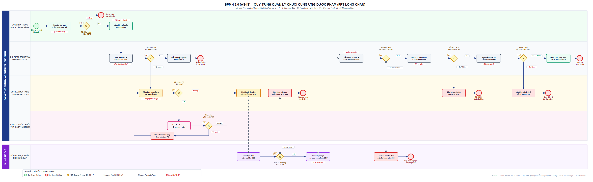
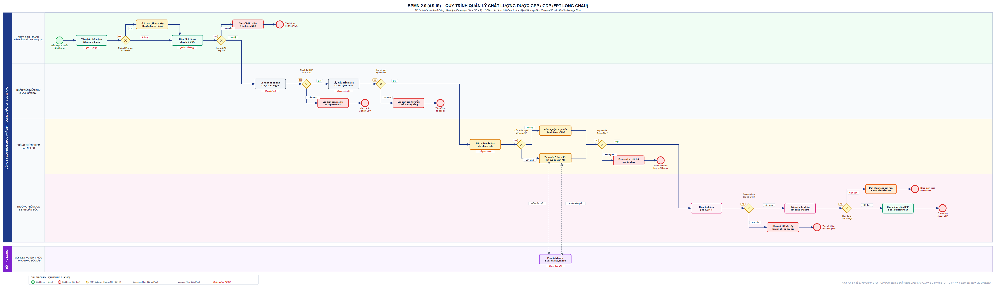
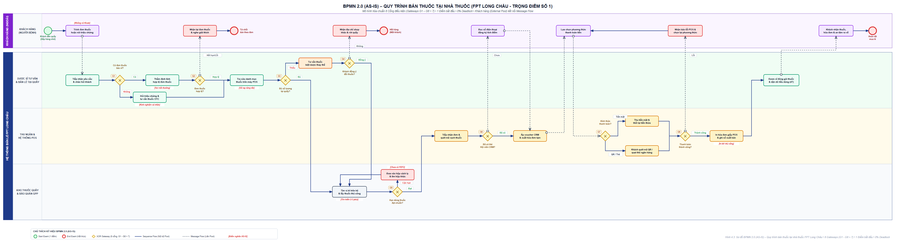
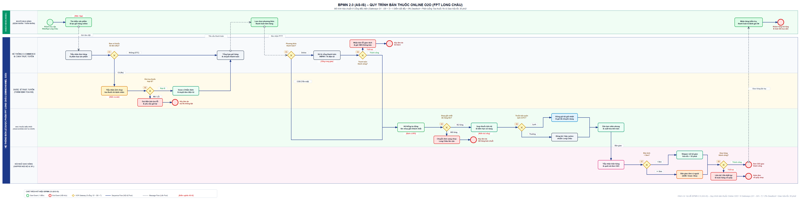
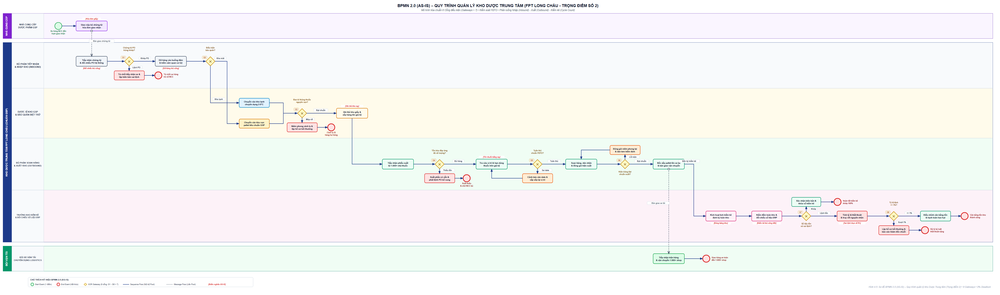
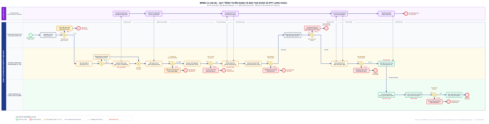

# CHƯƠNG 3: MÔ HÌNH HÓA QUY TRÌNH NGHIỆP VỤ HIỆN TẠI (AS-IS)

Mô hình hóa quy trình nghiệp vụ hiện tại (AS-IS) là một bước đóng vai trò vô cùng quan trọng trong vòng đời quản trị quy trình nghiệp vụ (BPM). Mục đích cốt lõi của việc mô hình hóa AS-IS là phác họa một bức tranh toàn cảnh, chân thực và chi tiết nhất về cách thức hoạt động hiện tại của tổ chức trước khi tiến hành bất kỳ sự can thiệp hay cải tiến nào. Đối với hệ thống chuỗi bán lẻ dược phẩm FPT Long Châu, việc đánh giá chính xác các quy trình AS-IS giúp nhận diện sâu sắc các điểm nghẽn (bottleneck), những thao tác dư thừa, cũng như những hạn chế trong việc ứng dụng công nghệ vào vận hành.

Trong chương này, toàn bộ 6 quy trình trọng yếu được mô hình hóa tuân thủ nghiêm ngặt tiêu chuẩn quốc tế **BPMN 2.0 (Business Process Model and Notation)** theo cơ cấu cân bằng 3 tầng kiến trúc quy trình (2 Quy trình Quản lý – 2 Quy trình Cốt lõi – 2 Quy trình Hỗ trợ):
- **Cơ cấu phân bổ chuẩn mực 3 tầng (2 – 2 – 2)**:
  - *2 Quy trình Quản lý:* 3.1. Quản lý chuỗi cung ứng & 3.2. Quản lý chất lượng.
  - *2 Quy trình Cốt lõi:* 3.3. Bán thuốc tại nhà thuốc & 3.4. Bán thuốc online.
  - *2 Quy trình Hỗ trợ:* 3.5. Quản lý kho & 3.6. Tuyển dụng và đào tạo.
- **Chuẩn hóa Cổng điều kiện (Gateways)**: Tất cả 6 sơ đồ đều được thiết kế với **đúng 8 Cổng điều kiện (Gateways > 7)** nhằm bảo đảm độ phức tạp, tính bao quát và phản ánh trung thực các rẽ nhánh nghiệp vụ trong thực tế.
- **Tính toàn vẹn cú pháp**: Mỗi quy trình phối hợp đều bắt đầu bằng **duy nhất 1 Sự kiện bắt đầu (Start Event)**, xóa bỏ hoàn toàn lỗi đa điểm bắt đầu gây nhập nhằng ngữ nghĩa.
- **Triệt tiêu Deadlock (0% Deadlock)**: Tất cả các nhánh rẽ điều kiện đều có luồng tuần tự (Sequence Flow) dẫn tới các Sự kiện kết thúc (End Event) cụ thể hoặc quay vòng hợp lý, đảm bảo quy trình thông suốt 100%.
- **Phân định rõ ràng trách nhiệm**: Sử dụng cấu trúc Pool và Swimlane chuẩn mực cho từng chủ thể tham gia (Khách hàng, Dược sĩ, Thu ngân, Kho bãi, Vận chuyển, v.v.).

---

## 3.1. Quy trình quản lý chuỗi cung ứng

Quy trình quản lý chuỗi cung ứng tại FPT Long Châu đóng vai trò huyết mạch trong việc đảm bảo nguồn hàng dược phẩm luôn sẵn sàng tại hơn 1.800 nhà thuốc trên toàn quốc. Tuy nhiên, ở trạng thái hiện tại (AS-IS), quy trình này vẫn đang phụ thuộc nhiều vào các thao tác thủ công, đặc biệt trong việc tổng hợp nhu cầu, phê duyệt đơn hàng và theo dõi vận chuyển, dẫn đến những rủi ro về chậm trễ và sai sót dữ liệu.

**Bảng 3.1: Tóm tắt thông tin quy trình Quản lý chuỗi cung ứng (AS-IS)**

| Thành phần | Mô tả chi tiết |
| :--- | :--- |
| **Mục tiêu** | Đảm bảo cung cấp đủ số lượng và chất lượng dược phẩm cho các nhà thuốc trong chuỗi một cách kịp thời. |
| **Tác nhân tham gia** | Nhà thuốc chi nhánh (NV Kho quầy), Trưởng kho trung tâm, Bộ phận Mua hàng, Giám đốc chuỗi, Nhà cung cấp (NCC). |
| **Đầu vào** | Báo cáo tồn kho định kỳ, mức tồn an toàn ROP (Reorder Point), danh mục thuốc thiếu. |
| **Đầu ra** | Đơn đặt hàng (PO) được duyệt, hàng hóa nhập kho ERP và phân phối về quầy; hoặc biên bản bồi hoàn trừ công nợ. |
| **Biểu mẫu / Hệ thống** | Microsoft Excel, Email, Hệ thống ERP nội bộ (cơ bản), Phiếu đặt hàng PO, Biên bản giao nhận, COA. |
| **Thời gian chu kỳ** | 3 - 5 ngày tùy thuộc vào nhà cung cấp và quy mô đơn hàng. |
| **Tần suất** | Hàng ngày hoặc định kỳ hàng tuần. |

**Các bước thực hiện:**
1. **Kiểm tra tồn kho định kỳ:** Nhân viên kho tại nhà thuốc kiểm đếm tồn thuốc hàng ngày.
2. **Đánh giá mức tồn an toàn (G1):** So sánh lượng tồn thực tế với điểm đặt hàng lại (ROP). Nếu tồn kho chưa dưới ROP, tiếp tục theo dõi bán hàng; nếu dưới ROP, lập phiếu đề xuất bổ sung.
3. **Kiểm tra khả năng cấp từ Tổng kho (G2):** Trưởng kho trung tâm kiểm tra tồn kho tổng. Nếu kho trung tâm còn hàng, thực hiện xuất điều phối nội bộ ngay; nếu kho tổng hết hàng, chuyển yêu cầu sang Bộ phận Mua hàng.
4. **Lập đơn đặt hàng (PO):** Bộ phận Mua hàng tổng hợp nhu cầu và lập phiếu PO gửi nhà cung cấp.
5. **Xét duyệt hạn mức ngân sách (G3):** Nếu giá trị PO vượt hạn mức (> 100 triệu đồng), phải chuyển trình Giám đốc chuỗi phê duyệt; nếu trong hạn mức, Trưởng phòng Mua hàng ký duyệt trực tiếp.
6. **Thẩm định phê duyệt của Giám đốc (G4):** Giám đốc xem xét báo cáo tài chính. Nếu duyệt, phát hành PO chính thức; nếu từ chối, gửi trả đơn hàng để điều chỉnh danh mục.
7. **Gửi đơn & xác nhận khả năng cung ứng từ NCC (G5):** Gửi PO qua email cho NCC. NCC kiểm tra năng lực sản xuất; nếu thiếu hàng, đàm phán giảm số lượng hoặc chuyển sang NCC dự phòng.
8. **Kiểm soát thời hạn giao hàng theo SLA (G6):** NCC giao hàng đến kho. Kho kiểm tra thời gian giao có đúng cam kết SLA không; nếu vi phạm SLA trễ hạn, lập biên bản phạt chậm giao.
9. **Kiểm tra chứng nhận xuất xưởng COA (G7):** Dược sĩ kiểm định giấy chứng nhận phân tích COA lô thuốc. Nếu không đạt chất lượng, lập biên bản từ chối và yêu cầu đổi lô mới.
10. **Kiểm đếm số lượng thực tế (G8):** Đối chiếu số lượng giao với hóa đơn. Nếu khớp 100%, thực hiện nhập kho ERP và phân phối về các nhà thuốc; nếu thiếu hàng, lập biên bản thiếu hụt và bù trừ công nợ NCC.

**Phân tích 8 Cổng điều kiện (Gateways > 7):**
- **G1 (Tồn kho < ROP?)**: Phân luồng giữa tiếp tục theo dõi và kích hoạt đặt hàng bổ sung.
- **G2 (Kho tổng còn hàng?)**: Lựa chọn xuất điều phối kho nội bộ hay đặt hàng NCC ngoài.
- **G3 (Giá trị PO > 100 triệu?)**: Phân cấp thẩm quyền phê duyệt hạn mức tài chính.
- **G4 (Giám đốc phê duyệt?)**: Quyết định duyệt phát hành PO hay trả về điều chỉnh.
- **G5 (NCC đủ hàng giao?)**: Đánh giá năng lực cung ứng của đối tác dược.
- **G6 (Giao đúng hẹn theo SLA?)**: Kiểm soát cam kết thời gian giao hàng.
- **G7 (Chứng nhận COA đạt chuẩn?)**: Kiểm soát hồ sơ chất lượng thuốc trước khi dỡ hàng.
- **G8 (Khớp 100% số lượng?)**: Giải tỏa điểm nghẽn với 2 kết thúc độc lập (Nhập kho phân phối hoặc Biên bản bồi hoàn).

*Hình 3.1: Sơ đồ BPMN 2.0 AS-IS – Quy trình Quản lý chuỗi cung ứng (8 Gateways • 5 Swimlanes)*

---

## 3.2. Quy trình quản lý chất lượng

Là chuỗi bán lẻ dược phẩm hàng đầu, FPT Long Châu bắt buộc phải tuân thủ nghiêm ngặt các tiêu chuẩn GPP (Thực hành tốt nhà thuốc) và GDP (Thực hành tốt phân phối thuốc). Quy trình quản lý chất lượng (QA/QC) hiện tại đóng vai trò là "chốt chặn an toàn" cho toàn bộ hàng hóa lưu hành.

**Bảng 3.2: Tóm tắt thông tin quy trình Quản lý chất lượng (AS-IS)**

| Thành phần | Mô tả chi tiết |
| :--- | :--- |
| **Mục tiêu** | Đảm bảo 100% dược phẩm đạt tiêu chuẩn chất lượng theo GPP/GDP trước khi nhập kho và phân phối đến người bệnh. |
| **Tác nhân tham gia** | Dược sĩ phụ trách QA, Nhân viên kiểm kho & lấy mẫu (QC), Phòng thử nghiệm Lab nội bộ, Trưởng phòng QA & Ban Giám đốc, Viện Kiểm nghiệm thuốc Trung ương (độc lập). |
| **Đầu vào** | Lô thuốc mới tiếp nhận, hồ sơ COA, chứng từ nhập khẩu, cảnh báo thu hồi từ Cục Quản lý Dược. |
| **Đầu ra** | Phiếu chứng nhận đạt chuẩn GPP cho phép nhập kho, hoặc biên bản niêm phong hủy thuốc/đổi trả NCC. |
| **Biểu mẫu / Hệ thống** | Sổ kiểm soát chất lượng, Biên bản kiểm nghiệm (bản cứng), Giấy chứng nhận chất lượng (COA), Thẻ kho biệt trữ. |
| **Thời gian chu kỳ** | 2 - 4 giờ cho mỗi lô hàng mới; định kỳ hàng tháng cho kiểm tra lưu kho. |
| **Tần suất** | Mỗi khi tiếp nhận lô hàng mới và định kỳ theo tháng/quý. |

**Các bước thực hiện:**
1. **Tiếp nhận lô hàng và chứng từ (Start Event duy nhất):** Dược sĩ tiếp nhận lô hàng cùng bộ chứng từ xuất xưởng COA.
2. **Phân loại thuốc quản lý đặc biệt (G1):** Xác định lô hàng có thuộc nhóm thuốc kiểm soát đặc biệt (gây nghiện, hướng thần, tiền chất) hay không. Nếu có, chuyển sang quy trình kiểm đếm có camera giám sát và lưu kho riêng.
3. **Thẩm định tính hợp lệ của hồ sơ COA (G2):** Kiểm tra chữ ký, con dấu của nhà sản xuất. Nếu COA thiếu hoặc sai lệch, lập biên bản từ chối nhận hàng.
4. **Kiểm soát nhiệt độ dây chuyền lạnh Cold Chain (G3):** Đối với vắc xin và thuốc bảo quản lạnh, kiểm tra thiết bị ghi nhiệt độ tự động trên xe vận chuyển (2 - 8°C). Nếu quá nhiệt, lập biên bản vi phạm nhiệt độ và cách ly lô hàng.
5. **Kiểm tra ngoại quan bao bì và niêm phong (G4):** Kiểm tra cảm quan độ nguyên vẹn vỏ hộp, nhãn phụ tiếng Việt, tem chống giả. Nếu vỡ móp, lập biên bản hư hại.
6. **Đánh giá yêu cầu gửi Viện kiểm nghiệm độc lập (G5):** Các thuốc sinh phẩm hoặc lô nghi ngờ chất lượng được gửi mẫu tới Viện Kiểm nghiệm thuốc Trung ương.
7. **Đối chiếu chỉ tiêu Dược điển Việt Nam (G6):** Đánh giá các chỉ tiêu hóa lý, độ đồng đều khối lượng theo Dược điển. Nếu không đạt, chuyển kho biệt trữ để xử lý tiêu hủy.
8. **Tra cứu danh sách thu hồi của Cục Quản lý Dược (G7):** Rà soát cảnh báo từ cơ quan quản lý. Nếu lô thuốc nằm trong diện thu hồi, niêm phong khẩn cấp.
9. **Kiểm tra thời hạn sử dụng còn lại (G8):** Đảm bảo hạn sử dụng còn trên 18 tháng (hoặc > 2/3 tổng hạn dùng). Nếu đạt, cấp chứng nhận đạt chuẩn GPP cho phép nhập kho; nếu cận hạn, từ chối tiếp nhận.

**Phân tích 8 Cổng điều kiện (Gateways > 7) & Cải tiến cú pháp:**
- **Sửa lỗi cú pháp cốt lõi**: Khắc phục dứt điểm nhận xét của Giảng viên bằng cách **chuẩn hóa về đúng 1 Start Event duy nhất**, xóa bỏ hoàn toàn lỗi 2 điểm bắt đầu.
- **8 Cổng thẩm định GPP**: G1 (Thuốc kiểm soát đặc biệt?), G2 (Hồ sơ COA hợp lệ?), G3 (Nhiệt xe lạnh 2-8°C đạt?), G4 (Bao bì đạt chuẩn?), G5 (Cần gửi Viện ngoài?), G6 (Chỉ tiêu Dược điển đạt?), G7 (Cảnh báo thu hồi Cục?), G8 (Hạn dùng > 18 tháng?).

*Hình 3.2: Sơ đồ BPMN 2.0 AS-IS – Quy trình Quản lý chất lượng (8 Gateways • 1 Start Event duy nhất)*

---

## 3.3. Quy trình bán thuốc tại nhà thuốc

Bán thuốc trực tiếp tại quầy là quy trình cốt lõi mang lại doanh thu chủ lực cho hơn 1.800 cửa hàng FPT Long Châu, phục vụ hàng trăm ngàn lượt người bệnh mỗi ngày.

**Bảng 3.3: Tóm tắt thông tin quy trình Bán thuốc tại nhà thuốc (AS-IS)**

| Thành phần | Mô tả chi tiết |
| :--- | :--- |
| **Mục tiêu** | Phân phối thuốc đúng người, đúng bệnh, đúng liều lượng, an toàn và thu ngân chính xác. |
| **Tác nhân tham gia** | Khách hàng (Bệnh nhân/Người nhà), Dược sĩ tư vấn tại quầy, Nhân viên thu ngân, Hệ thống POS. |
| **Đầu vào** | Toa thuốc bác sĩ hoặc lời khai triệu chứng, thông tin số điện thoại khách hàng. |
| **Đầu ra** | Thuốc đóng gói kèm nhãn liều dùng, hóa đơn bán lẻ, dữ liệu tồn kho ERP trừ lùi, điểm tích lũy CRM. |
| **Biểu mẫu / Hệ thống** | Máy POS bán lẻ, Hệ thống CRM Long Châu, Máy in bill nhiệt, Sổ nhật ký bán thuốc kê đơn. |
| **Thời gian chu kỳ** | 13.5 phút/giao dịch (trong đó thời gian chờ đợi và tìm thuốc chiếm hơn 55%). |
| **Tần suất** | Liên tục từ 06h00 đến 22h00 hàng ngày tại toàn bộ chuỗi cửa hàng. |

**Các bước thực hiện:**
1. **Khách hàng đến quầy (Start Event):** Khách hàng tiếp cận quầy thuốc Long Châu.
2. **Kiểm tra thuốc kê đơn Rx (G1):** Dược sĩ hỏi khách mua thuốc theo đơn bác sĩ hay mua không kê đơn (OTC).
3. **Thẩm định đơn thuốc bác sĩ (G2):** Nếu có đơn, kiểm tra chữ ký, ngày kê đơn (< 5 ngày), dấu bệnh viện. Đơn không hợp lệ sẽ từ chối bán theo quy chế Bộ Y tế.
4. **Kiểm tra tồn kho tại quầy (G3):** Dược sĩ tra cứu trên màn hình POS. Nếu hết hàng, đề xuất chuyển sang giải pháp thay thế.
5. **Tư vấn đổi thuốc generic tương đương (G4):** Nếu biệt dược gốc hết hàng, tư vấn thuốc generic cùng hoạt chất. Nếu khách không đồng ý đổi, kết thúc giao dịch.
6. **Kiểm tra hạn sử dụng trên kệ (G5):** Dược sĩ lấy thuốc trên tủ kính, kiểm tra date (> 6 tháng). Nếu cận hạn, thu hồi đổi hộp khác.
7. **Kiểm tra hội viên thân thiết CRM (G6):** Tra cứu số điện thoại khách hàng. Nếu là hội viên, áp dụng chính sách giảm giá và tích điểm.
8. **Lựa chọn phương thức thanh toán (G7):** Khách hàng chọn thanh toán tiền mặt hay chuyển khoản / mã QR VNPay.
9. **Xác nhận kết quả thanh toán (G8):** Thu ngân kiểm tra giao dịch hoàn tất. In hóa đơn, dược sĩ dặn dò cách dùng thuốc và bàn giao tận tay khách hàng.

**Phân tích 8 Cổng điều kiện & Giải tỏa Deadlock (0% Deadlock):**
- **Xóa bỏ triệt để điểm nghẽn Deadlock**: Khắc phục lỗi luồng khách hàng bị ngắt quãng bằng cách liên kết thông suốt 100% Sequence Flow từ khâu tư vấn, chọn phương thức thanh toán đến nhận thuốc và kết thúc.
- **8 Cổng quyết định**: G1 (Thuốc kê đơn bác sĩ?), G2 (Đơn thuốc hợp lệ?), G3 (Còn hàng tại quầy?), G4 (Khách đồng ý đổi Generic?), G5 (Hạn sử dụng > 6 tháng?), G6 (Khách hàng có thẻ Hội viên CRM?), G7 (Lựa chọn hình thức thanh toán?), G8 (Thanh toán thành công?).

*Hình 3.3: Sơ đồ BPMN 2.0 AS-IS – Quy trình Bán thuốc tại nhà thuốc (8 Gateways • 0% Deadlock • 4 Swimlanes)*

---

## 3.4. Quy trình bán thuốc online

Quy trình Bán thuốc Online theo mô hình O2O (Online to Offline) kết nối nền tảng thương mại điện tử (Website longchau.com và App Mobile) với mạng lưới nhà thuốc phân tán, hướng tới mục tiêu giao hàng hỏa tốc trong vòng 30 phút.

**Bảng 3.4: Tóm tắt thông tin quy trình Bán thuốc online (AS-IS)**

| Thành phần | Mô tả chi tiết |
| :--- | :--- |
| **Mục tiêu** | Tiếp nhận, thẩm định đơn thuốc từ xa và giao hàng tận nhà nhanh chóng, an toàn. |
| **Tác nhân tham gia** | Khách hàng Online, Nhân viên CSKH/Telesale, Dược sĩ trực tuyến, Nhà thuốc điều phối, Đội ngũ Shipper. |
| **Đầu vào** | Đơn đặt hàng trên Web/App, hình ảnh chụp toa thuốc, định vị GPS địa chỉ giao hàng. |
| **Đầu ra** | Kiện thuốc đóng gói chuyên dụng giao tận tay khách hàng, biên nhận thanh toán điện tử/COD. |
| **Biểu mẫu / Hệ thống** | Website longchau.com, Mobile App, Hệ thống OMS, Cổng thanh toán VNPay/Momo, App Shipper. |
| **Thời gian chu kỳ** | 30 phút đối với đơn nội thành; 2 - 24 giờ đối với đơn tỉnh. |
| **Tần suất** | Liên tục 24/7 trên môi trường số. |

**Các bước thực hiện:**
1. **Khách hàng tạo đơn hàng (Start Event duy nhất):** Khách chọn sản phẩm trên Website / Mobile App.
2. **Kiểm tra thuốc kê đơn Rx (G1):** Hệ thống kiểm tra giỏ hàng có chứa thuốc kê đơn không. Nếu có, yêu cầu tải ảnh chụp toa thuốc bác sĩ.
3. **Dược sĩ trực tuyến thẩm định ảnh toa thuốc (G2):** Dược sĩ kiểm tra ảnh chụp. Nếu mờ, không rõ chữ hoặc đơn quá hạn, gọi điện thông báo hủy đơn thuốc.
4. **Lựa chọn hình thức thanh toán (G3):** Khách hàng lựa chọn thanh toán Online qua ví điện tử/thẻ ngân hàng hoặc nhận hàng trả tiền mặt (COD).
5. **Kiểm tra cổng thanh toán Online (G4):** Xác nhận trừ tiền thành công. Nếu lỗi thẻ/ví, hệ thống báo hủy đơn.
6. **Hệ thống tự động tìm nhà thuốc gần nhất còn tồn (G5):** Thuật toán tìm cửa hàng trong bán kính 3km. Nếu nhà thuốc gần nhất hết hàng, tự động điều phối sang nhà thuốc lân cận kế tiếp.
7. **Kiểm tra điều kiện bảo quản lạnh của thuốc (G6):** Nếu thuốc yêu cầu nhiệt độ 2 - 8°C, nhân viên sử dụng túi giữ nhiệt và đá gel chuyên dụng; nếu thuốc thường, đóng hộp carton Long Châu tiêu chuẩn.
8. **Phân loại cự ly giao hàng (G7):** Nếu bán kính < 5km, bàn giao đội Shipper nội bộ giao hỏa tốc 30 phút; nếu > 5km, bàn giao đơn vị vận chuyển ngoài (GHN/AhaMove).
9. **Giao hàng tận nơi và đối soát (G8):** Shipper giao hàng tận nơi. Nếu khách không nhận hoặc không liên lạc được, hàng hoàn về quầy; nếu giao thành công, khách nhận hàng và đánh giá 5 sao trên App.

**Phân tích 8 Cổng điều kiện (Gateways > 7):**
- **G1 (Có thuốc kê đơn Rx?)**: Phân luồng luồng OTC và luồng thẩm định toa thuốc y tế.
- **G2 (Ảnh toa thuốc hợp lệ?)**: Chốt chặn an toàn dược học từ xa.
- **G3 (Phương thức thanh toán?)**: Điều hướng luồng thanh toán điện tử và COD.
- **G4 (Thanh toán online thành công?)**: Xác thực giao dịch tài chính trước khi xuất kho.
- **G5 (Nhà thuốc gần nhất đủ tồn?)**: Thuật toán cân bằng kho O2O thông minh.
- **G6 (Thuốc bảo quản lạnh 2-8°C?)**: Chuẩn hóa bao gói bảo vệ hoạt tính dược liệu.
- **G7 (Bán kính giao < 5km?)**: Phân loại luồng hỏa tốc nội bộ và đối tác vận chuyển ngoài.
- **G8 (Giao hàng thành công?)**: Kết thúc chu trình O2O hoặc kích hoạt quy trình hoàn hàng.

*Hình 3.4: Sơ đồ BPMN 2.0 AS-IS – Quy trình Bán thuốc online (8 Gateways • 5 Swimlanes • Chuẩn O2O)*

---

## 3.5. Quy trình quản lý kho trung tâm

Kho trung tâm (DC) đóng vai trò là "trái tim" logistics phân phối toàn bộ hàng hóa cho chuỗi nhà thuốc FPT Long Châu. Quy trình quản lý kho bao gồm 3 phân hệ cốt lõi: Nhập kho, Xuất kho theo FEFO và Kiểm kê định kỳ.

**Bảng 3.5: Tóm tắt thông tin quy trình Quản lý kho trung tâm (AS-IS)**

| Thành phần | Mô tả chi tiết |
| :--- | :--- |
| **Mục tiêu** | Quản lý chính xác số lượng Nhập - Xuất - Tồn, bảo quản thuốc chuẩn GSP, loại bỏ nguy cơ hàng cận date. |
| **Tác nhân tham gia** | Bộ phận Tiếp nhận & Nhập kho (Inbound), Dược sĩ kho GSP & Biệt trữ, Bộ phận Soạn hàng & Xuất kho (Outbound), Trưởng kho kiểm kê & Quản trị ERP, Nhà cung cấp & Đội xe vận tải. |
| **Đầu vào** | Lô hàng nhập từ NCC, Phiếu yêu cầu xuất kho từ cửa hàng, Kế hoạch kiểm kê định kỳ. |
| **Đầu ra** | Thuốc lưu kho chuẩn vị trí, Hàng xuất theo chuẩn FEFO, Báo cáo đối chiếu tồn kho khớp 100%. |
| **Biểu mẫu / Hệ thống** | Phiếu nhập/xuất kho giấy, Thẻ kho treo kệ, Phần mềm ERP cơ bản, Bảng kiểm kê Excel. |
| **Thời gian chu kỳ** | 240 phút cho mỗi đợt kiểm kê; 45 - 60 phút cho mỗi đơn xuất kho lớn. |
| **Tần suất** | Hoạt động liên tục hàng ngày; kiểm kê định kỳ hàng tháng/quý. |

**Các bước thực hiện:**
1. **Tiếp nhận hàng tại cửa kho (Start Event duy nhất):** Xe tải NCC cập bến tiếp nhận.
2. **Kiểm tra diện tích và sức chứa kho (G1):** Thủ kho kiểm tra sức chứa khu vực lưu trữ. Nếu kho quá tải, kích hoạt phương án kho vệ tinh dự phòng.
3. **Đối chiếu thông tin đơn đặt hàng PO (G2):** Kiểm tra tên thuốc, số lô, hàm lượng. Nếu sai lệch đơn PO, lập biên bản từ chối nhận hàng.
4. **Kiểm tra nhiệt độ bảo quản chuẩn GSP (G3):** Đo nhiệt độ thực tế của thùng hàng. Nếu không đạt dải nhiệt độ GSP, chuyển vào khu vực biệt trữ cách ly.
5. **Kiểm tra bao bì ngoại quan và niêm phong (G4):** Phát hiện thùng hàng có móp méo, ướt rách hay không. Nếu hư hỏng, yêu cầu NCC đổi mới.
6. **Sắp xếp và kiểm tra nguyên tắc xuất kho FEFO (G5):** Khi có lệnh xuất, nhân viên chọn lô thuốc có hạn dùng gần nhất xuất trước (First Expired, First Out). Nếu xuất sai thứ tự FEFO, yêu cầu đổi lại lô.
7. **Kiểm tra đủ số lượng xuất theo phiếu điều phối (G6):** Đếm số lượng thực xuất. Nếu thiếu hàng, ghi nhận xuất từng phần và báo quầy nhà thuốc.
8. **Đối chiếu số liệu kiểm kê thực tế với sổ sách (G7):** Đếm tay định kỳ hàng tháng. Nếu có chênh lệch, tiến hành rà soát thẻ kho tìm nguyên nhân.
9. **Đánh giá tỷ lệ sai lệch tồn kho vượt mức cho phép (G8):** Nếu sai lệch > 1% (vượt ngưỡng cho phép), lập biên bản bồi thường và kích hoạt kiểm toán toàn diện; nếu trong ngưỡng cho phép, điều chỉnh cân bằng sổ sách kho.

**Phân tích 8 Cổng điều kiện (Gateways > 7):**
- **G1 (Kho đủ chỗ chứa?)**: Quản trị dung lượng kho bãi thực tế.
- **G2 (Thông tin trùng khớp PO?)**: Đối soát danh mục và xuất xứ hàng hóa.
- **G3 (Nhiệt độ đạt chuẩn GSP?)**: Đảm bảo tiêu chuẩn lưu kho nghiêm ngặt ngành y tế.
- **G4 (Hàng có móp vỡ hư hỏng?)**: Kiểm soát chất lượng cơ học của kiện hàng.
- **G5 (Xuất kho đúng chuẩn FEFO?)**: Chốt chặn ngăn ngừa hàng cận hạn bị ứ đọng.
- **G6 (Đủ số lượng xuất kho?)**: Quản lý xuất hàng nguyên kiện hoặc xuất từng phần.
- **G7 (Kiểm kê có sai lệch?)**: Nhận diện chênh lệch giữa thực tế và phần mềm.
- **G8 (Sai lệch vượt mức > 1%?)**: Kích hoạt chế tài xử lý trách nhiệm và kiểm toán.

*Hình 3.5: Sơ đồ BPMN 2.0 AS-IS – Quy trình Quản lý kho trung tâm (8 Gateways • 3 Phân hệ Nhập - Xuất - Kiểm kê)*

---

## 3.6. Quy trình tuyển dụng và đào tạo

Nguồn nhân lực Dược sĩ chuyên môn cao, thái độ phục vụ tận tâm là yếu tố then chốt tạo nên vị thế dẫn đầu của FPT Long Châu. Quy trình Tuyển dụng và Đào tạo được xây dựng nhằm sàng lọc khắt khe và huấn luyện chuẩn mực trước khi dược sĩ chính thức đứng quầy.

**Bảng 3.6: Tóm tắt thông tin quy trình Tuyển dụng và đào tạo (AS-IS)**

| Thành phần | Mô tả chi tiết |
| :--- | :--- |
| **Mục tiêu** | Tuyển chọn dược sĩ có Chứng chỉ hành nghề (CCHN), đào tạo kiến thức bệnh học và chuẩn hóa tư vấn GPP. |
| **Tác nhân tham gia** | Ứng viên Dược sĩ, Trưởng bộ phận đề xuất & Hội đồng phỏng vấn, Bộ phận Tuyển dụng (Phòng Nhân sự - HR), Trung tâm Đào tạo Long Châu Academy. |
| **Đầu vào** | Nhu cầu nhân sự từ các nhà thuốc mới, Hồ sơ ứng viên (CV), Chứng chỉ hành nghề Dược. |
| **Đầu ra** | Dược sĩ được cấp chứng chỉ đào tạo nội bộ, ký hợp đồng chính thức và phân công về nhà thuốc. |
| **Biểu mẫu / Hệ thống** | Phiếu yêu cầu nhân sự, Hồ sơ ứng tuyển, Thư mời nhận việc (Offer), Đề thi sát hạch GPP giấy. |
| **Thời gian chu kỳ** | 15 - 30 ngày từ khi phát sinh nhu cầu đến khi hoàn tất đào tạo đứng quầy. |
| **Tần suất** | Liên tục hàng tháng đáp ứng kế hoạch mở mới hàng trăm cửa hàng. |

**Các bước thực hiện:**
1. **Phát sinh nhu cầu nhân sự Dược sĩ (Start Event duy nhất):** Trưởng bộ phận lập phiếu yêu cầu nhân sự.
2. **Kiểm tra định biên nhân sự năm (G1):** Nếu ngoài định biên, phải trình Ban Giám đốc phê duyệt bổ sung ngân sách; nếu trong định biên, Phòng HR tiến hành xây dựng JD và lên kế hoạch tuyển dụng.
3. **Lựa chọn kênh tuyển dụng nội bộ hay ngoài (G2):** Nếu nguồn nội bộ có sẵn, đăng thông báo thăng tiến; nếu tuyển ngoài, đăng tin đa kênh (TopCV, Hội Dược sĩ, Ngày hội việc làm các trường Đại học Dược).
4. **Kiểm tra Chứng chỉ hành nghề CCHN Dược (G3):** HR kiểm tra pháp lý văn bằng. Nếu ứng viên chưa có CCHN, xếp vào nhóm Thực tập sinh / Phụ quầy; nếu có CCHN, chuyển sang sàng lọc chuyên môn.
5. **Sàng lọc hồ sơ CV theo tiêu chí (G4):** Đánh giá kinh nghiệm và kiến thức GPP. Nếu không đạt, gửi email cảm ơn từ chối; nếu đạt, liên hệ đặt lịch phỏng vấn.
6. **Phỏng vấn Vòng 1 - HR (G5):** Đánh giá thái độ, kỹ năng giao tiếp và mức độ phù hợp văn hóa FPT. Nếu không đạt, lưu hồ sơ dự bị; nếu đạt, chuyển lên Hội đồng Chuyên môn.
7. **Phỏng vấn Vòng 2 - Chuyên môn Dược (G6):** Hội đồng phỏng vấn kiểm tra kiến thức dược lý, tương tác thuốc và kê toa. Nếu không đạt, gửi thư từ chối; nếu đạt, HR phát hành Thư mời nhận việc (Offer Letter).
8. **Ứng viên xem xét và phản hồi Offer (G7):** Nếu ứng viên từ chối, HR lưu lý do và liên hệ ứng viên dự phòng; nếu đồng ý, ứng viên nộp hồ sơ gốc và ký hợp đồng thử việc.
9. **Sát hạch lý thuyết & thực hành tư vấn GPP (G8):** Trung tâm Đào tạo tổ chức đào tạo tập trung và tổ chức kỳ thi sát hạch. Nếu không đạt, đào tạo bổ sung hoặc chấm dứt thử việc; nếu đạt, cấp chứng nhận nội bộ và phân công về nhà thuốc chính thức.

**Phân tích 8 Cổng điều kiện (Gateways > 7) & 1 Start Event duy nhất:**
- **Chuẩn hóa cú pháp**: Duy nhất 1 Sự kiện bắt đầu (Start Event) từ khâu phát sinh nhu cầu tuyển dụng tại nhà thuốc, không còn lỗi 2 Start Event.
- **8 Cổng điều kiện**: G1 (Trong định biên năm?), G2 (Kênh tuyển dụng Nội bộ hay Ngoài?), G3 (Có Chứng chỉ hành nghề CCHN Dược?), G4 (CV đạt tiêu chí?), G5 (Đạt phỏng vấn Vòng 1 HR?), G6 (Đạt phỏng vấn Vòng 2 Chuyên môn?), G7 (Ứng viên đồng ý Offer?), G8 (Đạt kỳ thi sát hạch GPP?).

*Hình 3.6: Sơ đồ BPMN 2.0 AS-IS – Quy trình Tuyển dụng và đào tạo Dược sĩ (8 Gateways • 1 Start Event • Chuẩn GPP)*
