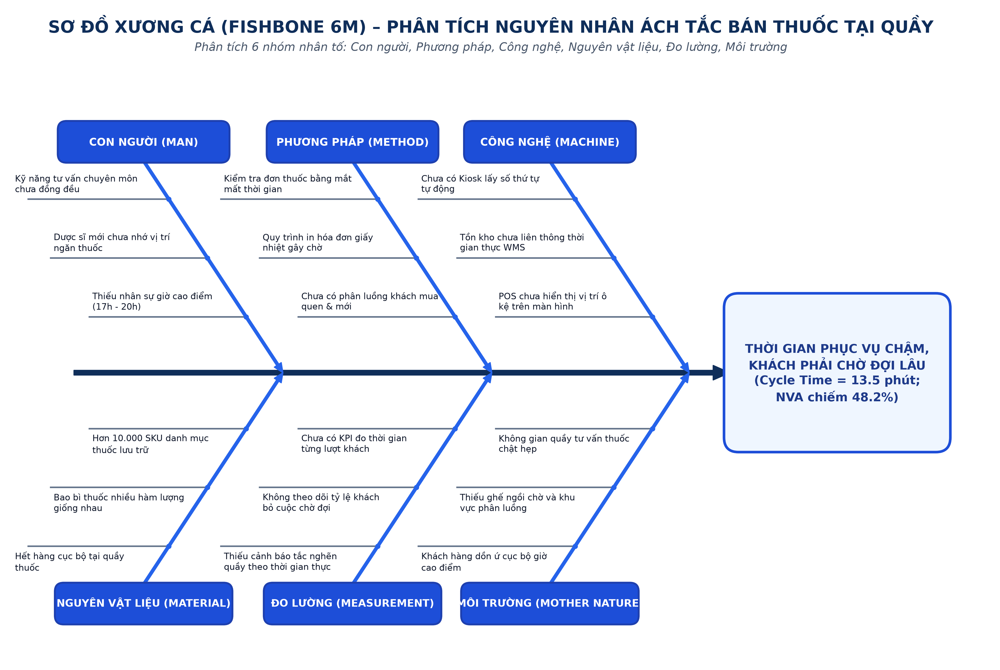
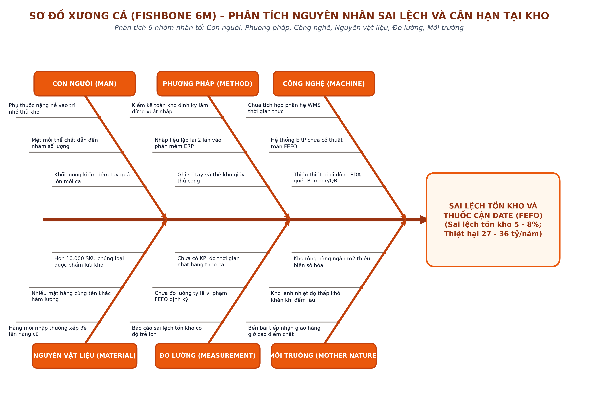

# CHƯƠNG 4: PHÂN TÍCH QUY TRÌNH NGHIỆP VỤ

Trong bối cảnh môi trường kinh doanh bán lẻ dược phẩm ngày càng cạnh tranh gay gắt, việc chỉ mô hình hóa các quy trình nghiệp vụ hiện tại (AS-IS) là chưa đủ. Mục tiêu cốt lõi của chương này là tiến hành phân tích chuyên sâu các quy trình nghiệp vụ đã được mô hình hóa ở Chương 3, từ đó nhận diện chính xác các điểm nghẽn (bottleneck), những hoạt động không mang lại giá trị (NVA) và các loại lãng phí đang tồn tại trong hệ thống của FPT Long Châu. Việc phân tích quy trình đóng vai trò cực kỳ quan trọng, là cầu nối không thể thiếu giữa bức tranh hiện trạng và những đề xuất cải tiến trong tương lai. Nếu không có bước phân tích thấu đáo, mọi nỗ lực cải tiến đều có nguy cơ đi chệch hướng, tốn kém chi phí mà không giải quyết được căn nguyên vấn đề. 

Để đảm bảo tính khách quan và khoa học, báo cáo áp dụng một phương pháp tiếp cận tổng quát đi từ việc phân tích tác nhân, bóc tách từng hoạt động theo chuỗi giá trị, nhận diện lãng phí theo tư duy Lean, cho đến việc truy tìm nguyên nhân gốc rễ bằng các công cụ chuyên dụng. Trong phạm vi chương này, hai quy trình trọng điểm được lựa chọn để phân tích sâu là: Quy trình bán thuốc tại nhà thuốc (đại diện cho luồng tương tác trực tiếp tạo doanh thu) và Quy trình quản lý kho (đại diện cho luồng vận hành logistics hậu cần).

## 4.1. Tiêu chí và phương pháp phân tích

Để phân tích sâu và hiệu quả, báo cáo sử dụng một hệ thống các tiêu chí và phương pháp phân tích đã được chuẩn hóa trong lĩnh vực Quản trị Quy trình Nghiệp vụ (BPM). Việc lựa chọn hai quy trình trọng điểm (bán thuốc và quản lý kho) dựa trên ba tiêu chí cốt lõi: tần suất thực hiện, tác động kinh doanh và khả năng cải tiến. Quy trình bán thuốc có tần suất diễn ra liên tục hàng ngày, tác động trực tiếp đến doanh thu và trải nghiệm khách hàng; trong khi quy trình quản lý kho quyết định đến sự liền mạch của chuỗi cung ứng và quản trị rủi ro hàng hóa.

Phương pháp phân tích đầu tiên được áp dụng là phân loại hoạt động theo giá trị (Value-Added Analysis). Các bước trong quy trình được chia thành ba nhóm:
- **VA (Value-Added - Tạo giá trị gia tăng)**: Là những hoạt động tạo ra giá trị trực tiếp cho khách hàng, khách hàng sẵn sàng chi trả cho các hoạt động này (ví dụ: tư vấn thuốc, giao thuốc).
- **BVA (Business Value-Added - Tạo giá trị doanh nghiệp)**: Những hoạt động không trực tiếp mang lại giá trị cho khách hàng nhưng bắt buộc phải có để doanh nghiệp vận hành, tuân thủ pháp luật (ví dụ: kiểm tra tính hợp lệ của đơn thuốc, ghi nhận sổ sách kế toán).
- **NVA (Non-Value-Added - Không tạo giá trị)**: Là những hoạt động lãng phí, không tạo ra bất kỳ giá trị nào cho cả khách hàng lẫn doanh nghiệp và cần được tối thiểu hóa hoặc loại bỏ hoàn toàn (ví dụ: chờ đợi, tìm kiếm hàng hóa, nhập liệu lặp lại).

Song song đó, khung phân tích 7 loại lãng phí (7 Wastes of Lean) cũng được sử dụng để nhận diện các điểm yếu trong quy trình:
1. **Chờ đợi (Waiting)**: Thời gian chờ máy móc, chờ phê duyệt hoặc khách hàng chờ phục vụ.
2. **Tồn kho thừa (Inventory)**: Lưu trữ hàng hóa quá mức cần thiết, gây đọng vốn.
3. **Di chuyển (Motion)**: Thao tác đi lại, tìm kiếm không cần thiết của nhân viên.
4. **Quy trình thừa (Over-processing)**: Các bước thực hiện phức tạp hơn mức cần thiết.
5. **Sản xuất thừa (Over-production)**: Thực hiện công việc sớm hơn hoặc nhiều hơn nhu cầu thực tế.
6. **Sửa chữa lỗi (Defects/Rework)**: Sai sót dẫn đến phải làm lại, đổi trả hàng.
7. **Phương tiện chưa dùng (Underutilized Talent)**: Lãng phí năng lực, kỹ năng của nhân viên vào các việc thủ công.

Để đi sâu vào bản chất vấn đề và bóc tách tác động của các bên liên quan, báo cáo sử dụng **Mô hình Xương cá Fishbone (Ishikawa 6M)** để phân rã nguyên nhân theo 6 nhóm nhân tố (Con người, Quy trình, Công nghệ, Môi trường, Nguyên vật liệu, Đo lường), kết hợp cùng **Phương pháp 5 Whys** để liên tục đặt câu hỏi nhằm tìm ra nguyên nhân gốc rễ (root cause) sâu xa nhất.

Cuối cùng, phương pháp đo lường hiệu suất được áp dụng qua các chỉ số: thời gian chu kỳ (cycle time) để biết tổng thời gian hoàn thành một quy trình, thời gian chờ (wait time) giữa các bước, tỷ lệ sai sót (error rate) và chi phí quy trình (process cost) nhằm lượng hóa các vấn đề đang tồn tại.

*(Lưu ý về nguồn dữ liệu: Nhóm nghiên cứu không có quyền truy cập vào cơ sở dữ liệu nội bộ bảo mật của FPT Long Châu. Do đó, các số liệu định lượng về thời gian chu kỳ, phân loại VA/BVA/NVA, tỷ lệ sai lệch và chi phí trong chương này được xây dựng dựa trên phương pháp mô phỏng học thuật (academic simulation) kết hợp quan sát thực tế và tài liệu công bố chính thức như Báo cáo thường niên FPT Retail 2023 - 2024).*

## 4.2. Phân tích quy trình bán thuốc tại nhà thuốc

Quy trình bán thuốc tại nhà thuốc là tuyến đầu tiếp xúc với khách hàng, nơi quyết định chất lượng dịch vụ và doanh thu cốt lõi của FPT Long Châu. Dưới đây là phân tích chi tiết nhằm bóc tách những hạn chế còn tồn đọng trong quy trình này.

### 4.2.1. Phân loại hoạt động VA/BVA/NVA

Việc phân loại chi tiết các bước trong quy trình theo ba nhóm giá trị gia tăng (VA - BVA - NVA) giúp nhóm bóc tách chính xác những khâu tạo giá trị và những khâu lãng phí cần triệt tiêu, theo cấu trúc phân tích: Liệt kê hoạt động, Mô tả bản chất và Đề xuất biện pháp khắc phục.

*Bảng 4.1: Phân loại hoạt động VA/BVA/NVA quy trình Bán thuốc tại nhà thuốc*

| STT | Hoạt động quy trình (Liệt kê) | Phân loại | Thời gian (phút) | Bản chất hoạt động (Mô tả) | Biện pháp khắc phục (Tối ưu hóa) |
| :---: | :--- | :---: | :---: | :--- | :--- |
| 1 | Khách hàng lấy số/chờ đến lượt | NVA | 3.0 | Khách phải đứng xếp hàng chờ đợi trong giờ cao điểm, không tạo ra bất kỳ giá trị nào. | Triển khai Kiosk lấy số thông minh phân luồng khách ưu tiên; hỗ trợ đặt trước qua App Long Châu. |
| 2 | Khách hàng trình bày triệu chứng/đơn thuốc | VA | 1.0 | Cung cấp thông tin lâm sàng thiết yếu cho việc chẩn đoán và lựa chọn thuốc. | Duy trì tương tác trực tiếp; cho phép quét mã đơn thuốc điện tử trên App để nạp dữ liệu tức thì. |
| 3 | Dược sĩ kiểm tra tính hợp lệ đơn thuốc | BVA | 0.5 | Hoạt động kiểm soát bắt buộc theo quy định pháp luật y tế và chuẩn GPP. | Tự động hóa kiểm tra chéo tương tác thuốc và liều lượng trần qua hệ thống Smart POS. |
| 4 | Dược sĩ đặt câu hỏi tư vấn sâu | VA | 2.0 | Tạo ra giá trị chuyên môn cao nhất, giúp người bệnh hiểu đúng phác đồ điều trị. | Chuẩn hóa kịch bản tư vấn theo từng nhóm bệnh lý; gợi ý phác đồ chăm sóc kèm theo trên màn hình POS. |
| 5 | Tra cứu tồn kho trên phần mềm | NVA | 1.0 | Dược sĩ phải gõ từng tên thuốc tìm kiếm thủ công do hệ thống phản hồi chậm. | Tích hợp hệ thống tra cứu nhanh theo hoạt chất và hiển thị tồn kho thời gian thực liên thông toàn chuỗi. |
| 6 | Đi lại tìm thuốc trên kệ | NVA | 1.5 | Di chuyển vật lý mất nhiều thời gian do mặt bằng quầy bố trí chưa tối ưu vị trí thuốc. | Số hóa sơ đồ kệ thuốc (Bin/Location layout); hiển thị chính xác vị trí ngăn kệ trên màn hình POS. |
| 7 | Lấy thuốc và kiểm tra hạn sử dụng | BVA | 0.5 | Kiểm soát cảm quan và date thuốc bắt buộc trước khi giao tận tay người bệnh. | Áp dụng máy quét mã vạch Barcode/QR kiểm tra date tự động, loại bỏ kiểm tra bằng mắt thường. |
| 8 | Di chuyển thuốc ra quầy thu ngân | NVA | 0.5 | Thao tác thừa do quầy tư vấn chuyên môn và quầy thu ngân bị tách rời vật lý. | Hợp nhất quầy tư vấn và quầy thanh toán (All-in-One Counter) trên một thiết bị Smart POS. |
| 9 | Thu ngân tính tiền và khách hàng thanh toán | VA | 1.0 | Hoàn tất giao dịch tài chính, tạo doanh thu trực tiếp cho nhà thuốc. | Tích hợp thanh toán không tiền mặt đa kênh (VietQR, thẻ ngân hàng, ví điện tử) trong 5 giây. |
| 10 | Đợi in hóa đơn giấy | NVA | 0.5 | Thời gian chờ máy in nhiệt in ra hóa đơn giấy dài, nhiều khách hàng vứt bỏ ngay. | Chuyển sang xuất hóa đơn điện tử (E-receipt) gửi tự động qua Zalo hoặc ứng dụng Long Châu. |
| 11 | Ghi chú liều dùng lên vỏ thuốc | VA | 1.0 | Mang lại giá trị sử dụng an toàn, giúp bệnh nhân tuân thủ đúng liều lượng chỉ định. | In tem nhãn hướng dẫn liều dùng tự động dán lên hộp thuốc thay vì viết tay bằng bút lông. |
| 12 | Giao thuốc và dặn dò khách hàng | VA | 1.0 | Tương tác cuối cùng tạo sự an tâm, dặn dò kiêng cữ và tái khám định kỳ. | Duy trì tương tác nhân văn; kích hoạt tính năng nhắc lịch uống thuốc tự động trên App. |

**Nhận xét:** Tổng thời gian chu kỳ (Cycle Time) là 13.5 phút. Trong đó:
- Thời gian tạo giá trị (VA): 6.0 phút (~44.4%).
- Thời gian tạo giá trị kinh doanh bắt buộc (BVA): 1.0 phút (~7.4%).
- Thời gian lãng phí không tạo giá trị (NVA): 6.5 phút (~48.2%).
Tỷ lệ NVA chiếm gần một nửa chu kỳ vận hành cho thấy quy trình hiện tại đang lãng phí đáng kể nguồn lực, chủ yếu rơi vào khâu chờ đợi của khách hàng, tra cứu tồn kho thủ công và việc đi lại nhặt thuốc của dược sĩ.

### 4.2.2. Phân tích sự lãng phí (Move – Hold – Overdo)

Theo phương pháp luận Lean, các loại lãng phí trong quy trình bán thuốc tại nhà thuốc được gom cụm thành 3 nhóm tác động trực tiếp: **Move (Di chuyển)**, **Hold (Tồn trữ / Chờ đợi)** và **Overdo (Làm thừa / Sửa sai)** theo cấu trúc chuẩn: Liệt kê, Mô tả biểu hiện trên quy trình và Đề xuất biện pháp khắc phục.

*Bảng 4.2: Bảng phân tích lãng phí Lean (Move – Hold – Overdo) quy trình Bán thuốc tại nhà thuốc*

| Nhóm lãng phí Lean | Hoạt động lãng phí (Liệt kê) | Biểu hiện cụ thể trên quy trình (Mô tả) | Biện pháp khắc phục (Khắc phục) |
| :---: | :--- | :--- | :--- |
| **MOVE** *(Di chuyển / Vận chuyển)* | Dược sĩ đi lại nhiều lần tìm thuốc trên kệ | Dược sĩ phải di chuyển qua lại liên tục giữa bàn tư vấn và các dãy kệ thuốc phía sau (mất 1.5 phút/đơn); nhiều dược sĩ cùng di chuyển va chạm nhau trong giờ cao điểm. | Quy hoạch lại layout nhà thuốc; sắp xếp thuốc theo tần suất bán (Fast-moving nằm gần bàn tư vấn); chỉ định mã vị trí ngăn chứa trên màn hình. |
| **MOVE** *(Di chuyển / Vận chuyển)* | Di chuyển khay thuốc sang quầy thu ngân | Sau khi nhặt thuốc, dược sĩ phải mang khay thuốc sang quầy thu ngân riêng biệt để quét mã tính tiền, tạo thêm một chặng di chuyển vật lý thừa (0.5 phút). | Hợp nhất chức năng tư vấn và thanh toán tại một điểm quầy (All-in-One Counter) tích hợp máy POS cảm ứng. |
| **HOLD** *(Tồn trữ / Chờ đợi)* | Khách hàng chờ đến lượt phục vụ | Khách hàng phải đứng chờ đợi trung bình 3.0 phút vào khung giờ cao điểm (17h – 20h) do không có cơ chế phân luồng khách hàng mua định kỳ và khách tư vấn mới. | Lắp đặt Kiosk điện tử lấy số thứ tự tự động; triển khai làn phục vụ nhanh cho khách đặt thuốc trước qua App. |
| **HOLD** *(Tồn trữ / Chờ đợi)* | Chờ đợi hệ thống POS tra cứu tồn kho | Dược sĩ phải chờ phần mềm phản hồi tra cứu thuốc thay thế hoặc tồn kho chi nhánh lân cận, làm gián đoạn cuộc hội thoại tư vấn với người bệnh (1.0 phút). | Nâng cấp đường truyền mạng 4G dự phòng; tối ưu hóa cơ sở dữ liệu POS để thời gian truy xuất thông tin dưới 1 giây. |
| **HOLD** *(Tồn trữ / Chờ đợi)* | Tồn kho lệch pha giữa các chi nhánh | Một số thuốc đặc trị hết hàng tại chi nhánh này nhưng lại tồn ứ tại chi nhánh khác, khiến dược sĩ phải gọi điện tìm nguồn điều chuyển thủ công. | Ứng dụng hệ thống liên thông tồn kho Realtime toàn chuỗi, tự động cảnh báo điều chuyển hàng giữa các cửa hàng lân cận. |
| **OVERDO** *(Làm thừa / Sửa sai)* | In hóa đơn giấy bắt buộc cho mọi đơn hàng | Máy in bill nhiệt in ra các cuộn giấy dài cho tất cả giao dịch dù phần lớn khách hàng bỏ lại tại quầy; mất thời gian chờ in (0.5 phút) và tốn chi phí giấy. | Mặc định xuất hóa đơn điện tử E-receipt gửi qua Zalo/App Long Châu; chỉ in hóa đơn giấy khi khách hàng có yêu cầu riêng. |
| **OVERDO** *(Làm thừa / Sửa sai)* | Tư vấn lặp lại do không lưu lịch sử | Khách hàng quen mua thuốc mãn tính hàng tháng vẫn phải khai báo lại từ đầu triệu chứng bệnh do hệ thống POS không lưu vết hồ sơ sức khỏe. | Tích hợp phân hệ CRM hồ sơ bệnh nhân điện tử (E-Health Profile), tự động nhận diện hội viên qua số điện thoại để hiển thị toa cũ. |
| **OVERDO** *(Làm thừa / Sửa sai)* | Lỗi nhặt nhầm thuốc phải đổi lại | Bao bì các hộp thuốc có hàm lượng khác nhau (ví dụ: Paracetamol 500mg và 650mg) rất giống nhau, dẫn đến rủi ro nhặt nhầm phải làm lại thao tác từ đầu. | Bắt buộc quét mã Barcode hộp thuốc trước khi đóng gói; hệ thống phát cảnh báo âm thanh nếu quét sai mã thuốc trong đơn. |

### 4.2.3. Phân tích các bên liên quan và nguyên nhân gốc rễ (Mô hình Xương cá Fishbone 6M & Kỹ thuật 5 Whys)

Trong quy trình bán thuốc tại nhà thuốc, các bên liên quan trực tiếp bao gồm **Khách hàng** (bệnh nhân/người mua thuốc), **Dược sĩ tư vấn** (chịu trách nhiệm chuyên môn lâm sàng), **Thu ngân** (thực hiện nghiệp vụ tài chính) và **Quản lý nhà thuốc** (giám sát vận hành ca làm việc). Mối quan hệ tương tác giữa các tác nhân này chịu tác động sâu sắc bởi các yếu tố công nghệ, quy trình và môi trường làm việc. Nhằm phân tích đa chiều sự ảnh hưởng của các bên liên quan và bóc tách nguyên nhân cốt lõi gây suy giảm chất lượng phục vụ, nhóm nghiên cứu sử dụng **Mô hình Xương cá (Ishikawa 6M)** kết hợp kỹ thuật truy vấn sâu **5 Whys**.

Mô hình phân rã bài toán trung tâm: **"Thời gian phục vụ khách hàng còn chậm, tỷ lệ khách hàng phải chờ cao"** thành 6 nhánh nhân tố tương tác trực tiếp với các bên liên quan: Con người (Man), Phương pháp (Method), Máy móc / Công nghệ (Machine), Sản phẩm (Material), Đo lường (Measurement) và Môi trường (Mother Nature).

*Hình 4.1: Sơ đồ Xương cá (Fishbone 6M) – Phân tích nguyên nhân ách tắc quy trình Bán thuốc tại nhà thuốc*

**Phân tích chi tiết 6 nhóm nguyên nhân theo mô hình 6M:**
- **Man (Con người & Tác nhân):** Thiếu hụt nhân sự dược sĩ quầy vào các khung giờ cao điểm (17h00 - 20h00); kỹ năng tra cứu hệ thống và khả năng ghi nhớ vị trí thuốc của nhân sự mới chưa đồng đều; tâm lý khách hàng dễ nôn nóng khi phải chờ đợi giải thích đơn thuốc phức tạp.
- **Method (Phương pháp & Quy trình):** Chưa thiết lập quy trình phân luồng khách hàng khoa học (khách mua định kỳ đơn giản bị xếp chung luồng với khách khám bệnh kê đơn); quy trình thanh toán tách rời với quầy tư vấn; quy trình in ấn và lưu trữ hóa đơn giấy còn nặng tính thủ công.
- **Machine (Công nghệ & Thiết bị):** Hệ thống Smart POS chưa tích hợp trợ lý AI gợi ý thuốc thay thế và tương tác thuốc; chưa có bản đồ định vị số hóa ô kệ thuốc (Bin/Location layout); thiếu kênh thông tin liên thông dữ liệu tồn kho thời gian thực giữa quầy và kho tổng.
- **Material (Nguyên vật liệu & Sản phẩm):** Danh mục quản lý hơn 10.000 SKU thuốc; bao bì nhiều mặt hàng cùng hoạt chất có thiết kế rất giống nhau (dễ gây nhầm lẫn khi nhặt hàng trong giờ cao điểm); tình trạng hết hàng cục bộ tại quầy khiến dược sĩ mất thời gian gọi tìm nguồn.
- **Measurement (Đo lường & Chỉ số):** Thiếu công cụ đo lường và hiển thị trực quan thời gian phục vụ từng khách hàng theo thời gian thực; chưa có hệ thống cảnh báo ùn tắc tự động để quản lý nhà thuốc kịp thời điều động dược sĩ hỗ trợ.
- **Mother Nature (Môi trường làm việc):** Diện tích quầy tư vấn và không gian di chuyển tại nhiều nhà thuốc còn chật hẹp; thiếu khu vực ghế ngồi chờ chuyên biệt cho người cao tuổi và bệnh nhân trong giờ đông khách.

**Áp dụng kỹ thuật 5 Whys truy tìm nguyên nhân gốc rễ cho sự cố "Khách hàng chờ lâu":**
1. *Tại sao khách hàng phải chờ đợi lâu tại nhà thuốc?* Vì thời gian chu kỳ hoàn tất một lượt giao dịch kéo dài trung bình 13.5 phút.
2. *Tại sao mỗi lượt phục vụ lại kéo dài tới 13.5 phút?* Vì dược sĩ mất nhiều thời gian đi lại tìm thuốc trên kệ (1.5 phút) và khách phải đứng chờ đến lượt do không có phân luồng (3.0 phút).
3. *Tại sao việc tìm thuốc trên kệ lại tốn nhiều thời gian di chuyển?* Vì nhà thuốc chưa có bản đồ vị trí ô kệ số hóa (Bin Location), dược sĩ phải dựa hoàn toàn vào trí nhớ cá nhân để tìm thuốc trong hơn 10.000 SKU.
4. *Tại sao hệ thống POS không hiển thị vị trí chính xác của ngăn kệ thuốc?* Vì cơ sở dữ liệu POS chưa được chuẩn hóa theo mã ô kệ (Bin/Location layout) và chưa kết nối liên thông với hệ thống quản lý kho WMS.
5. *Tại sao cơ sở dữ liệu chưa được chuẩn hóa và liên thông?* Vì quy trình vận hành trước đây được xây dựng trên tư duy bán lẻ truyền thống, chưa được tái thiết kế đồng bộ theo phương pháp luận BPM và hạ tầng số hóa tích hợp. *(Nguyên nhân gốc rễ)*

### 4.2.4. Phân tích định lượng (Thời gian, Chất lượng, Chi phí)

Phân tích định lượng là phương pháp sử dụng số liệu đo lường cụ thể để lượng hóa quy mô tổn thất và xác định rõ mục tiêu cần đạt sau cải tiến. Bảng dưới đây tổng hợp các tính toán thực nghiệm trên 3 khía cạnh cốt lõi: **Thời gian**, **Chất lượng** và **Chi phí**, theo cấu trúc: Liệt kê chỉ số, Công thức tính toán và Biện pháp khắc phục.

*Bảng 4.3: Bảng phân tích định lượng hiệu suất quy trình Bán thuốc tại nhà thuốc*

| Khía cạnh | Chỉ số đo lường (Liệt kê) | Công thức & Tính toán thực nghiệm (AS-IS) | Biện pháp khắc phục (Mục tiêu TO-BE) |
| :---: | :--- | :--- | :--- |
| **THỜI GIAN** *(Time)* | **1. Thời gian chu kỳ tổng (Cycle Time - CT):** - Thời gian tạo giá trị (VA) - Thời gian lãng phí (NVA)  **2. Hiệu suất chu kỳ quy trình (PCE - Process Cycle Efficiency):** | **Tính toán:** - Tổng Cycle Time: CT = 13.5 phút/lượt khách. - Phân rã thời gian: T_VA = 6.0 phút (44.4%), T_BVA = 1.0 phút (7.4%), T_NVA = 6.5 phút (48.2%). - **Hiệu suất chu kỳ (PCE):** PCE = (T_VA / CT) * 100% = (6.0 / 13.5) * 100% ≈ 44.4% *(Ý nghĩa: Hơn 55% thời gian chu kỳ là thời gian chết lãng phí).* | - Áp dụng Kiosk phân luồng, Smart POS định vị thuốc và thanh toán QR tức thì. - **Mục tiêu TO-BE:** Cắt giảm NVA từ 6.5 phút xuống còn 0.5 phút; đưa Cycle Time từ 13.5 phút xuống **4.5 phút** (giảm 67%); nâng hiệu suất PCE lên **88.9%**. |
| **CHẤT LƯỢNG** *(Quality)* | **1. Tỷ lệ khách hàng bỏ hàng (Abandonment Rate):**  **2. Tỷ lệ nhặt nhầm thuốc (Dispensing Error Rate):**  **3. Điểm đo lường sự hài lòng (NPS / CSAT):** | **Tính toán:** - Khảo sát vào khung giờ cao điểm (17h - 20h): Tỷ lệ khách hàng thấy đông đúc và bỏ đi không mua ước tính **8% – 10%** tổng lượt ghé quầy. - Tỷ lệ nhặt nhầm hàm lượng thuốc phải đối chiếu đổi lại tại bàn tư vấn: **1.5%** giao dịch. - Điểm hài lòng khách hàng NPS đạt **+45 điểm** (mức trung bình ngành bán lẻ dịch vụ). | - Kiosk phát số hẹn giờ; kiểm tra chéo đơn thuốc bằng máy quét Barcode tự động. - **Mục tiêu TO-BE:** Giảm tỷ lệ khách bỏ đi xuống **< 1%**; triệt tiêu 95% lỗi nhầm thuốc; nâng chỉ số hài lòng NPS lên **≥ 65 điểm** và CSAT đạt **≥ 90%**. |
| **CHI PHÍ** *(Cost)* | **1. Chi phí nhân công trả cho thời gian chết (NVA Labor Cost):**  **2. Chi phí cơ hội do mất doanh thu (Lost Sales Cost):**  **3. Chi phí in ấn hóa đơn giấy (Paper Receipt Cost):** | **Tính toán:** - *Chi phí thời gian chết NVA:* Mỗi khách lãng phí 6.5 phút NVA. Một nhà thuốc phục vụ 80 khách/ngày -> Lãng phí 6.5 x 80 = 520 phút (≈ 8.67 giờ công/ngày). Với đơn giá lương nhân viên 40.000 đ/giờ -> Thiệt hại **346.800 đ/ngày/cửa hàng** -> **10.4 triệu đ/tháng/cửa hàng** -> Toàn chuỗi 1.800 cửa hàng thiệt hại hơn **18.7 tỷ đồng/tháng** chỉ để trả lương cho thời gian chờ và đi lại vô ích! - *Mất doanh thu do khách bỏ đi:* 8% của 80 khách/ngày = 6.4 khách x Giá trị đơn 150.000 đ ≈ Thiệt hại **960.000 đ/ngày/cửa hàng** (≈ 28.8 triệu đ/tháng). - *Chi phí giấy in:* 3 cuộn bill/ngày ≈ **1.35 triệu đ/tháng/cửa hàng** -> 2.4 tỷ đ/tháng toàn chuỗi. | - Triệt tiêu 90% thời gian NVA giúp tiết kiệm hơn **16.8 tỷ đồng/tháng** chi phí nhân công lãng phí toàn hệ thống. - Giữ chân khách hàng giúp thu hồi gần **28 triệu đ doanh thu/tháng/cửa hàng**. - Chuyển sang E-receipt qua Zalo tiết kiệm **100%** chi phí giấy in nhiệt (tiết kiệm hơn 28 tỷ đồng/năm toàn chuỗi). |

---

## 4.3. Phân tích quy trình quản lý kho

Quy trình quản lý kho là xương sống hậu cần duy trì nguồn hàng ổn định cho toàn bộ chuỗi nhà thuốc FPT Long Châu. Tại hệ thống kho vận dược phẩm, quy trình vận hành đòi hỏi tính nghiêm ngặt về tiêu chuẩn GDP/GSP, nhưng hiện trạng tại các kho trung tâm vẫn đang tồn tại nhiều công đoạn thủ công, ghi chép trùng lặp, thiếu sự tự động hóa cần thiết dẫn đến suy giảm hiệu suất và gia tăng rủi ro cận hạn thuốc.

### 4.3.1. Phân loại hoạt động VA/BVA/NVA

Việc phân tích chuỗi giá trị (Value-Added Analysis) được thực hiện cho toàn bộ 14 hoạt động thuộc chu trình kho điển hình (bao gồm: Tiếp nhận nhập kho, Lưu trữ bảo quản, Soạn hàng xuất kho và Kiểm kê). Mỗi hoạt động được bóc tách theo cấu trúc: Liệt kê, Phân loại, Thời gian, Bản chất mô tả và Biện pháp khắc phục tối ưu.

*Bảng 4.4: Phân loại hoạt động VA/BVA/NVA quy trình Quản lý kho*

| STT | Hoạt động quy trình (Liệt kê) | Phân loại | Thời gian (phút) | Bản chất hoạt động (Mô tả) | Biện pháp khắc phục (Khắc phục) |
| :---: | :--- | :---: | :---: | :--- | :--- |
| 1 | Tiếp nhận thông báo giao hàng từ NCC | BVA | 5.0 | Đối chiếu lệnh giao hàng (PO) và chuẩn bị khu vực bến bãi tiếp nhận hàng hóa. | Tự động hóa qua cổng điện tử EDI và thông báo vận chuyển trước (Advance Shipping Notice - ASN). |
| 2 | Bốc dỡ hàng từ xe tải vào khu trung chuyển | VA | 30.0 | Thao tác vật lý chuyển hàng vào kho an toàn, chuẩn bị kiểm tra tiếp nhận. | Chuẩn hóa pallet hàng và trang bị xe nâng điện (Forklift) chuyên dụng để tăng tốc độ bốc dỡ. |
| 3 | Đợi giấy tờ, hóa đơn VAT và phiếu giao | NVA | 15.0 | Tài xế và nhân viên kho phải chờ ký duyệt chứng từ giấy tờ, đối chiếu thủ công. | Áp dụng biên bản giao nhận điện tử (E-Delivery Note) tích hợp chữ ký số trên hệ thống. |
| 4 | Kiểm đếm số lượng từng thùng, từng hộp thủ công | NVA | 45.0 | Đếm thủ công bằng mắt và bút dạ, tốn nhiều thời gian và rất dễ nhầm lẫn số lượng lớn. | Trang bị thiết bị PDA quét mã Barcode/QR Code kiểm đếm tự động theo kiện và quét mẫu ngẫu nhiên. |
| 5 | Kiểm tra ngoại quan, tem nhãn và hạn dùng | BVA | 20.0 | Hoạt động bắt buộc theo tiêu chuẩn GDP/GSP của Bộ Y tế nhằm đảm bảo chất lượng thuốc. | Tự động đối chiếu thông tin số lô và hạn sử dụng (EXP Date) qua quét mã vạch 2D DataMatrix. |
| 6 | Ghi chép sổ sách và lập phiếu nhập kho bằng tay | NVA | 15.0 | Thủ kho ghi chép tay vào sổ theo dõi kho trước khi mang về phòng vi tính nhập liệu. | Bãi bỏ hoàn toàn sổ tay giấy; tạo phiếu nhập kho (GRN) tức thì trên thiết bị PDA cầm tay. |
| 7 | Nhập lại số liệu từ sổ tay vào hệ thống ERP | NVA | 20.0 | Nhân viên ngồi máy tính gõ lại toàn bộ danh mục thuốc từ sổ tay, nhân đôi thời gian thao tác. | Đồng bộ dữ liệu tức thời (Real-time sync) từ PDA thẳng lên hệ thống ERP/WMS qua mạng Wi-Fi công nghiệp. |
| 8 | Di chuyển và sắp xếp hàng hóa lên giá kệ | VA | 40.0 | Tổ chức lưu trữ hàng hóa đúng quy chuẩn bảo quản, sẵn sàng cho việc xuất kho. | Ứng dụng thuật toán gợi ý vị trí ô kệ lưu trữ tối ưu (Put-away suggestion) trực tiếp trên PDA. |
| 9 | Tiếp nhận yêu cầu xuất kho từ nhà thuốc | BVA | 5.0 | Tiếp nhận thông tin nhu cầu phân bổ thuốc từ các điểm bán trong chuỗi. | Hệ thống WMS tự động gom đơn (Order Batching) và lập kế hoạch xuất kho tối ưu theo lộ trình xe giao. |
| 10 | Đi bộ tìm kiếm hàng hóa trên các dãy kệ | NVA | 30.0 | Nhân viên phải đi bộ lòng vòng qua nhiều dãy kệ tìm kiếm do không có bản đồ số hóa. | Mã hóa vị trí ô kệ (Bin Location Layout); hệ thống vạch lộ trình di chuyển nhặt hàng ngắn nhất (Picking Path). |
| 11 | Nhặt hàng (Picking) và kiểm tra hạn sử dụng | VA | 20.0 | Lấy đúng chủng loại thuốc, kiểm tra đúng lô hạn phục vụ đóng gói đơn hàng. | WMS bắt buộc nhặt đúng lô date ngắn theo nguyên tắc FEFO qua mã vạch (khóa quét mã nếu sai lô date). |
| 12 | Đóng gói và dán nhãn kiện hàng xuất | VA | 15.0 | Đóng thùng carton chuyên dụng, niêm phong và bảo vệ thuốc trong quá trình vận chuyển. | Chuẩn hóa quy cách đóng gói cơ giới hóa và in tem dán mã kiện hàng (Shipping Label) tự động. |
| 13 | Ghi trừ lùi thẻ kho bằng giấy thủ công | NVA | 10.0 | Nhân viên ghi bút trừ lùi số lượng tồn kho trên thẻ kho giấy gắn tại đầu kệ. | Loại bỏ 100% thẻ kho giấy; hệ thống tự động trừ lùi tồn kho điện tử thời gian thực ngay khi quét xuất. |
| 14 | Kiểm kê định kỳ toàn diện đếm tay bằng sổ | NVA | 240.0 | Cả kho phải ngừng vận hành xuất nhập để toàn bộ nhân viên đếm tay từng hộp thuốc. | Chuyển sang kiểm kê cuốn chiếu theo chu kỳ (Cycle Counting) bằng quét mã Barcode/RFID không dừng kho. |

**Nhận xét tổng thể chu trình kho AS-IS:**
- Tổng thời gian chu trình kho (Warehouse Cycle Time): 510.0 phút (tương đương 8.5 giờ công).
- Thời gian tạo giá trị (VA): 120.0 phút (chiếm 23.5%).
- Thời gian tạo giá trị kinh doanh bắt buộc (BVA): 30.0 phút (chiếm 5.9%).
- Thời gian lãng phí không tạo giá trị (NVA): 360.0 phút (chiếm tới **70.6%**).
Tỷ lệ NVA vượt quá 70% là con số đáng báo động, phản ánh hiện trạng quy trình kho đang chịu tải rất lớn bởi các thao tác kiểm đếm thủ công, nhập liệu lặp lại 2 lần và kiểm kê định kỳ làm đóng băng hoạt động kinh doanh.

### 4.3.2. Phân tích sự lãng phí (Move – Hold – Overdo)

Áp dụng phương pháp luận Lean, toàn bộ các lãng phí trong quy trình quản lý kho được phân nhóm và chuẩn hóa theo 3 nhóm tác động cốt lõi: **Move (Di chuyển / Vận chuyển)**, **Hold (Tồn trữ / Chờ đợi)** và **Overdo (Làm thừa / Sửa sai)** theo cấu trúc: Liệt kê hoạt động lãng phí, Mô tả biểu hiện trên quy trình và Biện pháp khắc phục.

*Bảng 4.5: Bảng phân tích lãng phí Lean (Move – Hold – Overdo) quy trình Quản lý kho*

| Nhóm lãng phí Lean | Hoạt động lãng phí (Liệt kê) | Biểu hiện cụ thể trên quy trình (Mô tả) | Biện pháp khắc phục (Khắc phục) |
| :---: | :--- | :--- | :--- |
| **MOVE** *(Di chuyển / Vận chuyển)* | Đi bộ tìm kiếm hàng hóa giữa các dãy kệ kho | Do kho không có hệ thống định vị vị trí lưu trữ (Bin Location), nhân viên phải đi bộ lòng vòng qua hàng ngàn mét vuông kệ (mất 30 phút/đơn); quãng đường đi bộ ước tính 8 – 10 km/nhân viên/ca trực. | Thiết lập sơ đồ định vị ô kệ số hóa (Aisle - Rack - Shelf - Bin); WMS tự động tối ưu hóa lộ trình di chuyển nhặt hàng ngắn nhất. |
| **MOVE** *(Di chuyển / Vận chuyển)* | Bốc dỡ hàng qua nhiều trạm trung chuyển | Hàng dỡ từ xe tải phải đặt xuống sàn bến bãi, bốc sang pallet kiểm đếm, rồi bốc tiếp sang xe đẩy đưa lên kệ, tạo nhiều lượt di chuyển vật lý thừa và tăng nguy cơ va đập móp méo vỏ thuốc. | Thiết lập luồng luân chuyển pallet nguyên khối từ cửa nhập thẳng lên ô kệ thông qua xe nâng điện (Forklift), giảm tối đa các khâu nâng hạ trung gian. |
| **HOLD** *(Tồn trữ / Chờ đợi)* | Hàng hóa lưu bãi chờ hoàn tất giấy tờ | Hàng nhập về phải nằm chờ tại bến bãi 15 – 30 phút để tài xế xuất trình phiếu giao, hóa đơn giấy và thủ kho đối chiếu chữ ký thủ công trước khi bốc dỡ. | Áp dụng biên nhận điện tử (E-Delivery Note) và cổng thông tin nhà cung cấp (Supplier Portal); phê duyệt nhập hàng trước khi xe đến bến. |
| **HOLD** *(Tồn trữ / Chờ đợi)* | Thuốc cận date ứ đọng do vi phạm FEFO | Các lô thuốc mới nhập thường được xếp chồng ra phía trước kệ đè lên lô cũ, dẫn đến các lô cận hạn bị che khuất, lưu cữu trong kho nhiều tháng và phải tiêu hủy khi hết hạn. | Phần mềm WMS quản lý nghiêm ngặt theo hạn sử dụng (FEFO); hệ thống tự động khóa và phát tín hiệu cảnh báo âm thanh nếu nhân viên nhặt sai lô date dài. |
| **HOLD** *(Tồn trữ / Chờ đợi)* | Tồn kho lệch pha giữa kho trung tâm và nhà thuốc | Nhiều mặt hàng thuốc hết tồn kho tại điểm bán nhưng lại nằm ứ đọng số lượng lớn tại kho tổng do thiếu cơ chế chia sẻ thông tin tồn kho thời gian thực. | Tích hợp hệ thống WMS - ERP - POS thời gian thực, tự động kích hoạt lệnh bổ sung hàng tồn kho tự động (Auto-Replenishment) khi chạm điểm Min-Max. |
| **OVERDO** *(Làm thừa / Sửa sai)* | Nhập liệu hai lần (Ghi sổ giấy và gõ lại ERP) | Thủ kho dùng bút ghi chép số lượng vào sổ kho giấy lúc kiểm nhận, sau đó cuối ngày nhân viên kế toán kho phải ngồi gõ lại toàn bộ dữ liệu vào phần mềm ERP. | Loại bỏ hoàn toàn việc ghi chép sổ tay; nhân viên thao tác trực tiếp trên máy quét PDA để dữ liệu tự động đồng bộ thẳng lên hệ thống ERP. |
| **OVERDO** *(Làm thừa / Sửa sai)* | Duy trì ghi chép thẻ kho giấy tại đầu kệ | Thao tác ghi chép trừ lùi thủ công số lượng thuốc lên các tấm thẻ kho giấy treo ở từng ngăn kệ là công việc trùng lặp, dư thừa khi doanh nghiệp đã có ERP. | Bãi bỏ 100% thẻ kho giấy; dán mã QR định danh vị trí ô kệ để tra cứu nhanh số lượng tồn kho tức thời bằng thiết bị PDA trong 1 giây. |
| **OVERDO** *(Làm thừa / Sửa sai)* | Kiểm kê đếm tay toàn bộ kho làm gián đoạn | Mỗi tháng kho phải dừng hoạt động 1 – 2 ngày để toàn bộ nhân viên đếm tay từng hộp thuốc, sau đó mất nhiều ngày đối chiếu chênh lệch giữa sổ sách và thực tế. | Chuyển sang mô hình kiểm kê cuốn chiếu theo chu kỳ (Cycle Counting) hàng ngày bằng máy quét mã vạch Barcode/RFID, không làm gián đoạn xuất nhập kho. |

### 4.3.3. Phân tích các bên liên quan và nguyên nhân gốc rễ (Mô hình Xương cá Fishbone 6M & Kỹ thuật 5 Whys)

Quy trình quản lý kho trung tâm là mắt xích kết nối đa chiều giữa nhiều tác nhân trong chuỗi cung ứng dược phẩm: **Nhà cung cấp** (giao nhận nguồn hàng và hồ sơ COA), **Nhân viên kho** (trực tiếp bốc dỡ, kiểm đếm, soạn hàng), **Trưởng kho** (kiểm soát luân chuyển và phê duyệt xuất nhập), và **Nhân viên nhà thuốc** (tiếp nhận phân bổ hàng hóa). Những trục trặc và ách tắc tại kho không chỉ đơn thuần là lỗi vận hành đơn lẻ mà xuất phát từ sự tương tác phức tạp giữa các bên liên quan trên nền tảng hạ tầng vận hành. 

Để nhận diện căn nguyên của các tổn thất, nhóm nghiên cứu áp dụng **Mô hình Xương cá (Fishbone 6M)** để giải phẫu bài toán trung tâm: **"Sai sót số liệu tồn kho và thuốc cận hạn không được phát hiện kịp thời"** theo 6 nhóm nhân tố toàn diện: Con người, Công nghệ, Quy trình, Sản phẩm, Đo lường và Môi trường.

*Hình 4.2: Sơ đồ Xương cá (Fishbone 6M) – Phân tích nguyên nhân ách tắc quy trình Quản lý kho trung tâm*

**Phân tích chi tiết 6 nhóm nguyên nhân theo mô hình 6M:**
- **Man (Con người & Tác nhân):** Khối lượng kiểm đếm thủ công quá lớn gây mệt mỏi thể chất và suy giảm độ tập trung; nhân viên kho thao tác dựa nhiều vào thói quen và kinh nghiệm cá nhân; áp lực thời hạn giao hàng khiến việc đối chiếu số lô date bị xem nhẹ.
- **Machine (Công nghệ & Máy móc):** Chưa trang bị thiết bị kiểm kho di động PDA tích hợp đầu đọc Barcode/QR Code; phần mềm ERP chưa hỗ trợ thuật toán kiểm soát hạn sử dụng FEFO (First Expired, First Out) tự động; thiếu hạ tầng mạng Wi-Fi công nghiệp đồng bộ tại các ngóc ngách kho bãi.
- **Method (Phương pháp & Quy trình):** Quy trình ghi chép thẻ kho giấy và sổ tay thủ công trước khi nhập liệu máy tính gây trùng lặp và tạo độ trễ thông tin; phương thức kiểm kê toàn diện định kỳ làm đóng băng hoạt động kinh doanh mà vẫn bỏ sót sai lệch giữa kỳ.
- **Material (Nguyên vật liệu & Hàng hóa):** Quy mô danh mục hơn 10.000 SKU thuốc; bao bì nhiều mặt hàng tương đồng cao (khác biệt chỉ ở hàm lượng in nhỏ trên vỏ hộp); tình trạng vỏ hộp bị móp méo trong quá trình bốc xếp thủ công làm khó nhận diện mã vạch.
- **Measurement (Đo lường & Chỉ số):** Chưa thiết lập hệ thống KPI tự động theo dõi năng suất nhặt hàng và tỷ lệ sai lệch tồn kho thời gian thực; thiếu cơ chế phân loại cảnh báo hàng cận hạn theo dải màu (3 tháng, 6 tháng, 9 tháng).
- **Mother Nature (Môi trường lưu trữ):** Không gian tổng kho rộng lớn hàng nghìn mét vuông nhưng thiếu hệ thống biển báo chỉ dẫn trực quan; khu vực kho lạnh bảo quản vắc-xin và sinh phẩm có nhiệt độ khắt khe khiến thời gian kiểm tra đối chiếu bị giới hạn.

**Áp dụng kỹ thuật 5 Whys truy tìm nguyên nhân gốc rễ cho sự cố "Số liệu tồn kho trên hệ thống không khớp thực tế":**
1. *Tại sao số liệu tồn kho trên ERP không khớp với số lượng thực tế trong kho?* Vì thẻ kho giấy và hệ thống phần mềm ghi nhận số liệu chênh lệch nhau.
2. *Tại sao hai nơi ghi nhận lại có sự chênh lệch?* Vì nhân viên xuất hàng nhưng quên cập nhật ngay vào phần mềm, hoặc gõ sai số lượng khi nhập liệu lại từ sổ tay vào cuối ngày.
3. *Tại sao nhân viên lại phải ghi sổ tay rồi mới gõ lại vào máy tính?* Vì tại bến bãi bốc dỡ và các lối đi giá kệ không có máy tính để bàn, quy trình buộc phải dùng sổ giấy trung gian.
4. *Tại sao không trang bị thiết bị di động để nhân viên quét mã cập nhật tồn kho tức thời ngay tại kệ?* Vì hệ thống vận hành kho chưa được đầu tư triển khai phân hệ WMS chuyên dụng và thiết bị PDA cầm tay.
5. *Tại sao chưa triển khai WMS và thiết bị PDA đồng bộ?* Vì hệ thống hậu cần kho vận trước đây chưa được định hướng chuyển đổi số theo chuẩn BPM hiện đại, dẫn đến độ trễ công nghệ so với tốc độ mở rộng của chuỗi bán lẻ. *(Nguyên nhân gốc rễ)*

### 4.3.4. Phân tích định lượng (Thời gian, Chất lượng, Chi phí)

Nhằm định lượng chính xác mức độ tổn thất và xác lập mục tiêu số liệu cho mô hình cải tiến TO-BE, bảng phân tích định lượng hiệu suất quy trình quản lý kho được xây dựng dựa trên 3 khía cạnh: **Thời gian**, **Chất lượng** và **Chi phí**, theo cấu trúc chuẩn: Liệt kê chỉ số, Công thức tính toán và Biện pháp khắc phục.

*Bảng 4.6: Bảng phân tích định lượng hiệu suất quy trình Quản lý kho*

| Khía cạnh | Chỉ số đo lường (Liệt kê) | Công thức & Tính toán thực nghiệm (AS-IS) | Biện pháp khắc phục (Mục tiêu TO-BE) |
| :---: | :--- | :--- | :--- |
| **THỜI GIAN** *(Time)* | **1. Thời gian chu kỳ chu trình kho (Warehouse Cycle Time - CT):** - Thời gian nhập kho (T_in) - Thời gian xuất kho (T_out) - Thời gian kiểm kê (T_audit)  **2. Hiệu suất chu kỳ quy trình kho (PCE - Process Cycle Efficiency):** | **Tính toán:** - Chu trình kho tổng thể: CT = T_in (150') + T_out (120') + T_audit (240') = 510.0 phút (≈ 8.5 giờ). - Phân rã giá trị: T_VA = 120.0 phút (23.5%), T_BVA = 30.0 phút (5.9%), T_NVA = 360.0 phút (70.6%). - **Hiệu suất chu kỳ (PCE):** PCE = (T_VA / CT) * 100% = (120.0 / 510.0) * 100% ≈ 23.5% *(Ý nghĩa: Hơn 76% thời gian vận hành kho là thời gian lãng phí vào đếm tay, ghi sổ và tìm kiếm hàng).* | - Triển khai thiết bị quét mã Barcode/QR PDA cầm tay, thuật toán FEFO và số hóa vị trí kệ kho (Bin Location). - **Mục tiêu TO-BE:** Cắt giảm thời gian NVA từ 360 phút xuống còn 20 phút; đưa Cycle Time từ 510 phút xuống **140 phút** (giảm 72.5%); nâng hiệu suất chu kỳ PCE lên **85.7%**; rút thời gian nhập kho xuống 45 phút và xuất kho xuống 30 phút. |
| **CHẤT LƯỢNG** *(Quality)* | **1. Tỷ lệ sai lệch tồn kho (Inventory Inaccuracy Rate):**  **2. Tỷ lệ thuốc vi phạm FEFO cận hạn dùng (FEFO Violation Rate):**  **3. Tỷ lệ nhặt sai quy cách thuốc (Picking Error Rate):** | **Tính toán:** - *Tỷ lệ sai lệch tồn kho:* Số mã SKU lệch / Tổng mã kiểm kê = **5.0% – 8.0%**. Với quy mô hơn 10.000 SKU, tương đương 500 – 800 mã thuốc bị sai lệch số liệu thực tế so với phần mềm. - *Tỷ lệ vi phạm FEFO:* Ước tính **2.0% – 3.0%** sản phẩm lưu kho bị trôi date do xếp lẫn lộn hàng mới đè lên hàng cũ. - *Tỷ lệ nhặt sai thuốc:* Ước tính **2.5%** đơn hàng xuất đi chi nhánh bị nhầm hàm lượng hoặc quy cách đóng gói. | - Áp dụng quét mã Barcode đối chiếu 100% khi nhập/xuất; WMS tự động khóa quét nếu sai date hoặc sai mã hoạt chất. - **Mục tiêu TO-BE:** Giảm tỷ lệ sai lệch tồn kho xuống **< 0.5%**; giảm tỷ lệ cận date do lỗi xếp kho xuống **< 0.2%**; triệt tiêu 98% lỗi nhặt nhầm thuốc tại kho. |
| **CHI PHÍ** *(Cost)* | **1. Thiệt hại do tiêu hủy thuốc quá hạn sử dụng (Expired Inventory Loss):**  **2. Chi phí nhân công trả cho thời gian chết NVA (NVA Labor Cost):**  **3. Chi phí gián đoạn do dừng kho kiểm kê (Warehouse Downtime Cost):** | **Tính toán:** - *Thiệt hại hủy thuốc quá hạn:* Với quy mô hàng tồn kho luân chuyển tại kho tổng hơn 2.000 tỷ đồng/năm, tỷ lệ thuốc hư hỏng/quá date do vi phạm FEFO chiếm khoảng 0.15% giá trị hàng -> Thiệt hại tài chính ước tính **27 – 36 tỷ đồng/năm**! - *Chi phí thời gian chết NVA:* Một ca trực kho gồm 50 nhân sự lãng phí 4.5 giờ/người/ngày vào các thao tác đếm tay, ghi chép sổ sách -> Lãng phí 50 x 4.5 = 225 giờ công/ngày. Với chi phí lương 45.000 đ/giờ -> Thiệt hại **10.125.000 đ/ngày** -> **303.75 triệu đ/tháng** -> Toàn hệ thống kho thiệt hại hơn **3.6 tỷ đồng/năm**! - *Chi phí dừng kho kiểm kê:* Đóng cửa kho 1 ngày/tháng gây đình trệ giao hàng cho hơn 150 nhà thuốc, ước tính thiệt hại chi phí cơ hội và tăng ca đạt **450 triệu đồng/năm**. | - Quản lý date bằng thuật toán FEFO tự động giúp bảo toàn hơn **25 tỷ đồng/năm** giá trị dược phẩm không bị hết hạn. - Số hóa loại bỏ thao tác giấy tờ giúp tiết kiệm hơn **3.0 tỷ đồng/năm** chi phí nhân công lãng phí. - Kiểm kê cuốn chiếu (Cycle Counting) giúp triệt tiêu **100%** chi phí gián đoạn kho (tiết kiệm 450 triệu đồng/năm). |

---

## 4.4. Tổng hợp các vấn đề và điểm nghẽn

Sau khi tiến hành mổ xẻ chi tiết hai quy trình mang tính sống còn của Long Châu, báo cáo đã tổng hợp được bức tranh toàn cảnh về những khiếm khuyết đang kìm hãm hiệu suất của hệ thống. Dưới đây là bảng tổng hợp các vấn đề chính yếu đã được nhận diện:

*Bảng 4.7: Bảng tổng hợp các vấn đề và điểm nghẽn của 2 quy trình then chốt*

| Tên vấn đề | Quy trình liên quan | Phân loại lãng phí | Mức độ ảnh hưởng | Giải pháp ưu tiên đề xuất |
| --- | --- | --- | --- | --- |
| Khách hàng chờ đợi lâu tại quầy | Bán thuốc tại nhà thuốc | NVA (Chờ đợi) | Rất cao | Tối ưu hóa phần mềm POS, tích hợp hệ thống phân luồng và kênh online. |
| Thao tác nhập liệu lặp lại (ERP & Giấy) | Quản lý kho | NVA (Quy trình thừa) | Cao | Số hóa hoàn toàn quy trình, loại bỏ các loại thẻ kho và sổ giấy. |
| Không áp dụng chuẩn xác FEFO | Quản lý kho | Lãng phí tồn kho | Rất cao | Tích hợp thuật toán cảnh báo hạn sử dụng vào phần mềm. |
| Tìm kiếm thuốc thủ công mất thời gian | Bán thuốc & Quản lý kho | NVA (Di chuyển) | Cao | Áp dụng máy quét mã vạch và thiết lập sơ đồ kho điện tử (Bin/Location). |
| Không khai thác được dữ liệu khách hàng | Bán thuốc tại nhà thuốc | NVA (Không sử dụng năng lực) | Trung bình | Xây dựng hệ thống CRM tích hợp nhận diện và lưu trữ bệnh án khách hàng. |
| Chênh lệch số liệu thực tế và phần mềm | Quản lý kho | NVA (Sửa chữa lỗi) | Cao | Cập nhật số liệu tồn kho theo thời gian thực qua thiết bị PDA di động. |

**Định vị các điểm nghẽn (Bottleneck) cốt lõi:**
Từ việc tổng hợp các vấn đề trên, có thể định vị 3 điểm nghẽn mang tính chiến lược đang "bóp nghẹt" hiệu năng của cả chuỗi bán lẻ:
1. **Điểm nghẽn thông tin tại quầy bán hàng (POS):** Phần mềm POS hiện tại thiếu tính kết nối sâu và tức thời với phân hệ kho (WMS). Mỗi khi dược sĩ cần tra cứu tồn kho, thao tác rời rạc làm chậm toàn bộ giao dịch, tạo ra "nút thắt cổ chai" khiến dòng khách hàng bị ùn ứ vào giờ cao điểm.
2. **Điểm nghẽn cập nhật dữ liệu và độ trễ thông tin:** Việc phụ thuộc vào ghi chép giấy tờ sau đó mới nhập liệu lại vào hệ thống tạo ra độ trễ rất lớn về thông tin. Ban lãnh đạo và hệ thống cung ứng không thể nhìn thấy lượng tồn kho theo thời gian thực (real-time), dẫn đến các quyết định điều phối hàng hóa, cảnh báo cận date bị sai lệch và chậm trễ.
3. **Điểm nghẽn công nghệ trong định vị hàng hóa:** Việc duy trì phương pháp tìm kiếm hàng hóa dựa hoàn toàn vào "trí nhớ" của nhân viên trên hàng ngàn mét vuông kệ kho vừa gây mệt mỏi vật lý, vừa làm tốc độ xử lý đơn hàng giảm sút nghiêm trọng. Khi có nhân sự mới chưa quen việc, điểm nghẽn này càng bộc lộ rõ rệt, đẩy tỷ lệ sai sót tăng cao.

**Nhận xét tổng quan về hiện trạng quy trình:**
Bức tranh hiện trạng quy trình nghiệp vụ của FPT Long Châu phản ánh một thách thức kinh điển: tốc độ mở rộng quy mô kinh doanh (lên tới hơn 1.800 cửa hàng) đã vượt quá năng lực đáp ứng của một cơ chế vận hành mang nặng tính thủ công và truyền thống. Mặc dù đội ngũ dược sĩ và nhân viên kho làm việc rất nỗ lực, nhưng chính sự thiếu hụt trong việc áp dụng công nghệ thông tin chuyên sâu đã và đang trói buộc năng suất của họ. Một khối lượng lớn thời gian và nguồn lực thay vì được dùng để tạo ra giá trị chăm sóc sức khỏe trực tiếp cho khách hàng (VA), lại bị tiêu phí vào các công việc hành chính, tìm kiếm, chờ đợi và xử lý lỗi (NVA).

Để duy trì vị thế dẫn đầu trên thị trường bán lẻ dược phẩm đầy khốc liệt và mang lại trải nghiệm tối ưu cho người bệnh, FPT Long Châu buộc phải thực hiện một cuộc cách mạng về quy trình (BPR). Những điểm nghẽn và nguyên nhân gốc rễ đã được chỉ ra một cách khoa học trong chương này chính là tiền đề trực tiếp, là kim chỉ nam để nhóm nghiên cứu tiến hành thiết kế lại các luồng công việc, ứng dụng các giải pháp tự động hóa. Cụ thể, các giải pháp mô hình hóa quy trình mục tiêu (TO-BE) và việc lựa chọn nền tảng công nghệ phù hợp sẽ được trình bày chi tiết và toàn diện trong Chương 5.

---
*(Lưu ý học thuật: Các thông số định lượng về thời gian xử lý chu kỳ (cycle time), thời gian chờ đợi (wait time), tỷ lệ lãng phí (VA/BVA/NVA), tỷ lệ sai lệch tồn kho và điểm số NPS trong chương này là số liệu giả định mô phỏng phục vụ mục đích nghiên cứu học thuật của đồ án môn học. Các số liệu được xây dựng dựa trên quan sát thực tế bên ngoài, phân tích lý thuyết Lean/BPM và tài liệu công khai, không phải dữ liệu trích xuất trực tiếp từ hệ thống ERP/WMS nội bộ của FPT Long Châu).*
